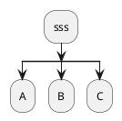
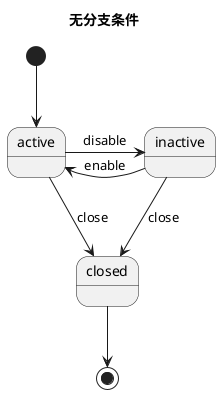
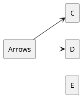
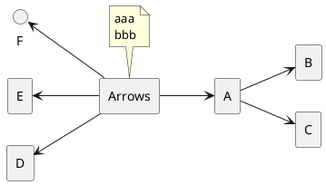
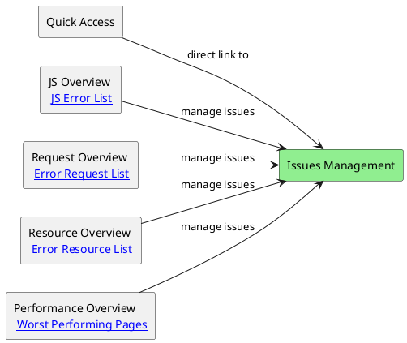
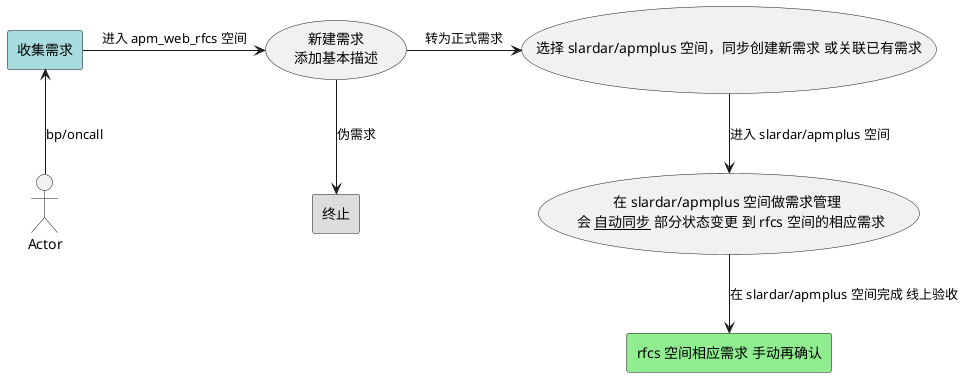
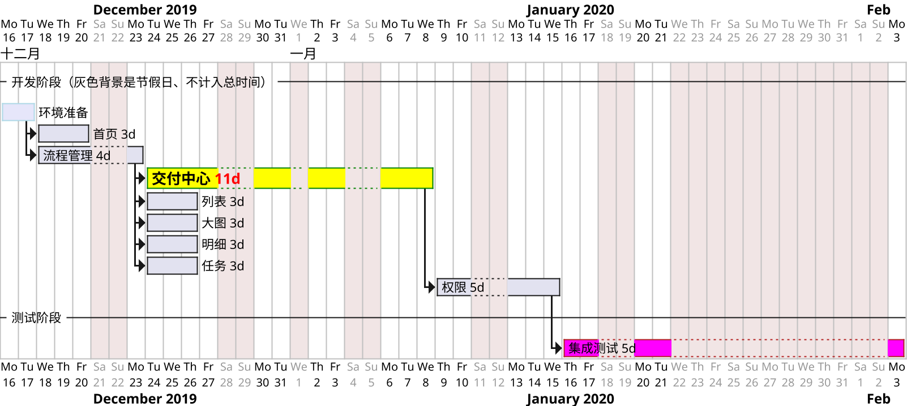

# .

网易 [科技](https://tech.163.com/)  [财经](https://money.163.com/) [国际](https://news.163.com/world/)
[pmbaobao](https://www.pmbaobao.com/) [人人PD](http://www.woshipm.com)
[热榜](https://tophub.today/) [36kr热榜](https://www.36kr.com/hot-list/catalog)

[oschina](https://www.oschina.net) [yuque](https://www.yuque.com/iscott)
[极客公园](https://www.geekpark.net) [少数派](https://sspai.com)
[凤凰网](https://www.ifeng.com) [威锋网](https://www.feng.com)
[蜻蜓](https://www.qingting.fm/) [什么值得买](https://www.smzdm.com)
[奇绩创坛](https://www.miracleplus.com)  [壹心理](https://www.xinli001.com)

[时代周刊](https://time.com)  [纽约时报](https://nytimes.com)
[华尔街日报](https://www.wsj.com)  https://youtube.com
https://instagram.com  https://whatsapp.com
[科技周刊](https://www.ruanyifeng.com/blog/2024/10/weekly-issue-322.html)


[codesandbox](https://codesandbox.io/s/zpjo211yp) [codepen](https://codepen.io)  GitHub登录
[JavaScript risingstars](https://risingstars.js.org)
[stateofjs](https://stateofjs.com/)、[stateofcss](https://stateofcss.com/)
[chromestatus](https://www.chromestatus.com/features)、[webkit](https://webkit.org/)
[Stack Overflow Developer Survey](https://insights.stackoverflow.com/survey)
[chrome-experiments](https://experiments.withgoogle.com/collection/chrome)

[react-next](https://www.react-next.com/)
[stateofreact](https://2023.stateofreact.com)
[awesome-react](https://github.com/enaqx/awesome-react)
[awesome-react-components](https://github.com/brillout/awesome-react-components)

https://npmtrends.com/lint-staged-vs-pre-commit-vs-pretty-quick
[设计工具排名](https://uxtools.co/tools/design)
[2019中国开源软件榜](https://www.oschina.net/project/top_cn_2019)
[2018前端技术清单](https://juejin.im/post/5bdfb387e51d452c8e0aa902)
https://coolshell.cn


## AI 场景

https://lmarena.ai/  https://openlm.ai/chatbot-arena/
https://huggingface.co/
https://app.slack.com/client/T053EMGBEEN/C05BVLPE885?geocode=zh-cn
https://openrouter.ai/rankings
2025-01 大模型竞技场

综合/模型厂商
https://chatgpt.com  https://gemini.google.com/
https://chat.deepseek.com/  https://chat.qwenlm.ai/
https://www.doubao.com/chat/  https://kimi.moonshot.cn
https://www.meta.ai/  https://llama3.dev/

套壳
https://onionai.so/
https://poe.com/
https://aichatru.ru/en
https://chathub.gg/
https://chat100.ai/zh-CN
https://www.perplexity.ai/
https://duckduckgo.com/?q=DuckDuckGo&ia=chat
https://mp.weixin.qq.com/s/qdXnBoMV4u2r-abUSnFReA

代码
字节 https://www.trae.ai/ https://www.trae.com.cn/
https://www.cursor.com/  Windsurf https://codeium.com/
支付宝 https://tbox.alipay.com/  蚂蚁 https://weavefox.ai/
antd机器人 Peter Cat https://mp.weixin.qq.com/s/PnHVc1_yBPu2HiA2En9cAg
https://bolt.new/  https://githubnext.com/projects/github-spark
字节 编程助手 https://www.marscode.com 海外 https://www.coze.com
网易-海豹D2C https://music.163.com/st/seal
https://www.ancodeai.com  https://github.com/abi/screenshot-to-code
生成 AI 应用
https://www.wordware.ai/
https://github.com/ChatGPTNextWeb/ChatGPT-Next-Web
自然语言命令行 https://github.com/guoriyue/LangCommand
https://github.com/guanguans/ai-commit
自然语言生成数据表格 https://columns.ai/chatgpt

电脑操作 https://deepmind.google/technologies/project-mariner/
手机助手
https://github.com/Skythinker616/gpt-assistant-android
https://github.com/X-PLUG/MobileAgent

数字人 https://character.ai
智能客服/知识库问答
https://github.com/1Panel-dev/MaxKB
https://github.com/cs-lazy-tools/ChatGPT-On-CS
阿里 B2B 个人采购代理 https://www.accio.com/
音乐 https://lamucal.ai/

---

AI Design: Google [AutoDraw](https://www.autodraw.com/) (原理[介绍](https://research.googleblog.com/2017/04/teaching-machines-to-draw.html))、鲁班、[sketch-rnn](https://github.com/tensorflow/magenta/blob/master/magenta/models/sketch_rnn/README.md)、[机器作艺术画](https://robotart.org/artworks/)、设计与人工智能[系列报告](http://sheji.ai/#/?_k=twxxpk)、[lobe.ai 生成表情](https://lobe.ai/)。

AI 编码/代码推荐: [为什么难](https://www.outsystems.com/blog/posts/ai-machine-learning-future-low-code/)、Facebook [Aroma](https://code.fb.com/developer-tools/aroma/)、[Would-AI-be-able-to-write-code](https://www.quora.com/Would-AI-be-able-to-write-code)。
imgcook(控件识别) / dumbo / 闲鱼UI2Code / 视觉稿还原比对-蒙娜丽莎。

JS 实现神经网络、[天猫精灵](https://open.bot.tmall.com/)、机器人工厂、阿里文娱 [AI 视频智能](https://ailab.youku.com/#/)、JS IM / [botui](https://github.com/moinism/botui)
知识图谱 https://github.com/ownthink/KnowledgeGraphData / https://www.ownthink.com/
2019

西安交大[设计图转代码](https://mp.weixin.qq.com/s?__biz=MzUxMzcxMzE5Ng==&mid=2247489854&idx=1&sn=4828d5d36c3becdf8b1f46490b5ce708)、
[Microsoft Sketch2Code](https://github.com/Microsoft/ailab/tree/master/Sketch2Code)、[sketch2code](https://azure.microsoft.com/en-us/blog/turn-your-whiteboard-sketches-to-working-code-in-seconds-with-sketch2code)、
[pix2code](https://github.com/tonybeltramelli/pix2code)、
[Screenshot-to-code](https://github.com/emilwallner/Screenshot-to-code)。
2018 AI图转码

百度大脑 http://ai.baidu.com/ 微软 https://azure.microsoft.com/en-us/services/cognitive-services/ 、阿里 PAI (数据采集，数据处理，特征工程，建模，预测服务) xNN、AliNN
蚂蚁：分布式学习和系统：智能客服；Parameter Server架构；美国组：自然语言处理；推荐营销；小助手；商业产品架构：金融类，量化理财因子发现，金融知识图谱；AI 平台部：达尔文测试系统；底层的GPU，FPGA开发调度系统阿尔卑斯。
2016-09 Google Allo


## AI 使用

https://github.com/luban-agi/Awesome-AIGC-Tutorials


--- 2025-03

node-semver 怎么获取 Tilde 或 Caret 标记?
代码依赖里一般都写 Tilde 或 Caret 标记, 怎么用 node-semver 做解析?
2025-03-05

kwgt kustom 能用 JavaScript 编程的方式做小组件吗?
哪里有比较丰富的 widgets 市场或集合, 可以直接下载使用?
2025-03-04

使用 pnpm Install 的库, 存在 ./node_modules/.pnpm 目录, 再使用 npm ls xx 会把这个目录里的依赖展示出来, 不符合预期. 但使用 pnpm ls xx 结果是空. 应该怎么处理?
https://gemini.google.com/app/720af5db3d7cb736
2025-03-04

前端组件库 monorepo 包含 50 个组件, 都位于一个 git 仓库里. 而传统的组件库 50 个组件分别位于 50 个 git 仓库里.
使用 云服务器 对 monorepo 仓库一次性构建 50 个组件, 和对传统的 50 个 git 仓库的组件分别进行构建.
能节省哪方面资源, 节省多少?
https://chatgpt.com/share/67c6c45a-cc9c-8008-86c7-60b6ef688619
https://grok.com/share/bGVnYWN5_a947bd4d-8829-4cbe-af01-0e9dbcef16c3
https://gemini.google.com/app/95b09bd5710e389f
2025-03-03

pnpm -r run build 怎么先构建被依赖的包?
对于 npm alias 形式的依赖, 没有先构建 dependencies 是怎么了?
2025-02-28

lerna version 不能自动更改 npm alias 的版本号, 怎么解决这个问题? 怎么解决?
除了 lerna 有其他类似工具能解决这个问题吗?
https://grok.com/chat/8e0fc14a-3f17-40a2-b7c5-99463c153087
https://grok.com/share/bGVnYWN5_2285de9a-750d-409c-a6a1-0c33cd067f1e
https://chat.deepseek.com/a/chat/s/e1bbf052-b8a7-4064-81f9-b7fc3bfc426f
2025-02-26

代码项目的目录命名 common 和 commons 哪个更好?
https://gemini.google.com/app/fd0ec4b35523c91f
https://chat.deepseek.com/a/chat/s/f32465b1-6753-4abf-be2b-1edb5ea56f26
https://chatgpt.com/share/67bdc47e-88b4-8008-9094-399b0a78b555
2025-02-25

monorepo same package name multiple version coexist
除了使用 npm alias 功能外, 还有其他办法吗? 使用中文回复.
...
通过以上提到的哪种方法, 能够解决如下报错
npm ERR! code EDUPLICATEWORKSPACE
npm ERR! must not have multiple workspaces with the same name
...
使用 lerna 和 pnpm 并加入 project.json 文件, 可以让多个子包 package.json 有相同的 name 和不同的 version. 除此之外,还有更多的实现办法吗?
...
参考 https://stackoverflow.com/questions/26414587/how-to-install-multiple-versions-of-package-using-npm
回复最好 https://gemini.google.com/app/4c2ea1e657922b90
2025-02-24

npm 的 dependencies 写了 latest, 是怎么解析版本的?
如果 最新发布的版本 是个 alpha 但不是 latest 标签, 会对它做解析吗?
这个最新的 alpha 版本的依赖有缺失, npm install 包的 latest 版本时, 实际不应安装这个 alpha 版本, 但 先对这个 alpha 版本 报错 No matching version found, 导致 安装失败. 是为什么?
2025-02-13 https://chatgpt.com/share/67ad9bcd-913c-8008-aa33-1edb177b7203

npm yarn 和 pnpm 的 lock 文件内容结构详细解释?
现在使用 pnpm 工具, 有两个环境, 比如 A 环境 registry 是 https://ra.com 生成了 lock 文件. 但 B 环境 registry 是 https://rb.com , 希望复用 A 环境生成的 lock 文件, 怎么做到? pnpm-lock.yaml 文件里的 tarball 地址, 怎么能不区分 ra rb 的域名?
在 monorepo 项目, 怎么用 npm shrinkwrap 收集到所有子项目依赖, 并给 pnpm 使用?
需要在 monorepo 里存在 同名包的 不同版本, 怎么实现?
lerna 和 pnpm 支持 通过 project.json 能让存在 同名包的 不同版本, 使用 npm 能做到吗?

最近 deepseek 火热, 新闻不断, 用什么成语或习语形容 比较有趣?
- 万众瞩目 人气爆棚 一鸣惊人 如日中天 家喻户晓 后来居上 异军突起
- 技惊四座 炙手可热 风头正劲 抢尽风头 风头无两 声名鹊起 崭露头角
- 独领风骚 独占鳌头 势如破竹 满城风雨 名声大噪 平地一声雷

deepseek 比 Gemini 豆包和kimi 优秀吗? 哪个技术实力最强? 哪个最有长期潜力和优势?

- DeepSeek、Gemini、豆包和 Kimi 各有千秋，没有绝对的优劣之分。选择哪个模型取决于你的具体需求和偏好。
  如果你注重技术创新和垂直领域优势，DeepSeek 或许更适合你。
  如果你需要强大的多模态能力和完善的生态系统，Gemini 或许是更好的选择。
  如果你更看重本土化服务和社交属性，豆包可能更符合你的需求。
  如果你喜欢创新功能和个性化服务，Kimi 或许能给你带来惊喜。

- DeepSeek 在技术研发方面投入巨大，尤其在强化学习和模型训练效率方面有独到之处。其 DeepSeek-R1 模型在海外 AI 圈引起轰动，获得大量“自来水”，甚至有博主将其誉为“开源 AGI 和文明的未来”。DeepSeek 还开源了一系列模型，并披露了所有训练秘密，这在业内是比较罕见的。
  DeepSeek： 凭借其在技术创新和成本控制方面的优势，以及开源策略，DeepSeek在技术社区中获得了良好声誉。其低成本高性能的模型有助于广泛应用，具有较大的长期潜力。
  如果你关注 多模态能力 和 国际化技术实力，Gemini 是目前最强的选择。
  如果你更看重 长上下文理解、高效推理 和 开源生态，DeepSeek 是最具潜力的模型。
  如果你主要关注 中文场景，豆包是最优选择。
  如果你需要处理 超长文本任务，Kimi 是一个不错的选择。

--- 2025-01

前端或 node 项目, 引用A包的时候，比如A引用了B，B里面有overrides/resolutions，最终会装 overrides / resolutions 指向的包吗?
主项目的 overrides/resolutions 优先级最高，覆盖所有依赖。
如果主项目没有定义，子依赖的 overrides/resolutions 只会影响其自己的依赖树。

怎么在运行 npm start / build 之前, 确保 node_modules 里的依赖有被重新 Insall 过

--- 2024-12

utils.ts 文件内容为
export function getChangedPkgNames() {}
export async function get1() {}
index.ts 文件内容为
export * from './utils';
不能把 utils 里的函数正确导出来, 是什么问题?

monorepo 项目根目录 tsconfig 里已配置 "paths": { "@xx/monoaid": ["./common/monoaid/src/index.ts"] }
根目录有个 build.mjs 文件,内容有 import { xx } from '@xx/monoaid';
使用 node ./build.mjs 运行报错 Error [ERR_MODULE_NOT_FOUND]: Cannot find package '@xx/monoaid'
这是因为 TypeScript 的 paths 配置只影响 TypeScript 编译器和工具（如 IDE 的代码提示），而不会直接影响运行时（Node.js）。Node.js 不会解析 tsconfig.json 中的 paths，所以它找不到 @afe/monoaid 模块。

在 bash 脚本的执行开头重置 env, 应该怎么写?

为什么 mui button 的 api 叫 variant , 最初来源于哪里?

antd 还有其他的 api 一样的版本吗?
由于大量项目已基于 antd 构建, 但需要换一套组件库, 希望新的组件库 api 和相应功能 都能对 antd做兼容, 应该怎么做? 最好的办法是什么?
应该基于哪个新的组件库来做呢?
有人用 Material UI 做兼容 antd 的 api 的中间层库吗?

monorepo 忽略了 samples 子目录, 但在 samples/xx 里运行 pnpm install 还是会根据根目录的 pnpm-lock 安装依赖, 怎么避免这个问题?

学习 tailwind 应该要理解哪些重点和难点地方
tailwind variants vs cva

基于 React Hook Form 和 Zod 做一个新的 react form 组件, 使其功能和 antd 4 的 Form 组件一样, api 用法也一样.

一个 position: absolute; 的元素, 被很多个  position: relative; 的外围元素包裹, 怎么让这个 absolute 的元素在最顶层显示?

利用 GitHub 当存储的笔记软件 有哪些?

macOS 使用 快捷指令 制作一个功能, 能触发 ctrl+. 快捷键.

--- 2024-11

很多 react UI 组件库都有 variant 属性, 为什么这么命名, 作用是什么 作用都一样吗
chrome 插件 popup 页面, 怎么区分是在 新 tab 打开, 还是 弹窗里打开?
https://chatgpt.com/share/674d2c48-8c94-8008-aca4-0ae4cc13eaa7

shadcn/ui ant-design material-ui 现状综合看哪个好、应该怎么选择？
基于哪个做二次开发比较好，成本怎么样？
需要面向未来、有一定先进性，应该怎么选?
想从 antd 迁移到新的 react 组件库, 要求 api 尽量一致或者改造成本低, 哪个新组件库符合要求?
https://chatgpt.com/share/6749ea04-8f08-8008-9f30-132d8ec8071d

在 macOS 系统上、使用 bash 写一个函数，自动地每天上午 11点50分 拷贝文件 a.md 的内容到一个新文件 _backup/datetime_a.md 中，每隔三天的 上午11点49分、清空 b.log 和 c.log 文件的内容。运行前后需要发出通知。
把 备份的文件, 只保留 5 个最新的, 其余旧的删除.
https://chatgpt.com/share/674539a5-4d50-8008-9cce-a950f4a2354b

在macOS用户目录下的 .zshrc 里写一个函数，判断是否已运行命令 ttyd -W -a zsh >> "$z_log" 2>&1 & 如果未运行过、则运行一次，如果已运行、则进一步判断：如果调用者是 ttyd 、则根据 http://localhost:7681/?arg=/Users/hua/.zshrc&arg='echo "aa"' 这个 URL 运行 arg 参数里的 echo 等任意自定义命令。
https://chatgpt.com/share/6742e267-f3a0-8008-bda3-6b1b6bbce601

js工具库代码最新版本是 3.x，但需要修复很久之前的 1.x 版本的 bug，当前只有 master 分支，怎么用 git 管理老版本的代码升级？
LTS（长期支持）策略 详解。
如果是 monorepo 项目，应该采用什么策略？
在老的 1.x 分支上拉了代码做改动，合并到 master 产生了大量冲突，怎么解决？
怎么在 git 提交历史中插入一个提交？
怎么把 某个 commit 改动的文件，应用到另一个分支上、但不携带改动之前的历史信息。
以上合并方式是什么？把改动的文件内容全覆盖，还是对改动的某些行进行交集合并，删除的文件或内容怎么处理？
`git checkout <commit-hash> -- <file-path>` 如果有多个 file 需要分别添加吗，有更快的方法吗？
https://chatgpt.com/share/673dd191-0d74-8008-a826-16844c0b9bb5


--- 2024-06~09

git 有很多 commit，一次性合并所有提交记录
git rebase autosquash 更详细用法
https://chatgpt.com/share/674ab367-c974-8008-9cdb-410303f51fe4

修改调试 VS Code 插件代码
https://chatgpt.com/share/674ab3ee-34c8-8008-b4bb-12ec48e8b2d6

mac系统的 Apache 怎么配置 localhost 同时支持 https http
能不配置 apache2/extra 里的文件吗
https://chatgpt.com/share/674ab45e-27a8-8008-b1bb-04c8bf5e444e

clash 配置指定域名用指定 dns 解析
https://chatgpt.com/share/671762b0-e55c-8008-bf27-b762cf930059


bash 查找 packages 目录下二级 目录里存在的所有 config.ts congfig.tsx config.js 和 config 目录，排除掉 node_modules 目录。不查找子路径。查找结果 存放到数组里。
```sh
result=($(find packages/*/src -maxdepth 1 -type f \( -name "config.ts" -o -name "config.tsx" -o -name "config.js" \) -not -path "*/node_modules/*" -o -type d -name "config" -not -path "*/node_modules/*"))
```

帮我写 Chrome 插件代码，实现这样的功能：选中一些标签页、把他们的 URL以有序数组形式 存储到 chrome storage 里、同时关闭这些标签页，通过 popup  页面的一个按钮、从数组里恢复打开标签页，并把这些标签页移动到其他已存在标签页的后边。

使用 html modal 元素写一个类似 bootstrap 的 modal 功能，抽象成 js 组件、把 css 注入进去。
把类改为使用函数写法。
防止多次调用时，多次生成样式和元素。
返回 打开 关闭 toggleModal 的函数。
把 openModalBtn 元素放到 js 里。
把 modal-content 和 close-btn 也放到 js 里去。

npm version 怎么自动升级 monorepo 的 子包依赖版本号
pnpm 只检查并保持 workspaces 内部包 的最新版本，写成 bash 脚本

bash 处理 git ls-remote --tags origin 和 git tag -l 获取到的字符串列表，并正则匹配到字符串里 refs/tags/ 之后的部分

豆包+通义千问: 使用 yq 判断 如果rules 里不存在 aaa，则前置插入aaa

Chrome Native Messaging 使用 bash 文件的 shebang 地址有问题，怎么让 /usr/local/bin 和 /usr/bin 都能互相调用


## snippets

### async

async await 实现原理 https://zhuanlan.zhihu.com/p/115112361
https://segmentfault.com/a/1190000023442526
await 后需要是 Promise

async await 与 forEach 不起作用。因为 forEach 每次循环 都忽略返回值
https://objcer.com/2017/10/12/async-await-with-forEach/
使用 map 或 for..of 代替 https://stackoverflow.com/a/37576787/2190503
https://advancedweb.hu/how-to-use-async-functions-with-array-foreach-in-javascript/

```js
function timeout(ms) {
  // return new Promise(resolve => setTimeout(resolve, ms));
  return new Promise((resolve, reject) => setTimeout(() => {
    ms === 404 ? reject('err...') : resolve(ms);
  }, ms));
}
var arr = [404, 2000, 4500];

// 普通 for 语句 串行执行，时间累加
for (var index = 0; index < arr.length; index++) {
  await timeout(arr[index]);
}
// for of 串行执行，时间累加
for (let item of arr) {
  await timeout(item);
}
// array.map 工作不正确
await arr.map((item) => {
  return timeout(item);
});
// Promise.all + array.map 并行执行，最慢的一个时间决定总时间
var res = await Promise.all(arr.map(async (item) => {
  // return await timeout(item).catch(() => 'catch it');
  try {
    return await timeout(item)
  } catch (error) {
    return 'catch it new style'
  }
}));
// reduce
await arr.reduce(async (memo, i) => {
  await memo;
  await timeout(10 - i);
  console.log(i);
}, undefined);


async function test() {
  console.log('test start');
  await otherTest();
  console.log('test end');
}
async function otherTest() {
  console.log('otherTest');
}
test();
console.log('after test');
// 输出 test start -> otherTest -> after test -> test end
// async 后函数相当于变成了
function test() {
  console.log('test start');
  const p = new Promise((res, rej) => {
      otherTest();
  });
  p.then(() => console.log('test end'));
  return p;
}
```

Promise
[promise-error-handling](https://zh.javascript.info/promise-error-handling)
https://zhuanlan.zhihu.com/p/58428287
https://segmentfault.com/a/1190000009478377
[Lightweight javascript implementation of promises](https://github.com/stackp/promisejs)

```js
Promise.all([
  new Promise(function (resolve, reject) {
    console.log('reject 先执行，后边 promise 内容是否会执行了？');
    window.addEventListener('DOMContentLoaded', () => resolve('dom ready'));
    // window.addEventListener('DOMContentLoaded', () => reject('dom ready'));
    // return reject('reject immediately');
  }),
  new Promise(function (resolve) {
    window.addEventListener('DOMContentLoaded', () => resolve('dom ready'));
    // return reject('reject again');
  }),
  new Promise(function (resolve) {
    console.log('p1');
    window.addEventListener('DOMContentLoaded', () => resolve('dom ready'));
  }),
  new Promise(function (resolve) {
    console.log('fake promise');
    resolve('fake promise');
  })
]).then(res => console.log('res: ', res), rej => console.log(rej));

// 不管成功失败，都返回所有结果，不退出
Promise.almost = r => Promise.all(r.map(p => p.catch ? p.catch(e => e) : p));

function PromiseImpl(fn) {
  let callbacks = [];
  this.then = (resolveFn, rejectFn) => {
    callbacks.push(resolveFn);
    return this;
  };
  const resolve = (value) => {
    callbacks.forEach(item => {
      item(value);
    })
  }
  fn(resolve);
}
const pro = new PromiseImpl((resolve, reject) => {
  setTimeout(() => {
    resolve(1);
  }, 100);
});
pro.then((data1) => {
  console.log(data1);
}, error => console.log(error)).then(data => {
  console.log(data);
}, error => console.log(error));
```


[Generators](https://developer.mozilla.org/en-US/docs/Web/JavaScript/Reference/Statements/function*)
[iterators](https://developer.mozilla.org/en-US/docs/Web/JavaScript/Guide/The_Iterator_protocol)
[yield](https://developer.mozilla.org/en-US/docs/Web/JavaScript/Reference/Operators/yield)

```js
// 斐波那契
function* fibonacci() {
  let [prev, curr] = [0, 1];
  for (;;) {
    [prev, curr] = [curr, prev + curr];
    yield curr;
  }
}
for (let n of fibonacci()) {
  if (n > 1000) break;
  console.log(n);
}

function* iterTree(tree) {
  if (Array.isArray(tree)) {
    for (let i = 0; i < tree.length; i++) {
      yield* iterTree(tree[i]);
    }
  } else {
    yield tree;
  }
}
const tree = ["a", ["b", "c"], ["d", "e"]];
for (let x of iterTree(tree)) {
  console.log(x);
}
```


### window

BOM 的核心是 window, window 对象包含属性：document、location、navigator、screen、history、frames
Dom 根节点包含子节点 forms、embeds、anchors、images、links

```js
// dom 节点包含 https://segmentfault.com/q/1010000007159611
console.log('log contains: ', document.documentElement.contains(document.body));
function isChildOf(child, parent) {
  var parentNode;
  if(child && parent) {
    parentNode = child.parentNode;
    while(parentNode) {
      if(parent === parentNode) {
        return true;
      }
      parentNode = parentNode.parentNode;
    }
  }
  return false;
}

// WebComponents Shadow DOM
/*
当用户没有与网页进行任何交互 并且也没有动画 requestIdleCallback 执行的时间最长可达到50ms。
屏幕是 60hz 有渲染时、每帧执行时间16ms（1000ms / 16），剩余空闲时间小于它。
requestAnimationFrame 的回调会在每一帧确定执行，属于高优先级任务，而 requestIdleCallback 的回调则不一定，属于低优先级任务。
不能在 requestIdleCallback 里再操作 DOM，因为它发生在一帧的最后，这样会导致页面再次重绘。DOM 操作建议在 rAF 中进行。
Promise的resolve(reject)操作也不建议放在里面，会拉长当前帧的耗时。
能做 数据的分析和上报 预加载资源 检测卡顿 拆分耗时任务(React 中的调度器 Scheduler)
*/
requestIdleCallback(myNonEssentialWork, { timeout: 2000 });
// 任务队列
const tasks = ['1', '2', '3'];
function myNonEssentialWork (deadline) {
  console.log('dl', deadline.timeRemaining());
  // 如果帧内有富余的时间，或者超时
  while ((deadline.timeRemaining() > 0 || deadline.didTimeout) && tasks.length > 0) {
    console.log('dl1', deadline.timeRemaining(), deadline.didTimeout);
    console.log('执行任务', tasks.shift());
  }
  console.log('dl2', deadline.timeRemaining());
  if (tasks.length > 0) {
    console.log('dl3', deadline.timeRemaining());
    requestIdleCallback(myNonEssentialWork);
  }
}
window.addEventListener('load', () => {
  requestIdleCallback(myNonEssentialWork, { timeout: 5000 });
  function myNonEssentialWork (deadline) {
    // console.log('执行任务 1', deadline.timeRemaining(), location.href);
    while ((deadline.timeRemaining() > 0 || deadline.didTimeout)) {
      // console.log('执行任务 while', deadline.timeRemaining());
    }
  }
});

// 判断当前页面是否在 iframe 里
if (self != top) {}
// 禁止别人以 iframe 加载你的页面
if (window.location != window.parent.location) {
  window.parent.location = window.location;
}

// 跨浏览器的 addEventListener 实现
function addEventListener(target, eventType, callback) {
  if (target.addEventListener) {
    target.addEventListener(eventType, callback, false);
    return {
      remove: function() {
        target.removeEventListener(eventType, callback, false);
      }
    };
  } else if (target.attachEvent) {
    target.attachEvent("on" + eventType, callback);
    return {
      remove: function() {
        target.detachEvent("on" + eventType, callback);
      }
    };
  }
}

// 改变 url 而不刷新页面的方法：location.hash(hashchange 事件)，history api。
// history 模式需要后端的配合，不然刷新页面会 404 https://developer.mozilla.org/en-US/docs/Web/API/History_API
// 浏览器在被点击“后退”或者“前进"按钮时，会触发 popstate 事件，代码调用 history.pushState/replaceState 不会触发。
// 用处：将 参数 更新到 URL 里，在 刷新页面 的时候会保留搜索结果
window.addEventListener('hashchange', (e) => console.log(e)); // 如果有 hash 时、触发
window.addEventListener('popstate', function (e) {
  console.log('popstate event: ', JSON.stringify(e.state), e);
  if (e.state !== null) {
    //load content with ajax
  }
});
history.pushState({page: 1}, "title 1", "?page=1");
// 浏览器不会下载或检查 bar.html 是否存在，刷新页面 404
history.pushState({page: 2}, "title 2", "bar.html");
// 不能跨域，baidu 跟本页面是不同域
history.pushState({page: 2}, "baidu", "https://www.baidu.com/");
history.replaceState({page: 3}, "title 3", "?page=3");
history.back(); history.forward(); history.go(2); // 跟 浏览器回退 按钮功能一样，触发 popstate 事件

// resize 事件只在 window 变化时触发，内部元素变化不会触发
// 注册在 元素上 不起作用 ele.addEventListener('resize'); 换用 ResizeObserver 监听元素尺寸变化
window.addEventListener('resize', () => {
  console.log('resize event');
}, true);

window.addEventListener('beforeunload', (e) => {
  e.preventDefault();
  e.returnValue = "";
  return "Custom message to show to the user";
}, true);

window.addEventListener('keydown', function showKeyCode(e) {
  var keyCode = e.keyCode || e.which;
  console.log('keyCode', keyCode);
}, false);

fetch('./users', {
  mode: 'no-cors',
  headers: {
    'Accept': 'application/json',
    'Content-Type': 'application/json'
  }
}).then(function checkStatus(response) {
  if (response.status >= 200 && response.status < 300) {
    return response
  } else {
    var error = new Error(response.statusText)
    error.response = response
    throw error
  }
}).then((response) => response.json()).catch(function(error) {
  console.log('request failed', error)
});

function ajax(url, success, fail) {
  var xhr = new XMLHttpRequest();
  xhr.onload = function() {
    if (xhr.status >= 200 && xhr.status < 400) {
      success(xhr.responseText);
    } else {
      fail(xhr);
    }
  };
  xhr.open('GET', url, true);
  xhr.send();
}

function ajaxUploadWithProgress(url, options) {
  const { method, headers, credentials, body } = options;
  return new Promise((resolve, reject) => {
    const result = {};
    var xhr = new XMLHttpRequest();
    xhr.withCredentials = credentials;
    Object.keys(headers).forEach(item => {
      xhr.setRequestHeader(item, headers[item]);
    });
    xhr.upload.onprogress = function(event) {
      console.log(`Uploaded ${event.loaded} of ${event.total} bytes`);
    };
    xhr.upload.onload = function() {
      console.log(`Upload finished successfully.`);
    };
    xhr.upload.onerror = function() {
      console.log(`Error during the upload: ${xhr.status}`);
    };
    xhr.onloadend = function() {
      console.log(`Error during the upload: ${xhr.status}`);
    };
    xhr.onload = function() {
      // success: xhr.status >= 200 && xhr.status < 400
      resolve(xhr);
    };
    xhr.open(method, url, true);
    xhr.send(body);
  });
}
```

### file img canvas svg

```js

function randomColor() {
  return '#' + ('00000' + (Math.random() * 0x1000000 << 0).toString(16)).slice(-6);
}

// 参考 https://unpkg.com/placeholder.js@3.1.0/dist/placeholder.js
function createImg(opts = {
  size: [128,128], text: '128', bgColor: randomColor(), color: randomColor(),
  // normal / italic / oblique
  fstyle: 'normal',
  // normal / bold / bolder / lighter
  fweight: 'bold',
  fsize: '', // auto calculate the font size to response to the image size
  ffamily: 'consolas',
}) {
  let cvs, cvsContext;
  const createCanvas = () => {
    if (!cvs || !cvsContext) {
      cvs = document.createElement('canvas');
      cvsContext = cvs.getContext('2d');
    }
    cvs.width = opts.size[0];
    cvs.height = opts.size[1];
    cvsContext.clearRect(0, 0, opts.size[0], opts.size[1]);
    cvsContext.fillStyle = opts.bgColor;
    cvsContext.fillRect(0, 0, opts.size[0], opts.size[1]);
    cvsContext.fillStyle = opts.color;
    cvsContext.font = `${opts.fstyle} normal ${opts.fweight} ${opts.fsize || 100}px ${opts.ffamily}`;
    const text_width = cvsContext.measureText(opts.text).width,
    let scale = 1.0;
    if (!opts.fsize) {
      scale = Math.min(0.7 * opts.size[0] / text_width, 0.7 * opts.size[1] / 100);
    }
    cvsContext.translate(opts.size[0] / 2, opts.size[1] / 2);
    cvsContext.scale(scale, scale);
    cvsContext.textAlign = 'center';
    cvsContext.textBaseline = 'middle';
    cvsContext.fillText(opts.text, 0, 0);
    return cvs;
  }
  return createCanvas().toDataURL();
}
// <form>
//   size: <input id="size" value="375x200" />
//   text: <input id="text" value="text" />
//   bgColor: <input id="bgColor" value="#ccc" placeholder="#f3efee #0D8FDB #39DBAC #F8591A" />
//   <br />
//   
// </form>
const opts = {
  size: [375, 200],
  bgColor: '#ccc',
  color: 'white',
  text: 'text',
};
['size', 'text', 'bgColor'].forEach(function(i) {
  document.getElementById(i).addEventListener('input', function() {
    opts[i] = this.value;
    document.getElementById('imgEle').setAttribute('src', createImg(opts));
  });
});

// canvas 有损缩放图片
async function resizeImg(imgSrc) {
  const canvas = document.createElement('canvas');
  const ctx = canvas.getContext('2d');
  const imgObj = await loadImage(imgSrc);
  const nw = imgObj.naturalWidth, nh = imgObj.naturalHeight;
  const ratio = nw / canvas.width;
  canvas.height = nh / ratio;
  ctx.drawImage(imgObj, 0, 0, nw / ratio, nh / ratio);
  return canvas;
}
const cvs = await resizeImg('https://gw.alipayobjects.com/zos/rmsportal/PnjNniBkexOKzoehotzl.jpg')
console.log('log cvs: ', cvs, cvs.width);

async function loadImage(imgSrc) {
  const imgObj = await new Promise((resolve) => {
    const img = new Image;
    img.onload = () => {
      resolve(img);
    };
    img.src = imgSrc;
  });
  console.log('img', imgObj);
}

const loadImage1 = async (imgSrc) => {
  const imgObj = await new Promise((resolve) => {
    const image = document.createElement('img');
    image.onload = () => {
      resolve(image);
    };
    image.src = imgSrc;
  });
  console.log('img', imgObj);
}

function getImgBase64() {
  // <input type="file" id="file" name="file" />
  const file = document.getElementById('file').files[0];
  const reader = new FileReader();
  reader.readAsDataURL(file);
  reader.onload = function (event) {
    const base64 = event.target.result;
    console.log('log base64: ', base64);
  };
}

// base64 图片自动下载
// https://stackoverflow.com/questions/14011021/how-to-download-a-base64-encoded-image
function downloadBase64File(base64String, fileName) {
  // const linkSource = `data:${contentType};base64,${base64Data}`;
  const now = new Date();
  const formatNow = `${now.getFullYear()}-${now.getMonth()}-${now.getDate()}_${now.getHours()}-${now.getMinutes()}`;
  const downloadLink = document.createElement("a");
  downloadLink.href = base64String;
  downloadLink.download = fileName || formatNow + '.jpeg';
  downloadLink.click();
}

// 读取 json 文件内容
const readJsonFile = (file) => {
  return new Promise((resolve) => {
    const reader = new FileReader();
    reader.readAsText(file);
    reader.onload = (event) => {
      resolve(JSON.parse(event.target.result));
    };
  });
};

// 下载字符串为 json 文件
import fileSaver from 'file-saver';
const downloadJson = (jsonData, { filename }) => {
  if (!jsonData) {
    return;
  }
  try {
    fileSaver.saveAs(
      new Blob([JSON.stringify(jsonData, null, 4)], { type: 'application/json;charset=utf-8' }),
      `${filename}.json`
    );
  } catch (e) {
    console.log(e);
  }
};
```


------ svg

svg 深入 https://flaviocopes.com/svg/
- 包括通过 img 或 CSS background-images 引用的 单独 svg 文件，必须要写 XML declaration DOCTYPE 声明。
- 直接写在 html 里的 svg 代码，不能写 XML declaration 和 DOCTYPE 声明。
- 如果 svg 使用 img 标签加载，不能与 css/js 交互，其包含的外部链接如 images, stylesheets, scripts, fonts 不能被加载。

https://flaviocopes.com

svg 文件 需要以 `<?xml version="1.0" encoding="UTF-8"?>` 和 `<!DOCTYPE svg PUBLIC "-//W3C//DTD SVG 1.1//EN" "http://www.w3.org/Graphics/SVG/1.1/DTD/svg11.dtd">` 开头

svg icon `<use class="icon-use" xlink:href="./sprites.svg#icon-hamburger"></use>`

svg 元素

`<object data="https://cdn.glitch.com/3b178055-c252-40d3-b2b8-69919fd392c5%2Fflag.svg?1522475211134" type="image/svg+xml"></object>`

`<iframe src="https://cdn.glitch.com/3b178055-c252-40d3-b2b8-69919fd392c5%2Fflag.svg?1522475211134" frameborder="0" width="300" height="200"></iframe>`

`<embed src="https://cdn.glitch.com/3b178055-c252-40d3-b2b8-69919fd392c5%2Fflag.svg?1522475211134" type="" />`

`<div style="background-image: url(https://cdn.glitch.com/3b178055-c252-40d3-b2b8-69919fd392c5%2Fflag.svg?1522475211134); height: 200px; width: 300px;"></div>`
``
``

`<svg width="50" height="50" xmlns="http://www.w3.org/2000/svg"><circle cx="25" cy="25" r="20"/></svg>`

```js
function pieChart(percentage, size) {
  // primary wedge
  var unit = (Math.PI * 2) / 100;
  var startangle = 0;
  var ra = 4;
  var endangle = percentage * unit - 0.001;
  var x1 = (size / ra) + (size / ra) * Math.sin(startangle);
  var y1 = (size / ra) - (size / ra) * Math.cos(startangle);
  var x2 = (size / ra) + (size / ra) * Math.sin(endangle);
  var y2 = (size / ra) - (size / ra) * Math.cos(endangle);
  var big = 0;
  if (endangle - startangle > Math.PI) {
      big = 1;
  }
  var d = "M " + (size / ra) + "," + (size / ra) +  // Start at circle center
      " L " + x1 + "," + y1 +     // Draw line to (x1,y1)
      " A " + (size / ra) + "," + (size / ra) +       // Draw an arc of radius r
      " 0 " + big + " 1 " +       // Arc details...
      x2 + "," + y2 +             // Arc goes to to (x2,y2)
      " Z";                       // Close path back to (cx,cy)

  return `
    <svg width="${size}" height="${size}" viewBox="0 0 ${size / 2} ${size / 2}">
      <circle cx="${size / ra}" cy="${size / ra}" r="${size / ra}" fill="#ebebeb"></circle>
      <path d="${d}" fill="red"></path>
      <circle cx="${size / ra}" cy="${size / ra}" r="${size * 0.17}" fill="#fff"></circle>
    </svg>
  `;
}
const pieHtml = pieChart(50, 72);
const div = document.createElement('div');
div.innerHTML = pieHtml;
document.body.appendChild(div);
```


### 国际化 / 日期
> 2024 2019

[Intl](https://developer.mozilla.org/zh-CN/docs/Web/JavaScript/Reference/Global_Objects/Intl)
[BCP 47](https://datatracker.ietf.org/doc/html/rfc5646)  locales 参数必须是一个 BCP 47 语言标记的字符串，或者是一个包括多个语言标记的数组。 [网页头部的声明应该是用 lang="zh" 还是 lang="zh-cn"](https://www.zhihu.com/question/20797118/answer/16809331)

最新推荐: zh (不区分简繁体和地区) zh-Hans (中文简体)  zh-CN(考虑老浏览器兼容)。
zh cn 等组合中的“大小写”对功能无影响，但比如 cn 小写会有违规范。

BCP 47： Best Current Practice 47 一种标准化的语言和区域设置标记系统 language-extlang-script-region-variant-extension-privateuse 标记结构：
- 语言代码（必填）：长度: 2-3 个字母（ISO 639-1 或 ISO 639-3）示例: en（英语）、zh（中文）、fr（法语）等。2 个字母的一般和 ISO 639 二字码是相同的，三字码是额外在 [IANA](https://www.iana.org/assignments/language-subtag-registry/language-subtag-registry) 中登记注册的。
- 国家/地区代码（可选）：长度: 2 个大写字母（ISO 3166-1 alpha-2）示例: US（美国）、CN（中国）、CA（加拿大）等，可以是数字 如 es-005=南美西班牙语。仅当有必要时才使用区域子标签。
- 脚本代码（可选）：长度: 4 个字母（ISO 15924）示例: Latn（拉丁文）、Cyrl（西里尔文）、Hans（简体中文）等。仅当有必要时才使用 script 子标签。
- 变体代码（可选）：长度: 各种长度 示例: valencia（瓦伦西亚语） pinyin=拼音 jyutping=粤拼 等。用于指示语言、脚本、区域组合不能涵盖的方言或变体。

zh-CN 简体中文-中国   zh-HK 繁体中文-香港   zh-MO 中文-澳门  zh-TW 中文-台湾  zh-SG 中文-新加坡
zh-CHS zh-Hans 简体中文  zh-CHT zh-Hant 繁体中文
zh-Hans-CN 简体中文-中国  zh-Hans-SG 简体中文-新加坡
zh(汉语/宏语言macrolanguage) za=Zhuang(状族语)  hak=Hakka(客家语)  cmn=Mandarin(普通话/是汉语的一种)
zh-cmn-Latn-pinyin 用拼音拼写的普通话(zh-cmn 就是 cmn)
zh-lzh-Hans 简体字书写的文言文
zh-yue-Hant-HK 在香港地区使用的繁体字书写的粤语

en-hk 英语(香港)  en-us 英语(美国)  en-gb 英语(英国)  en-ca 英语(加拿大)  en-au 英语(澳大利亚)
es-es 西班牙语(西班牙)  es-ar 西班牙语(阿根廷)
fr-fr 法语(法国)  fr-lu 法语(卢森堡)
es-us 西班牙语(美国)  es-mx 西班牙语(墨西哥)

```js
function isValidBCP47Tag(locale) {
  try {
    // 尝试创建一个 Intl.Locale 对象
    new Intl.Locale(locale);
    return true;
  } catch (e) {
    return false;
  }
}
// 测试示例
console.log(isValidBCP47Tag('en-US'));  // true
console.log(isValidBCP47Tag('invalid-locale'));
console.log(isValidBCP47Tag('123')); // false

const korean = new Intl.Locale('ko', {
  region: 'KR',
  script: 'Kore',
  hourCycle: 'h23',
  calendar: 'gregory',
});
const japanese = new Intl.Locale('ja-Jpan-JP-u-ca-japanese-hc-h12');
console.log(korean.baseName, japanese.baseName);
console.log(korean.hourCycle, japanese.hourCycle);
// Expected output: "h23" "h12"

const locales = ["ban", "id-u-co-pinyin", "de-ID"];
console.log(Intl.NumberFormat.supportedLocalesOf(locales, { localeMatcher: "lookup" }));
// ["id-u-co-pinyin", "de-ID"]

const regionNamesInEnglish = new Intl.DisplayNames(['en'], { type: 'region' });
const regionNamesInTraditionalChinese = new Intl.DisplayNames(['zh-Hant'], {
  type: 'region',
});
console.log(regionNamesInEnglish.of('US'));
console.log(regionNamesInTraditionalChinese.of('US'));

let date = new Date(Date.UTC(2020, 11, 20, 3, 23, 16, 738));
console.log(new Intl.DateTimeFormat('en-US').format(date));
// Expected output: "12/20/2020"
console.log(new Intl.DateTimeFormat(['ban', 'id']).format(date));
// Expected output: "20/12/2020"
console.log(
  new Intl.DateTimeFormat('en-GB', {
    dateStyle: 'full',
    timeStyle: 'long',
    timeZone: 'Australia/Sydney',
  }).format(date),
);
// Expected output: "Sunday, 20 December 2020 at 14:23:16 GMT+11"

console.log(date.toLocaleTimeString());
console.log(date.toLocaleTimeString("zh-CN"));
console.log(date.toLocaleTimeString("en-US"));
console.log(date.toLocaleTimeString("en-GB"));
console.log(date.toLocaleTimeString("ko-KR"));

date = new Date(Date.UTC(2012, 11, 20, 3, 0, 0));
// 请求参数 (options) 中包含参数星期 (weekday)，并且该参数的值为长类型 (long)
let options = {
  weekday: "long",
  year: "numeric",
  month: "long",
  day: "numeric",
};
console.log(new Intl.DateTimeFormat("de-DE", options).format(date));
// "Donnerstag, 20. Dezember 2012"
// 需要使用世界标准时间 (UTC)，并且 UTC 使用短名字 (short) 展示
options.timeZone = "UTC";
options.timeZoneName = "short";
console.log(new Intl.DateTimeFormat("en-US", options).format(date));
// "Thursday, December 20, 2012, UTC"
options = {
  hour: "numeric",
  minute: "numeric",
  second: "numeric",
  timeZone: "Australia/Sydney",
  timeZoneName: "short",
  fractionalSecondDigits: 3,
};
console.log(new Intl.DateTimeFormat("en-AU", options).format(date));
// "2:00:00.200 pm AEDT"
options = {
  year: "numeric",
  month: "numeric",
  day: "numeric",
  dayPeriod: "short", // 单独设置会出现 10 at night
  hour: "numeric",
  minute: "numeric",
  second: "numeric",
  hour12: false,
  timeZone: "America/Los_Angeles",
};
console.log(new Intl.DateTimeFormat("en-US", options).format(date));
// "12/19/2012, 19:00:00"
// 要使用选项，但是需要使用浏览器的默认区域，请使用 'default'
console.log(new Intl.DateTimeFormat("default", options).format(date));

// 在你的区域下创建相对时间格式化程序
const rtf = new Intl.RelativeTimeFormat("en", {
  localeMatcher: "best fit", // 其他值："lookup"
  numeric: "always", // 其他值："auto"
  style: "long", // 其他值："short"或"narrow"
});
// 使用负值（-1）格式化相对时间。
console.log(rtf.format(-1, "day")); // "1 day ago"
// 使用正值（1）格式化相对时间。
console.log(rtf.format(1, "day")); // "in 1 day"

const duration = {
  hours: 1,
  minutes: 46,
  seconds: 40,
};
console.log(new Intl.DurationFormat("fr-FR", { style: "long" }).format(duration));
console.log(new Intl.DurationFormat("en", { style: "short" }).format(duration));
// "1 hr, 46 min and 40 sec"

const number = 123456.789;
console.log(new Intl.NumberFormat("de-DE").format(number));
console.log(new Intl.NumberFormat("ar-EG").format(number));
console.log(
  new Intl.NumberFormat("de-DE", { style: "currency", currency: "EUR" }).format(
    number,
  ),
);
console.log(
  new Intl.NumberFormat("ja-JP", { style: "currency", currency: "JPY" }).format(
    number,
  ),
);
console.log(
  new Intl.NumberFormat("pt-PT", {
    style: "unit",
    unit: "kilometer-per-hour",
  }).format(50),
);
// 50 km/h

const list = ["Motorcycle", "Bus", "Car"];
console.log(
  new Intl.ListFormat("en-GB", { style: "long", type: "conjunction" }).format(
    list,
  ),
);

const str = "吾輩は猫である。名前はたぬき。";
console.table(str.split(" "));
// ['吾輩は猫である。名前はたぬき。']  这两个句子并没有得到正确的分割。
const segmenterJa = new Intl.Segmenter("ja-JP", { granularity: "word" });
const segments = segmenterJa.segment(str);
console.table(Array.from(segments));
// [{segment: '吾輩', index: 0, input: '吾輩は猫である。名前はたぬき。', isWordLike: true},
// etc.
// ]
```


- [各地时间](https://time.is/)
- [日期和时间字符串](https://docs.microsoft.com/en-us/scripting/javascript/date-and-time-strings-javascript)
- [计算日期和时间](https://docs.microsoft.com/en-us/scripting/javascript/calculating-dates-and-times-javascript)
- [safari 对时间格式支持的差异](http://stackoverflow.com/questions/4310953/invalid-date-in-safari)

https://github.com/date-fns/date-fns
已废弃 https://momentjs.com/

```js
// JS 先按 ISO Date Format 标准格式解析时间字符串，再按其他支持的格式解析 (Chrome / IE9+)
// 时间戳 最小是 微妙？
// mysql 在存储时对 毫秒 四舍五入。

// ISO 格式: YYYY-MM-DDTHH:mm:ss.sssZ  最后的 sss 是毫秒数
console.log(new Date().toUTCString()); // 标准 ISO 格式
console.log(new Date().toISOString()); // 标准 ISO 格式

var myDate = new Date("2012-02-10T13:19:11+0000");
var offset = myDate.getTimezoneOffset() * 60 * 1000;
// getTimezoneOffset() 获得的“时区值”： 一般用于自己换算时间，不对 new Date() 构造时间产生任何影响，
// 但 toISOString() / toUTCString() 结果计算方式是 “localTime + 时区值”

console.log(new Date(2010, 11, 29, 10, 59, 59, 300)); // 参数: 年 月 日 时 分 秒 毫秒, 本地时间
console.log(new Date(Date.UTC(2010, 11, 29, 10, 59, 59, 300))); // UTC 时间
console.log(new Date('2010-01')); // 标准 ISO 格式
console.log(new Date('2010-01-29')); // 标准 ISO 格式
console.log(new Date('14:30:05Z')); // 或者 143005Z 标准 ISO 格式 UTC 时间后边加 Z
console.log(new Date('22:30:05+08:00')); // 或者 223005+0800 北京时间
// 日期和时间的组合表示法，要在时间前面加一大写字母T
console.log(new Date('2022-01-23T16:00:00.000+00:00')); // 标准 ISO 格式
console.log(new Date('2016-06-08T12:18:00+08:00')); // 标准 ISO 格式 北京时间
console.log(new Date('2022-01-21T03:10:54.233Z')); // 标准 ISO 格式
console.log(new Date('20160608T121800+08')); // 标准 ISO 格式 北京时间 Invalid Date
console.log(new Date('2016-06-08T12:18:00+0800')); // 标准 ISO 格式，Safari: Invalid Date
console.log(new Date().toISOString().slice(0, 10));
console.log(isNaN(Date.parse('2010-1-29')), isNaN(Date.parse('2010-11-29'))); // test in Sarari
console.log(new Date('11-29-2010')); // 非 ISO 格式，Safari: Invalid Date
console.log(new Date('2010/11/29')); // 非 ISO 格式，所有浏览器都支持
console.log(new Date('11/29/2010')); // 非 ISO 格式，所有浏览器都支持
console.log(new Date("2010-10-20 4:30 +0000")); // 非 ISO 格式，不同浏览器解析结果可能不同

console.log(new Date('6 Mar 2017 21:22:23 GMT')); // RFC 2822 格式
console.log(new Date('Mon 06 Mar 2017 21:22:23 z')); // RFC 2822 格式
console.log(new Date('Mon, 06 Mar 2017 21:22:23 +0000')); // RFC 2822 格式

var now = new Date();
var now_utc = new Date(now.getUTCFullYear(), now.getUTCMonth(), now.getUTCDate(), now.getUTCHours(), now.getUTCMinutes(), now.getUTCSeconds());
var utc_now = new Date(now.getTime() + now.getTimezoneOffset() * 60000);

var utc_timestamp = Date.UTC(now.getFullYear(), now.getMonth(), now.getDate(),
  now.getHours(), now.getMinutes(), now.getSeconds(), now.getMilliseconds());
console.log("Local & UTC now \n", now, '\n', now_utc, '\n', utc_now)
console.log("Local timestamp " + now.getTime())
console.log("UTC timestamp  " + utc_timestamp)


console.log(Date.now ? Date.now() : +new Date());
var now = new Date();
console.log(now.getFullYear(), now.getMonth(), now.getDate());
// 今天凌晨零点：
console.log(new Date(now.getFullYear(), now.getMonth(), now.getDate()));
// 一年后：
console.log(new Date(now.setYear(now.getFullYear() + 1)));

// 是否为闰年
// 遇到整百年时（如2000，1900，300）要被400整除才是闰年，否则为平年（2000闰年，1900平年，300平年）；遇到非整百年时（如2004，2005），只要被4整除就是闰年，不能被4整除为平年。
// 闰年的2月有29天，平年的2月有28天。
function isLeapYear(year) {
  return (new Date(year, 1, 29).getDate() === 29);
}
// function isLeapYear(year) {
//   return (year % 4 === 0 && year % 100 !== 0) || year % 400 === 0;
// }
console.log('isLeapYear', isLeapYear(1900));

// format date object  e.g. 2017-01-01
function genDateStr(date) {
  let mday = date.getDate();
  let month = date.getMonth() + 1;
  month = month < 10 ? `0${month}` : month;
  mday = mday < 10 ? `0${mday}` : mday;
  return `${date.getFullYear()}-${month}-${mday} ${date.getHours()}:${date.getMinutes()}`;
}
console.log(genDateStr(new Date()));

// 秒数转换为时间形式
function toHHMMSS(sec_num) {
  var hours   = Math.floor(sec_num / 3600);
  var minutes = Math.floor((sec_num - (hours * 3600)) / 60);
  var seconds = sec_num - (hours * 3600) - (minutes * 60);
  if (hours   < 10) {hours   = "0"+hours;}
  if (minutes < 10) {minutes = "0"+minutes;}
  if (seconds < 10) {seconds = "0"+seconds;}
  return hours+':'+minutes+':'+seconds;
}
console.log(toHHMMSS(100));

function firstDayOfMonth(date) {
  return new Date(date.getFullYear(), date.getMonth(), 1).getDate();
}
function lastDayOfMonth(date) {
  return new Date(date.getFullYear(), date.getMonth() + 1, 0).getDate();
}
console.log(lastDayOfMonth(new Date(2016, 1)), firstDayOfMonth(new Date()));

function cloneDate(date) {
  return new Date(+date);
}
var cd = cloneDate(new Date());
cd.setFullYear(2016);
cd.setMonth(1);
cd.setDate(10);
cd.setHours(8);
cd.setMinutes(40);
console.log(cd);
```


### 数组 对象 函数 原型

```js
// 数组去重
var uniqueArray = function(arr) {
  for (var i = 0; i < arr.length - 1; i++) {
    var item = arr[i];
    for (var j = i + 1; j < arr.length; j++) {
      item === arr[j] && (arr.splice(j, 1), j--);
    }
  }
  return arr;
};
function unique(arr) {
  var a = {}, b = {}, c = [];
  for (var i = 0; i < arr.length; i++) {
    if (!b[a[i]]) {
      c[c.length] = arr[i];
      b[a[i]] = true;
    }
  }
  return c;
}
//字符串数组去除重复的项，即[‘1’,‘2’,‘1’,‘3’]——>[‘1’,‘2’,‘3’]
Array.from(new Set(array));

// 删除 done 为 true 的数组元素
var arr = [
  { done: false, val: 1 },
  { done: true, val: 2 },
  { done: true, val: 3 },
  { done: false, val: 4 }
];

// 筛选出新数组
arr.filter(item => !item.done);

// 方法一：正向查找，删除后 index 减一
// 注意：由于数组长度会变化，不能用 len = arr.length 存下最初数组长度 ！！
for (var i = 0; i < arr.length; i++) {
  var o = arr[i];
  if (o.done) {
    // 删除一个元素，而 i 仍递增，如果不减一，会跨过一个元素
    arr.splice(i--, 1);
  }
}
console.log(arr);

// 方法二：倒序查找删除
var i = arr.length;
while (i--) {
  if (arr[i].done) {
    arr.splice(i, 1);
  }
}
console.log(arr);

// forEach 过程删除元素
var nums = [0, 1, 2, 3, 1, 4, 5, 6];
nums.forEach((i, index, arr) => {
  // console.log(i, index);
  if (i === 1) {
    // nums[index] = false;
    // arr.splice(index, 1) // 删除数组中一个，相当于 index + 1
    // nums.splice(index, 1) // 删除数组中一个，相当于 index + 1
    // console.log(i);
  }
});
// console.log(nums);

// 排序
var arr = [3, 324, 5345, 6546, 134, 5654, 665];
arr.sort(function(a, b) {
  return a - b;
});
// 乱序：让比较函数随机传回-1或1（效率不高）
var arr = [1, 2, 3, 4, 5, 6, 7, 8, 9, 10, 22, 33, 55, 77, 88, 99];
arr.sort(function() {
  return Math.random() > 0.5 ? -1 : 1;
});

// https://developer.mozilla.org/en-US/docs/Web/JavaScript/Reference/Global_Objects/Array/reduce
// 数组和
[0,1,2,3,4].reduce((previousValue, currentValue) => previousValue + currentValue, 10);
// 数组到对象
[1, 2, 3, 4].reduce((previousValue, currentValue) => {
  previousValue[currentValue] = `val-${currentValue}`;
  return previousValue;
}, {});
// 对象解构 George, Sam, Pear
[{ name: 'George' }, { name: 'Sam' }, { name: 'Pear' }].reduce(function (partial, value) {
  if (partial) {
    partial += ', '
  }
  return partial + value.name
}, '');


var arr2 = ['a', 'b', 'c', 'e'];
var arr_final = ['d', 'f', 'e', 'a', 'c', 'b'].sort((a, b) => {
  console.log(a, b)
  return arr2.indexOf(a) - arr2.indexOf(b)
});
console.log(arr_final);

// react state slice
function todos(state, action) {
  return [
    ...state.slice(0, action.index),
    Object.assign({}, state[action.index], {
      completed: true
    }),
    ...state.slice(action.index + 1)
  ]
}
var newSt = todos([{completed: false}, {completed: false}], {index: 0})
console.log(newSt);

// js 数组深入 https://segmentfault.com/a/1190000037627661

// 元素翻转 https://stackoverflow.com/questions/872310/javascript-swap-array-elements
var list = [{ a: 1 }, { b: 2 }];
var b = list[1];
list[1] = list[0];
console.log(list, b);
list[0] = b;
console.log(list);

// 模拟 repeat 效果
console.log(Array(20).fill([1, 2, 3]).flat());

// array from 第二个参数 map 函数 不会跳过值为 undefined 的数值项
const length = 3;
const init   = 0;
const resultA = Array.from({ length }, (_, index) => ({}));
const resultB = Array(length).fill({});
console.log(resultA[0] === resultA[1], resultB[0] === resultB[1]);

const result = Array.from({ length }, () => init);
const result1 = Array(length).fill(init);
const result2 = Array(length).map(() => init);
console.log(result, result1, result2);

// https://stackoverflow.com/questions/11800873/javascript-split-an-array-into-subarrays-by-a-given-seperator

// 生成数组
var numbers = [];
for (var i = 1; numbers.push(i++) < 100; );
var genArr = Array.apply(null, Array(5)).map((x, i) => i);
var genArr = Array.apply(null, { length: 10 }).map(Number.call, Number);
var genArr = Array.apply(null, { length: 10 }).map(Function.call, Math.random);
var genArr = Array.from(new Array(20), (x, i) => i);
var genArr = Array.from(Array(10).keys());
var genArr = Array.from({ length: 10 }, (v, i) => i);
var genArr = [...Array(10).keys()];
var genArr = Array(7).join(0).split(0).map(Number.call, Number);
var genArr = Array(10).fill(0).map((e, i) => i + 1);
```


------ 对象 函数 原型

```js
// switch 取巧写法
switch (true) {
  case location.hostname == "www.amazon.com" && !true:
  case location.hostname == "www.reddit.com":
  case /hbogo\./.test(location.hostname):
    console.log('do sth');
    break;
  case location.hostname == "www.facebook.com":
    console.log('do sth');
    break;
  default:
    console.log('do sth default');
}

// 中间变量 值交换 https://juejin.cn/post/6844903492608327688
var a = 1, b = 2;
a = [b, (b = a)][0];

// Destructured assignment
var { repeat, rules: { custom }} = { repeat: true, rules: { custom: 10 } };
console.log('Destructured assignment:', custom);

// 生成随机字符
var randomChar = Math.floor(Math.random() * 36).toString(36);

// 变量提升 https://www.jianshu.com/p/0f49c88cf169
var v='Hello World';
(function(){
  var v;
  alert(v); // undefined
  v='I love you';
})();

const add = () => window.addEventListener('click', () => console.log(aa))
add();
const aa = 'sss';

// 局部变量和全局变量
(function(){
  var x = y = 1;
})();
console.log(y); // 1 在 window 上
console.log(x); // 报错

// var 与 let 区别
const Greeters = []
for (let i = 0 ; i < 10 ; i++) {
  Greeters.push(function () { return console.log(i) })
}
Greeters[0]() // 0
Greeters[1]() // 1

// https://www.jb51.net/article/211414.htm
for (var j = 0; j < 3; j++) {
  setTimeout(() => console.log(j), 1000);
  (function(j) {
    setTimeout(() => console.log(j), 3000);
  })(j);
}
for (let j = 0; j < 3; j++) {
  setTimeout(() => console.log(j), 1000);
}

// Block–scoped variables
var es = [];
for (var i = 0; i < 10; i++) {
  let c = i;
  es[i] = function () {
    console.log("ES" + c);
  };
}
es[6]();

class A {
  static color = "red";
  counter = 0;
  handleClick = () => {
    console.log("A.handleClick");
    this.counter++;
  }
  handleLongClick() {
    console.log("A.handleLongClick");
    this.counter++;
  }
}
// A.prototype.handleClick is undefined
console.log(A.prototype, A.prototype.handleClick, A.prototype.handleLongClick);
new A().handleClick();
class C extends A {
  handleClick() {
    super.handleClick();
    console.log("C.handleClick");
  }
}
console.log(C.prototype.__proto__); // {constructor: ƒ, handleLongClick: ƒ}
new C().handleClick();

// 闭包：利用的是 “高阶函数” 的特性：函数可以作为参数或者返回值。
var fn = function(i) {
  // 局部变量 i 由于被 fun 引用，即便 fn 执行完毕，但也不会被 垃圾回收。
  return function() {
    console.log(i++);
  };
};
var fun = fn(2);
fun();
fun();

// 考察 this 指向
var user = {
  count: 1,
  getCount: function() {
    return this.count;
  }
};
console.log(user.getCount()); // 1
var func = user.getCount;
console.log(func()); // undefined
// 怎么能访问到 user 的 count
var func = user.getCount.bind(user);
console.log(func()); // 1

var o = {
  x: 8,
  valueOf: function() {
    return this.x + 2;
  },
  toString: function() {
    return this.x;
  }
};
console.log(o + '1', o + 1); // "101" 11

// prototype arrow function this
function Person(name) {
  this.name = name;
  this.say();
}
Person.prototype = {
  work() {
    console.log('I can work!');
    console.log(this);
  },
  walk: () => {
    console.log(this); // 箭头函数，注意此处 this
  },
  say() {
    console.log('I can say!');
  }
};
var p = new Person('me');
p.work();
p.walk();
p.say();

// prototype this
function F() {
  getName = function () { console.log(1) }
  return this;
}
var getName = function () { console.log(2) }
function getName () { console.log(3) }
F.getName = function () { console.log(4) }
F.prototype.getName = function () { console.log(5) }
F.getName () // 4
F().getName () // 1
new F().getName () // 5
getName() // 1

// 创建 People (父类) 和 Male (子类) 实现继承
function People(name) {
  this.name = name;
}
People.prototype.getName = function() {
  console.log("name:", this.name);
};
function Male(name, sex) {
  // 这里的 call，只是调用父类的构造器，而父类构造器的 prototype 上的东西并没被处理
  People.call(this, name);
  this.sex = sex;
}
// Male.prototype = People.prototype; // 错误，这样对子类 Male 原型的修改，都直接会改变父类 People 的原型
// 方法一：正确做法，但是父类 People 上属性可能比较多，使得占用内存大
Male.prototype = new People();
// 方法二：优化，利用一个空函数对象，减小内存占用
var F = function() {};
F.prototype = People.prototype;
Male.prototype = new F();
// 方法三：优化，使用 Object.create
Male.prototype = Object.create(People.prototype);
Male.prototype.constructor = Male;
Male.prototype.getSex = function() {
  console.log("sex:", this.sex);
};
var male = new Male("jim", "male");
male.getName();
male.getSex();
// 父类修改，会影响所有子类
People.prototype.getName = function() {
  console.log("parent，xxx");
};
// 子类修改，不应该影响父类
Male.prototype.getName = function() {
  console.log("sub，xxx");
};
male.getName();
var male1 = new Male("jim", "male");
male1.getName();
male1.getSex();

// 借助 __proto__ 实现数组的 子类型
var MyArrayProto = Object.create(Array.prototype);
// var MyArrayProto = { __proto__:Array.prototype };
MyArrayProto.foo = function() {};
function createMyArray() {
  var arr = Array.prototype.slice.call(arguments);
  arr.__proto__ = MyArrayProto;
  return arr;
}
var myarr = createMyArray(1, 2, 3); // myarr会有foo方法,也会有其他的数组方法
console.log(Object.getPrototypeOf(MyArrayProto) === Array.prototype);

/* Object
用 var anObject = new aFunction() 形式创建对象的过程实际上可以分为三步：
  1. 建立一个新对象（anObject）；
  2. 将该对象（anObject）的 __proto__ 设置为构造函数（aFunction）prototype 引用的那个原型对象；
  3. 将该对象（anObject）作为 this 参数调用构造函数，完成成员设置等初始化工作。
对象建立之后，对象上的任何访问和操作都只与对象自身及其原型链上的那串对象有关，与构造函数无关。
*/

// 对象的创建过程示例
function MyFunc() { }; // 定义一个构造函数
var anObj = new MyFunc();
// 等价于：
var anObj = {};     // 创建一个对象
anObj.__proto__ = MyFunc.prototype;
MyFunc.call(anObj); // 将 anObj 对象作为 this 指针调用 MyFunc 函数

// 实现 new 操作符 http://blog.vjeux.com/2011/javascript/how-prototypal-inheritance-really-works.html
function New (f) {
  var n = { '__proto__': f.prototype };
  return function () {
    f.apply(n, arguments);
    return n;
  };
}
// 内置对象（Array、Number、Object）的 prototype 不能被改变。
Array.prototype = {
  splice: function(){ console.log(11); }
};
var arr = [];
console.log(arr instanceof Array); // true, 说明 Array 的内置原型对象的引用还是保存着的
console.log(arr.splice);

var o;
// 创建一个原型为null的空对象
o = Object.create(null);
o = {};
// 以字面量方式创建的空对象就相当于:
o = Object.create(Object.prototype);
o.foo = 2;
console.log(o);

// 如何判断一个变量是对象还是数组？
// 给出判断 数组 类型的两种以上方法
var ins = [];
var ins = {};
console.log(Object.prototype.toString.call(ins));
console.log(Array.isArray(ins)); // es5 Array.isArray()
console.log(ins instanceof Array); // IE 兼容性
console.log(typeof ins); // 不能使用 typeof 来判断对象和数组

/* instanceof 判断对象是否是某个类的实例
  如果 obj instanceof Class 返回 true，那么 Class 的原型与 obj 原型链上的某个原型是同一个对象，
  但这并不意味着 obj 拥有 Class 的所有实例属性 (但肯定拥有 Class 的所有原型属性)。
*/
console.log(1 instanceof Number, new Number(1) instanceof Number);
// iframe 内 js 对象和父文档 js 对象是两套
console.log(top.a instanceof Array, top.a instanceof top.Array);

function t() {};
t.prototype = Array.prototype;
var x = new t();
console.log(x instanceof t, x instanceof Array, x instanceof Object); // true

function Person(name) {
  this.name = name;
}
var p = new Person('a');
console.log(p instanceof Person);
Person.prototype = {};
Person.prototype.constructor = Person;
var q = new Person('a');
console.log(p instanceof Person); // 一直为 false，因为p的原型链已经指向别处？
console.log(q instanceof Person);

/* Function
JS 中的函数运行在它们被定义的作用域里, 而不是它们被执行 (调用) 的作用域里。
JS 引擎不是一行行执行，而是一段段（不同 Script 标签为不同段落）的分析执行，不同 script 里的相同函数定义互不影响。

- [匿名函数的多种调用方式](http://www.cnblogs.com/snandy/archive/2011/02/28/1966664.html)
- [立即调用的函数表达式](http://www.cnblogs.com/TomXu/archive/2011/12/31/2289423.html)
- [ECMA-262-3 Chapter 5. Functions](http://dmitrysoshnikov.com/ecmascript/chapter-5-functions/)

匿名函数 http://www.cnblogs.com/TomXu/archive/2011/12/31/2289423.html
http://dmitrysoshnikov.com/ecmascript/chapter-5-functions/#question-about-surrounding-parentheses
*/

// ()里边语句为函数表达式
(function() { console.log('括号在里边'); }());
(function() { console.log('括号在外边'); })();
// !后边语句也要为表达式
!function() { console.log('! 符号'); }();

// 常用方法：call / apply / bind
// call 是 Function 的实例方法还是静态方法？
console.log(Function.call === Function.prototype.call);
console.log(typeof Function.prototype); // function

function demo () {
  // [].slice.call(arguments); // 写法是否合适？
  console.log(Array.prototype.slice.call(arguments));  // 将 arguments 转换为数组对象
  // 最常见的 “类数组对象” 就是 function 的 arguments 对象和 dom 集合。
  // Array.prototype.slice.call 只能将 arguments 转换为数组，但是对 dom 集合却不可以
  var slice = Array.prototype.slice.call;
  console.log(slice([1, 2, 3], 1)); // TypeError 是否跟 this 有关？
}
demo(1, 2, 3);

// 严格模式 / 非严格模式
window.color = "red";
function sayColor() {
  "use strict";
  console.log(this); // 严格模式下 undefined
  console.log(arguments);
}
sayColor();
sayColor.call(window);
sayColor.call(undefined);
sayColor.call(null);

function Person(name) {
  "use strict";
  this.lastName = name;
}
// 严格模式下、没有 new 时、构造函数里 this 值为 undefined，由于不能给 undefined 添加属性，会抛出错误。
// 非严格模式下，没有 new 时、this 是全局对象。
var me = new Person("Nicholas");
```


------ 基本类型

正则

```js
// 正则 https://regex101.com/
var urlStr = 'https://cn.bing.com:8999/search/1?query=java+regex&a=b';
// 匹配问号前
var matches = urlStr.match(/^(http|https):\/\/([A-Za-z0-9.-]+)(:[0-9]+)?(\/[^?]+).*$/);
// 匹配问号后 q 参数
var matches = urlStr.match(/.+(\?|\&)q=([^&.]+)?&/);

// /^\d{6}$/  /^[a-zA-Z0-9]{6,15}$/  // 正则表达式验证 6 位数字密码？6~15位数字、字母？

' aab'.replace(/(^\s*)|(\s*$)/g , ""); // trim 空格

// 元字符  ( [ { / ^ $ | ) ? * + .  预定义字符  \t \n \r . \d \D \w   要进行转义
/index(\.web)?\.tsx$/.test('index.web.tsx');
'S89(KKK,L)'.test(/S\d+[\(]\w+,\w+\)/g);
/\bend\b/.test('weekend , endFor , end');
'bb=2.blueidea.com'.replace(/(bb=)\d/, "\$1" + "3");
// contain 子字符串
/(my|you)/i.test('it is my name and you...')
console.log( /^a|bc$/.exec("add") ); //匹配开始位置的a或结束位置的bc
console.log( /^(a|bc)$/.exec("bc") ); //匹配a或bc
console.log( /(abc){2}/.exec("abcabc ###") );
console.log( /(?:abc){2}/.exec("abcabc ###") ); // 非捕获分组 ?:

// 反向引用被存储在RegExp对象的静态属性$1―$9中
console.log( /(A?(B?(C?)))/.exec("ABC") );
console.log( RegExp.$1 + "\n" + RegExp.$2 + "\n" + RegExp.$3 );
console.log( "1234 5678".replace(/(\d)\s(\d)/, "$2 $1") );
// \1 \2 形式
console.log( /\d+(\D)\d+\1\d+/.exec("2008-1-1") );
console.log( /(\w)(\w)\2\1/.exec("woow") );
console.log( /(\w)\1{4,}/.exec("aa bbbb ccccc 999999999") );

// 多行匹配
console.log( "ab\ncdef".replace(/[a-z]$/g, '#') );
console.log( "ab\ncdef".replace(/[a-z]$/gm, '#') );

// 正向前瞻(?=)
console.log( /([a-z]+(?=\d))/i.test("abc every1 abc") ); //true
console.log( RegExp.$1 ); //every，不返回数字
//负向前瞻
console.log( /([a-z](?!\d))/i.test("abc1 one") );
console.log( RegExp.$1 ); //one

// search方法，无需在search时用g标识
console.log( 'my age is 180 year old'.search(/\d+/) );

//手机号码验证（国内、国际号码）
var chinaMobile = /^0*1[3,4,5,8]\d{9}$/.test(123);
/^(886){1}0{0,1}[6,7,9](?:\d{7}|\d{8}|\d{10})$/.test(88);

//email验证
/^([a-zA-Z0-9]+[_|\_|\.]?)*[a-zA-Z0-9]+@([a-zA-Z0-9]+[_|\_|\.]?)*[a-zA-Z0-9]+\.[a-zA-Z]{2,3}$/.test(value);

//验证邮编（国内、国际） 国际邮编：只能由数字、字母、空格、横杆组成
/^\d{6}|0{6}$/.test(val);
/^[a-zA-Z0-9\s\-]{6,10}$/.test(val);
/^\d{3}|0{3}$/.test(val);

{/*
<script type="tpl" id="tpl">
  <html><head></head>
  <body>
    <div></div>
  </body>
  </html>
</script>
*/}

// 多行匹配 html
var html = document.getElementById('tpl').innerHTML;
var match = html.match(/^([\s\S]*<body.*>)([\s\S]*)(<\/body>[\s\S]*)$/m);

// stripTags 检测html的tag
'<aa>xx</a>'.replace(/<\/?[^>]+>/g , "");
'<aa>xx</a>'.replace(/<[^>]*>|<\/[^>]*>/g, "");

// 调换位置
"Doe, John".replace(/(\w+)\s*,\s*(\w+)/, "$2 $1");

// 将所有双引号包含的字符替换成中括号包含的字符
'"JavaScript" 非常强大！'.replace(/"([^"]*)"/g, "[$1]");

//转化成camelize命名方式： background-color → backgroundColor
s.replace(/-([a-z])/ig, function(letter){ return letter.toUpperCase(); });

// 日期格式  替换
'12/05/2008'.replace(/^(\d{1,2})\/(\d{1,2})\/(\d{4})$/g, '$3-$1-$2');
```

undefined & null

```js
var jsonObj = { a: undefined, b: null, c: false, d: true, e: 2 };
console.log(JSON.stringify(jsonObj));

// undefined 是不可靠的，可用 void 0 代替：http://shapeshed.com/the-void-of-undefined-in-javascript/
console.log(void 0 === undefined);
function isUndefined(obj) {
  return obj === void 0;
}
console.log(null == undefined == '' == 0 == 0.0 == -0 == false);

console.log(window.localStorage != undefined, typeof window.localStorage != 'undefined') // 判断不完善
console.log('localStorage' in window && window['localStorage'] != null) // 完善

console.log('undefined' in window); // undefined 默认值为 'undefined'
var anObj = {};
console.log('undefined' in anObj); // false

// undefined 是 window 上的一个属性，但 null 不是, null 是空对象的直接量
console.log(window.undefined === undefined);
console.log(window.null === undefined, null !== undefined, window.null === null);

var undefined = 8; // 老浏览器上，window.undefined 是可以覆盖的，新浏览器不允许覆盖。
(function(window, undefined) {
  // 在老浏览器上：这里第二个参数 undefined 作为真正的 undefined 使用
  console.log(undefined); // 此处 undefined 参数为局部的名称为 undefined 变量，值为 undefined
  console.log(window.undefined); // 8 (老浏览器)
})(window);

var undefined = 6;
(function () {
  'use strict'; // 试试切换严格模式
  console.log(undefined); // undefined
})();

(function (undefined) {
  // undefined 作为函数参数，是可变的
  'use strict';
  console.log(undefined);

  undefined = 12345;
  console.log(typeof undefined);
})(-1);

(function () {
  'use strict';
  try {
    undefined = 3;
    console.log(undefined);
  } catch (e) { console.log(e); }

  undefined = 2;
  // var undefined = 4;
  console.log(undefined);
})();

/* Number
  Js 中所有数字都是浮点型
  NaN 类型 not a number NaN 自身和自身不相等，使用 isNaN() 函数判断 NaN 类型，原理是先调用对象的 valueOf() 方法，确定是否可以转换为数值，如果不能，基于这个返回值，再调用 toString() 方法，再测试返回值。
  parseInt() 方法有基模式，可以把 二进制、八进制、十六进制 或其他任何进制的字符串转换成整数，基是由方法的第二个参数指定。
  parseFloat() 原理和 parseInt() 解析方式相同，区别是只能解析 十进制 的值
*/

/**
 实现一个方法，用于验证给定字符串是否为数字，
// 注意充分考虑各种符合数字定义的字符串
示例：
  isNumber('0') => true
  isNumber(' 0.1 ') => true
  isNumber('abc') => false
  isNumber('1 a') => false
  isNumber('2e10') => true
  isNumber('Infinity') => true
*/
function isNumber(str) {
  /* 代码实现 */
  return !isNaN(str * 1);
}

console.log("10" * 5); // * - / 转换为整型，+ 转换为字符串
console.log(5 / 0);  // Infinity
console.log(-5 / 0);  // -Infinity
console.log(0 / 0);  // NaN
console.log(-4.3 % 2.1);  // 模运算符（%） -0.09999999999999964

console.log(0.1 + 0.2 === 0.3); //false  浮点数精度丢失
console.log(isNaN(10));     // false
console.log(isNaN('10'));   // false
console.log(isNaN(true));   // false
console.log(isNaN('blue'));   // true
console.log(isNaN(NaN));     // true

// 数值转换。通过 Number 转换，如果是 null，返回 0；如果是 undefined 返回 NaN；
console.log(Number('you'), Number(''), Number('0000011111'), Number(true));  // NaN 0 11111 1

console.log(
  parseInt('12fuck'), parseInt(''), parseInt('sns'), parseInt('0000011111'),
  parseInt('0xA'), parseInt(22.5), parseInt('70'), parseInt('070'), parseInt('0xf')
); // 12 NaN NaN 4681 10 22 70 56 15

console.log(
  parseInt("19", 10), parseInt("11", 2), parseInt("17", 8), parseInt("1f", 16), parseInt("010")
); // 19 3 15 31 10或8
console.log(
  parseFloat('1234fuck'), parseFloat('0xA'), parseFloat('070'), parseFloat('0808.5'),
  parseFloat('22.555.55'), parseFloat('3.11415926e7')
); // 1234 0 70 808.5 22.555 31141592.6
```

Boolean String

JavaScript 的字符串是不可变的（immutable），String 类定义的方法都不能改变字符串的内容。
像 String.toUpperCase() 这样的方法，返回的是全新的字符串，而不是修改原始字符串。
toString()方法转换为字符串，
1. 调用每个值都有的toString()方法，toString可指定基数，默认为十进制, null和undefined没有这个方法
2. 不知道转换值为null或undefined情况下 使用String()

```js
console.log(new Boolean());  // 0 null '' false NaN 这些值均为 false
console.log(new Boolean(1));  // true 'false' 这些值均为 true
console.log(!!'');  // false
console.log(!!' ');  // true
console.log(1 == true && 2 == true);

console.log('a' == new String('a'));
console.log(String.fromCharCode(255)); // Unicode 编码 >255 能确定是双字节

// console.log(20013.toString());  // 报错
console.log(20013..toString(2)); // 你没看错, 就是两个 .
console.log((20013).toString(2));

var bol = true;
var num = 10;
console.log(bol.toString());  // 'true'
console.log(num.toString(2), num.toString(8), num.toString(10), num.toString(16));  // '1010' '12' '10' 'a'

console.log(String(null), String(undefined));  // 'null' 'undefined'

var s = 'test';
s.len = 4; // 创建包装对象，为包装对象添加属性 len
console.log(s.len); // 查找其len属性，返回 undefined
```


### .

### 笔试题

开放问题
- 在项目中的角色？是否“独立”负责/0-1的项目、还是维护修改项目？
- 遇到印象深刻的难题是什么？怎么解决的？（潜力） 开源作品或技术博客？ 最有成就感的技术产出？
- 原工作是否有过因为他的存在而带来不一样的结果？以后三年职业计划？
- 看哪些技术网站？国外网站？最近有学什么新技术（学习能力和专业热情）

笔试套路：写出所有可能解法，也写出最经典解法。
- Google笔试面试
- 聊聊微软面试 https://mp.weixin.qq.com/s/-NESGyGBbF3WakPFieAT0w
- https://github.com/hzfe/awesome-interview
- https://github.com/yifeikong/reverse-interview-zh
- https://github.com/lydiahallie/javascript-questions
- https://h5bp.org/Front-end-Developer-Interview-Questions/translations/chinese/
- https://github.com/MaximAbramchuck/awesome-interview-questions
- 2020 https://github.com/CavsZhouyou/Front-End-Interview-Notebook
- 2019
- https://mp.weixin.qq.com/s/e-IC588SZPJK2QRBm3KuHA
- https://segmentfault.com/a/1190000019496107
- 2018
- https://mp.weixin.qq.com/s?__biz=MjM5MDE0Mjc4MA==&mid=2651011223&idx=2&sn=54acfe1d565f650c52fcea5481ad1195
- https://github.com/markyun/My-blog/tree/master/Front-end-Developer-Questions/Questions-and-Answers
- 2017 https://github.com/jawil/blog/issues/22

```js
/*
- 图文卡片，图片上 hover 显示半透明灰色背景、一个 button 在水平垂直居中位置。
- lodash 防抖和节流的 区别和应用场景？ 千位分隔符问题的实现方案？正则
- 检测 浏览器 滚动条停止滚动？ 实现一个弹窗组件？ 设计一个好用强大的图片上传组件？ 面向对象的思维来设计俄罗斯方块？虚拟滚动？
- js decorators 的 polyfill 实现 https://www.sitepoint.com/javascript-decorators-what-they-are/
*/

/*
在函数式编程中，函数实际上即是描述了一种集合到集合的映射关系。即这个函数在入参与结果之间建立了映射关系。在任意时间任意状态调用一个函数，都能获得同样的结果，也就是说它不会被任何可变状态影响、不会产生副作用。如 Redux 中的 compose，常见的函数柯里化，ImmutableJS 等等，都可以视为对于函数式编程范式的一种实现。
*/
// 柯里化 foo(1, 2, 3) curried(1)(2)(3)
// 函数链式调用 sum(1)(2,3)(4,5,6)... val.f1().f2().f3() 嵌套调用 f3(f2(f1(val)))  管道符
// https://zhuanlan.zhihu.com/p/498208169
var curry = fn => judge = (...args) => args.length === fn.length ? fn(...args) : (...arg) => judge(...args, ...arg)
// TC39 数据流编程 Pipe/Flow Pipeline Operator
const compose = (...funcs) => funcs.reduce((a, b) => (...args) => a(b(...args)));

// lodash 常用方法: escape unescape

// 2022-08 lodash get实现
const obj = {
  'a.b.c.d': 'abed',
  'a.d.xx': 'adxx'
  'a.e': 'ae'
}
// 写一个方法，将其转化为
{
  a: { b: { c: { d: 'abcd' } } },
  d: { xx: 'adxx' },
  e: 'ae'
}
```

```js
// 写一个 repeat 方法，实现执行下面代码后每隔 35 输出 123，总共执行 4 次
const test = repeat((a) => console.log(a), 4, 3000);
test(123);
function repeat(func, times, delay) {
  return function (...args) {
    for (let i = 0; i < times; i++) {
      setTimeout(() => {
        func.apply(null, args);
      }, delay * i);
    }
  }
}

// 排序 返回一个新的数组对象
function orderBy(data, fn) {}
const sortArr = orderBy([{ weight: 10 }, { weight: 3 }, { weight: 2 } ], item => item.weight);

// 实现 Promise.all 或 Promise.race 方法
const PromiseAll = function(promises) {
  let results = [];
  return new Promise((resolve, reject) => {
    promises.forEach((p, index) => {
      p.then((result) => {
        results.push(result);
        if (index === promises.length - 1) {
          resolve(results);
        }
      }).catch((err) => reject(err));
    });
  });
};
const task1 = new Promise(resolve => resolve(1));
const task2 = new Promise(resolve => setTimeout(() => resolve(2), 2000));
promiseAll([task1, task2]).then(results => {
  // 2秒后执行
  // results === [1, 2]
})

// 2011 设计一个异步请求队列
// 实现一个串行请求队列 https://github.com/BetaSu/fe-hunter/issues/6
// 控制并发请求数量
// https://juejin.cn/post/6850418108160147464
// https://juejin.cn/post/6976028030770610213
// https://zhuanlan.zhihu.com/p/349666099
async function asyncPool(poolLimit, array, iteratorFn) {
  const res = [];
  const exec = [];
  for (const item of array) {
    const p = Promise.resolve().then(() => iteratorFn(item, array));
    res.push(p);
    console.log('p1', res, res.length);
    if (poolLimit <= array.length) {
      const e = p.then(() => {
        exec.splice(exec.indexOf(e), 1);
      });
      exec.push(e);
      console.log('e1', exec);
      if (poolLimit <= exec.length) {
        console.log('p2', exec);
        await Promise.race(exec);
      }
    }
  }
  return Promise.all(res);
}
const timeout = t => new Promise(resolve => {
  setTimeout(() => {
    console.log('ttt', t);
    resolve(t);
  }, t);
});
asyncPool(2, [3000, 4000, 5000, 6000], timeout);


// https://github.com/mqyqingfeng/Blog/issues/12
var bind = function(fn, context) {
  var slice = Array.prototype.slice,
    args = slice.call(arguments, 2);
  return function() {
    return fn.apply(context, args.concat(slice.call(arguments)));
  };
};
var handler = function(x, y) {
  console.log(x, y);
};
var argh = bind(handler, undefined, 5, 10);

// debounce 和 throttle 区别 https://github.com/lishengzxc/bblog/issues/7
// debounce 请求时序问题  https://juejin.cn/post/6943877239612276744

// https://remysharp.com/2010/07/21/throttling-function-calls
function debounce(fn, delay) {
  var timer = null;
  return function() {
    var context = this, args = arguments;
    clearTimeout(timer);
    timer = setTimeout(function() {
      fn.apply(context, args);
    }, delay);
  };
}

// https://remysharp.com/2010/07/21/throttling-function-calls
function throttle(fn, threshold) {
  threshold = threshold || 200;
  var last, timeout;

  return function() {
    var now = +new Date();
    var args = arguments;
    var trigger = function() {
      last = now;
      fn.apply(this, args);
    }.bind(this);
    if (last && now < last + threshold) {
      // hold on to it
      clearTimeout(timeout);
      timeout = setTimeout(trigger, threshold);
    } else {
      trigger();
    }
  };
}

// 检测 滚动停止
var delayedExec = function(after, fn) {
  var timer;
  return function() {
    timer && clearTimeout(timer);
    timer = setTimeout(fn, after);
  };
};
var scrollStopper = delayedExec(500, function() {
  console.log("stopped it");
});
// document.getElementById('box').addEventListener('scroll', scrollStopper);

// 检验对象是否循环引用
var obj = { foo: { bar: {} } };
obj.foo.bar = obj.foo;
try {
  JSON.stringify(obj);
} catch (e) {
  console.log(e.message);
}

// if的条件为空的判断：`null、undefined、\t\n\f、字符串空值`等几种情形
function isBlank(str) {
  if (str == null) str = "";
  return /^\s*$/.test(str);
}

// 获取一个数字数组中的最大值或最小值
// Math.max(...array)
// Math.max.apply(Math, numbersArr);


/*
2012 阿拉蕾 arale
Widget , UI 组件的抽象类，进行生命周期管理。
jQuery 时代的 UI 管理，做的不够好，一定程度上不能称之为 component 组件管理。
*/
// Widget 抽象类
function Widget () {
  this.ele = null
}
Widget.prototype = {
  on: function (type, handler) {
    if (this.handlers[type] == undefined) {
      this.handlers[type] = []
    }
    this.handlers[type].push(handler)
    return this
  },
  fire: function (type, data) {
    if (Array.isArray(this.handlers[type])) {
      this.handlers[type].forEach(function (handler) {
        handler(data)
      })
    }
  },
  off: function (type) {
    if (type) {
    }
  },
  init: function (config) {
    var def = {};
    this.options = Object.assign(config, def);
  },
  render: function (container) {
    this.renderUI()
    this.handlers = {}
    this.bindUI()
    this.syncUI()
    $(container || document.body).append(this.ele)
  },
  //由子类具体实现 画ui界面
  renderUI: function () {},
  //由子类具体实现 为UI绑定dom事件，及组件的自定义事件
  bindUI: function () {},
  //由子类具体实现 根据config设置ui动态变化的部分，如宽、高、样式名等
  syncUI: function () {},
  destroy: function () {
    this.destructor()
    this.ele.off()
    this.ele.remove()
  },
  //由子类具体实现
  destructor: function () {}
}
Widget.prototype.constructor = Widget

/*
2011 面试题目
- 跨域。 实现继承。 实现 XHR封装。 实现addEvent函数。 实现 getElementsByClassName。
- Ajax readyState 值 0 1 2 3 4 分别表示什么？当 readyState=4 时，一个完整的服务器响应已经收到了，接着，函数会检查HTTP服务器响应的状态值。http状态码含义  304 Not Modified 使用缓存。 4xx: 客户端错误 403 Forbidden。  5xx: 服务器错误。
- IE页面渲染，那个“奇怪”的layout的理解？
- IE6 bug： 双倍 margin bug，如何解决？  DIV浮动IE文本产生3象素的bug。  在IE6中使用透明PNG图片。
- IE6不支持最小宽度（min-width） IE6不支持position:fixed;解决方法。
*/

// 2011-11 杭州胡同笔试
;(function(){
  var _toString = Object.prototype.toString;
  var data = [1,[],{},undefined,NaN,false,null,'true',/\s/,XMLHttpRequest(),Array];
  for(var i in data)
    console.log(typeof data[i]);
    //out?
  for(var i in data)
    console.log(_toString.call(data[i]).replace(/^.*?\s([a-z]+)]$/i,function(n,i1){return i1;}));
    //out?
})()
;(function(){
  var foo = function(i){
      var _that = this,
          _self  = arguments.callee;
            _self.i = i;
            _self._getIti = function(){
                  return i;
    };
            _self._getItii = (function(){
                  var i = _self.i;
                  return (function(){
                              return i;
                        });
    }());
          _that.getIti = _self._getIti;
          _that.getItii = _self._getItii;
  }
  foo.prototype = {
    pgetIti:function(){return foo._getIti();},
    pgetItii:function(){return foo._getItii();}
  }
  var f1 = new foo(1);
        console.log(f1.getIti());//?
  var f2 = new foo(2);
        console.log(f2.getIti());//?
        console.log(f2.getItii());//?
  var f3 = new foo(3);
        console.log(f3.getItii());//?
        console.log(f1.getIti());//?
        console.log(f2.getItii());//?
        console.log(f1.pgetIti());//?
        console.log(f2.pgetItii());//?
        console.log(f3.pgetIti());//?
        console.log(f3.pgetItii());//?
        console.log(f1.pgetItii());//?
    return 'done';
})()
```


### TS / node.js
> 2024

```ts
export type * as xTypes from 'x-editor'
export type { default as xTypes } from 'x-editor'

export type ProFormListItemProps = {
  onAfterAdd?: (...params: any) => any;
}

// next _document.tsx example
import Document, { Head, Main, NextScript } from "next/document";
export default class MyDocument extends Document<{ env: string; }> {
  static async getInitialProps(ctx) {
    const initialProps = await Document.getInitialProps(ctx);
    const { env } = await getXxxConfig(ctx);
    return { ...initialProps, env };
  }
  render() {
    const { __NEXT_DATA__, env, dangerousAsPath } = this.props;
    return (
      <html lang="zh">
        <Head>
          <meta charSet="utf-8" />
        </Head>
        <body id="cavalvy-container">
          <Main />
          <NextScript />
          body content
        </body>
      </html>
    );
  }
}
```

基本用法

```ts
const enum StateEnum {
  TO_BE_DONE = 0,
  DOING = 1,
}

// Arrow function returning an array of numbers
const getArr2 = (): (string | number)[] => {
  return [1, '2', 3];
};
// arrow function
const getObj2 = async (): Promise<{ name: string; age: number: [key: string]: any; }> => {
  return { name: 'Bobby Hadz', age: 30, xx: 'any' };
};
// Readonly
function getTuple(): Readonly<[number, number]> {
  return [10, 100];
  // return [10, 100] as const;
}

// 泛型
interface GenericInterface<T> {
  (arg: T): T
}
function foo<T> (arg: T): T {
  return arg
}
let output = foo('string') // type of output will be 'string'
let myFoo: GenericInterface<number> = foo
myFoo(123)

// 命名空间 types/ajax.d.ts
declare namespace Ajax {
  export interface AxiosResponse {
    data: AjaxResponse
  }
  export interface AjaxResponse {
    code: number,
    data: object | null | Array<any>,
    message: string
  }
}
this.axiosRequest({ key: 'idc' }).then((res: Ajax.AjaxResponse) => {
  console.log(res)
})
```


------ node.js

2024 mjs 文件

```js
// const fs = require('fs');
import path from 'path';

// __dirname is not defined in ES module scope
// const pkgFile = path.join(__dirname, './packages');
// console.log('pkgFile: ', pkgFile);
const cwd = process.cwd();
const pkgPath = path.join(cwd, 'packages', 'pkg');
console.log('pkgPath: ', pkgPath);
console.log('resolve: ', path.resolve(__dirname, './package.json'));
```

2024 js 文件 import mjs 文件方式

```js
async function loadModule() {
  const module = await import('./xx.mjs');
  console.log('module: ', module);
}
loadModule();

const asyncExec = () => {
  // 注意，不支持 await child_process.exec
  return new Promise((resolve, reject) => {
    child_process.exec(
      // `git name-rev --name-only HEAD`,
      'git log --pretty=format:"%h - %an - %s" -n 5',
      { encoding: 'utf-8' },
      (error, stdout, stderr) => {
        console.log('exec stdout: ', error, stdout, stderr);
        error ? reject(error) : resolve(stdout)
      }
    );
  });
};
const asyncSpawn = () => {
  // 如果输出量非常大，exec 的缓冲区可能会溢出。在这种情况下，child_process.spawn 更适合处理大文件或长输出。
  return new Promise((resolve, reject) => {
    const child = child_process.spawn(
      // 使用字符串会报错
      // 'git log --pretty=format:"%h - %an - %s" -n 5',
      // 出错提示 Your git status is not clean. Aborting.
      // 'git', ['status', '--porcelain'],
      'git', ['log', '--pretty=format:"%h - %an - %s"'],
      { encoding: 'utf-8' },
    );
    // console.log('child: ', child);
    child.stdout.on('data', (data) => {
      console.log('data: ', data.toString());
      resolve();
      // 处理标准输出并将其转换为字符串
      // process.stdout.write(data.toString());
    });
    child.once('error', (err) => {
      console.log('err: ', err);
      reject(err);
    });
    // child.on('close', (code) => {
    child.once('close', (code) => {
      console.log('close: ', code);
    });
  });
};
await asyncExec();
await asyncSpawn();

const execa = require('execa');
execa.sync('npm', ['version', 'prerelease', '--preid', 'rc', '--no-git-tag-version']);
execa.sync('cd', ['../../']);

import chalk from 'chalk';
function printErrorAndExit(message) {
  console.error(chalk.blue(message));
  console.log("\x1b[31m This text will be red \x1b[0m");
  console.log('this is log');
  process.exit(1);
}
printErrorAndExit('直接 node bash-node.mjs 执行此文件、会显示颜色');
printErrorAndExit('被 bash 直接调用、会显示颜色');
printErrorAndExit('被 bash 这样 $(node bash-node.mjs) 调用、不会显示颜色');

console.log(os.homedir());
console.log(process.env.HOME, process.env.HOMEPATH);
console.log(process.argv, process.execPath, process.uptime());
process.nextTick(function () {
  console.log('nextTick callback');
});
process.on('exit', function () {
  process.emit('cleanup');
});
// catch ctrl+c event and exit normally
process.on('SIGINT', function () {
  process.exit(2);
});
```

2024 对 某个目录下 的文件进行索引， 并生成文件名的 html a 标签

```js
async function createFileIndex(dirPath) {
  async function getFiles(dir) {
    const dirents = await readdir(dir, { withFileTypes: true });
    const files = await Promise.all(dirents.map((dirent) => {
      const res = resolve(dir, dirent.name);
      return dirent.isDirectory() ? getFiles(res) : res;
    }));
    return Array.prototype.concat(...files);
  }
  getFiles(dirPath).then(results => {
    const html = `<ul>` +
    results.filter(item => extname(item) === '.html').map(fileOrDirectory =>
      `<li style="margin: 5px 0;">
        <a href="https://warmhug.github.io/${fileOrDirectory.replace(__dirname, '')}" target="_top">
          https://warmhug.github.io/${fileOrDirectory.replace(__dirname, '')}
        </a>
      </li>
      `).join('\n') + `</ul>`;

    writeFile('index.html', `
  <!DOCTYPE html>
  <html lang="en">
  <head>
    <meta charset="UTF-8">
    <meta name="viewport" content="width=device-width, initial-scale=1.0">
    <title>Samples</title>
  </head>
  <body>
    <div style="margin: 5px;">
      GitHub 地址 <a href="https://github.com/warmhug/" target="_top">https://github.com/warmhug/</a>
    </div>
    ${html}
  </body>
  </html>`, 'utf8', (err) => {
      if (err) throw err;
      console.log('The file has been saved!');
    });
  });
}
createFileIndex('./samples/');
```

2022 node server

```js
var http = require('http');
var url = require('url');
var fs = require('fs-extra');
var path = require('path');
var port = 9998;
var jsonContentType = 'application/json; charset=utf-8';

var enumExts = ['jpg', 'jpeg', 'gif', 'png'];
var local2 = '/Users/hua/Downloads/';
function handleJoke2(res) {
  var items = [];
  var dName;
  fs.walk(local2).on('data', function (item) {
    if (item.stats.isDirectory()) {
      dName = item.path;
    }
    var extname = path.extname(dName);
    // path.basename(fileDir)
    var ext = extname && extname.substr(1);
    if (ext && enumExts.indexOf(ext) > -1) {
    }
  }).on('end', function () {
    if (items.length) {
      res.writeHead(200, {'Content-Type': jsonContentType});
      res.end(JSON.stringify(items));
    } else {
      res.writeHead(404, {'Content-Type': 'text/plain'});
      res.end('Not found');
    }
  })
}
http.createServer(function (request, response) {
  var parsedUrl = url.parse(request.url, true);
  // var query = require('url').parse(req.url).query;
  // var parm1 = require('querystring').parse(query).parm1
  var query = parsedUrl.query;
  if (query.joke == '1') {
    var content = fs.readFileSync().toString().split('\n\n');
    response.writeHead(200, {'Content-Type': jsonContentType});
    response.end(JSON.stringify(content));
  }
  if (query.joke == '2') {
    handleJoke2(response);
  }
}).listen(port);
console.log('> main server running on port ' + port);
```

2021 webpack 检测 node_modules 里某个包的 实际路径，并拷贝文件到项目 src 里

```js
const CopyPlugin = require('copy-webpack-plugin');
const fs = require('fs')
const path = require('path')
const mxgraph = path.resolve(__dirname, 'node_modules/mxgraph')
// console.log('xxx1', mxgraph);
let mxReal
try {
  mxReal = fs.realpathSync(mxgraph)
} catch (error) {
}

// webpack 里 plugin 设置增加 copy 插件
new CopyPlugin(
  // [{ from: mxReal + '/javascript/src/', to: 'dest' }]
  [
    mxReal + '/javascript/src/',
    { from: __dirname + '/src/routes/Designer/Editor/images', to: 'images' },
    { from: __dirname + '/src/routes/Designer/Editor/resources', to: 'resources' }
  ]
);

function walk(dir, filter) {
  var results = []
  fs.readdirSync(dir).forEach(function(file) {
    file = dir + '/' + file;
    var stat = fs.statSync(file)
    if (stat && stat.isDirectory()) {
      results = results.concat(walk(file, filter))
    } else {
      filter(file) && results.push(file)
    }
  });
  return results
}
var temp = walk('/Users/hua/Downloads', function(file) {
  return /\.html$/.test(file)
});
console.log('temp: ', temp);

fs.stat(parm1, function (err, stats) {
  if (stats.isFile()) {
    res.setHeader('Content-Type', 'text/plain');
    res.statusCode = 200;

    // 创建文件流读取，替代fs.readFile方法
    var file = fs.createReadStream(parm1);
    file.on('open', function () {
      return file.pipe(res);
    });
    return file.on('error', function (err) {
      return console.log(err);
    });
  }
});
```


### algorithm
> 2018 2022 2024

算法入门 https://leetcode.cn/study-plan/algorithms  (https://leetcode.com/ .cn 都是 GitHub 登录)
[LeetCode 刷题攻略](https://github.com/youngyangyang04/leetcode-master)
js 算法 https://github.com/trekhleb/javascript-algorithms
计算机科学中有哪些重要的算法？https://www.applysquare.com/topic-cn/RT1ia720O/
2009 POJ推荐50题 — ACM暑假集训 列表中大约有70个题目 选做其中的50道。北京大学ACM在线评测 http://poj.org

递归、尾递归，构造多叉树、二叉树(中序遍历)，排序。
常用算法：查找(二分法)、双指针(快慢指针)、动态规划、滑动窗口。
几种常见的JS递归算法 https://juejin.cn/post/6844904014207795214

数据结构 逻辑结构 线性的：数组、链表、栈、队列(优先队列)、串  非线性的：堆、树、图、广义表。 存储结构:

算法的时间与空间复杂度 https://zhuanlan.zhihu.com/p/50479555
时间复杂度：渐近时间复杂度的表示法T(n)=O(f(n))。按数量级递增排列，常见的时间复杂度有：常数阶O(1),对数阶O(log2n),线性阶O(n),线性对数阶O(nlog2n),平方阶O(n2)，立方阶O(n3),k次方阶O(nk), 指数阶O(2n)。随着问题规模n的不断增大，上述时间复杂度不断增大，算法的执行效率越低。Ο(1)表示基本语句的执行次数是一个常数，一般来说，只要算法中不存在循环语句，其时间复杂度就是Ο(1)。如果算法的执行时间不随着问题规模n的增加而增长，即使算法中有上千条语句，其执行时间也不过是一个较大的常数。此类算法的时间复杂度是O(1)。Ο(log2n)、Ο(n)、Ο(nlog2n)、Ο(n2)和Ο(n3)称为多项式时间，而Ο(2n)和Ο(n!)称为指数时间。计算机科学家普遍认为前者是有效算法，把这类问题称为P类问题，而把后者称为NP问题。

存储具有普通树结构数据的方法有 3 种：双亲表示法；孩子表示法；孩子兄弟表示法。
通过孩子兄弟表示法，任意一棵普通树都可以相应转化为一棵二叉树，换句话说，任意一棵普通树都有唯一的一棵二叉树于其对应。因此，孩子兄弟表示法可以作为将普通树转化为二叉树的最有效方法，通常又被称为"二叉树表示法"或"二叉链表表示法"。

二叉树结构可以用数组表示。满二叉树与完全二叉树、二叉树的遍历（前序、中序、后序遍历）。

迭代与递归：迭代用重复结构，而递归用选择结构。递归重复函数调用的开销很大，将占用很长的处理器时间和大量的内存空间。迭代通常发生在函数内，因此没有重复调用函数和多余内存赋值的开销。
尾递归算法和单向递归算法可用迭代算法来代替。斐波那契数列计算的递归改循环迭代所带来的速度大幅提升。汉诺塔问题的递归算法中有两处递归调用，并且其中一处递归调用语句后还有其他语句，因此该递归算法不是尾递归或单向递归。要把这样的递归算法转化为非递归算法，并没有提高程序运行的速度，反而会使程序变得复杂难懂，这是不可取的。

- 深度优先搜索(DFS)、广度优先搜索(BFS)，二叉树的遍历 前序遍历，如何将递归用循环表示，排序算法、逆波兰式，人工智能算法？
- slam 算法；杨辉三角的输出、两个有序链表合并成一个有序的链表；从 n 个数中取出 m 个不同的数，要求时间复杂度低。MySQL为什么用 b+ 树？
2018~2021


```js
// 数字两两组合 有多少种？

// 冒泡排序 时间复杂度 O(n²)
// 冒泡排序优化 对已排序的做标记、只排序未排的部分
function bubbleSort1(arr) {
  let _count = 1;
  for (let i = 0; i < arr.length; i++) {
    for (let j = 0; j < arr.length - i; j++) {
      // 循环次数
      console.log('for _count', _count++);
      if (arr[j] < arr[j + 1]) {
        // 交换次数 最多 n(n-1)/2
        [arr[j], arr[j + 1]] = [arr[j + 1], arr[j]];//交换位置
      }
    }
  }
  return arr;
}
// test
var arr = [91, 60, 96, 7, 35, 65, 10];
console.log(bubbleSort(arr));

// 快排 https://juejin.cn/post/6844903938290876430
// 时间复杂度为O(nlogn) 空间复杂度为O(n)
function quickSort(rawArr = []) {
  if (rawArr.length <= 1) { return rawArr; }
  // 排除掉分界点元素
  const leftArray = rawArr.filter((item, i) => item >= rawArr[0] && i !== 0);
  const rightArray = rawArr.filter(item => item < rawArr[0]);
  console.log('exec', leftArray, rightArray);
  return [...quickSort(leftArray), rawArr[0], ...quickSort(rightArray)];

  const left = [];
  const right = [];
  for (let index = 1; index < rawArr.length; index++) {
    if (rawArr[0] >= rawArr[index]) {
      left.push(rawArr[index]);
    } else {
      right.push(rawArr[index]);
    }
  }
  return [...quickSort(left), arr[0], ...quickSort(right)];
}
var arr = [91, 60, 96, 7, 35, 65, 10];
var arr = [2,3,1,5,0];
console.log(quickSort(arr));

// 二分法查找示例 https://juejin.cn/post/6860318443711938574
// 二分法查找和遍历复杂度 https://blog.csdn.net/HUST_zxs/article/details/130478382


// 爬楼梯 f(x)=f(x−1)+f(x−2)
// 斐波那契数列：前面相邻两项之和，构成了后一项。 [0, 1, 1, 2, 3, 5, 8, 13]
function fibArr(n) {
  if (n <= 1) return 1;
  let [pre, cur] = [1, 2];
  // 空间复杂度 O(1) 滚动数组法？ 动态规划法？
  for (let index = 2; index < n; index++) {
    [pre, cur] = [cur, pre + cur];
  }
  return cur;

  // 临时变量法 https://blog.csdn.net/yangxinxiang84/article/details/121278068
  let cur = 2, pre = 1, sum;
  for (let index = 2; index < n; index++) {
    sum = cur + pre;
    pre = cur;
    cur = sum;
    console.log('cur', cur, index);
  }
  return cur;
}
console.log(fibArr(10));
// 爬楼梯
function climbStairs(n) {
  const fibs = [1, 2];
  // 空间复杂度 O(n) 动态规划法
  for (let index = 2; index < n; index++) {
    fibs[index] = fibs[index - 1] + fibs[index - 2];
  }
  return fibs;
}

function fibonacci(n) {
  if (n <= 2) {
    return n;
  }
  // 递归法 会超时
  return fibonacci(n - 1) + fibonacci(n - 2);
}
console.log(fibonacci(10));

// 阶乘 递归法和迭代法 时间复杂度都为O(n)，但是递归算法要进行n次函数调用 迭代法只有一次函数调用。
function factorial(num){
  if (num<1) {
    return 1
  } else {
    return num * factorial(num-1)
  }
}
function factorial(num){
  if (num < 1) {
    return 1
  }
  let res = 1;
  for (let i = 1; i <= num; i++) {
    res *= i;
  }
  return res;
}

// 172. 阶乘后的零
var trailingZeroes = function(n) {
  let ans = 0;
  while (n !== 0) {
      n = Math.floor(n / 5);
      ans += n;
  }
  return ans;
};
console.log(trailingZeroes(26));

// 求次方 快速幂算法 https://zhuanlan.zhihu.com/p/95902286

// leetcode 1. 两数之和  暴力破解法、hash 表法
var twoSum = function(nums, target) {
  if (!nums || !nums.length) return;
  const hashObj = {};
  for (let index = 0; index < nums.length; index++) {
    const num = nums[index];
    const hasVal = hashObj[target - num];
    if (hasVal != undefined) {
      return [hasVal, index];
    }
    hashObj[num] = index;
  }
};
console.log('twoSum', twoSum([1,2,3,7,11,15], 9));

// 136. 只出现一次的数字  位运算异或 时间复杂度：O(n)，空间复杂度：O(1)
var singleNumber = function(nums) {
  let ans = 0;
  for(const num of nums) {
      ans ^= num;
  }
  return ans;
};
console.log(singleNumber([2,1,2]));

// 20. 有效的括号 https://leetcode-cn.com/problems/valid-parentheses/
var isValid = function(s) {
  let map = { "{":"}", "[":"]", "(":")" }
  let leftArr = [];
  for(let ch of s){
      if(ch in map){
          leftArr.push(ch)
      }else{
          if(ch!=map[leftArr.pop()]){
              return false
          }
      }
  }
   return !leftArr.length
};
console.log(isValid("{([])}"));

// 53. 最大子数组和
// 具有最大和的连续子数组（子数组最少包含一个元素），返回其最大和。
var maxSubArray = function(nums) {
  let pre = 0, maxAns = nums[0];
  nums.forEach((x) => {
      pre = Math.max(pre + x, x);
      maxAns = Math.max(maxAns, pre);
  });
  return maxAns;
};
console.log(maxSubArray([-2,1,-3,4,-1,2,1,-5,4]));

// 300. 最长递增子序列
// https://leetcode.cn/problems/longest-increasing-subsequence/solutions/1033432/dong-tai-gui-hua-he-er-fen-cha-zhao-lian-x7dh/
var lengthOfLIS = function (nums) {
  const dp = new Array(nums.length).fill(1);
  for (let i = 0; i < nums.length; i++) {
    // i与i前面的元素比较
    for (let j = 0; j < i; j++) {
      // 找比i小的元素，找到一个，就让当前序列的最长子序列长度加1
      if (nums[i] > nums[j]) {
        dp[i] = Math.max(dp[i], dp[j] + 1);
      }
    }
  }
  // 找出最大的子序列
  return Math.max(...dp);
};

// 873. 最长的斐波那契子序列的长度
// https://leetcode-cn.com/problems/length-of-longest-fibonacci-subsequence/
// 动态规划 https://juejin.cn/post/6951922898638471181
// 状态转移方程: 新加入一个元素nums[i], 最长递增子序列要么是以nums[i]结尾的递增子序列，要么就是nums[i-1]的最长递增子序列。
// 最长斐波那契式子序列的长度 (结果不一定是斐波那契数)
var lenLongestFibSubseq = function (arr) {
  const len = arr.length;
  let ans = 0;
  const map = arr.reduce((pre, item, index) => ({
      ...pre,
      [item]: index + 1,
  }), {});
  // dp数组初始化为2
  const dp = new Array(len).fill().map(() => new Array(len).fill(2));
  console.log('map', map, dp);
  for (let j = len - 1; j >= 1; j--) {
      for (let i = j - 1; i >= 0; i--) {
          const sum = arr[i] + arr[j];
          if (map[sum]) {
            dp[i][j] = dp[j][map[sum] - 1] + 1;
          }
          ans = Math.max(dp[i][j], ans);
      }
  }
  return ans > 2 ? ans : 0;
  /*
  let ans = 0, n = arr.length;
  for (let i = 0; i < n - 2; i++) {
    for (let j = i + 1; j < n - 1; j++) {
      let a = arr[i], b = arr[j], len = 2;
      for (let k = j + 1; k < n; k++) {
        let c = arr[k];
        if (a + b === c) {
          a = b;
          b = c;
          ans = Math.max(ans, ++len);
        } else if (a + b < c) {
          break;
        }
      }
    }
  }
  return ans;
  */
};
console.log(lenLongestFibSubseq([1,3,7,11,12,14,18]));
console.log(lenLongestFibSubseq([1,2,3,4,5,6,7,8]));


// leetcode 209. 长度最小的子数组
// https://github.com/azl397985856/leetcode/blob/master/problems/209.minimum-size-subarray-sum.md
var minSubArrayLen = function (target, nums) {
  if (nums.length === 0) return 0;
  const slideWindow = [];
  let acc = 0;
  let min = null;
  for (let i = 0; i < nums.length + 1; i++) {
    const num = nums[i];
    while (acc >= target) {
      if (min === null || slideWindow.length < min) {
        min = slideWindow.length;
      }
      acc = acc - slideWindow.shift();
      console.log('acc', slideWindow)
    }
    slideWindow.push(num);
    acc = slideWindow.reduce((a, b) => a + b, 0);
  }
  return min || 0;
};
console.log(minSubArrayLen(7, [2,3,3,2,4,3]));


// 汉诺塔问题 https://blog.csdn.net/lizhengxv/article/details/80043809

// 876. 链表的中间结点
```


二叉树 前中后序遍历

```js
// traverse https://segmentfault.com/a/1190000004620352
// 二叉树 前中后序遍历  数组表示法 [3,9,20,null,null,15,7]
var binaryTree = {
  value: 1,
  left: {
    value: 2,
    left: {
      value: 4,
    }
  },
  right: {
    value: 3,
    left: {
      value: 5,
      left: {
        value: 7,
      },
      right: {
        value: 8,
      },
    },
    right: {
      value: 6,
    }
  }
};
var levelTraverse = function (root) {
  if (!root) {
    return;
  }
  const que = [root];
  while(que.length) {
    const node = que.shift();
    console.log('current node', node.value);
    if (node.left) {
      que.push(node.left);
    }
    if (node.right) {
      que.push(node.right);
    }
  }
};
levelTraverse(binaryTree);

// 前序遍历 根左右
var preOrder = function (root) {
  if (!root) {
    return;
  }
  console.log('pre current node', root.value);
  preOrder(root.left);
  preOrder(root.right);
}
preOrder(binaryTree);
var preOrderUnRecur = function (root) {
  if (!root) {
    return;
  }
  const stack = [root];
  while (stack.length) {
    const node = stack.pop();
    console.log('preUn current node', node.value);
    if (node.right) {
      stack.push(node.right);
    }
    if (node.left) {
      stack.push(node.left);
    }
  }
}
preOrderUnRecur(binaryTree);

// 中序遍历 左根右
var inOrder = function (root) {
  if (!root) {
    return;
  }
  inOrder(root.left);
  console.log('in current node', root.value);
  inOrder(root.right);
}
inOrder(binaryTree);

// 后序遍历 左右根
var postOrder = function (root) {
  if (!root) {
    return;
  }
  postOrder(root.left);
  postOrder(root.right);
  console.log('post current node', root.value);
}
postOrder(binaryTree);

// leetcode 104. 二叉树的最大深度
var maxDepth = function (root) {
  if (!root) {
    return 0;
  }
  var lh = maxDepth(root.left);
  var rh = maxDepth(root.right);
  console.log('lr', lh, rh);
  return Math.max(lh, rh) + 1;
}
console.log('maxDepth', maxDepth(binaryTree));

```

BFS DFS

```js
const data = {
  id: 0,
  children: [
    { id: 1, children: [{ id: 3 }, { id: 4 }]},
    { id: 2 }
  ]
};

// dfs(data) // [0, 1, 3, 4, 2]
// bfs(data) // [0, 1, 2, 3, 4]

/**
 * 怎么生成 类似以下结构的 tree 数据？(注意 id 的值需要反馈节点所在树的位置)
 [{
    id: '0',
    children: [{
      id: '0-0',
      children: [{
        id: '0-0-0',
      }, {
        id: '0-0-1'
      }]
    }, {
      id: '0-1'
    }]
  }]
  * 再写出 用 广度优先(BFS) 和 深度优先(DFS) 遍历以上树的方法？
  */
// 生成 treeData 方法
function generateTree(
  x = 3, // x: 每一级下的节点数
  y = 2, // y: 每级节点数里有 y 个节点、存在子节点 (y < x)
  z = 1 // z: 树的 level 层级数（0表示只有一级）
) {
  const treeData = [];
  function _loop(level, preKey = "0", nodes = treeData) {
    if (level < 0) {
      return nodes;
    }
    for (let i = 0; i < x; i++) {
      const key = `${preKey}-${i}`;
      if (i < y) {
        nodes.push({ id: key, children: _loop(level - 1, key, []) });
      } else {
        nodes.push({ id: key });
      }
    }
    return nodes;
  }
  _loop(z);
  return treeData;
}
const tree = generateTree(3, 2, 2);
console.log(tree);

// BFS
function traverseBFS(callback, treeData) {
  let queue = [...treeData];
  while (queue.length) {
    const node = queue.shift();
    if (callback(node.id)) {
      return node;
    }
    queue = queue.concat(node.children);
  }
  return null;
}
console.log(traverseBFS(id => id === "0-0-1", tree));

// DFS
let selNode = "";
function traverseDFS(callback, treeData) {
  const stack = [...treeData];
  for (let index = 0; index < stack.length; index++) {
    const node = stack[index];
    if (callback(node.id)) {
      selNode = node;
    }
    if (node.children && node.children.length) {
      traverseDFS(callback, node.children);
    }
    // return node;
  }
}
traverseDFS(id => id === "0-0-1", tree);
console.log(selNode);


function getLeafCount(data) {
  if (!data.children) {
    return 1;
  }
  let count = 0;
  for (let index = 0; index < data.children.length; index++) {
    count += getLeafCount(data.children[index]);
  }
  return count;
}
console.log(getLeafCount({ id: 0, children: tree }));


// tree 数据结构扁平化 https://juejin.cn/post/6983904373508145189
function arrayToTree(items) {
  const result = [];   // 存放结果集
  const itemMap = {};  //
  for (const item of items) {
    const id = item.id;
    const pid = item.pid;
    if (!itemMap[id]) {
      itemMap[id] = {
        children: [],
      }
    }
    itemMap[id] = {
      ...item,
      children: itemMap[id]['children']
    }
    const treeItem = itemMap[id];
    if (pid === 0) {
      result.push(treeItem);
    } else {
      if (!itemMap[pid]) {
        itemMap[pid] = {
          children: [],
        }
      }
      itemMap[pid].children.push(treeItem)
    }
  }
  console.log('itemMap', itemMap);
  return result;
}
var arr = [
  {id: 1, name: '1', pid: 0},
  {id: 2, name: '2', pid: 1},
  {id: 3, name: '3', pid: 1},
  {id: 4, name: '4', pid: 3},
  {id: 5, name: '5', pid: 3},
]
console.log(arrayToTree(arr))


/*
tree 遍历算法： 广度优先和深度优先
Tree Traversal（BFS vs. DFS）：http://kevhuang.com/tree-traversal/
https://stackoverflow.com/a/33704700/2190503
库：http://aaronstacy.com/t-js/
*/
function unflatten(array, parent, tree) {
  tree = typeof tree !== 'undefined' ? tree : [];
  parent = typeof parent !== 'undefined' ? parent : { id: 0 };
  var children = array.filter(child => child.parentid == parent.id);
  if (children.length) {
    if (parent.id == 0) {
      tree = children;
    } else {
      parent['children'] = children;
    }
    children.forEach(child => unflatten(array, child));
  }
  return tree;
}

function unflatten1(array, parent = { id: 0 }) {
  var children = array.filter(child => child.parentid == parent.id);
  if (children.length) {
    parent['children'] = children;
    children.forEach(child => unflatten1(array, child));
  }
  if (parent.id == 0) {
    return children;
  }
}

// improve performance
function unflatten2(array, parent = { id: 0 }) {
  const children = [];
  for (let i = 0; i < array.length; i++) {
    if (array[i].parentid === parent.id) {
      children.push(array[i]);
      array.splice(i--, 1);
    }
  }
  if (children.length) {
    parent['children'] = children;
    children.forEach(child => unflatten2(array, child));
  }
  if (parent.id == 0) {
    return children;
  }
}

function findPath(obj, id) {
  let node = obj[id];
  const path = [];
  while(node) {
    path.push(node.id);
    node = obj[node.parentid];
  }
  return path;
}

function trackParent(array) {
  array.forEach(i => {
    if (i.parentid) {
      i['parent'] = array.filter(ii => ii.id === i.parentid)[0];
    }
  });
}

function findPath1(arr, id) {
  // 不用 reduce 效率更高
  return arr.reduce((result, next) => {
    return next.id === id ? next : result;
  });
}

var treeData = [
  {'id':1 ,'parentid' : 0},
  {'id':2 ,'parentid' : 1},
  {'id':3 ,'parentid' : 1},
  {'id':4 ,'parentid' : 2},
  {'id':5 ,'parentid' : 0},
  {'id':6 ,'parentid' : 0},
  {'id':7 ,'parentid' : 4},
  {'id':8 ,'parentid' : 5},
];
var treeData1 = {
  1: {'id':1 ,'parentid' : 0},
  2: {'id':2 ,'parentid' : 1},
  3: {'id':3 ,'parentid' : 1},
  4: {'id':4 ,'parentid' : 2},
  5: {'id':5 ,'parentid' : 0},
  6: {'id':6 ,'parentid' : 0},
  7: {'id':7 ,'parentid' : 4},
  8: {'id':8 ,'parentid' : 5},
};

var transformData = {};
treeData.forEach(i => transformData[i.id] = i);
console.log(findPath(transformData, 4));
// console.log(findPath(treeData1, 4));

// trackParent(treeData);
// console.log(findPath1(treeData, 4));

// var tree = unflatten1(treeData);
var tree = unflatten2(treeData);
console.log(tree);

```

实际用法

```js
// 生成 树数据
function generateData(x = 3, y = 2, z = 1, gData = []) {
  // x：每一级下的节点总数。y：每级节点里有y个节点、存在子节点。z：树的level层级数（0表示一级）
  function _loop(_level, _preKey, _tns) {
    const preKey = _preKey || '0';
    const tns = _tns || gData;

    const children = [];
    for (let i = 0; i < x; i++) {
      const key = `${preKey}-${i}`;
      tns.push({label: key + '-label', key: key});
      if (i < y) {
        children.push(key);
      }
    }
    if (_level < 0) {
      return tns;
    }
    const __level = _level - 1;
    children.forEach((key, index) => {
      tns[index].children = [];
      return _loop(__level, key, tns[index].children);
    });
  }
  _loop(z);
  return gData;
}
function calcTotal(x = 3, y = 2, z = 1) {
  const rec = (n) => n >= 0 ? x * Math.pow(y, n--) + rec(n) : 0;
  return rec(z + 1);
}

const gData = generateData(3, 2, 2);
console.log('总节点数（单个tree）：', calcTotal(3, 2, 2), gData);

const checked = ['0-0-0', '0-0-2', '0-0-1-0-0', '0-0-1-1', '0-0-1-2', '0-0-0-0'];
const checkedKeys = [...checked];

function recursive(children, cb) {
  children.forEach(item => {
    cb(item);
    if (item.children) {
      recursive(item.children, cb);
    }
  });
}

function checkChildren(children) {
  children.forEach((item, index) => {
    if (item.__checked) {
      return;
    }
    const ci = checkedKeys.indexOf(item.key);
    if (ci > -1) {
      item.__checked = true;
      checkedKeys.splice(ci, 1);
      if (item.children) {
        recursive(item.children, child => {
          child.__checked = true;
        });
      }
    } else {
      if (item.children) {
        checkChildren(item.children);
      }
    }
  });
}

function checkParent(children, parent = { root: true }) {
  let siblingChecked = 0;
  children.forEach(item => {
    if (item.children && !item.__checked && !item.__halfChecked) {
      const p = checkParent(item.children, item);
      if (p.__checked) {
        siblingChecked++;
      } else if (p.__halfChecked) {
        siblingChecked += 0.5;
      }
    } else if (item.__checked) {
      siblingChecked++;
    } else if (item.__halfChecked) {
      siblingChecked += 0.5;
    }
  });
  const len = children.length;
  if (siblingChecked === len) {
    parent.__checked = true;
  } else if (siblingChecked < len && siblingChecked > 0) {
    parent.__halfChecked = true;
  }
  if (parent.root) {
    return children;
  }
  return parent;
}

// 指定节点的子节点全选，如果兄弟节点都选中、则父节点也选中
checkChildren(gData);
checkParent(gData);
console.log(gData);

const gData1 = generateData(3, 2, 1);
console.log('总节点数（单个tree）：', calcTotal(3, 2, 1), gData1);

const checked1 = ['0-0-0', '0-0-1', '0-0-1-0'];

// 找出选中节点的父节点路径
let sel = [];
function findPath(selected, children, parent = { root: true }) {
  for (var i = 0; i < children.length; i++) {
    const item = children[i];
    if (selected === item.key) {
      sel.push(item);
      return;
    }
    if (item.children) {
      findPath(selected, item.children, item);
      if (sel.length) {
        sel.push(item);
        return;
      }
    }
  }
}
findPath(checked1[2], gData1);
console.log(sel);
```


tween 动画

```js
// https://github.com/gre/bezier-easing
var EasingFunctions = {
  // no easing, no acceleration
  linear: function (t) { return t },
  // accelerating from zero velocity
  easeInQuad: function (t) { return t*t },
  // decelerating to zero velocity
  easeOutQuad: function (t) { return t*(2-t) },
  // acceleration until halfway, then deceleration
  easeInOutQuad: function (t) { return t<.5 ? 2*t*t : -1+(4-2*t)*t },
  // accelerating from zero velocity
  easeInCubic: function (t) { return t*t*t },
  // decelerating to zero velocity
  easeOutCubic: function (t) { return (--t)*t*t+1 },
  easeOutCubic1: function (pos) { return Math.pow((pos - 1), 3) + 1; },
  easeOutElastic: function (t) {
    var p = 0.3;
    return Math.pow(2,-10*t) * Math.sin((t-p/4)*(2*Math.PI)/p) + 1;
  },
  // acceleration until halfway, then deceleration
  easeInOutCubic: function (t) { return t<.5 ? 4*t*t*t : (t-1)*(2*t-2)*(2*t-2)+1 },
  easeInOutCubic1: function (pos) {
    if ((pos /= 0.5) < 1) {
      return 0.5 * Math.pow(pos, 3);
    }
    return 0.5 * (Math.pow((pos - 2), 3) + 2);
  },
  // accelerating from zero velocity
  easeInQuart: function (t) { return t*t*t*t },
  // decelerating to zero velocity
  easeOutQuart: function (t) { return 1-(--t)*t*t*t },
  // acceleration until halfway, then deceleration
  easeInOutQuart: function (t) { return t<.5 ? 8*t*t*t*t : 1-8*(--t)*t*t*t },
  // accelerating from zero velocity
  easeInQuint: function (t) { return t*t*t*t*t },
  // decelerating to zero velocity
  easeOutQuint: function (t) { return 1+(--t)*t*t*t*t },
  // acceleration until halfway, then deceleration
  easeInOutQuint: function (t) { return t<.5 ? 16*t*t*t*t*t : 1+16*(--t)*t*t*t*t }
};
```


### react


react input two-way-binding.

```js
// 受控 非受控
class ControlledInput extends React.Component {
  state = {
    val: 1
  };
  componentWillReceiveProps(nextProps) {
    // this.setState({ val: nextProps.val });
  }
  componentDidUpdate(prevProps, prevState) {
    console.log(this.state.value);
  }
  onChange = () => {
    this.setState({ value: Math.random() });
  }
  render() {
    return (
      <div>
        <h3>controlled input</h3>
        <input value={this.state.val}/>
        <br/>
        <h3>Uncontrolled input</h3>
        <input defaultValue={this.state.value} onChange={evt => {
          console.log('evt: ', evt.target.value);
          this.onChange();
        }} />
      </div>
    );
  }
}
```


------ context useReducer

```js
import React, { useState, useEffect, useReducer, useContext } from 'react';

// context
export const themes = {
  light: {
    foreground: '#000000',
    background: '#eeeeee',
  },
  dark: {
    foreground: '#ffffff',
    background: '#222222',
  },
};
export const ThemeContext = React.createContext(
  themes.dark // 默认值
);
export const TodosDispatch = React.createContext(null);

export const DeepChild = ({ todos }) => {
  // 如果我们想要执行一个 action，我们可以从 context 中获取 dispatch。
  const dispatch = useContext(TodosDispatch);
  function handleClick() {
    dispatch({ type: 'add', text: 'hello' });
  }
  return (
    <button onClick={handleClick}>Add todo {JSON.stringify(todos)}</button>
  );
}

export default ({ onClick }) => {
  // 提示：`dispatch` 不会在重新渲染之间变化
  // 父组件 避免 向子组件 传递回调函数，改为 传递 dispatch
  const [todos, dispatch] = useReducer((state, action) => {
    switch (action.type) {
      case 'add':
        return {text: state.text + action.text};
      default:
        throw new Error();
    }
  }, 'default', (text) => {
    return { text: text };
  });

  return (
    <div>
      <TodosDispatch.Provider value={dispatch}>
        <DeepChild todos={todos} />
      </TodosDispatch.Provider>
    </div>
  )
}
```

------ react hooks

useState 异步回调获取不到最新值 https://www.cnblogs.com/hymenhan/p/14991789.html

```js
import React, { useState, useEffect, useCallback } from 'react';

export default (props) => {
  const [count, setCount] = useState(0);
  const [flag, setFlag] = useState(true);

  const increase = useCallback(() => {
    setCount(count + 1);
    // 函数式方法更新 count 会加 1
    // setCount(count => count + 1);
  }, [count]);

  function handleClick() {
    setCount(count + 1);
    // setCount(c => c + 1);
    setFlag(f => !f);

    increase();
    increase();
    increase();
    // 相当于
    // setCount(count + 1);
    // setCount(count + 1);
    // setCount(count + 1);

    // 只更新 UI 一次
  }

  useEffect(() => {
    setTimeout(() => {
      setCount(c => c + 1);
      setFlag(f => !f);
      // 更新 UI 两次
    }, 1000);
  }, []);

  useEffect(() => {
    const intervalId = setInterval(() => {
      console.log(`Count: ${count}`);
      // setCount(count + 1);
      // https://reactjs.org/docs/hooks-reference.html#functional-updates
      // setCount(count => count + 1);
    }, 1000);
    // return () => clearInterval(intervalId);
  }, []);
  // }, [count]);

  console.log('re render count');

  return (
    <div>
      <div>{count} {String(flag)}</div>
      <button onClick={handleClick}>re render</button>
    </div>
  );
}
```

useEffect useCallback

```js
import React, { useState, useEffect, useCallback } from 'react';
const Index = () => {
  const [count, setCount] = useState(0);
  const [text, updateText] = useState('');

  const onAlert = useCallback(() => {
    setTimeout(() => {
      alert('Value: ' + count)
    }, 5000)
  }, [count])

  useEffect(() => {
    console.log('count change')
    return () => {
      console.log('count cleanup')
    }
  }, [count])

  async function fetchData() {
    const res = await new Promise((resolve) => {
      setTimeout(() => resolve(true), 3000);
    });
    updateText('new');
  }

  useEffect(() => {
    fetchData();
  }, []);

  return (
    <div>
      <button onClick={() => setCount(count + 1)}>btn1 {count}</button>
      <button onClick={onAlert}>点我后，再点 btn1</button>
      <input value={text} onChange={e => updateText(e.target.value)} />
    </div>
  );
}
```

常用 hooks

```js
import React, { useCallback, useRef, useEffect } from 'react';

// 解决 React state update on an unmounted component
export function useIsMounted() {
  const isMounted = useRef(false);
  useEffect(() => {
    isMounted.current = true;
    return () => {
      isMounted.current = false;
    };
  });
  return isMounted;
}

export function usePrevious(value) {
  const ref = useRef();
  useEffect(() => {
    ref.current = value;
  });
  return ref.current;
}

export function useEventCallback(fn, dependencies) {
  const ref = useRef(() => {
    throw new Error('Cannot call an event handler while rendering.');
  });
  useEffect(() => {
    ref.current = fn;
  }, [fn, ...dependencies]);
  return useCallback(() => {
    const fn = ref.current;
    return fn();
  }, [ref]);
}

/**
 * https://github.com/uidotdev/usehooks
 * https://usehooks.com/useDebounce
 * @param value
 * @param delay
 */
export function useDebounce(value, delay) {
  const [debouncedValue, setDebouncedValue] = useState(value);
  useEffect(() => {
    const handler = setTimeout(() => {
      setDebouncedValue(value);
    }, delay);
    return () => {
      clearTimeout(handler);
    };
  }, [value, delay]); // Only re-call effect if value or delay changes
  return debouncedValue;
}
function useDebounce(fn, ms) {
  const fRef = useRef();
  fRef.current = fn;
  const result = useCallback(debounce(() => fRef.current(), ms), []);
  return result;
}
```

debounce / throttle + react hooks

```js
import React, { useState, useCallback, useRef } from 'react';
import { debounce } from 'lodash';

export default (props) => {
  const [value, setValue] = useState();
  const f = () => console.log(value);

  // 组件 re-render，每次都重新生成一个 debounce 的 fetch  timeout 之后都触发了请求
  // const fn = debounce(f, 500);

  // 使用 useCallback 但没监听 value 则 value 一直为 undefined
  // const fn = useCallback(debounce(f, 500), []);

  // 使用 useRef 组件 re-render，每次都重新生成 回调函数，不需要外部传入最新变量
  const fRef = useRef();
  fRef.current = f;
  const fn = useCallback(debounce(() => fRef.current(), 500), []);

  return (
    <div>
      <input
        value={value}
        onChange={(event) => {
          const _v = event.target.value;
          setValue(_v);
          fn();
        }}
      />
    </div>
  );
}
```

throttle

```js
import React, { useState, useEffect, useRef } from 'react';
import { throttle } from 'lodash';

export default (props) => {
  const [hover, setHover] = useState(false);
  const containerRef = useRef();

  useEffect(() => {
    console.log('click', hover);
    if (!hover) {
      return;
    }
    const container = containerRef.current;

    const onScroll = throttle(() => {
      console.log(container.scrollTop, window.innerHeight);
      // 如果 otherFn 内部有依赖其他 state 也需要添加到 useEffect 监听里
      // otherFn();
    }, 200);

    container.addEventListener('scroll', onScroll, { passive: true });
    return () => {
      container.removeEventListener('scroll', onScroll);
    };
  }, [hover]);

  return (
    <div onClick={() => setHover(!hover)}>
      <div ref={containerRef} style={{ width: 500, height: 200, border: '1px solid red', overflow: 'scroll' }}>
        <div style={{ height: 1000 }}>点击后、滚动内容</div>
      </div>
    </div>
  );
}
```

------ animate

```js
// "rc-animate": "^2.4.4",
// "rc-queue-anim": "^1.5.0",
// "rc-scroll-anim": "^2.4.1",
// "rc-tween-one": "^1.7.3",
import ScrollAnim from 'rc-scroll-anim';
import TweenOne from 'rc-tween-one';
import Animate from 'rc-animate';
import QueueAnim from 'rc-queue-anim';
const Index = () => {
  return (<div>
    <div style={{ height: 500, background: 'tan' }}>
      <QueueAnim key="1" type="bottom">
        <div key="0" style={{ margin: '30px auto', width: 600, height: 80, backgroundColor: '#133252'}}></div>
        <div key="1" style={{ margin: '30px auto', width: 600, height: 80, backgroundColor: '#F38EAD'}}></div>
        <div key="2" style={{ margin: '30px auto', width: 600, height: 80, backgroundColor: '#133252'}}></div>
        <div key="3" style={{ margin: '30px auto', width: 600, height: 80, backgroundColor: '#133252'}}></div>
      </QueueAnim>
    </div>
    <ScrollAnim.OverPack
      style={{ width: '100%', height: 1000, backgroundColor: '#174270' }}
      playScale={0.8}
    >
      <TweenOne
        animation={{ opacity: 1 }}
        style={{ opacity: 0, textAlign: 'center', color: '#fff', fontSize: 32, padding: 160, }}
        key="title"
      >
        在页面80％时进入
      </TweenOne>
      <Animate key="0" transitionName="fade" transitionAppear>
        <div style={{ margin: '30px auto', width: 600, height: 80, backgroundColor: '#133252'}}></div>
      </Animate>
      <TweenOne
        style={{
          margin: '30px auto', width: 600, height: 80, backgroundColor: '#133252',
          transform: 'translateY(100px)', opacity: 0
        }}
        animation={{ y: 0, opacity: 1 }}
        key="1"
      />
    </ScrollAnim.OverPack>
  </div>);
}
```


------ react-router

```js
// "react": "^16.2.0",
// "react-dom": "^16.2.0",
// "react-router": "^3.0.2"

// index.js
import React from 'react';
import ReactDOM from 'react-dom';
import { Router, Route, hashHistory, IndexRoute, Link } from 'react-router';
import App from './App';
import P1 from './pages/P1';
class Index extends React.Component {
  render() {
    return (
      <div className="body">
        <h1>Stages list</h1>
        <ul role="nav">
          <li><Link to="/p1">P1</Link></li>
          <li><Link to="/p2">P2</Link></li>
        </ul>
      </div>
    );
  }
}
ReactDOM.render(
  <Router history={hashHistory}>
    <Route path="/" component={App}>
      <IndexRoute component={Index} />
      <Route path="p1" component={P1} />
      <Route path="p2" component={P2} />
    </Route>
  </Router>
, document.getElementById('root'));

// App.js
import React from 'react';
import { hashHistory } from 'react-router';
import { NavBar } from 'antd-mobile';
export default class App extends React.Component {
  constructor(props){
    super(props);
    this.state = { title: 'app' };
  }
  render() {
    return (
      <div className="container">
        <NavBar mode="light" onLeftClick={() => hashHistory.goBack()}>
          {this.state.title}
        </NavBar>
        <div style={{ position: 'relative', height: '100%' }}>
          {this.props && this.props.children && React.cloneElement(this.props.children, {
              changeTitle: title => this.setState({ title })
            }) || 'no content'}
        </div>
      </div>
    );
  }
}
// pages/P1.js
import React from 'react';
export default class Demo extends React.Component {
  componentDidMount() {
    this.props.changeTitle('Stage 2');
  }
  componentWillUnmount() {
    console.log('componentWillUnmount');
  }
  render() {
    return (<div style={{ marginBottom: 30 }}>
      Page 2
    </div>);
  }
}
```


## ts/js html/css 小程序/RN

--- 2023

! 是 typescript 非空断言符，解决 ts 类型空提示问题。

void promise 函数返回值类型 `() => Promise<void>`。

ts高级用法 Omit Pick
```ts
import { INameProps } from './Name';
type IDashboardNameProps = {
  className?: string;
  style: React.CSSProperties;
} & Pick<INameProps, 'id' | 'onSaved'>;
```

[TypesSript 装饰器源码分析](https://github.com/frontend9/fe9-library/issues/226)

[使用 TypeScript 实现依赖注入](https://github.com/frontend9/fe9-library/issues/225)

[如何实现一个 TypeScript 的宏](https://github.com/frontend9/fe9-library/issues/186)

[让 babel 帮你编译 typescript](https://github.com/frontend9/fe9-library/issues/23)

https://github.com/zzj3720 (github/toeverything)
[conditional type 中的联合类型与 never](https://github.com/frontend9/fe9-library/issues/135)
[TypeScript专栏](https://www.zhihu.com/column/c_206498766)


------ js

- https://evertpot.com/using-top-level-await-is-bc-break/

- 33-js-concepts https://github.com/leonardomso/33-js-concepts
- 只在行首字符是 `+ - [ ( /` 这5种情况下，加前置分号即可
- 原型链/闭包(匿名函数)？实现继承？new的原理实现？this指向改变(call/apply/bind)？null/undefined区别？事件代理(委托)？减少事件注册 节省内存。
- es6 常用哪些特性？ 变量最小作用域 es5 function, es6 let 块级。 var 变量提升(Hoisting)。 Map 和 WeakMap 区别。 Symbol generator。
- promise 跟 async/await 关系？ async 方法返回 promise 、是 promise 的语法糖。
- es6 generator？ es6 和 node 的 module 的区别？ fetch、xhr 优劣势
- ES 与 CommonJS modules 的区别
- 内存泄漏的几种情况？ https://blog.logrocket.com/escape-memory-leaks-javascript/
- WeakRef 的用处 https://www.reddit.com/r/Frontend/comments/1ato11w/will_the_event_listeners_be_removed_automatically/
- 在 es class 中的 箭头函数 比较慢，而且不在 原型链 上  https://medium.com/@charpeni/arrow-functions-in-class-properties-might-not-be-as-great-as-we-think-3b3551c440b1
- es6 modules 父子 module 的代码执行顺序、class 内外代码执行顺序。

- shim、sham 和 polyfill 之间的区别？ https://github.com/es-shims/es5-shim
  - es5-shim 完美模拟了所有 ES5 中可以被完美模拟的方法。就是说 ES5 中有些方法，是可以在旧 JS 引擎中完美模拟了，那么 shim 就完美模拟了它们。shim 不局限与浏览器环境，只要 JavaScript 引擎支持，代码即可运行。
  - es5-sham 只承诺你用的时候代码不会崩溃，至于对应的方法是不是起作用它就不保证了。如果你要用的方法在 shim 中都包含了，那么就不需要 sham。sham 能不引用就不引用。sham 依赖 shim。 IE8：只支持 ES3。

库/框架

- React16 / 17 / 18版本新特性 https://blog.csdn.net/momei1942/article/details/129699873
- React18: 并发控制的更好更灵活，定时器等异步函数setState批处理、Suspense 流式 html SSR、useTransition 延迟/过渡更新。
- 看过 框架或库 源码？ react 使用注意事项 https://github.com/mithi/react-philosophies  React 技术揭秘 https://react.iamkasong.com/

- react diff 原理？生命周期？受控组件和非受控组件？父组件和子组件的通信方式？render-props 高阶组件 (代替mixin及ref问题)？
- react 应用性能优化？列表 key / shouldComponentUpdate / PureComponent (父子组件 props state 不变时不render 为什么不建议用?) / memoization
- react setState 是同步的还是异步的? 异步。 子组件和父组件 componentDidMount 哪一个先执行？子组件先。
- prop 的变化 同步到 state 的方法？

- react 渲染器了解一下？ https://juejin.cn/post/6844903753242378248
- React Fiber 架构 https://xueshiming.cn/2021/05/08/React%20%E4%B9%8B%20Fiber%20%E6%9E%B6%E6%9E%84/
- React-Fiber 并发模式、区分任务优先级、调度协调 中断/恢复任务，浏览器60fps渲染 10毫秒自己执行 5毫秒空闲时间。

- react 需要遍历或修改 children，要使用`React.Children.forEach / React.Children.map` 方法，而不要用`Array.isArray(children) / children.forEach`等方法。
- setState 是异步的 [示例](https://stackoverflow.com/a/45249445/2190503) 会引起不必要的 render。
- [真实 DOM 和 react 虚 dom 讨论](http://www.zhihu.com/question/31809713)
  - dom 对象是很庞大的（上边有很多属性），其创建的开销比较大，已有的 dom 对象上做更新开销并不大，众多框架都在围绕此做优化，比如用`key`是否变化来判断对 dom 的操作是 “更新” 还是 “销毁重建”。 dom批量更新：dom操作如，1.删除一个元素，2.增加一个元素，3.在增加的元素上改变一个属性。如果用 dom-api，会有多次 repaints reflows 比较耗性能。 如果放到「虚拟 dom」上操作，会把这三个过程最终的结果，一次更新到实际 dom 树上，只用操作一次实际 dom。 virtual-dom 里一次 digest 中的 diff 只需一次，但是会随着 ui 的规模复杂度，性能损耗严重。

react hooks
- https://github.com/frontend9/fe9-library/issues/257
- 不优雅的 React Hooks https://zhuanlan.zhihu.com/p/455317250
- React Hooks 使用误区 https://zhuanlan.zhihu.com/p/450513902
- React Hooks 陷阱 https://mp.weixin.qq.com/s?__biz=MzIzMjcxNzE5MA==&mid=2247488097&idx=1&sn=e8a6d71d1c05c8be04c25b32af43fb09
- useLayoutEffect 和 useEffect 的区别 https://zhuanlan.zhihu.com/p/348701319
- [useReducer callback](https://github.com/facebook/react/issues/15344)

- react hooks 怎么把 props 里复杂对象（数据请求结果）的实时变化、”完全同步/只是初始化“ 更新到 state 中？
- react hooks useRef 用途？和“函数组件”外定义的变量区别？(类全局变量) 分别的执行时机？
- react hooks useMemo useCallback useReducer/redux 应用场景？
- react hooks useEffect 及其 return 函数的执行时机？子组件先执行？多个时执行顺序？怎么确保 dom 先增加成功 (setTimeout)？

[redux](https://redux.js.org/) 概念
- 为什么是 企业级前端开发框架？ 实现 双向绑定 的原理？
- 单双向数据流区别？https://pomb.us/build-your-own-react
- data-flow, 不可变的数据更新模式 immutable-update-patterns.
- actions 其实就是 mutations，即 ui 或者 server 的 response.
- action creator 调用 dispatcher (passive pub-sub systems) 传递 mutations.
- store 监听 actions 再去 mutate data (只有store能决定怎么更新数据).
- component 监听 store, 获取需要的数据.
redux 基本流程
- 为什么用单一的 store? 子组件 connect 后可使用 store 了？ context。 immutable-js ？ immerjs
- redux-saga 典型流程:  form 表单提交，触发 FORM_POST action，saga 里 `yield put` POST_SUCCESS 触发 action，改变页面状态或拉取新数据，触发 UI CHANGE 的 action，过程中用 `yield select` 从 state 里选取需要的参数。
[Reactive programming vs Passive programming](https://vaibhavgupta.me/2017/12/31/reactive-programming-vs-passive-programming/)


------ html css

cssinjs https://mp.weixin.qq.com/s/cepGi8Jhe4RnyfNaoN_zfw
react19 cssinjs 问题 https://juejin.cn/post/7359876671137071156
探索：业务中推行 tailwindcss 和 emotion，设计上 design token 抽象。
2024-10 cssinjs

- html 规则检测 https://validator.w3.org 、 http://infohound.net/tidy
- html head 里的 js css 如何放置  head 里能放什么 https://github.com/joshbuchea/HEAD
- iframe 有哪些问题 https://afantasy.ninja/2018/07/15/dive-into-iframe
  - 高度改变麻烦、弹框、iframe 里再嵌套 ifr。
  - 移动端页面、打开(全屏)嵌入的 iframe 页面，点浏览器返回、返回不到业务页面、需要销毁 iframe。
  - 浏览器刷新 iframe url 状态丢失、后退前进按钮无法使用。
  - 里边 弹出框 的位置、难居中，浏览器 resize 时自动居中 更难处理。
  - 主文档和 iframe 文档如果不同域、免登录处理麻烦，涉及 cookie 透传。
  - 需要完全重新加载，比较慢。
  - iframe 自适应高度：给定高度、内部滚动
- div/span 都是容器元素， p dt 标签里不能有块(block)标签， button 里面不要嵌套 a 标签。
- img script 的 src、css 的 href 都不能为空。 DOM 的 attribute 和 property 区别。
- a 伪类需遵循 css2 规范中的 L-V-H-A (a:link visited hover active) 顺序。
- 没有 css-parent-selector 。 BEM命名方式。  如何提升 CSS 选择器性能 http://www.jianshu.com/p/268c7f3dd7a6

- [anchor-positioning-api](https://developer.chrome.com/blog/anchor-positioning-api?hl=zh-cn)
- CSS 选择器优先级(id>class>标签>伪类)？伪类和伪元素区别？BFC/IFC 介绍？
- 浮动以及清除浮动？页面布局方法？flex一维 CSS Grid 二维。元素垂直居中方法？
- border-box 作用？display/position 作用(absolute会变为块元素)？z-index 在节点 position 值是什么生效(relative/absolute/fixed)？
- 子元素的 margin-top 设置影响父元素位置？页面兼容性问题？响应式布局怎么实现？
- CSS优化方法？减少DOM操作，减少重绘和重排，合理使用选择器，减少@import使用。
- h5高清方案(rem) 优缺点？ css 实现 loading，三角形？ css-module 的作用？ css 样式初始化为了什么？
- https://www.iconfont.cn/
- css 时间函数 http://www.smashingmagazine.com/2014/04/15/understanding-css-timing-functions
- css 长度 https://css-tricks.com/the-lengths-of-css
  - 绝对长度: px inch cm mm。 rem: 相对 root 的 font-size 大小  em: 基于大写字母 M 的尺寸  ex: 基于 x 字母高度  1vh 等于 1/100 的视口高度


browser

- [URL 编码，为什么要编码？](http://anjia.github.io/2015/04/15/jsURIEncode/)
- 浏览器在自动选择编码方式的时候不会优先根据 html 源码中的所展示的`<meta charset="utf-8" />`代码来决定选择什么编码方式，而是优先根据“响应标头-response header”中的键为“Content-Type”的值来自动选择判断。
- [ua 检测](https://github.com/ded/bowser) / [特性检测](https://github.com/barisaydinoglu/Detectizr)
- 浏览器解析和CSS（GPU）动画优化 https://segmentfault.com/a/1190000008015671
  - css 动画中尽量只使用 transform 和 opacity ，这不会发生重排和重绘。
  - 有动画的元素样式，给定尺寸、设置为 display block（如果设置 display flex 子元素尺寸会动态变化、影响动画效果）
- [WebAssembly](https://juejin.im/entry/5b20d09d6fb9a01e242490b1)
  - 不是一门编程语言，而是一份字节码标准。 各种复杂的计算：图像处理、3D运算(大型 3D 网页游戏)、语音识别、音视频编码解码。区块链合约。
  - [madewithwebassembly](https://madewithwebassembly.com/)、eBay 的[条形码扫描](https://www.infoq.cn/article/vc*q7psQqWMaVU8igJeD)、 [Google earth web](https://earth.google.com/web/) 版、 [autocad](https://web.autocad.com/login) web 版
- [PWA](https://developers.google.com/web/progressive-web-apps/)
  - Service Worker 需要运行于 HTTPS 或本地 localhost 环境，是继 Web Worker 后又一个新的线程。来实现离线页面功能。 Service Worker 是独立于页面的一个运行环境，它在页面关闭后仍可以运行。Web Worker 在页面关闭后不再运行。
- https://developer.chrome.com/blog/introducing-popover-api/   Web Authentication 在Web上使用Touch ID 和 Windows Hello 登录
- xss/csrf 原理和防御方法。CORS 的 POST 跨域如何带cookie https://www.jianshu.com/p/13d53acc124f
- 浏览器 eventLoop 机制 microtask marcotask 执行顺序？setTimeout 宏队列先执行，promise 微队列。
- 优化：压缩资源、异步加载、预加载、缓存、使用gzip、减少cookie、减少重定向、减少请求数。

- JSONP 的原理以及 cors 怎么设置？跨域的方法有哪些？jsonp、 iframe、window.name、window.postMessage、服务器上设置代理页面。
- web worker 突破同源限制？importScripts。 不好地方:(协程)解决并行计算，数据共享和精确控制线程生命周期方面存在缺陷。
- SPA 实现方法？产生的问题：切换路由后会把上个路由状态生成的html全部销毁掉，再切回来恢复不到原来的样子。客户端渲染和服务端渲染，哪个快？
- 移动: 点击穿透/300ms延迟？Fastclick。首频渲染、网络性能？手势库？有没有用过RN PWA？
- 数据可视化: 3d 编辑器功能？技术点 svg 3dgis canvas webgl，svg 转 webgl 怎么实现？

drag-drop
- drag 事件 不支持 ie8、Safari 5.1  ie<=9 只能对 a href="" 、img、文本 添加drag事件。 ie9上通过 selectstart hack方法对任何元素添加事件。 在ie<=8版本上，需要把dragenter/drageover/drop事件绑定到具体的元素上，而不能绑定到document做委托处理。
- 使用 drag-drop API的优势（相对于用mousedown/mousemove）： 如果拖动元素所在的容器尺寸小，拖动过程产生滚动条、会自动触发滚动条移动。 不用再 clone 出一个要拖动的元素； 不用计算涉及到的元素的位置和尺寸。
传统拖动做法
- 在 touchstart / mousedown 中记录起始位置，并开始监听 touchmove touchend / mousemove mouseup
- 在 touchmove mousemove 中计算当前位置和起始位置之间的 offset，并进行拖拽操作
- 在 touchend mouseup 中取消监听 touchmove 和 touchstart，并进行释放操作


简易编辑器

```html
<div class="toolbar">
  <button class="select">选择</button>
  <button class="bold">加粗</button>
</div>
<div style="height: 200px; border: 1px solid gray;" contenteditable="true">
  <p>richEditor富文本简化版，这是可编辑的</p>
  <p contenteditable="false">这是不可编辑的</p>
</div>
<script>
  document.querySelector('.bold').addEventListener('click', () => {
    let range = window.getSelection().getRangeAt(0);
    console.log('bold', range);
    document.execCommand('bold', false, null);
  });
</script>
```


------ 小程序/RN

小程序的渲染层和逻辑层分别由2个线程管理：渲染层的界面使用了 WebView 进行渲染；逻辑层采用 JsCore 线程运行JS脚本。一个小程序存在多个界面，所以渲染层存在多个 WebView 线程，这两个线程的通信会经由微信客户端做中转，逻辑层发送网络请求也经由 Native 转发。
目的：安全可控，沙箱隔离，限制 DOM 和 BOM 能力。逻辑层和渲染层是独立的，二者不会互相阻塞，因此性能更优（小程序限制了 JS 操作 DOM 的能力，因此不用担心二者的不同步问题）在浏览器网页中，虽然 JS 执行和 UI 渲染也是处于两个线程，但是 JS 线程和 UI 线程是互斥的。

小程序采用的是混合架构，可通过 html 里的 a 标签启动新的 webview 窗口、调用 popWindow 关闭窗口。基本页面元素是 html 渲染，弹窗类 loading toast ActionSheet 和 本地存储、系统或用户信息，使用客户端原生实现。

而 react-native 只是采用 js/html 写法，背后完全是 客户端原生 渲染。
微信小程序和 RN 的区别：双线程架构，渲染层一个主要是 webview 一个完全 native。
微信的支付 小程序云等开放API、小程序安全管控。

小程序框架
- [taro](https://taro.aotu.io/)、[remax](https://github.com/remaxjs/remax)、[alibaba/rax](https://github.com/alibaba/rax)、[flutter](https://github.com/flutter/flutter)。
- 编译时：约定了一套自己的 DSL ，在编译打包的过程中，利用 babel 工具通过 AST 进行转译，生成符合小程序规则的代码。
  - 容易出现 BUG、开发限制过多、跟不上 react vue 更新。早期的 Taro 1/2 采用的这种方案。
- 运行时：在小程序的逻辑层中运行起来 React 或 Vue 的运行时，然后通过适配层，实现自定义渲染器。
  - 有天然优势，remax taro3 这样实现。

React component -> React Reconciler(调和器、实现了 Diff/Fiber 算法) -> React Renderer(可以是dom也可以是js对象等)。
跨端小程序框架 remax taro3 自己实现了一套可以在 React 中用的，且能渲染到小程序页面的自定义渲染器。
在 react reconciler resetAfterCommit 函数中、调用小程序的 setData 方法。
小程序环境中，不支持直接创建DOM、仅支持模板渲染，用递归模板的方式，用相对静态的小程序模板语言实现了动态的模板渲染的特性。

小程序 API
```js
const { Ali } = window;
const { isAlipay } = Ali;
window.AlipayJSBridge;
document.addEventListener('AlipayJSBridgeReady', callback, false);
Ali.httpRequest({ url: '', method: 'POST' }, (result) => {});
Ali.rpc({ operationType: '', requestData: [] }, (result) => {});
Ali.call('imageViewer', { enablesavephoto: true, images: [], init: index });
Ali.showLoading(param);
Ali.showToast({ content: '' });
Ali.showActionSheet({ content: '' }, (result) => {});
AlipayJSBridge.call('popWindow');
AlipayJSBridge.call('setTitle', { title: 'xxx' });
AlipayJSBridge.call('getSystemInfo', { }, (result) => {});
```


## 监控 性能 质量 测试

https://httparchive.org/reports/page-weight
语言性能 jsperf / benchmarks https://jsben.ch/browse
[heavy tasks on the main thread](https://github.com/astoilkov/main-thread-scheduling)

Headless BI https://cube.dev/
https://github.com/GoogleChromeLabs/quicklink
https://superset.apache.org/

ICBU前端性能度量 https://mp.weixin.qq.com/s/XAdNOovCQxh5xuGVOSEz3w

https://web.dev/articles/vitals?hl=zh-cn
[Web vitals](https://www.cnblogs.com/constantince/p/15237915.html)、
[thresholds](https://web.dev/i18n/en/defining-core-web-vitals-thresholds/)、
[Chrome的First Paint触发的时机探究](https://cloud.tencent.com/developer/article/1124484)、
[window.onload vs document.onload](https://stackoverflow.com/questions/40193553/load-event-on-script-with-async-and-or-defer)

[如何根治 Script Error.](https://mp.weixin.qq.com/s/6v_X0vtM5EZThF0odwJmTw)
[JavaScript Errors Handbook](https://github.com/mknichel/javascript-errors/blob/master/README.md)、
[如何捕获前端错误](https://mp.weixin.qq.com/s/E51lKQOojsvhHvACIyXwhw)、[搞定前端错误捕获和上报](https://juejin.cn/post/7031876097390149645)、[错误监控总结](https://segmentfault.com/a/1190000014672384)

为什么大厂前端监控都在用GIF做埋点？ https://mp.weixin.qq.com/s?__biz=MzAxODE4MTEzMA==&mid=2650099077&idx=1&sn=813d2c96cd940dc95b0f47585b989c2f

AEM [表单分析](https://img.alicdn.com/imgextra/i3/O1CN01x1xSNj26XMy1xUikf_!!6000000007671-0-tps-2934-1678.jpg)
AEM: 稳定性(脚本/接口/资源异常)、流畅性(加载/卡顿/动画掉帧)、用户流量(pv uv 活跃用户 新用户/点击率 点击热点 / 停留黏性/来源去向/设备)、行为分析(页面流/操作流/留存跳失率/访问链路/表单分析)、满意度(问卷/反馈/录屏/主观分析)。告警/多维指标(用户纬度年龄性别籍贯)/自定义看板/乐高搭建报表页。

[chrome-performance-devtool](https://github.com/Sanotsu/web-beginner/blob/master/documents/11-others/web-base-chrome-performance-devtool.md)
Google [lighthouse](https://developers.google.com/web/tools/lighthouse/)、类似服务 [web.dev/measure](https://web.dev/measure)、[webpagetest](https://www.webpagetest.org/)、[pagespeed insights](https://developers.google.com/speed/pagespeed/insights/)

arms / quick a+ / spm / aplus / retcode / clue。

性能和体验 2020
弹窗 modal 里高度需要设置、内容长时“内滚动”。
一行多列 card 卡片，每个卡片 高度需要设置成一样。
某个操作 触发多次 ajax 请求、再 setState 页面，导致卡顿？
一个页面有多个“富文本实例”同时初始化、比较耗时？导致页面卡顿？

------ 质量

[iceworks-doctor](https://marketplace.visualstudio.com/items?itemName=iceworks-team.iceworks-doctor)
[vscode-codemetrics](https://marketplace.visualstudio.com/items?itemName=kisstkondoros.vscode-codemetrics)

[jsinspect](https://github.com/danielstjules/jsinspect)、
[jscpd](https://github.com/kucherenko/jscpd)
[代码圈复杂度Cyclomatic Complexity](http://kaelzhang81.github.io/2017/06/18/%E8%AF%A6%E8%A7%A3%E5%9C%88%E5%A4%8D%E6%9D%82%E5%BA%A6/)

[研发效能度量引发的血案](https://mp.weixin.qq.com/s/h9zIg2e8iHn3qgxlUGObbQ)、
[10 倍程序员神话](https://www.simplethread.com/the-10x-programmer-myth/)、
[代码质量](https://stackoverflow.blog/2021/10/18/code-quality-a-concern-for-businesses-bottom-lines-and-empathetic-programmers/)


------ 测试

https://lightpanda.io/

CI/CD、JS 覆盖率工具 [istanbul](https://istanbul.js.org/)。
测试-漏测率。 阿里MTC无线测试中心、蚂蚁云测平台[Solomon]

基础理论:
[前端测试体系建设与最佳实践](https://mp.weixin.qq.com/s?__biz=MzI5MjYyODYyNQ==&mid=2247483987&idx=1&sn=132aea5d5185a1e4fa2fab5037a2fb3e)、
[测试金字塔](https://martinfowler.com/bliki/TestPyramid.html)

[codecov.io](https://codecov.io/) 覆盖率分析对比工具 支持所有语言，对 GitHub commit 的覆盖率做记录、前后对比。

[代码测试覆盖率分析](https://blog.rsuitejs.com/2017/08/20/test-coverage/)
Statements 与 Lines 的区别：一行可能有多个语句

[百分百测试覆盖率真的有意义吗？](https://www.zhihu.com/question/29528349)
各种 corner cases(比如除0、IO error handling) 很难做到 100% 覆盖。 覆盖率数据只能代表你测试过哪些代码，不能代表你是否测试好这些代码。 不能盲目追求代码覆盖率，而应该想办法设计更多更好的案例，哪怕多设计出来的案例对覆盖率一点影响也没有。


## 生成 搭建 文档/图

------ 生成 搭建

[去哪儿网前端代码自动生成技术实践](https://mp.weixin.qq.com/s/Jhs2dAvFHbaaP1OKjB0c6w)
https://docmost.com/

[阿里低代码引擎LowCodeEngine正式开源](https://mp.weixin.qq.com/s/rQ-X9OBFRvhI16KrWwIT6w)
[官网](https://lowcode-engine.cn/)、[github](https://github.com/alibaba/lowcode-engine)

https://www.wix.com/
https://soloist.ai/

[无代码nocobase](https://cn.nocobase.com/) [博客](https://blog-cn.nocobase.com/posts/nocobase-opensource-income-3years/)

[网易云音乐低代码体系建设思考与实践](https://mp.weixin.qq.com/s/9yo-Au3wwsWErBJfFjhxUg)

[从实现原理看LowCode](https://zhuanlan.zhihu.com/p/452251297)

https://github.com/imcuttle/mometa
[百度amis](https://baidu.github.io/amis/)
https://aisuda.bce.baidu.com/amis

AECP 开发平台架构 https://img.alicdn.com/imgextra/i2/O1CN01VFIoNq1E0PCIklFol_!!6000000000289-2-tps-2482-1410.png

[2020/01/13/the-no-code-delusion](https://www.alexhudson.com/2020/01/13/the-no-code-delusion/)、[无代码编程介绍](https://mp.weixin.qq.com/s/eKvSxOvSyEZEr3BLloCXdw)
[antd-lowcode](http://g.alicdn.com/code/npm/@ali/antd-lowcode/0.5.1/example/index.html)

Markdown + 卡片 [可视化搭建](https://zhuanlan.zhihu.com/p/164558106)、
宜搭、[云凤蝶](https://www.yunfengdie.com/home)、[阿里云外网建站](https://ac.aliyun.com/jianzhan)。微软 Power [Platform](https://yuque.antfin-inc.com/chenyu/articles/skei6i)。AWS [honeycode](https://www.honeycode.aws/)、[mendix](https://www.mendix.com/)。

[SaaS（科技）行业导航](http://www.allsaas.cn/)、SaaS 平台：[氚云](https://h3yun.com/index.php?g=Chuanyun&m=Scene&a=index)、[搭搭云](https://www.dadayun.cn/)、[明道云](https://blog.mingdao.com/13061.html)、[appsheet](https://www.appsheet.com/)、[fibery](https://fibery.io)、[openchakra](https://openchakra.app/)、[tumult](https://tumult.com/)(YC投资)、
[grapesjs](https://grapesjs.com/)、[noflojs](https://noflojs.org/)、[pagedraw](https://pagedraw.io/)、Google Web Designer (类似 Dreamweaver) 2013 发布 2017 停止更新。

[What's Salesforce?](https://tryretool.com/blog/salesforce-for-engineers/) 、Salesforce [Lightning](https://www.salesforce.com/cn/campaign/lightning)

云上[编排](https://blog.csdn.net/devcloud/article/details/93175186)([cloudcraft](https://app.cloudcraft.co/)/阿里[ros](https://cn.aliyun.com/product/ros)/华为云[aos](https://www.jianshu.com/p/2301a1729fcc)/[Terraform](https://blog.csdn.net/yejingtao703/article/details/80574363)/[PAD图](https://baike.baidu.com/item/PAD%E5%9B%BE))、[图编排(](https://www.atatech.org/articles/170866)[相关](https://www.atatech.org/articles/174875/))

GUI 研发：[umi-ui](https://umijs.org/guide/umi-ui.html)、[angular-console](https://angularconsole.com/)

表单: [formily](https://github.com/alibaba/formily)、[build forms from JSON Schema](https://github.com/mozilla-services/react-jsonschema-form)、[react-final-form](https://github.com/final-form/react-final-form)、[AForm模型驱动生成表单](http://xiehuiqi220.github.io/AForm/doc/book/index.html)。


------ 低代码 2021

低代码平台：源码不可维护 git diff 不起作用。

物料(模板、页面、区块、基础组件、业务组件、布局组件)

区块（Block）：一系列业务组件、布局组件等组合而成的代码片段，不对外提供可配置的属性；区块内部具备完整的内部样式、事件、生命周期管理、状态管理、数据流转机制，能独立存在和运行，通过代码片段的复制实现跨页面、跨应用的快速复用，保障功能和数据的正常。
模板（Template）：特定垂直业务领域内的业务组件、区块可组合为单个页面，或者是再配合路由组合为多个页面集，统称为模板。

Microsoft Power Apps 中，页面的生产过程是由字段的布局来决定的，字段对应的组件可以切换。在 Mendix、OutSystems 中。页面虽然是基于模型来生产的，但整体开发体验，依然是面向页面和组件视角的。组件可以绑定字段。
从前端对低代码提效本质的分析来看，可视化搭建本质上是通过可视化手段降低了前端开发的上手门槛，但开发思路和源码开发基本是一样的。其提高开发效率的主要手段是，通过丰富的静态模板让页面开发少写一些代码。没有元数据的支持，其对开发效率的提升至多是线性的，而我们需要的是数量级的提升。
由于模型元数据驱动和可视化搭建在本质思路上的不同，在可视化搭建基础上，集成模型驱动的能力，会让整个产品的复杂性增加，产品定位不清晰，扩展性差。与其这样，不如从0开始打造一个纯净的模型驱动低代码开发工具。

[阿里低代码引擎LowCodeEngine正式开源](https://mp.weixin.qq.com/s/rQ-X9OBFRvhI16KrWwIT6w)
[官网](https://lowcode-engine.cn/)、[github](https://github.com/alibaba/lowcode-engine)

[总体](https://img.alicdn.com/imgextra/i4/O1CN01z4bl431OOoSsB0Fgl_!!6000000001696-0-tps-2647-1048.jpg)

[引擎图](https://img.alicdn.com/imgextra/i1/O1CN01rYYbMH1KKSEUlOB3B_!!6000000001145-2-tps-1196-736.png):
- 入料引擎（Materialin Engine）Material for Schema [架构图](https://img.alicdn.com/imgextra/i3/O1CN01ySybed1u7TAlCEmgI_!!6000000005990-2-tps-1698-467.png)
- 编排引擎（Choreography Engine）Schema to Schema [架构图](https://img.alicdn.com/imgextra/i1/O1CN01BV9MmX26om0c3PECA_!!6000000007709-2-tps-1542-829.png)
- 渲染引擎（Rendering Engine）Schema to UI [架构图](https://img.alicdn.com/imgextra/i3/O1CN01u0oISH1tUXVQ8V8Wu_!!6000000005905-2-tps-1834-536.png)
- 出码引擎（Codeout Engine）Schema to Code [架构图](https://img.alicdn.com/imgextra/i1/O1CN01rvvk6H1X433D49JOc_!!6000000002869-2-tps-1382-690.png)。

schema 基础协议规范

```js
{
  "version": "1.0.0",      //当前协议版本号
  "componentsMap": [{      //组件描述
    "componentName": "Button",
    "package": "alife/next",
    "version": "1.0.0",
    "destructuring": true,
    "exportName": "Select",
    "subName": "Button",
  }],
  "componentsTree": [{
    "componentName": "Page",   //单个页面。枚举类型 Page|Block|Component
    "fileName": "Page1",
    "meta": {          //页面元信息
      "title": "首页",    //页面标题描述
      "router": "/",     //页面路由
      "spmb": "abef21",  //spm B位
    },
    "props": {},
    "defaultProps": {   // 默认props：  选填 仅用于定义低代码业务组件的默认属性 固定对象
      "name": "xxx"
    },
    "css": "body {font-size: 12px;} .table { width: 100px;}",
    "state": {                       // 初始state： 选填 对象类型/变量表达式
      "btnText": "submit",                     // 默认数据值： 选填 变量表达式
      "num": 8,
    },
    "lifeCycles": {                   //生命周期:          选填 对象类型
      "didMount": {
        "type": "JSExpression",
        "value": "function() {        //生命周期方法：      选填 函数类型\
            console.log('did mount');\
        }",
      },
      "willUnmount": {
        "type": "JSExpression",
        "value": "function() {\
          console.log('will unmount');\
        }"
      }
    },
    "methods": {                     // 自定义方法对象：     选填 对象类型
      "getNum": {
        "type": "JSExpression",
        "value": "function(a, b){\
                return a + b;\
              }"
      }
    },
    "dataSource": {                  // 数据源对象：选填  对象类型
      "list": [{                          // 数据请求列表    必填  数组类型
        "id": "list",                // 单个数据请求id标识    必填  字符串类型
        "isInit": true,              // 是否为初始数据             必填     布尔类型/变量表达式
        // 建议改个名字，比如 auto | loadOnInit
        "type": "fetch/mtop/jsonp",  //请求类型   必填    字符串类型
        "options": {                //请求类型对应参数  必填  对象类型
          "uri": "",                      //请求地址        必填  字符串/变量表达式
          "params": {},                //请求参数       选填   字符串/变量表达式
          "method": "GET",             //请求方法              必填   字符串/变量表达式
          "isCors": true,              //是否支持跨域,   对应credentials = 'include'     选填  布尔
          "timeout": 5000,             //超时时间单位ms     选填   数字类型 单位ms
          "headers": {}                //请求header参数  选填   请求头信息
        },
        "dataHandler": { //异步请求回调： 选填  函数类型
          "type": "JSExpression",
          "value": "function(data, err) {} "
        }
      }],
      "dataHandler": {  // 所有初始异步数据接口执行完成后的回调   选填 函数类型
        "type": "JSExpression",
        "value": "function(dataMap) { }",
      }
    },
    "children": [{
      "componentName": "Button",
      "props": {
        "text": {
          "type": "JSExpression",
          "value": "getNum(state.num, state.num2) + '万'"
        }
      },
      "condition": {
        "type": "JSExpression",
        "value": "state.num > state.num2"
      }
    },{
      "componentName": "Div",
      "props": {
        "className": "",
        "text": {
          "type": "JSExpression",
          "value": "i18n['i18n-jwg27yo4']"
        }
      },
      "condition": {                     // 函数类型属性：选填 函数类型
        "type": "JSExpression",
        "value": "!!this.state.isshow",  // 渲染条件： 选填 根据表达式结果判断是否渲染物料 默认值true
      },
      "loop": [],                        // 循环渲染数据：选填 根据数据循环渲染物料 默认不进行循环渲染；
      "loopArgs": ["item", "index"],     // 循环迭代对象、索引名称 选填
      "children": [{
        "componentName": "Button",
        "props": {
          "prop1": 1234, // 简单 json 数据
          "prop2": [{   // 简单 json 数据
            "label": "选项1",
            "value": 1
          }],
          "prop3": [{
            "name": "myName",
            "rule": {
              "type": "JSExpression",
              "value": "/\w+/i"
            }
          }],
          "valueBind": { // 变量绑定
            "type": "JSExpression",
            "value": "this.state.user.name"
          },
          "onClick": { // 动作绑定
            "type": "JSExpression",
            "value": "function(e) { console.log(e.target.innerText) }",
          },
          "onClick2": { // 动作绑定2
            "type": "JSExpression",
            "value": "this.submit",
          },
        },
      }]
    }],
  }],
  "utils": [{
    "name": "clone",
    "type": "npm",
    "content": {
      "package": "lodash",
      "version": "0.0.1",
      "exportName": "clone",
      "subName": "",
      "destructuring": false,
      "main": "/lib/clone"
    }
  }, {
    "name": "beforeRequestHandler",
    "type": "function",
    "content": {
      "type": "JSFunction",
      "value": "function(){\n ... \n}"
    }
  }],
  "constants": {
    "ENV": "prod",
    "DOMAIN": "xxx.alibab.com"
  },
  "config": {  //当前应用配置信息
    "sdkVersion": "1.0.3",  //渲染模块版本
    "historyMode": "hash",  // 浏览器路由：brower  哈希路由：hash
    "targetRootID": "J_Container",
    "layout": {
      "componentName": "BasicLayout",
      "props": {
      	"logo": "...",
        "name": "测试网站"
      },
    },
    "theme": {
      "package": "@alife/theme-fusion",
      "version": "^0.1.0",
      "primary": "#ff9966"
    }
  },
  "i18n": {
    "zh-CN": {
      "i18n-jwg27yo4": "你好",
    },
    "en-US": {
      "i18n-jwg27yo4": "Hello",
    }
  }
}
```

区块级API（实现区块级内部的上下文，数据流，状态管理）

```js
this.state
this.setState()
this.dataSourceMap[oneRequest.id]: {
  load(params), status, data, error
}
this.reloadDataSource()
this.xxx()
```

页面级api（实现页面级内部的上下文，数据流，状态管理，从而实现区块之间的通信）

```js
this.page
this.page.state
this.page.setState()
this.page.props
this.page.xxx()
this.page.dataSourceMap
this.page.reloadDataSource()
```

低代码业务组件 API (开发一个低代码业务组件需要用到的API，实现内部的上下文，数据流，状态管理)

```js
this.component
this.component.state
this.component.setState()
this.component.props
this.component.xxx()
this.component.dataSourceMap
this.component.reloadDataSource()
```

获取循环数据对象 api (获取在循环场景下的数据对象)

```js
this.item
this.index
```

《低代码开发会是未来吗？》https://mp.weixin.qq.com/s/M0vrPskxg0SZeQ6cmso7Qw
2019-12-03 @玉伯


------ 文档 / 图

https://affine.pro/ (字节刘义)

2020-11 孟方(游圣) [aliyun/cadt](https://www.aliyun.com/product/developerservices/cadt)

Roam Research [介绍](https://www.zhihu.com/question/384453977)、[介绍1](https://baijiahao.baidu.com/s?id=1669749949965240303)、[foam](https://foambubble.github.io/foam/)

https://github.com/thinkerchan/notion2md
​[Notion 编辑器原理](https://zhuanlan.zhihu.com/p/359122473)、[腾讯在线 Excel 技术](https://mp.weixin.qq.com/s/f1vwzuPryc8ag6nd5Ngr5A)
[语雀 实时保存 方案](https://klab.yuque.com/docs/share/0e3ee249-d977-492b-82f2-6b44d26bd4af) (平侠/遇春 2021-01)、[语雀后端技术](https://mp.weixin.qq.com/s/VM61gkZuYYqE4pVhpba3nQ)、[隆昊《富文本编辑器的技术演进》](https://myslide.cn/slides/21863)、[有道云笔记富文本编辑器技术演进](https://mp.weixin.qq.com/s/9gDI1r9aAu6dHJhXg34eIg)。

[飞书在线文档协同](https://mp.weixin.qq.com/s?__biz=MzkzNTIwNTAwOA==&mid=2247496795&idx=1&sn=5edf65ebf8609ada7981a9a804b072d3)、
实时协作技术 [ot-vs-crdt](https://www.tiny.cloud/blog/real-time-collaboration-ot-vs-crdt/) / [xi-editor-CRDTs](https://xi-editor.io/docs/rope_science_08.html) / [are-crdts-suitable](https://blog.kevinjahns.de/are-crdts-suitable-for-shared-editing/)、[vs code 多人协作](https://docs.microsoft.com/en-us/visualstudio/liveshare/reference/connectivity)、[CKEditor 多人协作](https://ckeditor.com/collaborative-editing/)、[automerge](https://github.com/automerge/automerge)、[crdt](https://wiki.nikitavoloboev.xyz/distributed-systems/crdt)。

[文档协同的三元结构-浩初](https://www.yuque.com/docs/share/92faca9c-2162-4fe2-974d-193164650b11)、[resume生成](https://github.com/visiky/resume)

- 阿里云[媒体管理](https://help.aliyun.com/document_detail/63273.html)、[微软](https://support.microsoft.com/en-us/office/embed-a-presentation-in-a-web-page-or-blog-19668a1d-2299-4af3-91e1-ae57af723a60)、[Google/微软](https://gist.github.com/tzmartin/1cf85dc3d975f94cfddc04bc0dd399be)、Google [示例](https://docs.google.com/viewer?embedded=true&url=http%3A%2F%2Fhomepages.inf.ed.ac.uk%2Fneilb%2FTestWordDoc.doc)、转换 [sheetson](https://sheetson.com/)
- 生成/查看 PPT: [PptxGenJS](https://github.com/gitbrent/PptxGenJS)、[apache_poi_ppt](https://www.w3cschool.cn/apache_poi_ppt/apache_poi_ppt_presentation.html)(java)、[nodeppt](https://github.com/ksky521/nodeppt)。[ViewerJS](https://github.com/webodf/ViewerJS)、[office sdk](https://www.pdftron.com/office-sdk/office-document-viewer/)。

微软: [office](https://products.office.com/zh-cn/home) ([task](https://techcommunity.microsoft.com/t5/microsoft-365-blog/connecting-tasks-experiences-across-microsoft-365/ba-p/1522069))、[teams](https://teams.microsoft.com/)

Google: [gsuite](https://gsuite.google.com/) ([google-forms](https://docs.google.com/forms/u/0/)/[教程](https://youtu.be/RoA65-vLV_0)) [alerts](https://www.google.com/alerts) [classroom](https://classroom.google.com/h)

[notion](https://www.notion.so/)、[craft.do](https://www.craft.do/)、[airtable](https://airtable.com/)、[quip](https://quip.com/about/product)、[coda.io](https://coda.io/t/Welcome-to-Coda_tvbBdpE72Lq#)、slack。 [wolai](https://www.wolai.com/) ([介绍](https://www.zhihu.com/question/407132273/answer/1352638849))。 [mathigon](https://mathigon.org/)(互动教程)。

腾讯文档 [docs.qq.com](https://docs.qq.com/desktop/)、头条 [larksuite](https://www.larksuite.com/) ([lark 出海](https://zhuanlan.zhihu.com/p/58585005))、[teambition](https://www.teambition.com/)、[wps](https://www.wps.cn/) (稻壳模板[docer](http://www.docer.com/))、[xiezuocat](https://xiezuocat.com/#/)(AI纠错)、[sheetui](https://sheetui.com/)(表格转网页)、[Luckysheet](https://github.com/mengshukeji/Luckysheet)、[handsontable](https://handsontable.com/)、[prezi](https://prezi.com/dashboard/next/#/presentations)、[milanote](https://app.milanote.com/1KeUXu1ElqNVrw/home)、

产品设计工具: 白板([mural](https://mural.co/)、[miro](https://miro.com/))、原型([xiaopiu](https://www.xiaopiu.com)、[xiaopiu/prd](https://www.xiaopiu.com/prd)、[justinmind](https://www.justinmind.com/))、[知乎](https://www.zhihu.com/question/23004570)([invision](https://www.invisionapp.com/)、[modao](https://modao.cc/)、[会议桌](https://www.huiyizhuo.com/))、[流程图和图表](https://zhuanlan.zhihu.com/p/111990866)、在线[培训工具](https://segmentfault.com/a/1190000021793283)。

其他: [mubu](https://mubu.com/)、[slides.com](https://slides.com/)、[ppt.baomitu](https://ppt.baomitu.com/)、[zoho](https://www.zoho.com/)、[visme](https://www.visme.co/templates/)、[deckdeckgo](https://deckdeckgo.com/)、[witeboard](https://witeboard.com/)、[wireflow](https://wireflow.co/)、[presenta](https://play.presenta.cc/#s0)。
[batnoter](https://github.com/batnoter/batnoter)
https://evernote.com


--- 画图 (web/客户端)

如何画好一张架构图？ https://www.atatech.org/articles/173778
流程图  https://baike.baidu.com/item/%E6%B5%81%E7%A8%8B%E5%9B%BE
八种常见的业务设计和架构模型 https://www.sohu.com/a/384776040_246648
B端产品设计3大流程图 http://www.woshipm.com/pd/3873765.html
海兔设计系统 DSM https://yuque.antfin-inc.com/afx-es/data-ai/weekly-2020-05-16
https://online.visual-paradigm.com/diagrams/templates/brainstorming/
软件设计/业务设计/流程图/架构图/UX设计/BPMN/脑图

https://tldraw.dev/
[SVG-to-Canvas (canvas-to-SVG) Parser](https://github.com/fabricjs/fabric.js)

[skeditor](https://github.com/skeditor/skeditor) [canvaskit-wasm](https://zhuanlan.zhihu.com/p/432454443)

[figma](https://www.figma.com/) ([FigmaToCode](https://github.com/bernaferrari/FigmaToCode))
[figma 技术](https://madebyevan.com/figma/) / [figma c++](https://madebyevan.com/figma/building-a-professional-design-tool-on-the-web/) / [figma 插件技术](https://zhuanlan.zhihu.com/p/357724347)

[react-sketchapp](https://github.com/airbnb/react-sketchapp)

[drawio](https://github.com/jgraph/drawio)([mxgraph](https://github.com/jgraph/mxgraph))、[cloudskew](https://www.cloudskew.com/)、[diagram-js](https://github.com/bpmn-io/diagram-js)、[excalidraw](https://github.com/excalidraw/excalidraw)、[draw2d](https://github.com/freegroup/draw2d)([demo](http://freegroup.github.io/draw2d_js.app.shape_designer/))、[plantuml](https://plantuml.com/zh/)、[planttext](https://www.planttext.com/)、[diagram.codes](https://www.diagram.codes/)、[jsplumb](https://github.com/jsplumb/jsplumb)([jsplumb-vs-mxgraph](https://www.npmtrends.com/jsplumb-vs-mxgraph))、[mermaid-js](https://github.com/mermaid-js/mermaid)、[nomnoml](https://github.com/skanaar/nomnoml)、[visjs](https://github.com/visjs)([timeline](https://visjs.github.io/vis-timeline/examples/timeline/))、[react-diagrams](https://github.com/projectstorm/react-diagrams)、[roughjs](https://roughjs.com/)、[rete.js/](https://rete.js.org/#/)[flume](https://flume.dev/)/[nodered](https://nodered.org/)(可视化节点)、[diagrams](https://github.com/mingrammer/diagrams)([graphviz](https://www.graphviz.org/))、[vscode-drawio](https://github.com/hediet/vscode-drawio)、[text-to-diagram](https://smusamashah.github.io/text-to-diagram)、[isoflow](https://isoflow.io/)、[reactflow](https://reactflow.dev/)、[diagram-maker](https://github.com/awslabs/diagram-maker)。

平台/端: [processon](https://www.processon.com/)、visio、mindnode lite、[visual-paradigm](https://online.visual-paradigm.com/diagrams/features/aws-architecture-diagram-tool/)、[ithoughts](https://www.toketaware.com/ithoughts-osx)、[gliffy](https://www.gliffy.com/)、[terrastruct](https://terrastruct.com/)、[edrawsoft](https://www.edrawsoft.cn/)、[freedgo](https://www.freedgo.com/)、[websequencediagrams](https://www.websequencediagrams.com/)、[chartmage](http://chartmage.com/intro.html)、[thebrain](https://www.thebrain.com/)、[asciiflow](https://asciiflow.com/#/)([textik](https://textik.com/#9fe9a0bacdcf4a9a))、[omnigraffle](https://www.omnigroup.com/omnigraffle/)、[flowchart](https://flowchart.fun/)、[photopea](https://www.photopea.com/)​、[PPTist](https://github.com/pipipi-pikachu/PPTist)

收费: [gojs](https://gojs.net/latest/samples/index.html)、[jointjs](https://www.jointjs.com/)、[jsplumbtoolkit](https://jsplumbtoolkit.com/)、[yworks](https://www.yworks.com/products/yfiles/demos)、[mindfusion-diagram](https://mindfusion.eu/javascript-diagram.html)

系统: [drawio-aws-cloudcraft](https://www.diagrams.net/blog/drawio-aws-cloudcraft)、([placeholder](https://www.diagrams.net/blog/placeholder-scope)、[mermaid](https://www.diagrams.net/blog/mermaid-diagrams)、[network](https://www.diagrams.net/blog/network-diagrams)、[org](https://www.diagrams.net/blog/org-charts))


## 工程化

https://github.com/web-infra-dev


业务脚手架 2021
- 研发平台: 阿里def / 蚂蚁雨燕 / [DevOps平台-onedev](https://github.com/theonedev/onedev) / 大禹
- 内置含 BU 特色的组件，基于“开源脚手架”定制，既提升效率又有开放性，是较好的选择。
- 微前端: 微应用注册、路由管控(统一菜单/权限)、发布版本管控、发布灰度控制、多环境(日常/预发/线上)、预加载、应用组件。 子应用样式丢失。
- request 组件: csrf-token 处理、gateway domain 网关域名、登录、返回异常、返回json结果格式化、上传/下载。
- jwt https://www.zhihu.com/question/301253397/answer/547887208  http://blog.leapoahead.com/2015/09/07/user-authentication-with-jwt/
- API 管理平台 生成工具, 提高前后端联调效率. [google 的 API 设计指南](https://google.aip.dev/general) RESTful GraphQL.
- API 数据mock/前后端: [postman](https://www.getpostman.com/) [paw](https://paw.cloud/) [hoppscotch](https://hoppscotch.io/)  [mockjs](https://github.com/nuysoft/Mock)  [swagger](https://swagger.io/) / [json-server](https://github.com/typicode/json-server)  [miragejs](https://miragejs.com/).
- BFF: 多端适配/聚合裁剪数据，额外的部署资源及运维成本，集合 GraphQL https://insights.thoughtworks.cn/use-graphql-build-bff-in-microservices


### SLO/SLI 标准化体系

> 2024-06 ~ 12

AI 判断: 工作量 工作难度 工作能力
浑水摸鱼 产出不足

研发流程
- 敏捷迭代, 交付管理 WBS, 并行需求 都想先做自己的, 部分需求 后端全栈.
- 优化: 仓库 monorepo 改造(基建+部分业务), 统一流水线.
- 监控
  - 性能体系化: 3s体验战役, 技术方案统一(js大小), 性能指标.
  - 监控体系化智能化: 埋点和用户分析, 线上(sdk)线下(lighthouse)错误和性能监控一体化, AIOps/LLM, SLO体系, 自动指定代码cr人, 组织视图.

研发平台
- brook 需求管理, 流水线, 研发效能度量.
- 工程化程度: 单测 CI/CD git 工具, GitHub action 协作方式。
- 质量工具: [jscpd/重复代码](https://github.com/chinanf-boy/copy-paste-check/blob/master/src/duplicated-code.ts) 检测, deadcode, 单测, e2e.

研发资源
- 效率工具: [代码定位插件](https://github.com/zh-lx/code-inspector), 接口代理自动配置.
- 标准Prd文档生成器(原型设计工具), 组件自动生成. 拼图 imgcook lowcode 插件.
- [云原生应用市场](https://hub.grapps.cn/)

工具成熟度
- 看起来单点零散 增强体系化 产品化程度 开箱即用.
- 工具的易用和完善度: 业务团队的基础工具，很难按 文档说明 一次性 的就能做好跑起来。 产物不一致、本地没问题 线上有问题。

技术成熟度 / 架构
- 组件设计经验？ 弹窗的 visible 应该在哪儿维护？
- 代码可维护性提升方法？ 与优秀代码的差距？ 重复代码。 编程范式？(函数式与OO)  S.O.L.I.D 原则：S：单一职责 O：开闭 L：里氏替换 I：接口隔离 D：依赖倒置。
- 设计模式：工厂模式、观察者模式、MVC。

参考
> [研发阶段](https://gw.alipayobjects.com/mdn/security_c/afts/img/A*z-C8SpqQo08AAAAAAAAAAABjARQnAQ) [蚂蚁](https://gw.alipayobjects.com/mdn/security_c/afts/img/A*jRrGSYNyLqIAAAAAAAAAAABjARQnAQ)
> https://developer.apple.com/icloud/telemetry/


### monorepo

优势
- 快速解决公共问题: 构建工具问题, 合规治理问题, 统一发布, 统一多环境同步.
- 共享: 代码直接调用/复制粘贴/AI自动生成(饼), 踩坑经验共享, 一次性项目配置 甚至不需要脚手架.
- 研发基准: 更高效促进依赖的 工具和组件升级, 更容易制定标准 推行和实践标准, 拔高下限 提升上限.
- 研发可观测(指标/日志/跟踪): 技术栈分布/研发效能/SLO-SLI. 通过统一工具更智能地兜底或测试, review环节更严格.

收益: 效率提升 >20%, 研发质量和稳定性提升 >30%, 跨团队协作更容易 SRE 进行专项支持.

顾虑点
- 误改动问题: 工具可解决,可分配人和改动的目录文件权限,在流水线里做卡点.
- 版本关联升级问题: 能提醒改动带来的影响, 只有极特殊情况不需要关联 也能轻松解除.
- 权限问题: 保密项目/代码 仍按传统多仓库做法, 其他情况以 monorepo 思维优先.
- 代码泄露问题: 不管什么形式 都不能彻底解决 故意的泄露问题 (防君子不防小人).
- 已有项目迁移问题: npm包几乎无额外工作量, 项目node版本区别 能兼容 但建议改造.

---

使用 pnpm 未把 dependencies 构建完成,而导致 dependent 构建失败的问题
https://stackoverflow.com/questions/72216431/how-to-control-pnpm-workspace-build-order
2025-02

npm v7(2020-10发布) 支持 Workspaces

[Turborepo](https://github.com/vercel/turborepo) (类似nx) 解决了 Monorepo 的问题。我们的远程缓存存储您所有任务的结果，这意味着您的 CI 永远不需要做同样的工作两次。 任务调度可能是困难的，想象 yarn build 需要运行前 yarn test ，在所有的工作空间。Turborepo 可以调度您的任务，以最大的速度，在所有可用的核心。

在 2022/05 的时候 Next.js 在这个 [PR#37259](https://github.com/vercel/next.js/pull/37259) 从yarn 转移到了pnpm，原因是使用pnpm 帮助他们降低了下载套件的大小，而且找到了一些幽灵依赖，并在 CI 上安装套件的速度从 4 分钟降低到了 2 分钟。

monorepo 大版本同步开发，bugfix/feature 代码复用、git checkout cherry-pick 、git 冲突。

[bit 介绍](https://juejin.cn/post/6844903872108953607) https://github.com/mcuking/blog/issues/88
[将 50 万个文件放在一个 Git 存储库中](https://www.infoq.cn/article/tomhtgpmuy4oqhpvf0w1)
https://www.51cto.com/article/759432.html

https://github.com/changesets/changesets  https://juejin.cn/post/7024827345059971080

2022 monorepo (one code base)
* [monorepo.tools](https://monorepo.tools/)
* [monorepo-vs-polyrepo](https://github.com/joelparkerhenderson/monorepo-vs-polyrepo)
* [Awesome-monorepo](https://github.com/korfuri/awesome-monorepo)
* [advantages of monorepo](https://medium.com/@suman.maity112/is-it-the-era-of-mono-repo-671e6dee387)
* [Misconceptions about Monorepos](https://blog.nrwl.io/misconceptions-about-monorepos-monorepo-monolith-df1250d4b03c)
https://github.com/facebook/react/
https://github.com/vuejs/core/
https://github.com/angular/angular


### 基本库


[JPlag](https://github.com/jplag/JPlag) 相似度检查 原理
https://chatgpt.com/share/677e48dd-63b8-8008-b7d2-83c00c030fe8
不可行
- 完全不修改
- 修改了注释内容
- 修改了函数名和部分变量名
- 交换了部分函数调用的顺序
- 更改代码逻辑中的部分条件判断
- 改变代码结构，将主函数分解成多个小函数
- 调整部分使用的数据结构
- 彻底更换实现方式，使用不同的数据结构和逻辑
- 功能完全不相关的其它代码
可行:
- 改变代码结构，将主函数分解成多个小函数


misc

- 代码转换
[convert react class based apps to functional/hooks?](https://www.reddit.com/r/reactjs/comments/o6djp7/is_there_any_automatic_tool_to_convert_react/)
https://transform.tools/
https://github.com/airbnb/ts-migrate
https://github.com/reactjs/react-codemod
https://github.com/facebook/jscodeshift
https://astexplorer.net/
- 图表: [amcharts](http://www.amcharts.com/demos/) / antv [L7地图](https://l7.antv.vision/zh)
- 编辑器/IDE: [awesome editors](https://github.com/JefMari/awesome-wysiwyg)
  - IDE: [coding.腾讯](https://coding.net/) / [stackblitz](https://stackblitz.com/) / [gitpod](https://www.gitpod.io/) https://bi.cool/bi
  - web-Excel / [sheetjs Excel 解析](https://sheetjs.com/) / [moveable](https://github.com/daybrush/moveable)
  - [slate](https://github.com/ianstormtaylor/slate) / [trix](https://github.com/basecamp/trix) / [tui-editor](https://ui.toast.com/tui-editor/) / [craft.js](https://github.com/prevwong/craft.js) / [stylojs](https://stylojs.com/)
- 截图: dom-to-image / html2canvas / [各设备截图服务](https://screendump.techulus.com/) / 录制回放 [rrweb](https://github.com/rrweb-io/rrweb)
- 日历: [react-big-calendar](https://github.com/jquense/react-big-calendar) / [fullcalendar](https://fullcalendar.io/) / [webix/scheduler](https://webix.com/scheduler/) / [tui.calendar](https://github.com/nhn/tui.calendar)
- 文件管理器: [file-manager](https://js.plus/products/file-manager) / [dhtmlxFileManager](https://dhtmlx.com/docs/products/dhtmlxFileManager/) / [syncfusion/file-manager](https://www.syncfusion.com/blogs/post/introducing-new-javascript-file-manager-control.aspx) / [webix/filemanager](https://webix.com/filemanager/) https://github.com/filebrowser/filebrowser
- 营销/游戏/大屏[多媒体](https://www.yuque.com/books/share/6487738a-085c-4a82-98b3-834f87859a2a)
- 垂直: https://togetherjs.com  [wiki.js](https://wiki.js.org/)  UA 检测 https://github.com/Lissy93/web-check


框架 (2021)

[umijs](https://github.com/umijs/umi)
[蚂蚁前端框架和工程化](https://github.com/sorrycc/blog/issues/85)
[qiankun 子应用嵌套](https://github.com/umijs/qiankun/issues/960)


构建工具 (2024)

- webpack babel
  - [Babel 插件原理](https://github.com/frontend9/fe9-library/issues/154)
  - [webpack sideEffect](https://github.com/frontend9/fe9-library/issues/33)
  - Webpack 5 module federationtion 联邦模块 https://juejin.cn/post/6844904187147321352
- https://github.com/umijs/father
- lint & actions
  - lint 工具: ESLint Prettier pretty-quick husky. 使用 ESLint 检查代码逻辑错误。使用 Prettier 格式化代码. eslint-config-prettier：关闭 ESLint 中与 Prettier 冲突的格式规则。 eslint-plugin-prettier：将 Prettier 的格式检查集成到 ESLint 中.
  - https://github.com/ant-design/ant-design/blob/master/.github/PULL_REQUEST_TEMPLATE_CN.md
  - https://github.com/react-component/rc-test/blob/main/.github/workflows/main.yml
  - dependabot vercel [coderabbitai](https://github.com/apps/coderabbitai)(Summary by CodeRabbit) socket-security codecov github-actions cloudflare-workers-and-pages
    - https://github.com/react-component/select/pull/1080
    - https://github.com/react-component/select/pull/1074
    - https://github.com/react-component/select/pull/1079
    - https://github.com/react-component/segmented/pull/242
    - https://github.com/react-component/tree-select/pull/586
    - https://github.com/react-component/picker/pull/886
    - https://github.com/ant-design/ant-design-mobile/pull/6776
- changelog & compatible upgrade
  - [Changelog Generator](https://github.com/orhun/git-cliff)
  - https://github.com/ant-design/compatible
  - https://github.com/ant-design/codemod-v4
- 工具
  - 获取浏览器 cookie https://github.com/thewh1teagle/rookie
  - [代理库](https://www.npmjs.com/package/https-proxy-agent)
  - [翻译api](https://github.com/matheuss/google-translate-api)
  - [各种 web-servers](https://gist.github.com/willurd/5720255)
  - [isomorphic-git](https://isomorphic-git.org/en/)
  - [jsfuck 代码混淆](http://www.jsfuck.com/)
  - [frNatural language detectionanc](https://github.com/wooorm/franc)
  -
  - https://www.rspack.dev  https://modernjs.dev/guides/get-started/tech-stack.html
  - gulp 手册 http://p.tb.cn/rmsportal_127_gulp_E6_89_8B_E5_86_8C1.pdf  http://p.tb.cn/rmsportal_127_gulp_E6_89_8B_E5_86_8C2.pdf
  - https://github.com/ant-tool/atool-build
  - [解读](https://github.com/frontend9/fe9-library/issues/32)


功能库 (2024)

- react hooks
  - [zeit/swr](https://github.com/zeit/swr)
  - [react-use](https://github.com/streamich/react-use)
  - https://usehooks.com/
- form/table
  - [react-hook-form](https://react-hook-form.com/) 和 [zod](https://zod.dev/)
  - [tanstack/table](https://tanstack.com/table), [react-data-grid](https://github.com/adazzle/react-data-grid) / [react-grid-layout](https://github.com/STRML/react-grid-layout)
- pop弹窗: https://github.com/floating-ui/floating-ui  https://popper.js.org/react-popper/v2/ 被 material-ui 和 shadcn 等多个库依赖.
- 独立功能: [react-virtualized](https://github.com/bvaughn/react-virtualized) / 分步指引 tour [shepherd](https://github.com/shipshapecode/shepherd) / [driver.js](https://github.com/kamranahmedse/driver.js) / form-builder FormRender.

基础 UI 组件 (2024)

- [tailwindcss](https://github.com/tailwindcss/tailwindcss)
  - [shadcn/ui](https://ui.shadcn.com/)(2023-05开源)
  - [Chakra UI](https://v2.chakra-ui.com/)(2019-09开源) / [Mantine](https://mantine.dev/)(2021-03开源)
  - [Adobe](https://react-spectrum.adobe.com/) / [上海 geist-ui](https://github.com/geist-org/geist-ui)
- [material-ui](https://mui.com/material-ui) [base-ui](https://mui.com/base-ui/)
- [github-primer](https://primer.style/) / [Semantic UI](https://semantic-ui.com/)
- https://ant.design
  - https://github.com/react-component / 字节 arco-design semi-design
  - https://procomponents.ant.design/

[antd tree-shaking](https://github.com/ant-design/ant-design/issues/23988)


## FE 整理 suffer


### pro-components 2024-07 ~ 2025

------ 流水线(pipeline/ci/cd)

问题：现在的方案、针对“单包/单项目”的开发，没有考虑到这种大型联合开发的场景，另外在功能的扩展性和产品细节等方面、存在不少优化空间。
需求：解决 monorepo 组件开发，对每个子包 有统一规范并需要强制Check的 情况。

流水线问题

- 自定义
  - 不能像是 GitHub action 一样，能完全自定义流水线。不支持自动生成 PR 供合并。
  - 默认运行 npm i，没考虑 pnpm 等工具，node 版本可选的少。
- 比如公共的 release / test 分支是由 feat1 2 3 合并而成，但流水线里没有提供 合并进来 分支名 信息。
  - 需求：在 feature 分支合并到 release 时，在 release 流水线里 想拦截检查 feature 分支是否规范：比如 commit message 规范性，是否 rebase 过 master，是否 commit 数量过多，是否修改了被保护的代码 等。
  - 现状：只能在 feature 分支流水线里检查，可以设置卡点 当 feature 流水线运行失败、则不能合并到 release 或 test 分支。
  - 问题：feature 分支代码是一周前的、一周前 feature 流水线运行结果也是成功的，这一周里 master 分支已经有很多新提交、但 feature 也没有跟 master 产生冲突、所以会自动和 master 代码合并起来生成 release 分支。但此时的 feature 分支没有 rebase 过最新的 master 不符合预期的规范。
  - 解法：一是在合并到 release 时，feature 流水线先自动运行一遍。更好的是在 release 流水线里提供合并进来的各个 feature 分支名、自定义脚本 检查这些 feature 分支是否都符合预期的要求。
- 使用 lerna 时、需要人工 配置模板，迁移或新建项目 不了解这个。
- 内置的 扫描过时风险依赖、安全检查 等任务不支持 loglevel 设置，影响查日志效率。
  - 不支持 内置任务 与 用户任务 的 log 文件拆分。
  - 成功时就提示个成功 就行、失败了再显示具体日志，不要一直都是显示一大堆。
  - 或者能 支持统一或单独配置 loglevel (silly verbose silent)。
  - 自定义的关键 log 信息，全被其他无用的 log 淹没了。协作同学、对这个流水线不熟悉，根本看不懂哪里是对的 哪里是错的。
- 不支持给 gitlab 打 annotated tags, 不支持 灵活调用 打 tag 的脚本。
  - 容器内不注入git的ssh key 。拉代码容器的key不会暴露给其他容器。
- 推送代码和权限
  - 安全要求、不能推送代码到 gitlab，也不支持在 feature 流水线里 推代码。
  - 使用者对 gitlab 代码只有 读权限、没有 写权限。
- npm 包管理平台 搜不到包, 但 npm view xx 能搜到.

项管平台 brok 问题

- 各 feature 分支合并代码到 test 或 release，不支持检测是否 rebase 和 squash 代码。
- release 构建或发布成功的节点，不支持配置 通知人和群。
- 某个服务只能在某个brok项目使用。
- 右上角新建按钮、只能建项目 不能建任务直接，希望能基于 已有的项目、直接能 新建任务。


------ lerna

[lerna commands](https://lerna.js.org/docs/api-reference/commands)
[lerna实践](https://warmhug.github.io/2024/08/06/lerna-usage.html)
lerna version 命令除了能 自动升级版本号，还能 自动生成 changelog 文档，自动给 gitlab 打 tag。
使用 lerna version 前必读 https://docs.npmjs.com/cli/v10/commands/npm-version

```sh
# --loglevel silly --yes --no-commit-hooks
# --include-merged-tags --no-push --no-git-tag-version
lerna ls --graph # 等效 pnpm ls -r --json
lerna ls --long # 等效 pnpm ls -r --depth -1 --json 换成 npm 不行
lerna list --json
# 比较自上次发布以来的所有包或单个包的差异。依赖 Git 标签来确定上次发布的版本。
lerna diff
lerna diff package-name
# 自上次标记版本以来已更改的。它通过比较当前工作树与最近的标签之间的差异来识别哪些包有改动。
lerna changed
lerna changed --include-merged-tags
lerna changed --include-merged-tags --loglevel debug
lerna version patch --exact
lerna version patch --include-merged-tags --no-push --no-git-tag-version --no-commit-hooks --exact
lerna version patch --exact --message '🎨 chore(release): Publish' --conventional-commits
lerna version prerelease --preid beta
lerna publish prerelease --preid rc --dist-tag rc
lerna publish from-git --preid rc --dist-tag rc
lerna publish from-package

# 需要 nx
lerna watch -- echo \$LERNA_PACKAGE_NAME \$LERNA_FILE_CHANGES
lerna watch -- lerna run build --scope=\$LERNA_PACKAGE_NAME

lerna ls --since="master" --loglevel=verbose
lerna ls --include-merged-tags
lerna ls --since --include-merged-tags
lerna exec --since --include-merged-tags -- ls -la
lerna exec --include-merged-tags --concurrency 1 -- "pwd && ls -la"
lerna exec --scope @ant-design/pro-form -- pnpm version 0.1.5-alpha.0 --no-git-tag-version
```

总结

- lerna 根据什么检测变更
  - 命令 lerna changed --include-merged-tags 背后做了什么事, 对应的 git 命令是什么?
  - 如果你的项目使用了规范化的提交信息（例如，使用 commitizen 和 cz-lerna-changelog），Lerna 可以更准确地检测变更，因为它会根据提交信息中的标签来识别影响的包。
  - `lerna ls --since master` [since文档](https://lerna.js.org/docs/api-reference/commands#--since-ref) changed 不支持 since 参数
  - 如果 lerna publish 失败，使用 lerna publish from-git 重新发布，不用改版本号。
  - [lerna 发包原理浅析](https://zhuanlan.zhihu.com/p/392438222) lerna changed 判断如果没有 tag，则认为全部的包都需要发布。
- lerna 子包之间互相依赖
  - 配置文件 lerna.json 的 `"version": "independent"` 模式，不强制同步所有子包的版本:比如 A子包依赖B子包 B没有更新 A有更新，A子包的 package.json 不会修改 它依赖的B子包的版本号。
  - 利用了 pnpm 的 `--link-workspace-packages=true` 设置，比如 A子包依赖B子包 B子包本地版本号为1.1.1(npm上不存在此版本号) 如果A子包dep里的B子包版本号也写死为1.1.1，则B子包如果有变更、使用 `lerna changed` 就会显示 B A 子包都会有变化，默认都会升级版本号。
  - 在 lerna publish / version / changed 设置 `--include-merged-tags` 会检测 master 外的其他分支发布的 release tags。公司通常为 feature / test / pre-release / release 研发模式、在分支上发布很常见，建议加上。
  - 在 lerna publish / version / changed 设置 `--scope` 不起作用 https://github.com/lerna/lerna/issues/1556
  - 构建时需包含依赖 `lerna run build --include-dependencies --concurrency 4` (最大并发数为4) 要使用 concurrency 不要使用 parallel 参数 会忽略 dependencies 之间的构建先后顺序 导致构建出错。
  - 子包怎么更新自身依赖 https://github.com/lerna/lerna/issues/2142
- lerna 仅支持 git annotated tags:
  - [tag问题](https://juejin.cn/post/7114538970339344420)
  - 如果 lerna publish 打 tag 的 commit 被 squash，但 tag 仍然存在，会导致 lerna changed 检测错误。 pro-components commit/f3900b2e89dda3186223fbd09330d8306dd46576
  - https://lerna.js.org/docs/troubleshooting#publish-command
  - https://github.com/lerna/lerna/issues/1357#issuecomment-438162152
  - 如果是 annotated 使用 git show tag_name 会看到包含 tagger 标记
  - 或者使用 git tag -v tag_name 不出现 error: cannot verify a non-tag object
- lerna version 不支持 dry-run、lerna lite 支持 https://github.com/lerna/lerna/issues/51#issuecomment-2293358836
- lerna ERR! EUNCOMMIT Working tree has uncommitted changes, please commit or remove the following changes before continuing: lerna ERR! EUNCOMMIT  M pnpm-lock.yaml
  - 如果是 M pnpm-lock.yaml 则确保开发阶段使用的 pnpm 版本一致
  - 如果是其他文件，使用 from-git 或 git commit https://github.com/lerna/lerna/issues/1591
- lerna 项目存在 相同的 pkgName 不同的大版本 1x 2x 3x 怎么管理
  - 加入 project.json 文件, 内容为 { "name": "pkgName@1.x" } 或 { "name": "pkgName@2.x" }

更新 “有变更的包” 自身版本号 & 依赖的其他子包的版本号，修改 package.json 文件

```js
/**
利用 lerna exec + npm version 命令:
能升级每个包本身的 version 但其 dependencies 的 version 需要额外处理。
可以使用 pnpm up 命令，但升级后的 包的版本号为 "xxx": "workspace:0.1.3" 类似这样，
需要 lerna/npm publish 命令再次处理。
*/
await Promise.all(versionInfo.map(async ({ name, newVersion }) => {
  return await exec('node',[
    [lernaCli], 'exec', '--scope', name, '--', `pnpm version ${newVersion} --workspaces=false --no-git-tag-version --allow-same-version=true`
  ], { shell: false });
}));

// lerna version 只能根据当前文件的版本号升级，当前文件可能版本老旧
const lernaArgs = () => [
  '--message', `chore(release): auto version latest`, '--no-push',
  '--loglevel', 'silly', '--no-commit-hooks', '--yes',
  '--include-merged-tags', '--exact',
];
await exec('node',[
    [lernaCli], 'version', 'prerelease', '--preid', npmTag, ...lernaArgs(),
    '--git-tag-command', `git tag -a %s -f -m 流水线打标签%s`,
  ],
  { shell: false },
);

// 流水线提供的能直接打 tag 并推送到 gitlab 上的工具， 但 不建议业务使用
const proj = 'fe/pro-components';
await exec('./gitw', [
  '--company', 'xxx', '--option', 'tag', '--repo', proj, '--tag', tagName,
  '--branch', PACKMAN_PUBLISH_BRANCH,
]);
const gitwTag = `./gitw --company xxx --option tag --repo ${proj} --tag %s --branch ${PACKMAN_PUBLISH_BRANCH}`;
await exec('node',[
  [lernaCli], 'version', 'patch', ...lernaArgs(), '--conventional-commits',
  '--git-tag-command', gitwTag,
  ],
  { shell: false },
);
```


------ 版本问题

确保依赖版本始终同步的一种常用方法是，在 package.json 中为工作区包的依赖项指定严格的版本号，而不是 ^ 或 ~ 这样的语义版本号范围。这样做可以避免依赖更新时出现的意外问题。

lockfile 出现合并冲突，主流的包管理工具都支持运行依赖安装命令（npm install/yarn/pnpm install）来自动解决冲突。
在 主分支 上合入 开发分支（git merge feat-branch），theirs 指的就是开发分支，ours 指的是主分支，如果两个分支同时更新同一模块的版本号、对 lockfile 进行合并的策略:
- npm：深合并，并以当前分支（ ours ）的为准
- yarn：浅合并，并以目标分支（theirs）的为准
- pnpm：深合并，以版本号大的为准 (认为 新版本出现的问题会比旧版本更少)
  - 关注直接依赖 搜素 specifiers 的版本变更，对于直接依赖引入的间接依赖，自动升级出错的概率较小（一旦出错影响的不只一个项目），且 review 成本太高，选择信任社区。
  - 支持在每个分支中生成锁文件 https://github.com/pnpm/pnpm/pull/4475 。
  - [@types/react 18.3.5 bug](https://github.com/DefinitelyTyped/DefinitelyTyped/discussions/70418) 在 package.json 设置 resolutions 锁定版本。

对于应用项目来说，可以直接使用固定版本；但是对于类库项目，不推荐固定版本，有以下原因：
- 依赖该类库的应用项目无法充分复用依赖：比如 ^1.0.0 和 ^1.1.0 可以合并成 ^1.1.0）
- 类库项目的间接依赖出现安全漏洞时，无法通过重新安装依赖直接修复
- 锁定直接依赖的版本也不完全有效，丢失 lock 后，直接依赖的间接依赖还是会进行升级，进而导致 BREAKING CHANGE
- 锁版本 就得信任其他依赖不会出现问题（听天由命）
- 尽量由开发流程保证，有冲突就复测，并做好充足的人工 review

在开发一个 npm包 时，你的 npm包 是需要被其他仓库依赖的，由于扁平安装机制，如果你锁定了依赖包版本，你的依赖包就不能和其他依赖包共享同一 semver 范围内的依赖包，这样会造成不必要的冗余。所以我们不应该把package-lock.json 文件发布出去（ npm 默认也不会把 package-lock.json 文件发布出去）。

npm 包的主版本号为 0 时，会被认为是一个不稳定版本，主版本号和次版本号都为 0: ^0.0.z、~0.0.z 都被当作固定版本，主版本号为 0: ^0.y.z 表现和 ~0.y.z 相同，只保持修订号为最新版本。
1.0.0 的版本号用于界定公共 API，对外部发布一个正式版本的npm包时，把它的版本标为1.0.0。

pre-release 预发布版本号的排序规则是：
不同预发布版本类型之间 alpha < beta < rc < release（即稳定版本，没有预发布标识符）。
同一预发布版本类型下，数字越大，版本越新，例如 1.0.0-alpha.1 < 1.0.0-alpha.2。
比如 rc-0..n > beta-0..n > alpha-2..


------ git 冲突

Git 合并出现冲突的原因在于 两个分支版本对一个文件的同一区域 做了修改。
如果是不同区域，Git 会尝试自动合并（auto-merge，默认策略）解决冲突。

自动合并规则 (比如对 配置文件A(.npmrc) 的第12行 做修改):
> origin 和 origin1 是只有 .npmrc 等配置文件 有差异的 两个代码库 (用于部署到不同环境)，除了配置文件外 其他文件内容相同。
- origin/master 文件A 的第3行 后只有 2行 内容。
- origin1/master 文件A 的第3行 后有 5行 内容，并和 origin/master 文件A 的 后2行 内容完全不同。
- 当前在 origin/master 分支，需要合并 origin1/master 分支，运行 `git merge -X ours origin1/master --no-commit` 后 自动解决了冲突。
- 此时合并结果为：前两行(相同) + origin1文件A后5行 + origin文件A的第三行(有改动)和后2行。会发现 origin文件A后2行 不是想要的内容。

由此看来 git 自动合并冲突的方法是“不安全”的。还有比如 package.json 的 dependencies 里,

```sh
# 操作 https://stackoverflow.com/a/930495/2190503
git stash push lock.yaml  # 暂存 lock 文件，使用当前 lock 文件
git checkout --ours "*lock*" # 使用 当前或目标(--theirs) 的 lock 文件
# 在 .gitattributes 文件里配置 当 pnpm-lock.yaml 出现冲突时，将以当前分支为准
pnpm-lock.yaml merge=ours
```

多分支合并冲突原因：
- 代码差异过大：1.x 和 master 在文件结构、功能模块等方面差异较多。
- 历史变更未同步：master 分支的某些改动未在 1.x 中体现。
- 文件删除或重命名：1.x 和 master 对同一文件的操作不同步。
- 如果 1.x 和 master 需要长期共存，定期同步两者的改动，避免分支差异积累到难以处理的程度。


------ iframe 内页面操作父页面dom (不同域名)

问题：文档网站域名是 https://pro.xx.net 使用 iframe 引用了 https://cdn.xx.com/dist/index.html 这个放在cdn上的静态html页面（css/js也是放在cdn上）也就是文档的实际内容。
页面里的链接需要改变 URL 的 hash 地址，但这两个域名 完全不同、无法直接改变 pro.xx.net 这个 URL 的参数。几种方案:
- [window.postMessage](https://developer.mozilla.org/en-US/docs/Web/API/Window/postMessage)
  - 注意收发消息的时机，比如需要等页面 onload
- [html proxy](https://juejin.cn/post/7174065483014995981) 会有 csp 等问题，不建议使用。
- 微前端 更复杂的方案。

跨域和同源政策:
> https://www.ruanyifeng.com/blog/2016/04/same-origin-policy.html
- 同源: 协议、域名、端口都要相同；如果不同源，则 dom 和 storage 无法读取、Ajax 不能发送。
- 使用 document.domain (已被废弃)，要求“一级域名”必须要一样、否则不行，设置后端口变为null。
  - 能规避同源政策，两个网页可以共享Cookie、能够**互相获取和操作**对方的 dom 元素。
  - 但是 LocalStorage 和 IndexDB 无法通过这种方法共享。
- 设置 cors headers 解决的是 Ajax 问题，不能解决跨域 iframe 和父页面之间 dom 操作问题。

```js
// dumi 设置为 history: { type: 'hash' } 模式, 应用内链接改变 URL 的 hash:
// 但不会触发 window 自己绑定的 hashchange 事件, dumi 提供的 钩子函数 onRouteChange 会被触发, 为什么?
window.addEventListener('hashchange', (evt) => {
  console.log('evt ifr: ', evt.newURL, evt.oldURL, location.hash);
});
```

------ antd

antd5 [发布日志](https://github.com/ant-design/ant-design/issues/38671)  https://www.yuque.com/ant-design/ant-design/cy5nfvdo8oidvwmz
- less到cssvar和design-token，不需要按需加载插件，使用day.js
- [releases/tag/5.0.0](https://github.com/ant-design/ant-design/releases/tag/5.0.0)
- [迁移 less 到 cssinjs](https://ant-design.github.io/antd-style/zh-CN/guide/migrate-less-codemod)

antd4 [发布日志](https://github.com/ant-design/ant-design/issues/21656)
- 暗色主题 无边框组件 图标按需加载 form/table重做 内置虚拟滚动
- [antd 3.x-stable](https://github.com/ant-design/ant-design/tree/3.x-stable)


------ less/css

- [postcss](https://github.com/postcss/postcss): 处在 css 预处理器 less scss 等流程之后，解析 css 为 ast，并有 Autoprefixer 等知名插件。
- antd-style 只能和 antd@5 配合使用 https://github.com/ant-design/antd-style/issues/156

[less Playground](https://lesscss.org/less-preview)
[analyze-css](https://www.projectwallace.com/analyze-css)
```less
// dumi dark theme
@dark-selector: ~[data-prefers-color="dark"];
.some-container {
  color: #fff;
  @{dark-selector} & {
    color: #000;
  }
}
```

------ pnpm i 报错

pnpm install 时 esbuild 报错

```sh
.../esbuild@0.21.5/node_modules/esbuild postinstall$ node install.js
xxx/node_modules/.pnpm/esbuild@0.21.5/node_modules/esbuild/install
throw new Error(`Expected ${JSON.stringify(versionFromPackageJSON)}
Error: Expected "0.21.5" but got "0.23.1"
at xxx/node_modules/.pnpm/esbuild@0.21.5/node_modules/esbuild
Node.js v18.20.4
node_modules/.pnpm/node-sass@4.14.1/node_modules/node-sass: Running install script...
ELIFECYCLE Command failed with exit code 1.
```

在 package.json 里对 esbuild 包设置 pnpm resolutions/overrides 都没用 https://github.com/evanw/esbuild/issues/3800 ，
发现 k.j 源的包信息、缺少了 `optionalDependencies` 部分 (原因猜测是 esbuild 这一个版本号有问题 修复后覆盖发包 而不是正常的升级版本号)，实际原因是 k.j 源“限制了字段长度”，把 optionalDependencies 字段删除了。负责的同学去掉了这个限制、这个问题被解决。但又出现以下新的报错:

```sh
.../node_modules/node-sass postinstall$ node scripts/build.js
node_modules/.pnpm/node-gyp@3.8
gyp ERR! configure error
gyp ERR! stack Error: Command failed: /usr/local/bin/python3.10 -c import sys; print "&s.%s.&s"
gyp ERR! cwd .../node_modules/.pnpm/node-sass@4.14.1/
gyp ERR! node -v v18.20.4
gyp ERR! node-gyp -v 3.8.0
gyp ERR! not ok
Build failed with error code: 1
```

这个错跟 [node-sass](https://www.npmjs.com/package/node-sass/v/8.0.0) 有关:
sass-loader需要用node-gyp构建，node18需要最低node-sass 8.0 版本。

在项目根目录使用 `npm ls node-sass` 查到 `style-loader@2.0.0 -> sass-loader@8.0.2 -> node-sass@4.14.1` 即 style-loader 依赖的依赖 含有 node-sass 4 版本，和 node18 环境不搭配。

解决方法: 在 package.json 里对 node-sass 包设置 resolutions/overrides 为固定的 `node-sass@8.x` 。

另外解决方法: 在 install 时 ignore-scripts 绕过，但这个方法无法在 npmrc 文件里做配置。

```sh
pnpm i --ignore-scripts esbuild@0.21.4
pnpm i --ignore-scripts node-sass@4.14.1
```


------ 打包构建

[father](https://github.com/umijs/father) 和 dumi
- father 4 Bundle 模式使用 Webpack 作为构建核心，Bundless 模式支持 esbuild、Babel 及 SWC 三种构建核心。
- father 4 打包成 umd 产物时，lessLoader 设置 `math: 'always'` 配置项 https://github.com/umijs/father/issues/514#issuecomment-2222842879
  - [webpack chain 用法](https://juejin.cn/post/6947851867422621733)
- [father 2.x](https://github.com/umijs/father/tree/v2.9.0) 基于 [rollupjs](https://rollupjs.org/) 构建，采用 babel插件 编译 js/ts、采用 [rollup-plugin-postcss](https://github.com/egoist/rollup-plugin-postcss) 编译 less/css (不支持less配置项)。利用 [docz](https://www.docz.site/) 生成网站。
- dumi 设置非根目录 [publicPath](https://github.com/umijs/dumi/issues/849)

[rollup，vite以及webpack比较与介绍](https://juejin.cn/post/7097493230572273700)
- rollup 与 webpack 都是基于JavaScript依赖系统的一个打包构建工具，他们的共同点很多。 Rollup 默认打包为 ES6 格式、依靠插件生成 CommonJS 和 AMD 代码，静态分析代码中的 import 并排除任何未实际使用的代码。 Rollup 构建速度明显快于 webpack，生成的代码量很小。
- 不过在应用开发层面讲，如果开发一个Web应用webpack要比rollup有更大的优势，因为其天然继承了devServer以及hmr，这使得开发者可以快速的对应用进行调试开发。 Rollup 更加适合插件开发，而webpack更加适合应用开发。
- vite 号称是下一代的打包构建工具，主要体现在他从开发环境到生产环境的构建速度都能比webpack提升很多倍，原因就在于基于 rollup 和 esbuild 两个基础构建工具上。利用浏览器对ESM模块的支持，通过babel解决兼容性。将应用中的模块区分为 依赖 和 源码 两类，Vite使用esbuild预构建依赖、构建速度快 10-100 倍。在浏览器请求源码时、根据 router 按需以 原生 ESM方式提供 源码。利用 HTTP 头来加速整个页面的重新加载，源码模块的请求会根据 304 Not Modified 进行协商缓存，而依赖模块请求则会通过 Cache-Control: max-age=31536000,immutable 进行强缓存，因此一旦被缓存它们将不需要再次请求。
- vite 在生产环境打包也使用的 rollup，在预购建依赖的时候使用 esbuild。
- esbuild 使用 go 编写，发挥多线程多核优势，不使用 AST。所以一些通过 AST 处理代码的 babel插件没有很好的方法过渡到 esbuild 中。

概述
- 转译器：将一门高级语音转译为另一种高级语言，如 ts 转译为 js、es6 转译为 es5 等等。 用js/ts实现的 babel、tsc 其他语言实现的 esbuild（go）、swc（rust）。
  - [esbuild](https://esbuild.github.io/) 不提供 AST 操作能力，一些需要操作 AST 的 babel 插件无法与之兼容。有两大功能，分别是 bundler 与 minifier，其中 bundler 用于代码编译，类似 babel-loader、ts-loader；minifier 用于代码压缩，类似 terser。
  - SWC 设计为与 babel 插件体系相兼容，因此可以在许多现有的 babel 配置下无缝替换，提升构建速度。
- 打包器：将项目中的各种文件如 png、sass、json 等等打包成想要的结果。
  - 一类是通过监听源代码变化然后重新构建项目将打包后的代码推送到浏览器的传统模式 如 Webpack、 rollup、 [parcel](https://parceljs.org/) 。
  - 另一类是通过浏览器的原生 module 来实现动态打包的 bundleless 模式 如 [vite](https://vite.dev/) 、 [snowpack](https://www.snowpack.dev/) 他们都依赖 esbuild 。
  - Bundle vs Bundleless（代表就是webpack VS vite）。 webpack 等工具会把代码打包成 Bundle 文件，而 vite 则是依赖原生的 ESM 来实现，虽然在生产环境仍然要打包。 在生产环境中发布未打包的 ESM 仍然效率低下（即使使用 HTTP/2）。为了在生产环境中获得最佳的加载性能，最好还是将代码进行 tree-shaking、懒加载和 chunk 分割（以获得更好的缓存）。
- gulp 强调的是前端开发的工作流程，通过配置一系列的task，定义执行顺序，来让gulp执行。 webpack 侧重模块打包，我们可以把开发中的所有资源（图片、js文件、css文件等）都看成模块，通过loader（加载器）和plugins（插件）对资源进行处理，打包成符合生产环境部署的前端资源。 对于 gulp 来说模块化不是他强调的东西，而 webpack 更强调模块化开发，而文件压缩合并、预处理等功能，不过是他附带的功能。


### 基础组件库 调研 2024-11 ~ 12

- [Best 19 React UI Component Libraries of 2024](https://prismic.io/blog/react-component-libraries)
- [2023 流行 UI 库](https://www.builder.io/blog/25-plus-ui-component-libraries)
- [全新的 React 组件设计理念 Headless UI](https://mp.weixin.qq.com/s/1SlLWmZmQch0W3WSqlc4GA)
https://juejin.cn/post/7160223720236122125
- [react hooks有必要分离 ui 和业务逻辑吗？](https://www.zhihu.com/question/561700319/answer/2739674649)


选择

- [我放弃 antd 的理由](https://juejin.cn/post/7234893047284416570)
- [“未来的”组件库的调研和思考](https://juejin.cn/post/7085533349725437989)
- [TailwindCSS 国内有哪些公司在业务上使用了](https://www.zhihu.com/question/510330196/answer/3523414557)
- https://zhuanlan.zhihu.com/p/694048244
- https://medium.com/@nirbenyair/headless-components-in-react-and-why-i-stopped-using-ui-libraries-a8208197c268
- https://nickb.dev/blog/decapitation-a-migration-from-antd-to-headless-story/
- https://medium.com/@chaitanya99j/why-unstyled-component-libraries-are-the-ying-yang-of-design-choices-for-react-537dfa080a65
- https://www.subframe.com/blog/how-headless-components-became-the-future-for-building-ui-libraries

- https://blog.logrocket.com/shadcn-ui-adoption-guide/
- https://www.chintristan.io/blog/shadcn-ui-hype-or-substance
- https://www.kilerd.me/you-need-shadcn-ui/
- https://www.reddit.com/r/reactjs/comments/1eqcv6q/shadcn_vs_parkui_vs_chakra_ui_which_componentui/
- https://codeparrot.ai/blogs/material-ui-vs-shadcn

- https://www.reddit.com/r/nextjs/comments/18e65wc/shadcnui_seems_abandoned_should_i_still_use_it/
- [put 2000+ hours into the context menu](https://www.youtube.com/watch?v=lY-RQjWeweo&t=1395s)

- https://github.com/rewindui/rewindui
- https://www.reddit.com/r/reactjs/comments/tjka8o/chakra_ui_vs_mantine/
- https://magicui.design/blog/mantine-vs-chakra
- 偏右 漫谈 Material Design & Ant Design https://juejin.cn/post/6844903542411493383

--- shadcn-ui

- [cva](https://cva.style/) / [tailwind-variants](https://www.tailwind-variants.org/)
- [cva vs tailwind-variants](https://dev.to/webdevlapani/cva-vs-tailwind-variants-choosing-the-right-tool-for-your-design-system-12am)
- [Tailwind CSS + cva 实现样式变体组件](https://juejin.cn/post/7290802328722276352)

- https://www.reddit.com/r/reactjs/comments/16anhxn/is_it_me_or_is_react_table_a_convoluted_option/

- https://github.com/MrBr/antd-zod
- https://blog.csdn.net/fudebao/article/details/137536527
- https://github.com/jsun969/react-hook-form-antd
- https://github.com/iDouglasD/react-hook-form-antd

https://www.shadcnblocks.com/

https://manupa.dev/blog/anatomy-of-shadcn-ui

https://www.51cto.com/article/778949.html

通过"复制粘贴"到你的项目中。这种设计方式颠覆了传统组件库的设计理念，但它的好处是更容易控制代码，决定组件的构建和样式。最大的灵活性和控制力. 考虑面向未来和先进性，如果项目注重快速定制化和紧跟现代 CSS 框架发展趋势，Shadcn/ui 是不错的选择.
公司的项目，以 npm 为核心的组件库还是有很多价值的，也许 AntD 会有一些问题，但围绕团队建设贴合业务的小组件库是有必要的。复用能保证同一个坑，一个团队不用踩 10 遍.
不再需要业务组件库?

https://go.lightnode.com/zh/tech/shadcn-ui

React社区对于UI库的选择呈现出逐年变化的态势。从几年前的Material UI，到Semantic UI/Ant Design，再到Chakra UI和Mantine UI，最终在去年，焦点集中在了shadcn/UI上。尽管这些选择都基于设计和可用性的考量，但shadcn/UI却展现出了独特之处。
shadcn/UI 成为了一个广受欢迎的UI库，它创新性地将Tailwind作为核心组件（与CSS变量并驾齐驱）进行主题定制，以达成高度自定义的设计目标。与常规的安装方式不同，shadcn/UI不是作为Node包来安装，而是直接复制粘贴到项目中，使开发者能够自由调整组件以满足独特需求。
CSS-in-JS解决方案（如Styled Components和Emotion）这些方案依赖于客户端/浏览器执行JavaScript来生成CSS，增加了性能负担。相比之下，新兴的CSS-in-JS解决方案（如StyleX）通过编译为实用优先的CSS，有效解决了这一问题。目前，无头UI库（如Radix与shadcn/UI）和实用优先的CSS（如Tailwind）已经崭露头角，而未来还可能涌现出更多如vanilla-extract、PandaCSS、CVA等替代品.
https://www.51cto.com/article/781853.html

将组件代码直接添加到项目中能够实现较高的自主控制程度。我们可以根据需要添加所需的样式和交互功能。对于某些情况来说，这样做确实可以提高效率，并降低代码的耦合度。举个例子，之前我使用过一个组件库，想要监听某个组件内的滚动，但是该组件并没有提供相应的方法，因此需要修改代码变得非常麻烦。这可能也是shadcn/ui组件库受到大量关注的原因之一，它具备这种灵活性。
https://juejin.cn/post/7320525947249803283

Calendar 组件选用 React DayPicker；Chart 组件选用 Recharts；
密码输入组件选用了 input-otp；提示组件选用了 Sonner；抽屉组件选用了 Vaul。
可能作者从一开始就没有考虑为纯粹的组件使用者们提供服务，而是为组件开发者提供了维护的便利。因此，如果我们站在组件使用者的角度来看，确实容易得出和自己不适配的结论。
https://wxad.design/abc/shadcn

--- antd

https://github.com/refinedev/refine
https://github.com/ant-design/sunflower

https://github.com/ant-design/ant-design-mobile/issues/6704
https://github.com/ant-design/ant-design-mobile/pull/6739
https://github.com/ant-design/ant-design-mobile/issues/6503
新功能 https://github.com/react-component/tree-select/pull/596
https://github.com/react-component/tree-select/pull/576
性能 https://github.com/react-component/tree/issues/798
https://github.com/react-component/tree/pull/867
个性化怎么解决? https://github.com/react-component/select/pull/1081
https://github.com/react-component/picker/pull/402

Semantic DOM https://github.com/ant-design/ant-design/discussions/40221
sx prop https://github.com/ant-design/ant-design/discussions/40934
variant https://github.com/ant-design/ant-design/discussions/49700
variant 来源 https://m2.material.io/design/color/the-color-system.html
新组件 https://github.com/ant-design/ant-design/issues/49126
原子组件 类似shadcn ui https://github.com/ant-design/ant-design/issues/51222
tailwindcss版本的antd https://github.com/ant-design/ant-design/discussions/51817
antd inspired by Tailwind CSS https://github.com/ant-design/ant-design/issues/24033

--- Material ui
[Material Design 3](https://m3.material.io/) 中文版 https://www.yuque.com/advancedux/xr6e1n
谷歌设计系统 Material Design 改版成 Material You 后，变化有多大？ https://zhuanlan.zhihu.com/p/450105902
[material-web](https://github.com/material-components/material-web)
谷歌 Material Design 的文本框为什么没人用？ https://zhuanlan.zhihu.com/p/436327750
畅谈React material-ui的样式方案 https://zhuanlan.zhihu.com/p/261695780
Material Design 好看和好用吗？https://www.zhihu.com/question/49180577/answer/1868829834

[base-ui规划](https://mui.com/blog/base-ui-2024-plans/)
[Base UI customization API](https://github.com/mui/base-ui/discussions/157)
[antd vs mui](https://www.zhihu.com/question/496182225/answer/2942982608)

MUI 中 variant API 的命名直接来源于 Material Design 规范，旨在提供组件的不同视觉风格。这个设计哲学强调语义化和一致性，同时为开发者提供高度的灵活性和可扩展性。
variant 是一个设计模式术语，用于描述组件的一种风格变体。其他系统中的类似命名：
- Bootstrap 使用类似的概念（如 btn-primary，btn-secondary）。
- Tailwind CSS 通过修饰类（如 bg-blue-500, border-gray-300）实现变体功能。
- “Variant” 是 Material Design 的具体实现。


### 组件“构建和文档”工具选型 2024-11-14

文档工具

* [https://docusaurus.io/](https://docusaurus.io/) 推荐
* [https://www.gatsbyjs.com](https://www.gatsbyjs.com) 比较复杂
* [https://www.docz.site/](https://www.docz.site/) 基于 GatsbyJS
* [https://storybook.js.org/](https://storybook.js.org/) 比较复杂 较难定制

其他
* [https://github.com/hexojs/hexo](https://github.com/hexojs/hexo) 中国台北？
* [https://mkdocs.org](https://mkdocs.org) 基于Python
* [https://gohugo.io](https://gohugo.io) 基于 Go
* [https://jekyllrb.com](https://jekyllrb.com) 基于 Ruby 适合个人博客
* gitbook (老旧) [https://docsify.js.org](https://docsify.js.org) / VuePress (vue技术栈)
* [dumi](https://d.umijs.org/) gh-pages

打包构建工具

https://cn.rollupjs.org/
https://webpack.js.org/
https://www.parceljs.cn/

- 转译器：babel, tsc, [esbuild](https://esbuild.github.io/) (go语言 不使用 ast 兼容性差些), swc (rust 兼容 babel 插件)
- 打包器：webpack(应用打包) parcel (零配置) rollup (组件打包) [vite](https://vite.dev/)(不合规？bundleless) [snowpack](https://www.snowpack.dev/) (bundleless)

其他
[umijs/father](https://github.com/umijs/father) Bundle 模式使用 Webpack 作为构建核心，Bundless 模式支持 esbuild、Babel 及 SWC 三种构建核心。


### pintu 2024-06

体验问题: avi 对图的大小限制、下载大图时进度提示、重复点击和并发问题、下载低质量(宽高和分辨率不变)图片。

设计稿 设计倍率:
[摹客](https://help.mockplus.cn/p/504) 插件，可以自动匹配特定的尺寸为 2x 倍率、其他尺寸为 1x 倍率，可以手动修改指定。[摹客demo](https://app.mockplus.cn/app/z1pw7JNhn/develop/design/mmHsUz9q0)
蓝湖 待调研。

相关:
- [蓝湖](https://lanhuapp.com/)、[摹客](https://www.mockplus.cn/)、[moonvy](https://moonvy.com/)
- [缩小png](https://tinypng.com/) [changeDPI](https://github.com/shutterstock/changeDPI)

--- sketch 插件

https://developer.sketch.com/plugins
[Sketch 插件开发实践](https://segmentfault.com/a/1190000020920371)

Sketch 和 Figma 插件都不支持 XMLHttpRequest 导致上传图片时 无法监听上传进度
fetch 只能监听下载进度 https://juejin.cn/post/7253969759191023675
https://forum.figma.com/t/cannot-make-a-post-request-in-figma-plugin/25039

[skpm](https://github.com/skpm/skpm) 通过 polyfill 方式支持 fetch FormData 如下代码
https://github.com/skpm/skpm/blob/master/packages/builder/src/utils/webpackConfig.js
```js
new webpack.ProvidePlugin({
   fetch: require.resolve('sketch-polyfill-fetch'),
   FormData: require.resolve('sketch-polyfill-fetch/lib/form-data'),
   Promise: require.resolve('@skpm/promise'),
}),
```

浏览器/node等环境的 宿主 判断如下，但 sketch 插件的宿主跟这些都不同
```js
// https://github.com/ladjs/superagent/blob/master/src/client.js
let root;
if (typeof window !== 'undefined') {
  // Browser window
  root = window;
} else if (typeof self === 'undefined') {
  // Other environments
  console.warn('non-browser environment');
  root = this;
} else {
  // Web Worker
  root = self;
}
```


------ pintu WebGL 图像查看器

能支持超大图 不卡顿。 https://www.photopea.com/ (Facebook [私信](https://www.facebook.com/photopea))

- [sketch demo](https://www.sketch.com/s/a00a5b36-d81a-4a55-8e78-ffac2894d292)
- [figma demo](https://www.figma.com/design/dknmxVeJpnOq5aD0K9WvUa/test?node-id=0-1&t=qfDYyfOJPjQe4SDo-0)

figma 不支持插入 大于 4096px 的图片，会被裁剪和降低清晰度，参考[文档](https://help.figma.com/hc/en-us/articles/360040028034-Add-images-and-videos-to-design-files)。

canvas 模糊问题：
[antialiasing](https://stackoverflow.com/questions/17861447/html5-canvas-drawimage-how-to-apply-antialiasing)
[canvas-blur](https://medium.com/wdstack/fixing-html5-2d-canvas-blur-8ebe27db07da)
[lines-are-blurry](https://stackoverflow.com/questions/8696631/canvas-drawings-like-lines-are-blurry)
[canvas drawimage blurry](https://stackoverflow.com/questions/31910043/html5-canvas-drawimage-draws-image-blurry)
[higher-dpi-graphics-with-html5-canvas](https://stackoverflow.com/questions/14488849/higher-dpi-graphics-with-html5-canvas)
[sketch points-vs-pixels](https://www.sketch.com/support/sketch-features/mac-app/points-vs-pixels/)
[Optimizing_canvas](https://developer.mozilla.org/en-US/docs/Web/API/Canvas_API/Tutorial/Optimizing_canvas)

查看支持度: chrome://gpu  chrome://settings/system (图形加速)  https://get.webgl.org/
注意：
- 如果电脑只有一个显卡，比如 mac mini（m系列芯片）、Windows台式机、部分低配笔记本电脑，需要在 Chrome 浏览器设置里开启“图形加速”功能。
- Chrome 图形加速开启方法：手动打开“设置-系统”、或在浏览器地址栏输入`chrome://settings/system`，勾选“使用图形加速功能”，重启浏览器。
- Intel 电脑一般都有双显卡。
- 外接显示器没有GPU。因此，图形渲染由主 CPU 完成。
- 开启图形加速，可能使 Chrome cpu 占用一直高于 100%、风扇噪音大。

参考
- https://webglfundamentals.org/webgl/lessons/webgl-image-processing.html
- https://webglfundamentals.org/webgl/lessons/webgl-2d-scale.html
- https://webgl2fundamentals.org/webgl/lessons/webgl-cross-platform-issues.html
- https://elhigu.github.io/canvas-image-tiles/
- https://fengyuanchen.github.io/cropperjs/
- https://pettor.github.io/app-pixi-image-editor
- https://github.com/pixijs/pixijs/issues/6372
- https://css-tricks.com/building-an-images-gallery-using-pixijs-and-webgl/
- https://github.com/openseadragon/openseadragon

- canvas engines 性能测试 https://benchmarks.slaylines.io/webgl.html
- WebGL vs WebGPU https://www.infoq.cn/article/QwAwharqAwdrAgtCoXQv
- 360 viewer https://github.com/y-fujii/zuho
- 360 viewer https://github.com/Experience-Monks/360-image-viewer
- 医学图像查看 https://github.com/niivue/niivue
- https://www.wenjiangs.com/docs/webgl-docs-zh
- https://stackoverflow.com/questions/21603350/is-there-any-reason-for-using-webgl-instead-of-2d-canvas-for-2d-games-apps
- https://gamedev.stackexchange.com/questions/7927/should-i-use-textures-not-sized-to-a-power-of-2

不是 webgl 实现的 https://github.com/konvajs/konva


### 测试 2024-02-16

自动化测试 https://github.com/puppeteer/puppeteer / https://www.selenium.dev/
https://livebook.manning.com/book/unit-testing/chapter-1/
我们为什么需要单元测试？ https://mp.weixin.qq.com/s/F60MjrCnNsFmZV9jT75AVg

TDD(Test-Driven Development)很强大，但不一定适用所有的团队，推广难度很大，学习曲线很高。
TDD事实上由两个方面组成：测试先行，以及演进式设计；测试先行是非常重要的工程实践，做不到TDD，可以做到测试先行。在Kent Beck的经典名著《解析极限编程》中，提到：尽早测试，经常测试，自动测试！测试先行的本质能力要求是接口的设计能力——能否清晰的定义出设计单元的边界。
什么是有效的单元测试？一味追求代码覆盖率，往往写出无效的单元测试。一个测试应当只检查一件事。避免条件逻辑。不要写永不失败的测试。避免冗余测试。避免Mock不确定的依赖：时间、随机数、并发性、基础设施、现存数据、持久化、网络等等。
可测试的代码和设计：使用new要当心；避免构造函数中包含逻辑；避免复杂的私有方法；组合优于继承；可测试的代码是否违背了SOLID中的开闭原则？可测试的代码就是解耦了的代码；可测试的代码帮助我们实现更好的抽象。
在实现测试金字塔时，你也应该牢记这两条基本法则：
1. 如果一个更高层级的测试发现了一个错误，并且底层测试全都通过了，那么你应该写一个低层级测试去覆盖这个错误；
2. 竭尽所能把测试往金字塔下层赶；
任何测试，如果它的运行速度不快，结果不稳定，或者要用到被测试单元的一个或多个真实依赖，就是集成测试。 集成测试不够稳定，运行时间长等问题，如果不做隔离，日常开发浪费时间和精力维护，最后导致开发人员不再信任测试。
把单元测试当成是“一等公民”，在Code Review的过程中，互相学习、分享最佳实践，消除无效的单元测试。
愿意主动增加单元测试来保护自己的代码，那么单元测试这件事就算比较成功了。
关于单元测试这件事，我觉得最重要永远是写单元测试的人，优秀的团队文化非常重要，没有什么能够真正衡量单元测试做的好坏，有的只是程序员的职业操守。
<如何写出有效的单元测试> https://mp.weixin.qq.com/s/U6z-sjb29luOI3E6pE9kMw

TDD 更适合配合单元测试，更适合通用组件/工具函数和纯函数库，比如 lodash、aHooks、ant-design等。
BDD(Behavior-Driven Development) BDD思想就是写单元测试就像写产品需求，而不关心内部逻辑，每一个用例阅读起来就像一篇文档。更适合配合集成测试，测试关键业务流程代码。
- 因为以功能性的集成测试为主，因此不是那么关注每个函数功能，测试覆盖率比较低
- 难保证代码质量，没有 TDD 那么严格的保证代码质量，极端边界条件难覆盖
<内网>

测试金字塔的历史可以追溯到2009年。随着技术的快速发展，人们在应对不同的开发需求时，也可能需要不同的测试模型。由Kent C. Dodds提出的测试奖杯(https://twitter.com/kentcdodds/status/960723172591992832)就是一种针对前端开发所构建的测试模型。与金字塔相比，单元测试处于次要地位，而且可以被ESLint和JSHInt等静态测试工具所取代。它们通过扫描代码，便可发现诸如：使用了不安全的语句、或未遵守变量命名规则等潜在问题。
https://www.testingjavascript.com/
<测试金字塔模型全解析> https://www.easemob.com/news/8530  英文 https://dzone.com/articles/the-testing-pyramid-how-to-structure-your-test-sui

覆盖率是金字塔的核心，底层是最宽的，象征着UT覆盖率应该是最高的，越往上越低，这一点大家都能达成共识。但是有一点需要注意的是，每网上一层应该是对下面一层覆盖率的一个补充。简单说集成测试应该聚焦于UT不好覆盖的场景或者UT采用mock方式测试的场景，而顶层的UI自动化应该聚焦于整个流程的集成测试，覆盖集成测试和UT难以覆盖到的场景。
<测试金字塔是什么> https://juejin.cn/post/7216626919772225573

唯一可以真正验证应用程序可行性的测试，只有E2E测试。因为它需要用线上真实的数据进行测试，所以它不仅涉及到前端，还涉及到后端。除了E2E外的测试方式都是通过Mock数据来实现。
你的应用程序在与最终用户（浏览器）相同的环境中做测试，这意味着更高的置信度。即使你只编写一个 UI 测试，它给你带来的置信度也比一百个单元测试更多。
你日常工作中接触的大多数项目都是小到中等规模的，它们最适合进行 UI 测试。UI 测试是一个通用术语，我们必须将其分为端到端测试和 UI 集成测试。
<刚开始接触前端测试？那就从金字塔顶端开始吧！> https://www.infoq.cn/article/ei01kymcs0v2fo1r4srg

E2E 把整个系统当作一个黑盒，测试人员模拟真实用户在浏览器中操作 UI，测试在真实浏览器环境运行测试。
E2E 测试一般是由 QA 测试工程师来做。稍小的项目可能根据测试用例（excel）操作一遍就完了，稍大一点的会写一些自动化测试的代码。
前端可能会为核心的、主要的或稳定的业务流程写 E2E，不过占据的测试比例要小很多，主要目的是：便于给 PM（产品经理） 展示业务流程，便于修改 Bug 之后的回归测试。

完成E2E测试的最佳时间是开发过程接近尾声时。 这是因为客户使用的大部分功能都在软件中，这意味着端到端测试涵盖了用户将体验到的程序的所有必要方面。
单元测试检查一段代码的具体单元，如单个函数和程序中两个不同函数之间的孤立连接。单元测试可以更快，但其缺点是不能完全模拟用户体验。
较大的组织往往有单独的测试和开发团队，保持这两个机构相互独立，以便不对E2E测试的结果引入任何偏见。
在可能的情况下，让没有开发过特定功能的人去测试它。 这在可能的情况下消除了固有的偏见，并使端到端的测试尽可能地准确。
规模较小的独立开发者，如首次开发应用的开发者或预算限制较多的开发者自己完成E2E测试。
在可能的情况下，多人完成测试并重复测试是最理想的，因为它提供了额外的确定性，无论是自动还是人工结果。
端到端测试的调试过程更加复杂，因为自动测试返回的 “失败 “信息不太可能是问题的具体原因。开发人员需要进一步调查以解决问题，特别是在没有整合具体错误信息的情况下。
响应速度 一些E2E测试的重点是确保系统快速返回有效的结果。
UAT测试是用户验收测试的意思，是一种测试形式，不是由开发团队的人完成，而是由目标受众的成员完成。
端到端测试仅仅是对软件的分析，以及它如何有效地工作，系统测试还包括对它所运行的硬件和一些固件的评估，如操作系统，它与之互动。
通过人工端到端测试过程的主要好处之一是你自己看到所有的潜在问题，注意到计算机可能看不到的软件缺陷。然而，与实现测试过程自动化相比，这个过程可能相对缓慢。
较小的项目可以由一个团队手动进行彻底的测试，梳理代码中的任何错误，并立即将其记下。相反，较大的项目根本无法手动测试，需要大量的软件测试自动化。
<端到端测试 – 深入了解E2E测试类型、流程、方法、工具等> https://www.zaptest.com/end-to-end-testing-deep-dive-into-e2e-test-types-process-approaches-tools-more
https://www.zaptest.com/zh-hans/%E7%AB%AF%E5%88%B0%E7%AB%AF%E6%B5%8B%E8%AF%95-%E6%B7%B1%E5%85%A5%E4%BA%86%E8%A7%A3e2e%E6%B5%8B%E8%AF%95%E7%B1%BB%E5%9E%8B%E3%80%81%E6%B5%81%E7%A8%8B%E3%80%81%E6%96%B9%E6%B3%95%E3%80%81%E5%B7%A5

质量不等于测试。质量不是被测试出来的。虽然质量不是被测出来的，但同样有证据可以表明，未经测试也不可能开发出有质量的软件。
把开发过程和测试融合在一起----开发和测试必须同时开展。写一段代码就立刻测试这段代码，完成更多的代码就做更多的测试。
最适合做测试的角色是开发人员而不是测试人员，质量更像是一种预防行为而不是检测行为。在google, 测试的目标是判断这种预防行为是否正常工作。质量是开发过程中的问题，而不是测试问题。
测试工程师会转型为测试设计。少量的测试设计师快速地规划出测试范围、风险热图和应用程序的漫游路线。测试工程师会转变成像安全工程师这样的专家型角色，或者编程测试活动的管理者，而那些具体的测试活动则由其他人来完成。
<Google软件测试之道>

质量保障的追求不是发现所有的bug、解决所有的风险，而是确保即使触发了bug也不会带来恶劣的影响，在此基础上力求去发现尽可能多的bug  -> bug 触发概率降到尽可能低 -> 触发bug后带来的损失降到尽可能小。
<测试八年｜对业务测试人员的一些思考> https://mp.weixin.qq.com/s/LQqYwrL2EDJBg5S00E3vaA

研究了代码质量后，开发速度提高了 2 倍，bug 减少了 15 倍
https://mp.weixin.qq.com/s/2FXkUE2OttMHUSwbf3JDgw


### APM 2022

Typical SLOs: Slow queries.  High/low CPU utilization.  Disk usage, IOPS.  API response time.  Errors, faults, and retries.   These are internal-facing signals.
SLI、SLO和SLA，一文彻底搞懂 https://blog.csdn.net/lquarius/article/details/120244396
SLI设计思考 https://bytedance.feishu.cn/wiki/wikcnZ32QDudTo9Lg7gpbItyIpg

智能功能：智能报警、相似 issues 检测/推荐、波动归因、尖刺过滤。
智能报警：当“js错误数”在“过去5分钟”超过“上下界”2次 触发报警，采用敏感度“宽松”策略、忽略尖刺或数据跌0的脏数据。

clickhouse 堆积、导致指标跌0。https://clickhouse.com/
物化视图是查询结果集的一份持久化存储，所以它与普通视图完全不同，而非常趋近于表。“查询结果集”的范围很宽泛，可以是基础表中部分数据的一份简单拷贝，也可以是多表join之后产生的结果或其子集，或者原始数据的聚合指标等等。所以，物化视图不会随着基础表的变化而变化，所以它也称为快照（snapshot）。如果要更新数据的话，需要用户手动进行，如周期性执行SQL，或利用触发器等机制。
物化视图不够智能，ClickHouse Projection 可以看作是一种更加智能的物化视图。

Slardar平台数据堆积问题：
越来越多的数据上报也给slardar带来了沉重的负担，堆积问题愈发严重。
而数据堆积也对于报警的准确性、数据准确性都带来了极大的危害，目前已经发生了多次由于数据堆积导致用户接收到大量无效告警和无法正常排查业务问题等案例。
目前slardar的app上报数据大致可以分为四类，sesion数据、crash数据、exception数据和打点数据。数据写入没有划分权重，分级不明确，如打点数据，由于事件数据、自定义打点数据上报量突增或者依赖的存储如redis故障等原因，导致所有数据都产生堆积。业务方常常不感知到自己上报量已经过大。堆积问题的排查较为困难，无法快速排查问题。

categories_keys属于datahouse里拿的，只有clickhouse里拿的才能过滤。

Hive 离线数据、表申请。
hive是小时级别数据，所以想确认一下是不是有open api能够实时查询。
Hive 白屏在哪个表  哪个字段来判断？
数据堆积问题？ DataHouse / ClickHouse 滞后或丢数据。
数据验证平台有数据，看板无数据。


* 功能全面：包含 前端、客户端、后端监控、数据库、云监控 等。
* 都有 dashboard、指标查询、三方库集成、拨测 等通用功能。
* Events 的含义 几乎都一样。 Alerts 告警 做法比较类似。
2022-08 Datadog Newrelic Sentry 共同特点

如何选择 APM 工具 [https://www.infoq.cn/article/rRRJcT6zeECqrQd97196](https://www.infoq.cn/article/rRRJcT6zeECqrQd97196)
2022-07

例如: 北京今天35度，南京今天30度。我们可以理解为北京，南京是城市维度(可枚举)，而度数为指标(不可枚举)。
统计 75 分位数据：从好到坏的第75%分位。
pct95 https://www.zhihu.com/question/20575291
Pct 90 等含义 https://cloud.tencent.com/developer/article/1891918
基础知识：图表类型、数据分析初步、数据/指标不准确、不同版本平台pv差别大、
2022-07


### 竞品调研 issue管理 2022-10~07

国内有类似Pagerduty的通告服务吗？ https://www.zhihu.com/question/32084832
视频演示 https://www.pagerduty.com/weekly-demo/
事件 https://support.pagerduty.com/docs/incidents
事件和报警 https://support.pagerduty.com/docs/alerts
AIOps 事件归类处理 https://www.pagerduty.com/platform/aiops/event-intelligence/ 、 https://support.pagerduty.com/docs/event-intelligence
2022-10 PagerDuty

AIOps https://www.youtube.com/watch?v=UYNygjTY4xw
AIOps 是什么 https://www.bigpanda.io/blog/what-are-aiops-platforms/
Incidents 详情 https://docs.bigpanda.io/docs/the-incidents-tab
术语警报 https://docs.bigpanda.io/docs/glossary-alert
事件管理控制台 https://www.bigpanda.io/our-product/incident-360-console/
根因分析 https://www.bigpanda.io/our-product/root-cause-analysis/
事件聚合方法 https://www.bigpanda.io/our-product/open-box-machine-learning/
在高度复杂和动态的 IT 环境中，这意味着清理、准备和丰富具有丰富操作和拓扑上下文的警报数据有效负载。如果没有这种丰富性，AIOps 驱动的工具在消除 IT 噪音、发现问题的根本原因以及自动执行手动事件管理任务方面的能力将受到限制。 In highly complex and dynamic IT environments, this means cleansing, preparing... https://www.bigpanda.io/our-product/event-enrichment-engine/
BigPanda 的 Root Cause Changes 从所有主要变更管理、CI/CD、编排和变更审计工具中提取数据，利用 Open Box Machine Learning 的强大功能将这些变更与它们导致的事件实时关联起来，从而使团队能够快速解决事件和/或回滚更改。Ingesting data from all major change management, CI/CD...  https://www.bigpanda.io/our-product/root-cause-changes/
由于一次中断通常会跨十几个或更多工具触发数十个甚至数百个警报，因此您的 IT 运营团队可以专注于对一个事件进行故障排除，而不是将时间浪费在 60 个看似不同但相关的事件上。 DevOps 团队采用 CI/CD 实践并不断发布新功能。由于发布速度对于 DevOps 团队来说至关重要，因此他们每周评估数千次更改的风险是不切实际的。这使得 IT Ops 团队争先恐后地弄清楚发生中断时发生了什么变化。 https://www.bigpanda.io/solutions/devops-and-sre/
超过 80% 的 IT 事件是由具有意外后果的更改引起的。 https://www.bigpanda.io/solutions/application-modernization/
一位 BigPanda 的客户曾经说过，“如果我们的公司着火了，我们知道 BigPanda 会和我们一起拿着消防水带。”  If our company were on fire, we know BigPanda would be there holding the firehose with us.” https://www.bigpanda.io/services/
2022-10 Bigpanda

什么是事件管理 https://www.datadoghq.com/blog/incident-response-with-datadog/、 https://www.datadoghq.com/knowledge-center/incident-management/
Monitor as a service https://mp.ofweek.com/cloud/a656714325227
含义：APM是服务端、RUM 是前端和客户端
apm 模块的 trace 概念和 sentry 的类似 https://docs.datadoghq.com/tracing/glossary/
Slardar 数据探索 参考 https://docs.datadoghq.com/real_user_monitoring/browser/data_collected/
Datadog 能成为最大的云监控厂商吗 https://zhuanlan.zhihu.com/p/360756250
报警 Status & History 实时 显示当前是否在报警。 报警能力强：能给 events https://app.datadoghq.com/event/explorer 和 rum新错误 https://docs.datadoghq.com/real_user_monitoring/error_tracking/explorer/ (最底部) 设置报警。
2022-08~09 Datadog

New Relic 整体介绍: https://www.zhihu.com/question/27069676/answer/2491052603 、https://segmentfault.com/a/1190000014353747
New Relic 可观测平台调研 https://zhuanlan.zhihu.com/p/516337057
可观测性成熟度 https://docs.newrelic.com/docs/new-relic-solutions/observability-maturity/introduction/
报警策略和工作流 https://docs.newrelic.com/docs/new-relic-solutions/get-started/implementation-guide-alerting-proactive-solutions/
2022-08~09 New Relic

Traces, Transactions, and Spans https://docs.sentry.io/product/sentry-basics/tracing/distributed-tracing/

- issues & events：在相同地方产生的异常会被归纳为一个「Issue」，每次在这个地方产生的异常叫做「Event」。
- event：直译是”事件”, 是可操作数据的基本单位. 每一次日志输出就产生一个event. event并不一定就是错误, 如果日志记录级别设置很低, 那么后台会产生很多的event, 所以正确的设置日志级别很重要。
- alerts digest & limit：默认 Sentry 的 alerts 会发送邮件。当一个 issue 产生或者一组 issue 产生时，项目相关的成员都会收到邮件。但是并不是每次 issue 有更新就会产生 alert 。考虑到用户也不希望被一箩筐的报警邮件给轰炸，因为过多相当于没有， Sentry 除了对重复的报警进行抑制，还会追加一段时间内更新 issue 的摘要（digest）到下一个报警，这样，用户邮件上接收到的信息会充分压缩，不用苦恼于过多的邮件。
- 更多亮点：敏感信息过滤，release版本跟踪，关键字查找，受影响用户统计，权限管理等。
- 不是日志的替代品 Sentry 的目的是为了让我们专注于系统与程序的异常信息，目的是提高排查问题的效率，日志事件的量到达一个限制时甚至丢弃一些内容。官方也提倡正确设置 Sentry 接收的日志 level 的同时，用户也能继续旧的日志备份。
- 不是排查错误的万能工具 Sentry 是带有一定策略的问题分析工具，以样本的形式展示部分原始日志的信息。信息不全面的同时，使用过程中也可能出现 Sentry 聚合所带来的负面影响，特别是日志记录质量不够的情况下。 不是传统监控的替代品。

APM系统主要注重应用层的行为分析，收集的更多是运营方向的数据。而Sentry所做的是收集应用底层代码的崩溃信息，便于排查代码异常。
后端和脚本用Python内置的日志模块记录程序中间状态，同时也将两者的输出重定向到指定文件, 以获取未捕获的异常信息。无法第一时间感知错误：脚本日志的拉取不是实时的，web端用户的反馈也往往存在滞后。错误信息的获取相对低效：用户反馈和邮件告警包含的错误信息非常有限，最终都不得不在大量的日志中上下翻看关联的信息。可能还需要在测试环境下给代码埋点多获取一些中间变量数据，给定位问题带来很多麻烦。
2022-07-19


### 2023 ~ 2022

代码写的要优美(卷)：分块用class类、赋值用lodash set。

代码坑：代码目录结构层级深。公共组件或公共状态复杂且难找。未用到的代码没删除，后期涉及到改动也不敢轻易删。

代码以前正常、现在不正常，如果前端没有改动，那就是后端数据变更导致。比如 布尔 判断这种情况、前端这么写：
`obj.id ? update() : create()`; 后端的 id 数据变更后存在 number 0 时，前端代码逻辑即出错。这就是 js 的弱类型导致的问题。

tailwindcss 的 text-danger 等 className 使用。


------ 2022-01~04

arm aem 对任何请求（包括图片）都做埋点，导致业务接口被阻塞，页面性能下降一倍。采用合并、延迟上报埋点方式，把所有打点请求都延迟推入单独的队列维护，当页面完全加载完成后再从队列中依次取出数据进行上报。下掉非必要埋点。

- 一个组件里 点击触发请求、返回成功或失败，设置 isSuccess 的布尔值。另一个组件 需要监听 成功和重新点击 的状态，即 重新点击 isSuccess 不能为 true，但上次点击后 已经把它设置为了 true 怎么解决？
- useEffect 里监听的 多个状态、互相有影响，怎么解决？分别写 useEffect。
- antd 多层弹窗嵌套需要设置 [getPopupContainer](https://img.alicdn.com/imgextra/i3/O1CN01uK3oLs1dJyW9Y1sZJ_!!6000000003716-0-tps-1234-1166.jpg)

react-big-calendar 日历组件支持自定义的 EventWrapper 子组件，业务场景中 EventWrapper 组件需要根据某个业务 prop 调用接口获取数据。但 EventWrapper 可能会被 react-big-calendar 加载卸载或重复渲染很多次(次数不可控)，而只用在“第一次加载或卸载再加载”时调用接口一次即可。此时 useEffect 的监听 该怎么写？

```js
// EventWrapper 组件
const { param1, param2, mode } = props;
useEffect(() => {
  if (mode === 'a') {
    fetchData({ param1, param2 })
  }
  // 怎么确保只请求一次，同时监听 prop 变化？
}, []);
```


### 2021 ~ 2020 周日报

remaxjs 2021-08

- 导入函数不能这样 `import _ from 'lodash';` 而要这样 `import groupBy from 'lodash/groupBy';` (踩坑0.5h+)，遇到这类错误无法定位、调试困难。
- 样式：单位要 x2、box-sizing 要设置到相应位置，伪元素无法定位。
- 元素：span 标签有嵌套时不起作用、样式不正确，i 标签等更多 html 标签不支持。
- 组件：
   - 功能不强：Picker 不支持两列，Tabs 功能和样式不好用，类似pc上 tooltip 的 Tips 组件位置难设置，有些组件 slot 必须要用 View 不灵活。
   - 封装不完善，FlexItem 不支持设置 className、没有 Row Col 等便捷组件。
- 图表组件 g2 不起作用，antd、react-dom 等引用内容要移除。
- 迁移额外成本：很多地方都要修改，架构调整(找到pc各模块代码、删减/重新组织)。
- 小程序：picker 和 optionsSelect 的使用场景区别？mobile table design patterns 用列表代替表格。


navigator.geolocation  gts周日报需求，需要定位功能。

定位技术：GPS定位技术、基站定位技术、利用Wifi在小范围内定位。
GPS定位搜索卫星初次定位时间过长而略显不便。另外，卫星信号覆盖不好时，比如室内，会导致无法定位。
手机定位的原理 https://www.sohu.com/a/76257016_335896

问题：
2021-09 Chrome 浏览器在 4G 热点和家里 WiFi 环境下，不会执行 getCurrentPosition 公司 WiFi 可以。网络翻墙问题。
如图 https://gw.alicdn.com/imgextra/i4/O1CN01c6wdMl1OuPlbjec3c_!!6000000001765-2-tps-1112-518.png
最优方案、使用 高德或百度 封装的定位功能，避开 googleapis 被墙的问题。

2012-01 三星gt-i9003(安卓2.3.5)、中兴ZTE-U880(安卓2.2.2) 浏览器不执行 getCurrentPosition 也没有是否允许定位的提示框弹出。

```js
if ("geolocation" in navigator) {
navigator.geolocation.getCurrentPosition((position) => {
   console.log('geolocation', position);
},
(error) => {
   console.log('geolocation error', error);
   if (error.PERMISSION_DENIED) {
      console.log('未开启定位权限');
   }
   if (error.POSITION_UNAVAILABLE) {
      // 在 Chrome 浏览器里，因为被墙、会返回 Network location provider at 'https://www.googleapis.com/ :ERR_TIMED_OUT.
      console.log('至少有一个内部位置源返回一个内部错误');
   }
   if (error.TIMEOUT) {
      console.log('超时');
   }
},
{
   timeout: 1000 * 15,
   // enableHighAccuracy: true, // 设为 true 移动端通过 gps 定位、费电
   // maximumAge: 1000 * 15, // 返回 15 秒内的 缓存位置，默认为 0
}
);
} else {
/* geolocation IS NOT available */
}
```

- waterfall 瀑布流 内容顺序 难保证 https://segmentfault.com/q/1010000009117246/
- flex 顺序正确的 布局 https://jessieji.com/2019/pure-css-masonry
- 多列 https://segmentfault.com/a/1190000017866549

周日报遗留问题：
dashboard 数据边界细节很多。
复制文字+多个图片、分别上传多个图片。
保存过期、前端存。大表格崩溃、大小极限。 编辑页 id 输错、结果处理。
一次性复制进去、还是会弹出事项选择框。导入上一篇 事项匹配错误。
断网再连上、报标题不能为空。新版日志编辑器：选中报错、任务样式问题。

- beforeunload 事件里有 ajax 等不到返回、页面就会关闭，怎么解决？
- 使用 `DOMParser().parseFromString(xml, 'text/xml');`解析 xml 时、需要把 xml 里的 `&` 等特殊符号 转义为 `&amp;` 不然会解析错误；参考 解答[一](https://stackoverflow.com/questions/17423495/how-to-solve-ampersand-conversion-issue-in-xml)、[二](https://stackoverflow.com/questions/11555890/how-to-parse-xml-with-special-character-specifically-for-ampersand)。
- 使用 `https://localhost` 或 umi 报 Disconnected from the devServer, trying to reconnect... 提示、设置 `chrome://flags/#allow-insecure-localhost` 能暂时解决。
- Chrome 无法访问非受信证书页面，方法1: 在页面上手工输入 `thisisunsafe` 。方法2: 打开 `chrome://net-internals/#hsts`在 Delete domain security policies 里删除相应域名。
- blocked:mixed-content 在 HTTPS 页面上有 HTTP 的请求，会被 Chrome 阻止、统一改为 HTTPS 即可。参考 [fixing-mixed-content](https://developers.google.com/web/fundamentals/security/prevent-mixed-content/fixing-mixed-content?hl=zh-cn)
- 绑定 host 访问 https 时 (`https://localhost`)、Chrome 可能会有 ERR_CERT_AUTHORITY_INVALID 证书错误，解决 [方法一](https://segmentfault.com/a/1190000021843971)、[方法二](https://blog.csdn.net/xujing19920814/article/details/53966948)。

- react 不会触发 keydown 事件，需要设置 focus 或 tabIndex="1"
- web excel 缺点：数据量大时页面死掉。
- 下载文件不能直接可点击下载，需要设置 csrf token 来避免安全问题。
- [大规格文件的上传优化](https://aotu.io/notes/2020/05/12/file-upload/index.html)

antd
- Table 伸缩列 [bug多](https://github.com/ant-design/ant-design/commit/84c65582c71c66df9744177d337cfd3d4ce1a713)、性能[差](https://github.com/ant-design/ant-design/issues/28214)。
- Menu 和 Modal `<Menu.Item onClick={doSth} />` 里放子组件、子组件里有 `<Modal onCancel={cancel} />` 弹窗，cancel 事件会触发 menu item 的 click 事件；弹窗里嵌套弹窗问题。
- Select 组件
   - 下拉框和选择框样式分别自定义场景：比如 `mode="multiple"`、`labelInValue`、`options` 的 label 为定制的 jsx 时，可使用 `Select.Option` 组件 + `optionLabelProp="label"` 组合来避免 `onChange` 参数里的 label 是 jsx 、也能让选择框里 选项样式 能自定义。
   - 无尽列表翻页 [issues/12406](https://github.com/ant-design/ant-design/issues/12406)
   - 搜索框和单选选择框合并 [0.12 效果](https://012x.ant.design/components/select/#demo-search)、[1.x修改](https://github.com/ant-design/ant-design/issues/1390)、1.0 [changelog](https://github.com/ant-design/ant-design/issues/1050)
   - 数据项有重复时 会乱跳，如视频：[mp4](https://gw.alipayobjects.com/os/rmsportal/GxGqYTHnIXRioQTbtkok.mp4)
- Upload 组件
   - 多文件合并到一个 xhr 里上传 [issues/8579](https://github.com/ant-design/ant-design/issues/8579)
   - 使用内部的 UploadList 来[自定义进度条显示位置](https://github.com/ant-design/ant-design/issues/8387)
   - umi-request 基于 fetch 实现、不支持显示上传文件的进度，而 axios 可以支持。
   - 使用`beforeUpload`来限制上传文件大小、`customRequest`自定义上传接口和上传进度。
- Upload 上传文件/夹 (参考 语雀 或 teambition 上传资源)
   - 上传的文件或文件夹、都会存在一个`fileList`列表里，文件属性`webkitRelativePath`的值存在时、表示上传的是文件夹里的文件。`onChange`会在上传状态(上传中、已完成、失败等)变化时调用。
   - 多次点上传按钮时、可根据`fileList`里每个条目的`uid`标记来区分新旧。两次上传同一个文件夹时、需要 分别创建不同的文件夹名，比如后缀加上(1)。
   - 需要等待 所有文件都上传后 (即状态都是 done) 并且至少有一个文件上传成功，再创建目录。
   - 前端根据每个文件的`webkitRelativePath`值，循环构造出多层 文件夹 的层级数据，传给后端。
   - 后端一般需要起“异步”的任务、创建各级文件夹，前端轮询异步任务状态、判断是否成功。
   - 大文件分片上传和断点续传[原理](https://segmentfault.com/a/1190000040309502)，需要使用 oss 提供的 sdk。
   - 文件夹里包含超过 300 个小文件，上传起始会卡顿、上传失败的文件优先显示、上传过程并发数的浏览器限制。
- Popover 和 Tooltip 组件，children 如果不是元素、而是 {props.children} 不起作用。

redux / umi

- 框架的“双向绑定”意思是 view -> state -> view 变化的绑定，而不是 state1 <-> state2 变化的绑定、同样功能的 state 只用定义一个、有多个就会导致 state 变更检测的死循环。
- umi 某个 router 多处复用方案 [umi/1830](https://github.com/umijs/umi/issues/1830)、[umi/4569](https://github.com/umijs/umi/issues/4569)
- subscriptions 怎么获取到 model 中的 state [issues/1600](https://github.com/dvajs/dva/issues/1600)
- 多个请求并行发起 [redux-saga/issues/1800](https://github.com/redux-saga/redux-saga/issues/1800)、[redux-saga/pull/759](https://github.com/redux-saga/redux-saga/pull/759)、[dva/issues/1009](https://github.com/dvajs/dva/issues/1009)
- 如何请求多个数据源并渲染？如[图](https://img.alicdn.com/imgextra/i4/O1CN0150J8CS26jHFosJFF4_!!6000000007697-2-tps-476-266.png)

后端

- 2021-03-01 用户导入200万条数据、Java堆打爆 虚拟机退出、数据库连接满。
- 2020-07~10 账号、权限、越权漏洞、上传文件不成功、丢文件。
- 2020-04 vm修改了、刷新页面可能不会更新，因为有缓存、要重启机器。


### 2019 以前

------ 大安全移动业务开发 2019-02

- 熄屏时 JS 倒计时变慢 
- H5软键盘兼容方案 [https://segmentfault.com/a/1190000018959389](https://segmentfault.com/a/1190000018959389)
- iOS 9.1 以下系统的 WKWebView 在 302 后的 document 地址可能不变更。
   - 比如当前域 (mobileic.alipay.com) 有相对地址的 post 请求 `ajax({ url: './verify.json', method: 'post' })`，但是这个页面是由 上个域 (securitycore.alipay.com) 的页面 302 跳转过来的，最终拼接出来的 ajax url 地址是上个域的 `securitycore.alipay.com/verify.json`导致错误，所以 post url 建议换成绝对地址。
- antd-mobile Carousel 在 iPhone 7/8 上有些情况下，卡住不会滚动、斜着滑动(同时导致页面上下滑动)时卡顿。[ant-design-mobile/issues?utf8=%E2%9C%93&q=is%3Aissue+carousel](https://github.com/ant-design/ant-design-mobile/issues?utf8=%E2%9C%93&q=is%3Aissue+carousel)
- Input 输入框 被键盘遮挡
   - 更多 [讨论和解法](https://juejin.im/post/59d74afe5188257e8267b03f)，部分 安卓机型 比如 moto 暂时无法解决。
- Android 4 白屏: `Set``Promise``Symbol` 未定义错误
- iOS webview 里 https 页面引入 http 的 js/css 不能加载？需要统一使用 https 协议。
- iOS 9 不支持 箭头函数


------ [前端九部](https://github.com/frontend9/fe9-library)
https://www.yuque.com/fe9/basic/zw24qu

- [菜单溢出自动收起](https://github.com/frontend9/fe9-library/issues/48)
- [在线换主题](https://github.com/frontend9/fe9-library/issues/59)
- [js中关于base64](https://github.com/frontend9/fe9-library/issues/280)
- [任意两个数加减](https://github.com/frontend9/fe9-library/issues/217)
- [JavaScript 精度问题](https://github.com/frontend9/fe9-library/issues/141)
- [Node.js里面import和require](https://github.com/frontend9/fe9-library/issues/141)
- [深浅拷贝](https://github.com/frontend9/fe9-library/issues/93)
- [如何解析一个ip地址](https://github.com/frontend9/fe9-library/issues/3)
- [手写递归下降](https://github.com/frontend9/fe9-library/issues/10)
- [让你的程序更可读](https://github.com/frontend9/fe9-library/issues/36)
- [Clean Code 阅读总结](https://github.com/frontend9/fe9-library/issues/70)
- [重构 - 改善代码的各方面问题](https://github.com/frontend9/fe9-library/issues/228)
- [前端中后台页面的配置化](https://github.com/frontend9/fe9-library/issues/125)
- [可控组件？不可控组件？](https://github.com/frontend9/fe9-library/issues/195)
- [ZForm](https://github.com/zzj3720/ZForm)
- https://www.ruanyifeng.com/blog/2013/01/javascript_source_map.html


------ G2/G6 问题 2018

- [G2] 时间横坐标在 mac 能显示 24 小时、正常，在 win7 上只能显示 12 小时。
- [G6] 绘制每个元素，都要自己设置 大小、填充、边框？挨个绘制多个元素时：要获取前一个元素的位置 + 当前元素尺寸，手工重新定位？
- [G6] API 文档没法搜索：支持哪些属性设置、文档难查找。比如 label 的 text 居中怎么设置？
- [G6] fixView: autoZoom 和 maxZoom: 2 会有兼容性问题
   - mac chrome 71 图不会自动居中，出现在左上角。
   - win7 chrome 55 看起来正常，但此浏览器版本太旧。
- [G6] 图表疑似绘制两次？


------ umi.js 2018

```js
// umi.js config
export default {
  // appType 标记为 h5, 就会官方植入 hd, fastclick 等移动研发相关解决方案;
  appType: 'h5 | console',
  // deployMode: 'assets | custom',
  deployMode: {
    mode: 'online',
  },
  favicon: false,
  title: '标题',
  targets: {
    ios: 8,
    android: 4,
    chrome: 33,
  },
  // 是否关掉 cssModule;
  disableCSSModules: true,
  deer: {
    // 埋点位
    spma: 'a1153',
  },
  // 异常搜集
  clue: { pid: '12345' },
  dynamicImport: {
    webpackChunkName: false,
    loadingComponent: '../src/component/Loading',
  },
  theme: {
    // 'brand-primary': '#108ee9',
  },
  locale: {
    enable: true,
  }
  // 去除默认加上的 .html 后缀
  exportStatic: null,
  // 解决对于 node_modules 有 es6 会在 build 报错
  es5ImcompatibleVersions: true,
  // Android 4 里 Set Promise 未定义错误
  // 如果是 assets 应用，没有用到 bigfish 构建出来的 HTML, script 配置无效，需手动修改后端 html 文件添加
  script: [
    'https://a.alipayobjects.com/g/component/??es6-shim/0.35.1/es6-sham.min.js,es6-shim/0.35.1/es6-shim.min.js',
  ],
  proxy: {
    dev: {
      'eworkcard/api/': {
        target: 'http://xx.alipay.net',
      },
    },
    test: {},
    pre: {},
  }
  routes: [{
    path: '/',
    indexRoute: {
      title: 'ww',
      spmb: 'b9903',
      component: 'index',
    },
    component: '../layout',
    routes: [
      {
        path: 'index',
        spmb: 'b9903',
        component: 'index',
      },
      {
        path: 'guide',
        spmb: 'b9901',
        title: 'xx',
        component: 'guide',
      },
    ],
  }],
}

// umi.js / bigfish.js model
// from 2018-2019 云游 @pofeng
import axios from 'axios';
import { Action } from 'redux';
type ModelState = {
  params: object;
};
type SetStateAction = Action & { payload: Partial<ModelState> };

function setState(payload: Partial<ModelState>) {
  const action: SetStateAction = { type: 'setState', payload };
  return action;
}
const getInitialState = (): ModelState => {
  return {
    architecture: [],
  };
};
const namespace = 'xxx';
export default {
  namespace,
  state: getInitialState(),
  reducers: {
    setState(state: ModelState, { payload }) {
      return { ...state, ...payload };
    },
  },
  effects: {
    *fetchData(_, effectMap: EffectsCommandMap) {
      const { call, put, fork, select } = effectMap;
      yield fork(() => fetch_deploymentUnitWhiteList(_, effectMap));
      try {
        const modelState: ModelState = yield select(state => state[namespace]);
        const rsp: IServiceResponse = yield call(() => axios.get(`/api/envs/${envId}`));
        yield put(setState({ architecture: rsp.data.data }));
      } catch (e) {
        yield put(setState({ architecture: getInitialState().architecture }));
      }
    },
  },
};

// umi.js / bigfish.js  page
import React, { PureComponent } from '@alipay/bigfish/react';
import { Divider, Icon, Layout, Menu } from '@alipay/bigfish/antd';
import { List, WingBlank, Button, Flex } from '@alipay/bigfish/antd-mobile';
import { connect } from '@alipay/bigfish/sdk';
import history from '@alipay/bigfish/sdk/history';
import { Link } from '@alipay/bigfish/sdk/router';
import { formatMessage } from '@alipay/bigfish/locale';
import { replace, map, indexOf } from "@alipay/bigfish/util/lodash";
import qs from '@alipay/bigfish/util/query-string';
'@alipay/bigfish/eslint'
'@alipay/bigfish/stylelint'
@connect(({ page, guide }) => ({ page, guide }))
@NavWrapper
export default class App extends PureComponent {
  componentDidMount() {
  }
  goBack = (ev) => {}
  render() {}
}
```


------ antd / mobile

```js
import React from 'react';
// import js and css modularly, parsed by babel-plugin-antd
import { Button } from 'antd-mobile';
// import pc antd
import { Button as ButtonPc } from 'antd';
// import 'antd/lib/button/style/index.css';
// import ButtonPc from 'antd/lib/button';
export default class Antd extends React.Component {
  render() {
    return (
      <div>
        <Button onClick={(e) => console.log('mobile', e) }>Start</Button> <br />
        <ButtonPc onClick={(e) => console.log(e)}>Start</ButtonPc>
      </div>
    );
  }
}
```

antd-mobile@2 模版

```html
head
<!-- 不需要设置 meta name="viewport" content="" -->
<!-- 高清方案脚本 -->
https://os.alipayobjects.com/rmsportal/lvEQQbNgHsIxVfXLkmuX.js

body
<!-- 依次添加下列 js -->
https://gw.alipayobjects.com/os/lib/react/16.13.0/umd/react.production.min.js
https://gw.alipayobjects.com/os/lib/react-dom/16.13.0/umd/react-dom.production.min.js
/dist/shared.js
/dist/file_name.js
https://as.alipayobjects.com/g/component/fastclick/1.0.6/fastclick.js
if ('addEventListener' in document) {
  window.addEventListener('load', function() {
    FastClick.attach(document.body);
  }, false);
}
```


------ web api 2016

rest
- [介绍-入门](http://www.cnblogs.com/artech/p/restful-web-api-02.html)
- [RESTful API 设计指南](http://www.ruanyifeng.com/blog/2014/05/restful_api.html)
- [理解本真的REST架构风格](http://www.infoq.com/cn/articles/understanding-restful-style)、[如何设计好的RESTful API？](http://www.infoq.com/cn/articles/how-to-design-a-good-restful-api)
- [hateoas](http://timelessrepo.com/haters-gonna-hateoas)
- [RESTful API的十个最佳实践](http://www.cnblogs.com/xiaoyaojian/p/4612503.html)
- [最佳实践](http://www.vinaysahni.com/best-practices-for-a-pragmatic-restful-api)
- [Google/Facebook/GitHub等设计对比](http://blog.octo.com/en/design-a-rest-api/)
- [jsonapi](http://jsonapi.org/format/) - [jsonapi中文](http://jsonapi.org.cn/format/)

[来自于PayPal的RESTful API标准](https://segmentfault.com/a/1190000005924733) /
[Microsoft/api-guidelines](https://github.com/Microsoft/api-guidelines/blob/master/Guidelines.md)

[What does “state transfer” in Representational State Transfer (REST) refer to?](https://stackoverflow.com/questions/4603653/what-does-state-transfer-in-representational-state-transfer-rest-refer-to)

通过 url 来设计系统的结构。根据 REST，每个 url 都代表一个 resource，而整个系统就是由这些 resource 组成的。因此，如果 url 是设计良好的，那么系统的结构就也应该是设计良好的。REST 允许我们通过 url 设计系统，就像 Test Driven Development 允许我们使用 testcase 设计 class 接口一样。使用 REST 的关键是如何抽象资源，抽象得越精确，对 REST 的应用就越好。

- 使用名词而不是动词，使用名词的复数形式。（一些非CRUD操作如login/logout，可以用动词，方便理解）
- Get方法和查询参数不应该改变资源状态。GET PUT和DELETE方法是幂等方法。
- 假如资源连接到其它资源，则使用子资源形式`GET /cars/711/drivers/4`，但cars和drivers可以是并列的资源。
- 有一种url形式，它对应到程序中的继承关系：`/products/books`，也可以`/books`单独作为顶层接口。
- 为集合提供过滤、排序、字段选择以及分页
  - 过滤：为所有字段或者查询语句提供独立的查询参数：`GET /cars?color=red Returns a list of red cars`
  - 排序：允许跨越多字段的正序或者倒序排列：`GET /cars?sort=-manufactorer,+model`
  - 字段选择：一些情况下，我们只需要在列表中查询几个有标识意义的字段，我们不需要从服务端把所有字段的值都请求出来，所以需要支持API选择查询字段的能力，这也可以提到网络传输性能和速度：`GET /cars?fields=manufacturer,model,id,color`
  - 使用offset和limit来获取固定数量的资源结果，当其中一个参数没有出现时，应该提供各自的默认值，比如默认取第一页，或者默认取20条数据：`GET /cars?offset=10&limit=5 取第三页的5条数据`
  - 使用自定义的头X-Total-Count发回给调用段实际的资源数量。
- 使用HTTP状态码处理错误
  - 200 – OK – 一切正常
  - 201 – OK – 新资源已经被创建
  - 204 – OK – 资源删除成功
  - 304 – 没有变化，客户端可以使用缓存数据
  - 400 – Bad Request – 调用不合法，确切的错误应该在error payload中描述，例如：“JSON 不合法 ”
  - 401 – 未认证，调用需要用户通过认证
  - 403 – 不允许的，服务端正常解析和请求，但是调用被回绝或者不被允许
  - 404 – 未找到，指定的资源不存在
  - 422 – 不可指定的请求体 – 只有服务器不能处理实体时使用，比如图像不能被格式化，或者重要字段丢失。
  - 500 – Internal Server Error – 标准服务端错误，API开发人员应该尽量避开这种错误

- 无状态通信（Stateless）：通信的会话状态（Session State）应该全部由客户端负责维护。应该注意区别应用的状态和连接协议的状态。HTTP连接是无状态的（也就是不记录每个连接的信息），而REST传输会包含应用的所有状态信息。通讯本身的无状态性可以让不同的服务器的处理一系列请求中的不同请求，提高服务器的扩展性。
- 充分利用好HTTP缓存是RESTful API可伸缩性的根本。HTTP协议是一个分层的架构，从两端的user agent到origin server之间，可以插入很多中间组件。而在整个HTTP通信链条的很多位置，都可以设置缓存。HTTP协议内建有很好的缓存机制，可以分成过期模型和验证模型两套缓存机制。

根据[richardson模型](http://martinfowler.com/articles/richardsonMaturityModel.html), REST架构的成熟度有3个等级:

- Level 0 POX (这个就不算REST了)
- Level 1 Resources:  解决了Level 0 接口的问题, 使得各种资源有了自己相应的URI,虽然仍然是POX的交互方式, 但是每一个接口都更加紧凑和内聚, 相应的容易维护起来.
- Level 2 Http verbs:  这一级别使用http verbs来对各种资源进行crud操作, 使得应用程序的接口更加的统一, 语义更加明确.
- Level 3 Hypermedia Controls:
  - RESTful的架构本意是"在符合架构原理的前提下，理解和评估以网络为基础的应用软件的架构设计，得到一个功能强、性能好、适宜通信的架构。" 这个世界上规模最大的, 耦合度最低, 最稳定的, 性能最好的分布式网络应用是什么? 就是WEB本身. 规模,稳定,性能都不用说了. 为什么说耦合度低呢? 想一想每个人上网的经历, 你几乎不需要任何培训就可以上一个新的网络购物平台挑选商品,用信用卡付款,邮寄到自己家里.把网站的程序想像成一个状态机, 用户在一系列状态转换中完成自己的目标. 这中间的每一步, 应用程序都告诉你当前的状态和可能的下一步操作, 最终引导用户从挑选商品,挑选更多商品,到支付页面,到输入信用卡信息,最终完成付费,到达状态机的终点.这种 service discoverablility 和 self-documenting 就是 level 3 想解决的问题 在这里面, 告诉用户当前状态以及各种下一步操作的东西, 比如链接, 按钮等等, 就是Hypermedia Controls. Hypermedia Controls 就是这个状态机的引擎. Level 3 的REST架构就是希望能够统一这一类的 Hypermedia Controls, 赋予他们标准的, 高度可扩展的标准语义及表现形式, 使得甚至无人工干预的机器与机器间的通用交互协议边的可能. 比如你可以告诉一个通用的购物客户端, "给我买个最便宜的xbox", 客户端自动连上google进行搜索, 自动在前10个购物网站进行搜索, 进行价格排序, 然后自动挑选最便宜的网站, 进行一系列操作最终完成用信用卡付费, 填写个人收件地址然后邮寄. 这些都依赖于Hypermedia Controls带来的这种 service discoverablility 和 self-documenting。

资源、子资源、相关资源，都能通过「links」关联，达到从一个资源找到相关资源(links列出URL)，或者直接 embedded 相关资源。

业务实例

> 其他：[github](http://api.github.com/)、[instagram](https://instagram.com/developer/)、
[白宫API规范](https://github.com/WhiteHouse/api-standards)
> [React.js and Spring Data REST: Part 1 - Basic Features](https://spring.io/blog/2015/09/01/react-js-and-spring-data-rest-part-1-basic-features)、[React.js and Spring Data REST: Part 2 - Hypermedia](http://spring.io/blog/2015/09/15/react-js-and-spring-data-rest-part-2-hypermedia)，包含_links、_embedded、Paging、Sorting 很完善的rest库。

具体到业务中的表现就是“embedded resources”，代码中的实现方式是在一些标记@RestResource注解的bean中(model)的一些属性上加入@Relation注解(自定义的注解)，并设置相应的loader用来加载相关资源，然后写具体的loader来实现功能。

目前只在业务中的一部分实现了这个功能，前端能通过拼接参数获得关联资源(也能exclude掉不需要的数据字段)，实例如`http://xx?e=xx&_xfields=title&_embedded=category,category.types,type,rank,status`，通过改变`_xfields / _embedded`会得到不同结果，其实这样已经带来了不少便利。当然如果像github-API一样把关联资源子资源等的link-uri的给出，那么也就产生了在线API文档，少了些找文档的问题。

如果不用这样的@Relation注解实现、Java怎么处理这个问题呢？一般是要设置不少`多余的`model，如父子资源各有一个model，当需要一起用的时候，又要设置新的合并起来的model。或者会形成很多map数据结构的层层嵌套，导致代码耦合难以阅读。

- [Apollo Data Stack](http://docs.apollostack.com/)
- [How to build a GraphQL server](https://medium.com/apollo-stack/tutorial-building-a-graphql-server-cddaa023c035#.gdvn0fb8v)
- [Swagger 及 API 管理](https://www.linkedin.com/pulse/swagger-%E5%8F%8A-api-%E7%AE%A1%E7%90%86%E7%AE%80%E4%BB%8B-minglei-tu)


[Falcor](http://netflix.github.io/falcor/)

不同于传统REST API，它只提供唯一的一个端点。有了它，开发者不再需要向不同的服务器端点请求不同的数据，而是向同一个端点请求不同的模型数据。服务器端可以识别请求参数，并由Falcor Router调用恰当的router函数。也就是说，Falcor提供了一个更加直观的API，就是开发者的数据模型。这可以确保服务器永远不会返回不必要的模型数据，节省了带宽。Falcor客户端还可以使用缓存数据为连续的请求提供服务，减少服务器响应时间。

- [Demand driven architecture（CQRS/Falcor）](http://www.javacodegeeks.com/2015/10/transcending-rest-and-rpc.html)
- rpc优却点：低延迟，数据量小；不可缓存(手动管理)，紧耦合
- rest优却点：可缓存，松耦合；高延迟，数据量大
- 两者结合:
  - one model everywhere
  - The data is the API
- You can convert any JSON object into a JSON Graph in two steps:
  - Move all objects to a unique location within the JSON object
  - Replace all other occurrences of the object with a Reference to that object’s unique location

- 他希望编写优雅、易读的代码。在用户界面上查找和修改数据要直观，最好是开发者只需要考虑自己的数据模型，而不用关心可用的API端点。
- 他希望可以消除由传统REST API所导致的不必要的请求和响应开销。
- 他还希望用一种更好的方法取代难以维护和改进的传统REST API。


[GraphQL](https://github.com/facebook/graphql)

GraphQL is Facebook's [graph API](https://developers.facebook.com/docs/graph-api)
（[How to get lots of data from the Facebook Graph API with just one request - Optimizing request queries to the Facebook Graph API](https://www.sammyk.me/optimizing-request-queries-to-the-facebook-graph-api)）。
[基于 GraphQL 的产品](https://www.reindex.io/)。

- [GraphQL - The Good and the Bad](https://scotch.io/tutorials/graphql-the-good-and-the-bad)
- [GraphQL is the King. Long Live the King!](https://medium.com/@scbarrus/graphql-is-the-king-long-live-the-king-r-i-p-rest-cf04ce38f6c#.avmpteg2j)
- [Introducing Relay and GraphQL译](http://segmentfault.com/a/1190000002570887)
- [文档](http://graphql.org/docs/getting-started/) / [graphql-js](https://github.com/graphql/graphql-js)
- [From REST to GraphQL](https://blog.jacobwgillespie.com/from-rest-to-graphql-b4e95e94c26b#.e3re515s5)
- [From REST to GraphQL-](https://news.ycombinator.com/item?id=10365555)

GraphQL is essentially the one [API Gateway](http://microservices.io/patterns/apigateway.html) to rule them all. And then you add Relay on top of it to build up the exact query you want.

- GraphQL Returns Only the Data You Request. 请求什么返回什么
- GraphQL Returns Data in the Same Shape You Requested It. 返回的数据结构和请求结构一致
- GraphQL Sends a Single Request to the API and Returns a Single Response. 把同时发出的多个请求合并为一个，返回一个请求结果集合，并自动拆分到不同的组件里


------ scroll

- 模拟滚动
  - iScroll 并没有监听原生`onscroll`事件，而是用 touch 事件模拟浏览器原生滚动效果。
  - 缺点：模拟的滚动结束后，不会自然触发“浏览器原生的滚动”，类似需求不容易满足。
- touch 事件 和 手势
  - 在某个元素的 touchmove 事件里如果有 e.preventDefault() 则会阻止包括 body 的整个页面滚动。
  - 手势是使用 touch 事件实现的，比如 https://github.com/hammerjs/hammer.js 。
  - 走马灯、下拉刷新、上拉刷新、Swipeable-Tabs、iOS swipe-to-show-actions 等都需要基于一个良好的“手势”库来实现。
- 原生 scroll 事件问题
  - ios 上 scroll 事件，只在 scroll 结束时触发（ios < 8），安卓会一直触发。
  - iOS < 8 pauses painting during scrolling.
  - 滚动过程中要「fixed标题栏」，在惯性滚动过程中不会触发 scroll 事件。
  - [iOS 与 惯性滚动](https://fe.ele.me/momentum-scrolling-on-ios/)

移动端 scroll 事件只在滚动结束时触发，用 touchmove 事件代替。

scrollTop/Left 变化会 多触发一次 scroll 事件。参考
https://stackoverflow.com/questions/1386696/make-scrollleft-scrolltop-changes-not-trigger-scroll-event


------ touch

```js
// -webkit-tap-highlight-color: rgba(0, 0, 0, 0);
/* touch 和 mouse 事件 执行顺序
  Android: touchstart -> touchend -> mouseenter -> mousemove -> mousedown -> mouseup -> click
  iOS: touchstart -> touchend -> mouseenter -> mousemove
  iOS 上如果注册了 mousemove 或 mouseenter 那么 mouse down up 事件不会触发。
  touchMove 只在 touchstart 元素上触发；mouseMove 在当前鼠标位置上触发。
  touch 结束后不会触发 mouseleave 需要再点击一下元素外边 才会触发。
*/
// http://zeptojs.com/zepto.js
var startTime, m = false;
function log(msg) {
  $('body').append('<div>' + (new Date().getTime() - startTime) + ': ' + msg + '</div>');
}
$('#test').bind('click', function () {
  log('click');
}).bind('mousedown', function (e) {
  e.preventDefault();
  startTime = startTime || new Date().getTime();
  m = true;
  log('mousedown');
}).bind('mousemove', function (e) {
  e.preventDefault();
  log('mousemove');
  if (!m) return;
  log('mousemove con');
}).bind('mouseup', function () {
  m = false;
  log('mouseup');
}).bind('mouseenter', function() {
  log('mouseenter');
}).bind('mouseleave', function() {
  log('mouseleave');
}).bind('touchstart', function () {
  startTime = new Date().getTime();
  log('touchStart');
}).bind('touchmove', function (e) {
  e.preventDefault();
  log('touchMove');
}).bind('touchend', function () {
  log('touchEnd');
});
```

touch-action: manipulation;
touch-action: none;
指针事件 (Pointer Events)：是一个新的 web 事件系列，相应的规范旨在使用一个单独的事件模型，
对所有输入类型，包括鼠标 (mouse)、触摸 (touch)、触控 (stylus) 等，进行统一的处理。
例如，你可以只去监听一个元素的 pointerdown 事件，无需分别监听其 touchstart 和 mousedown 事件。
有一个和点击延迟直接相关的实现 —— 一个名为 touch-action 的新 CSS 属性。
根据规范，touch-action 属性决定 “是否触摸操作会触发用户代理的默认行为。这包括但不限于双指缩放等行为”。
touch-action 的默认值为 auto，将其置为 none 即可移除目标元素的 300 毫秒点击延迟。
IE 11+ 可以用 touch-action: manipulation; 属性来阻止元素的双击缩放。

------ [fastclick](https://github.com/ftlabs/fastclick)

Touch事件穿透，click事件被执行了两次：一次是touchend我们手动执行，一次是系统自建的click，这就是传说中的鬼点击 ghost-click 。
在 touchend 处阻止浏览器默认事件，避免 鬼点击，iOS 有效，android 无效。

```js
// #d1, #d2 {width: 100%; height: 50px;position: absolute;z-index: 1;top: 0; left: 0;}
// #d1 {background-color: blue; color: #fff;}
// #d2 {background-color: red;color: #fff; width: 60%; height: 70px;}
// d2 在 d1 上边
var touchStartTime = 0;
var d1 = document.getElementById('d1');
var d2 = document.getElementById('d2');
function hideD2() { d2.style.display = 'none'; }
function log(text) {
  var console = document.getElementById('console');
  console.innerHTML += '<br />' + text;
}
d1.addEventListener('touchstart', function () {
  log('blue div: touchstart');
})
d1.addEventListener('touchend', function () {
  log('blue div: touchend');
})
d1.addEventListener('click', function () {
  log('blue div: click');
})
d2.addEventListener('touchstart', function () {
  touchStartTime = new Date().getTime();
  log('red div: touchstart');
  // hideD2();
})
d2.addEventListener('touchend', function () {
  log('red div: touchend, ' + (new Date().getTime() - touchStartTime));
  hideD2();
})
d2.addEventListener('click', function () {
  log('red div: click, ' + (new Date().getTime() - touchStartTime));
  // hideD2();
})
```

设置 `<meta name="viewport" content="width=device-width, initial-scale=1">` 后，Chrome 32+ on Android 和 iOS 10 都不会再有 300ms 延迟，可以不使用 fastclick。

```js
// https://as.alipayobjects.com/g/component/fastclick/1.0.6/fastclick.js
window.addEventListener('load', function() {
  var logId = 0;
  var tsTime;
  document.getElementById('btn').addEventListener('touchstart', function() {
    tsTime = new Date().getTime();
    // console.log(tsTime)
  })
  document.getElementById('btn').addEventListener('click', function() {
    // console.log(new Date().getTime())
    document.getElementById('log').innerHTML =
      logId++ + ' 点击延迟：' + (new Date().getTime() - tsTime);
  })
  FastClick.attach(document.body);
}, false);
```


------ webview

```js
document.write('<pre>');
document.writeln(navigator.userAgent);
var isIOS = typeof navigator !== 'undefined' && /iPad|iPhone|iPod/i.test(navigator.userAgent);
document.writeln('is iOS: ', isIOS);

var isWebView = typeof navigator !== 'undefined' && /(iPhone|iPod|iPad).*AppleWebKit(?!.*Safari)/i.test(navigator.userAgent);
document.writeln('is WebView: ', isWebView);

// https://stackoverflow.com/questions/28795476/detect-if-page-is-loaded-inside-wkwebview-in-javascript
if (navigator.platform.substr(0,2) === 'iP') {
  //iOS (iPhone, iPod or iPad)
  var lte9 = /constructor/i.test(window.HTMLElement);
  var nav = window.navigator, ua = nav.userAgent, idb = !!window.indexedDB;
  if (ua.indexOf('Safari') !== -1 && ua.indexOf('Version') !== -1 && !nav.standalone){
    //Safari (WKWebView/Nitro since 6+)
    document.writeln('is UIWebView: false. is Safari');
  } else if ((!idb && lte9) || !window.statusbar.visible) {
    //UIWebView
    document.writeln('is UIWebView: true');
  } else if ((window.webkit && window.webkit.messageHandlers) || !lte9 || idb){
    //WKWebView
    document.writeln('is WKWebView: true');
  }
}
```

浏览器内核区别：手机系统官方浏览器、Chrome、UC、QQ、android控件里的webview、自己开发的APP里引用的 Webview，内核都不一样。


------ 2013-08 兼容性问题
- IE8及以下，ajax请求地址和参数相同时，会在一段事件内，读取浏览器缓存的ajax返回文件数据，而不去重新请求。-- 解决：请求参数加时间戳
- JSON.stringify 只支持IE8\9\10标准文档模式，考虑到文档设置有兼容性视图模式（IE67模式）需要对此方法做兼容（参考json2.js）
- input、textarea的blur事件中删改页面元素，会影响作用区域周围的元素事件处理。例如：点提交btn，先触发了blur事件，改变btn周围的元素，使得btn位置变动，此时btn的事件处理函数不会触发，再点才可触发。
- IE8里在某个元素上设置`background: transparent;`，给此元素添加事件，并不会触发事件，像click mousedown事件
- IE9什么原因能导致input file框点击没反应？


------ 2012

[Template-Engine-Chooser!](http://garann.github.io/template-chooser/)
模板引擎一般需要：预编译，运行时两个阶段。

- [mustache](https://github.com/janl/mustache.js) --不能预编译，轻逻辑，有各种语言(eg. java)版本
- [Hogan](https://github.com/twitter/hogan.js) -- mustache的编译器，使用基本没问题
- [handlebars](http://handlebarsjs.com/) -- 有runtime版本，基本能保证高性能；有扩展支持if else等，
- [artTemplate](https://github.com/aui/artTemplate?source=c) -- 国内出品，特性比较全面；有预编译工具；但是- 模板语法不通用，没有服务端语言支持。
- [ejs](http://embeddedjs.com/) --有些古老，使用不便


------ 2011
- https://www.cnblogs.com/huajs/
- http://images.cnblogs.com/cnblogs_com/bluedream2009/201609/o_mm.jpg
- https://os.alipayobjects.com/rmsportal/EylTaSCtqXQRiTK.jpg
- 2011.5.11google首页动画 - 现代舞先驱玛莎·葛兰姆 117 周年诞辰
- [html5 snooker club](http://www.codeproject.com/Articles/217626/Html-Snooker-Club)
- [粒子系统](http://spielzeugz.de/html5/liquid-particles.html)
- [simulation of a cube that rotates](http://stackoverflow.com/questions/1401311/could-someone-explain-the-math-behind-how-this-cube-rotating-script-works?tab=active#tab-top)
- [三维旋转矩阵](http://wenku.baidu.com/view/58b1f64cf7ec4afe04a1df73.html)

`$('xx').data()` 使用地方 - [jQuery.data](http://www.cnblogs.com/silin6/p/jQuery_data.html)
在实际应用中我们要给我们的 DOM 添加数据，如果我们给一个 DOM 添加的数据太多的话，会存在循环引用的风险，例如我们添加的数据恰好引用了这个 DOM 元素，就会存在内存的泄露。
jquery 使用了数据缓存的机制就解决或者说避免这一问题。在 DOM 上扩展了一个属性 expando，数据都存在了 $.cache 中，利用 expando 这个属性建立 DOM 和缓存对象之间的联系。无论我们添加多少的数据都会存储在缓存对象中，而不是直接挂在 DOM 上。
es6 WeakMap 解决类似问题。


# .
# 装机/工具

> 2021 ~ 2024 自动化 work and life !

https://apps.apple.com  https://music.apple.com

[Run shortcuts from the command line](https://support.apple.com/en-gb/guide/shortcuts-mac/apd455c82f02/mac)
`shortcuts run 获取时间/list`

[Bookmarklet](https://en.wikipedia.org/wiki/Bookmarklet)
- https://make-bookmarklets.com/
- 需要保存为书签 `javascript:(function(){var baseUrl="https://web.archive.org/web/*/",urlmod=document.URL;window.location.href=baseUrl+urlmod;}());`


## 软件

手机/Windows

- 小米桌面 https://hyperos.mi.com/continuity/abilities/ab0016
- Android软件: MX播放器(VLC不能播放加密文件)  微动手势(允许后台弹出界面和显示悬浮窗), automate, quick cursor, kwgt, popup widget, macrodroid, tasker(收费), easytouch, anywhere。
- Android 反编译 apk 工具：apktool / dex2jar / jd-gui / http://www.javadecompilers.com
- iOS 快捷指令
  - 同步: Apple ID -> iCloud -> 使用iCloud的APP -> 显示全部 找到 快捷指令 勾选同步。
  - 朗读的 声音大小和siri一样，不受设置里声音大小的控制，通过设置 Siri 的声音来控制。
- 小米多看电纸书[一代](https://item.jd.com/100010633100.html)、安装app[方法](https://www.bilibili.com/video/av893445949/)
- 支持 Mac + Win 读写的U盘格式: exFAT FAT32 NTFS(软件 ntfstool / ParagonNTFS )
- 2024-04 [Win系统安装盘](https://zhuanlan.zhihu.com/p/273305963)、系统[下载地址](https://hellowindows.cn/)，电脑开机(按F12)设置U盘优先启动。
- 2023-11 尝试了 百度/腾讯/中国移动 等网盘，因为广告多 文件支持度不够 放弃，最终使用 微软云盘。
- 2022-09 iPhone 恢复出厂设置后，系统软件版本是 iOS 最新版 不是出厂时旧版本。 连接数据线恢复备份的文件后，各个第三方app仍然需要重新下载、如有卡死状态 用手机网络 先下载重要app 其他暂停.
- 2022-05 惠普z27k显示器 typec 100w 输出功率 能给电脑充电

macOS 设置

- 点击和手势: 触控板。1 勾选 “轻点来点按” 2 启用词典：查询与数据检测器 - 选择三指轻点 3 更多手势 - 应用Expose。
- 三指拖移窗口: 辅助功能 -> 鼠标与触控板 -> 触控板选项 -> 启用拖移 -> 三指拖移。
- 触发角: 调度中心 -> 触发角 (左上角:启动台, 左下角:显示器睡眠, 右上角:调度中心, 右下角:桌面)。
- 键盘 -> 键盘快捷键:
  - 输入法(input source) 选择 `cmd + 空格`，在 “服务” 里勾选或不选。
  - 打开文件夹下的 terminal: 选择 服务(Services), 展开 "文件和文件夹", 勾选 "新建位于文件夹位置的终端窗口", 选择一个文件夹 "右键" 即可看到.
  - [添加快捷键](https://superuser.com/a/1260437)
- launchpad 里的图标 不能一次性拖动 多个 进行移动. (macOS 15.3)
- dock: 程序坞 -> 不勾选 “在程序坞中显示最近使用的应用程序”(最后一项) 显示隐藏 `cmd + alt + d`。
- 通知: 通知中心 -> 勾选 “当显示器进入睡眠状态时/当屏幕锁定时”
- 文本替换: 键盘 -> 文本，「command + A」全选、拖拽到 Finder 会生成 “用户词典.plist” 的文件。
- 系统顶部菜单栏: 按住 `Command` 再拖动图标，改变右边图标顺序。
- Finder 设置
  - 列表视图 `cmd + 2` 展开所有子文件夹 `alt + 左边箭头`。
  - 按 `cmd + alt`，拖动 app 到工具栏。
- QuickLook: 搜索下载 QLMarkdown / QLStephen / QuickLookJSON 并放到 `~/Library/QuickLook` 或 `/Library/QuickLook` 目录。如果不生效、`killall Finder` 重启 Finder。
- 查看ip地址: 设置 - wifi - 详细信息。
- m1 外接显示器分辨率低: 显示器 -> 按住 Option 键的同时点击“缩放”。

macOS 软件

- AppCleaner / Unarchiver / Clipy / https://github.com/Stengo/DeskPad / ngrok inlets(GitHub) / https://github.com/CrossPaste/crosspaste-desktop
- xnip snipaste lightshot (snip) / licecap (kap gifify) / UPDF(pdf编辑) / any-video-converter(online-audio-converter.com) / XnConvert(图像处理) / Movist (IINA) / ExifRenamer(重命名图片) / ExifTool [exifr](https://mutiny.cz/exifr/) / HandBrake / MKVToolnix(mkv字幕抽取) / perian(QuickTime 插件) / aria2
- 下载器 https://github.com/imputnet/cobalt  https://www.fastdownload.io webtorrent-desktop / NeatDownloadManager
- 视频字幕类型有三种：内嵌字幕、外挂字幕、封装软字幕。可以视频转为音频、再提取字幕。
  - 字幕下载 https://subhd.tv  剪映 / 钉钉闪记 / B站必剪 / 迅捷文字转语音。
  - Subtitle Edit / Aegisub / Subtitle Workshop / HandBrake / FFmpeg
- 大模型 openai/whisper 为视频生成字幕文件 https://github.com/buxuku/VideoSubtitleGenerator
- 语音转文字 https://www.zaixianai.cn/voiceToText  https://github.com/openai/whisper
- 欧路词典: 修改 ~/Library/Preferences/ com.eusoft.eudic.plist 修改 MAIN_TimesLeft：允许使用次数(任意改) 10000000 重启 （更新 [notion](https://www.notion.so/Eudic-Mac-0b5e993809794576868714f613f637ff)、百度网盘下载 再升级）
- [测网速](https://fast.com)  https://archive.org/web
- [vpn检测](https://proxy.incolumitas.com/proxy_detect.html)

安装 git gcc `xcode-select --install`
允许安装”任何来源“的软件，解决 xx.app已损坏 `sudo spctl --master-disable`

关闭 sip 关机、按住电源键(非m1按下`Cmd R`)
选择实用工具->终端 `csrutil disable` 查看状态 `csrutil status`

图片批量修改 宽或高 最大值 保持宽高比 `sips -Z 2000 *.jpg`
或指定宽高 `sips -z height width [file]`

文件传输
https://github.com/WCY-dt/EasyTransfer
https://snapdrop.net/ (速度快 最方便， mac 上 edge 浏览器不可用、使用 chrome 浏览器)
https://easychuan.cn/  https://www.wenshushu.cn/  https://github.com/schollz/croc
Mac smb 文件共享(速度约1M/s较慢): 在需要共享文件的 Mac 上打开「系统偏好设置-共享-文件共享」会显示类似 smb://192.168.1.9 的共享地址。在另一台 Mac 上打开访达，在菜单栏选择「前往-连接服务器」。在 iPhone 或 iPad 打开「文件」App，点击右上角选项图标，选择「连接服务器」。

谷歌账号在注册的时候就确定了关联的国家与地区，属于哪个国家地区和当时注册ip手机环境有关系。以下是查看当前 Google 账号的归属地方法：登录 Google 账号，打开 Google 搜索首页 点击 首页右下角 条款  在新页面显示出 国家/地区版本：香港
2024-11-14

光猫设置：电脑先连上网线(Mac需要USB转网线接口)，打开“网络偏好设置”确认“Apple USB以太网转接器”已连接，可以打开百度测试。浏览器打开 192.168.1.1 填写 username=useradmin userpwd=p4!3nkGM 登录成功，找到“网络”打开“WLAN2.4G网络配置”打开“功能开关”选中“广播取消”不选“WPS使能”，则开启了无线网并隐藏了WiFi名字。ssid1=CMCC-iheD&wifipwd=GVuhSxC2
破解移动宽带光猫 GS3101 超级管理员密码：brew install telnet  ->  telnet 192.168.1.1  ->  账号密码 admin s2@We3%Dc#  ->  输入cat /tmp/ctromfile.cfg | grep 'Admin'  ->  打开 http://192.168.1.1/cgi-bin/getGateWay.cgi 输入超级账密 CMCCAdmin  CMCCAdminSz8Zv6*q (参考 https://www.cnblogs.com/scoluo/p/13945175.html ) 最终发现 usb 口仍然不能当U盘使用。
2020-11 / 2023-12-10

MacBookPro (Retina, 13-inch, Late 2013) 处理器 2.4 GHz 双核Intel Core i5 内存 8 GB 1600 MHz DDR3 图形卡 Intel Iris 1536 MB  序列号 C02LL67AFH00  Designed by Apple in California Assembled in China Model A1502 EMC 2678 Rated 16.5V === 3.65A max. Contains FCC ID: QDS-BRCM1069 and IC: 4324A-BRCM1069 CAN ICES-3 (B)/NMB-3(B)
2013-11 自己电脑

tplink-WR720N(迷你型无线路由器) 默认管理IP: 192.168.1.253 子网掩码: 255.255.255.0 账号密码: admin，默认模式为 AP 模式（其他有3G/Router模式）。路由器直接通电(不用插入网线)，电脑/手机连接上“路由器名称（不带密码）”，浏览器输入“默认管理IP”、找到“无线设置”-“基本设置”-“SSID号”-“无线网络安全设置” 设置完毕即可。
- AP 模式：用于“租房/宾馆”等能直接连网线上网、但没有无线网的地方，网线直接连到路由器 LAN 端口 即可直接使用路由器的无线网。
- Router 模式：确保路由器“LAN和WAN” 不在一个网段内。WAN填IP和DNS地址，修改LAN口的IP地址 打开DHCP。
2012 小路由器


------ vscode chrome

- 按`cmd shift p` 输入 code zoom reload(未知错误) diplay(修改语言) 等命令。
- 在查找(替换)框里按 ctrl + enter 支持多行，或者 复制多行文本 粘贴。
- 查找中文，启用正则表达式 搜索 [\u4e00-\u9fa5]+
- 使用 macOS native tabs https://stackoverflow.com/a/55470186/2190503

https://github.com/jianbingfang/vscode-dup-checker

[tab group 建议](https://github.com/microsoft/vscode/issues/100335#issuecomment-964358943)
扩展 [推荐](https://github.com/viatsko/awesome-vscode):
- plantuml(设置指定server) / Auto Hide / Live Preview / Markdown All in One / markdown-pdf / marp / GitLens(simple logs) / pangu / Hungry Delete / Template String Converter
- Code Runner / Terminal Keeper / Commands(usernamehw) / Todo Tree / Excalidraw / npm-dependency-links / Bookmarks / Diff Folders / Editor Group Minimizer Plus / favorites
端口 [转发](https://code.visualstudio.com/docs/editor/port-forwarding) 实现 [内网穿透](https://51.ruyo.net/18562.html)，目前已被 [国内禁用](https://github.com/microsoft/vscode-remote-release/issues/9438)

```json
// 快捷键
[
  { "key": "cmd+d", "command": "editor.action.copyLinesDownAction" },
  { "key": "alt+`", "command": "terminal.open" }
]
// markdown-pdf 扩展
{
  "markdown-pdf.displayHeaderFooter": false,
  "markdown-pdf.margin.top": "0.01cm", // bottom
  "markdown-pdf.margin.left": "0.5cm", // right
}
// xxProj/.vscode/settings.json
{
  "editor.tabSize": 2,
  "prettier.singleQuote": true,
  "typescript.tsdk": "node_modules/typescript/lib",
  "search.exclude": {
    "**/dist": true,
  }
}
```
tasks `xxProj/.vscode/tasks.json`
代码片段 `xxProj/.vscode/my.code-snippets`、


--- chrome extensions

ChatGPT 历史会话搜索 chrome 插件: 1Proompt / ChatGPT Conversation History Search / Superpower ChatGPT / Echoes / Searchable ChatGPT / GPT Search

Tab Position Options / 一键切换(Jomic) 搜索拐杖 下一页(空格键自动翻到下一页) ModHeader XSwitch Tamper Tampermonkey / Disable Content-Security-Policy / Talend API Tester / Web Developer / Neat URL / Copy Tab Info / Open Multiple URLs / 沙拉查词 / User JavaScript and CSS / Wayback Machine / Memex / 一叶 / grammarly.com / gitpod npmhub / screenity / Language Reactor / Side Browser / Sidebar Tab / Porter Plug / Video Speed Controller


------ clash 代理
> 2015 ~ 2024

测试 终端代理 是否成功: `curl -v x.com`
- 不能用 ping， ping 使用的是ICMP协议，ICMP处于网络层(第三层)，而SOCKS5是传输层代理协议(第四层)，HTTP和HTTPS是应用层协议(第五层或者第七层)，协议层不同是无法代理的。
- 可选: 终端代理 `brew install proxychains-ng` 修改 /usr/local/etc/proxychains.conf 配置文件“末尾”部分内容 `#socks4  127.0.0.1 9050` 改为 `socks5  127.0.0.1 1080`。 使用 `proxychains4 -q curl https://www.google.com` 测试是否成功，不成功则需要关闭 sip

多设备共享vpn网络：
- 代理模式 https://www.youtube.com/watch?v=xTzubV8-PwM
- 手机当网关路由 https://www.youtube.com/watch?v=H4g1y3ZMWaw
- [安卓手机充当软路由](https://www.youtube.com/watch?v=r6nXCgYkXTQ) [网络链路](https://how-did-i-get-here.net/)

获取 DNS服务器 设置:
```sh
scutil --dns
cat /etc/resolv.conf
networksetup -getdnsservers Wi-Fi
networksetup -getdnsservers Ethernet
```

[clash文档](https://a76yyyy.github.io/clash/zh_CN/)
> 远程控制：菜单 -> 控制台 -> 右键 -> 检查元素 -> 查看网络 -> 端口和秘钥 (或者 设置 -> Api端口/秘钥)
> 在浏览器打开 `http://127.0.0.1:58147/ui/#/proxies`

- 查看IP所属区域 https://db-ip.com/149.154.160.0

绕过微信客户端网络限制/相关域名ip走proxy:
- 先设为“全局模式”,点击Clash“控制台”,查看“日志”。
- 在微信客户端里 发送文字和图片，查看抓包的相关域名和ip，用 https://db-ip.com 验证微信ip网段
  - 登录和收发文字: qq.com / wechat.com / tenpay.com
  - 收发图片: 43.153.165.235:80 / 43.175.127.21:443
  - 搜索"xx.0到xx.255怎么配置IP-CIDR"，或者[ip网段计算器](https://www.calculator.net/ip-subnet-calculator.html)
  - 最终规则类似 `SRC-IP-CIDR,43.175.127.0/24,Proxy`
- 在Clash配置文件"rules"添加规则。

code ~/.config/clash/config.yaml

```yaml
# port: 7890
# socks-port: 7891
mixed-port: 7890
allow-lan: false
mode: Rule
external-controller: 127.0.0.1:9090
dns:
  enable: true
  ipv6: false
  use-hosts: true
  nameserver: ['https://doh.pub/dns-query', 'https://dns.alidns.com/dns-query']
  # fallback 值 先配置 公司内网 DNS服务器 地址，通过 cat /etc/resolv.conf 获取
  fallback: ['https://doh.dns.sb/dns-query']
  fallback-filter: {
    geoip: true,
    geoip-code: CN,  # 确保国内 IP 使用内网 DNS
    ipcidr: [240.0.0.0/4, 0.0.0.0/32],
    domain: ['+.xx.team', '+.xx.net']
  }
  # # 需要 Clash 版本支持 Fake-IP 模式
  # enhanced-mode: fake-ip
  # fake-ip-range: 198.18.0.1/16
  # # default-nameserver 主要用于 enhanced-mode: fake-ip 模式下
  # default-nameserver: [223.5.5.5, 119.29.29.29]
  # nameserver:
  #   - 180.76.76.76
  #   - 114.114.114.114
  #   - https://dns.alidns.com/dns-query
  #   - https://doh.pub/dns-query
  # fallback:
  #   - 8.8.8.8
  #   - tls://dns.rubyfish.cn:853
  #   - tls://1.0.0.1:853
  #   - tls://8.8.4.4:853
  #   - https://cloudflare-dns.com/dns-query
  #   - https://dns.cloudflare.com/dns-query
  #   - https://dns.google/dns-query
  # fallback-filter:
  #   geoip: true
  #   ipcidr:
  #     - 127.0.0.1/32
  #   domain:
  #     - +.google.com
  #     - +.googleapis.cn
rules:
  # - DOMAIN,example.com,DIRECT,dns - 114.114.114.114,119.29.29.29
  # 微信客户端
  - DOMAIN-SUFFIX,weixin.qq.com,Proxy
  - DOMAIN-SUFFIX,qq.com,Proxy
  - DOMAIN-SUFFIX,wechat.com,Proxy
  - DOMAIN-SUFFIX,tenpay.com,Proxy
  - SRC-IP-CIDR,43.175.127.0/24,Proxy
  - SRC-IP-CIDR,43.153.165.0/24,Proxy
  # one driver
  # - DOMAIN-SUFFIX,microsoftonline.com,Proxy
  # - DOMAIN-SUFFIX,live.com,Proxy
  # - DOMAIN-SUFFIX,office.com,Proxy
  # - DOMAIN-SUFFIX,office.net,Proxy
  # - DOMAIN-SUFFIX,sharepointonline.com,Proxy
  # 常用国外站点
  - 'DOMAIN-KEYWORD,google,Proxy'
  - DOMAIN-KEYWORD,google,Proxy
  - DOMAIN-KEYWORD,gmail,Proxy
  - DOMAIN-KEYWORD,youtube,Proxy
  - DOMAIN-KEYWORD,facebook,Proxy
  - DOMAIN-KEYWORD,github,Proxy
  - DOMAIN-KEYWORD,twitter,Proxy
  - DOMAIN-KEYWORD,instagram,Proxy
  - DOMAIN-KEYWORD,whatsapp,Proxy
  # 其他
  - DOMAIN-SUFFIX,local,DIRECT
  - DOMAIN-SUFFIX,cn,DIRECT
  - DOMAIN-KEYWORD,-cn,DIRECT
  - DOMAIN-KEYWORD,umeng,REJECT
  - DOMAIN-SUFFIX,stat.com,REJECT
  - DOMAIN,e.crashlytics.com,REJECT
  # Telegram Messenger
  - IP-CIDR,91.108.4.0/22,Proxy,no-resolve
  - IP-CIDR,91.108.8.0/22,Proxy,no-resolve
  - IP-CIDR,91.108.12.0/22,Proxy,no-resolve
  - IP-CIDR,91.108.16.0/22,Proxy,no-resolve
  - IP-CIDR,91.108.56.0/22,Proxy,no-resolve
  - IP-CIDR,149.154.160.0/22,Proxy,no-resolve
  - IP-CIDR,149.154.164.0/22,Proxy,no-resolve
  - IP-CIDR,149.154.168.0/22,Proxy,no-resolve
  - IP-CIDR,149.154.172.0/22,Proxy,no-resolve
  # apple.com
  - IP-CIDR,17.0.0.0/8,DIRECT
  # 内网网段
  - IP-CIDR,127.0.0.0/8,DIRECT
  - IP-CIDR,172.16.0.0/12,DIRECT
  - IP-CIDR,192.168.0.0/16,DIRECT
  - IP-CIDR,10.0.0.0/8,DIRECT
  - IP-CIDR,100.64.0.0/10,DIRECT
  # 自动检测
  - GEOIP,CN,DIRECT
  - MATCH,Proxy
proxies:
  - name: 有效期2025/07/03,剩余:94.71GB
    type: trojan
    server: iplc-hk-beta1.trojanwheel.com
    port: 5001
    password: xxx
    alpn:
      - h2
      - http/1.1
    skip-cert-verify: true
  - name: 香港-IPLC-HK-BETA1-流量倍率:1.0
    type: trojan
    server: iplc-hk-beta1.trojanwheel.com
    port: 5001
    password: xxx
    alpn:
      - h2
      - http/1.1
    skip-cert-verify: true
proxy-groups:
  - name: Proxy
    type: select
    proxies:
      - Auto
      - 有效期2025/07/03,剩余:94.71GB
      - 香港-IPLC-HK-BETA1-流量倍率:1.0
  - name: Auto
    type: url-test
    url: http://www.gstatic.com/generate_204
    interval: 300
    proxies:
      - 有效期2025/07/03,剩余:94.71GB
      - 香港-IPLC-HK-BETA1-流量倍率:1.0
```


mac 自动设置全局代理
https://gist.github.com/rmcdongit/f66ff91e0dad78d4d6346a75ded4b751
https://gist.github.com/dvessel/2b6ad97b2da16d445671b39618221aab
https://community.jamf.com/t5/jamf-pro/scripting-quot-exclude-simple-hostnames-quot/m-p/64445

```sh
open /System/Library/PreferencePanes/Network.prefPane  # 打开网络偏好设置面板
open "x-apple.systempreferences:com.apple.Network-Settings.extension?Proxies"
networksetup
# 打开 WiFi 里 自动发现代理 开关
networksetup -setproxyautodiscovery Wi-Fi on
# 获取 WiFi 或 以太网 代理配置
networksetup -getsecurewebproxy Wi-Fi/Ethernet
networksetup -getproxybypassdomains Wi-Fi
networksetup -listallnetworkservices

# 设置别名
# alias pset='networksetup -setwebproxy Wi-Fi 127.0.0.1 7890 && networksetup -setsecurewebproxy Wi-Fi 127.0.0.1 7890 && networksetup -setsocksfirewallproxy Wi-Fi 127.0.0.1 7890 && networksetup -setproxybypassdomains Wi-Fi 192.168.0.0/16,10.0.0.0/8,172.16.0.0/12,127.0.0.1,localhost,*.local,timestamp.apple.com,sequoia.apple.com,seed-sequoia.siri.apple.com'
# alias psystem='networksetup -setwebproxystate Wi-Fi on && networksetup -setsecurewebproxystate Wi-Fi on && networksetup -setsocksfirewallproxystate Wi-Fi on'
# alias upsystem='networksetup -setwebproxystate Wi-Fi off && networksetup -setsecurewebproxystate Wi-Fi off && networksetup -setsocksfirewallproxystate Wi-Fi off'
```


------ Apache

出现 403 You dont have permission to access 错误， 修改 路径下 各级目录 权限 everyone 为 “只读”，再重启。
默认设置，不能浏览目录、只能访问目录下的文件，比较安全。

生成自签名证书
```sh
sudo mkdir /etc/apache2/ssl
cd /etc/apache2/ssl
sudo openssl req -x509 -nodes -days 365 -newkey rsa:2048 -keyout localhost.key -out localhost.crt
```

操作
```sh
httpd -v # 查看版本号
sudo apachectl restart / start / stop   # 开关重启
code /etc/apache2/httpd.conf  # 编辑 Apche 的配置文件
# http://localhost  https://localhost
```

httpd.conf 文件配置
```sh
# Apache 通过 <Directory> 指令控制特定目录的访问权限。
# 在 index template 里插入自定义 meta. http://httpd.apache.org/docs/2.4/mod/mod_autoindex.html
IndexHeadInsert "<meta name=\"viewport\" content=\"width=device-width, initial-scale=1\" />"
DocumentRoot "/Users/hua/inner"
<Directory "/Users/hua/inner">
    Options Indexes FollowSymLinks MultiViews
    MultiviewsMatch Any
    AllowOverride None
    Require all granted
    Header set Access-Control-Allow-Origin "*"
    Header set Access-Control-Allow-Headers "Origin, X-Requested-With, Content-Type, Accept"
    Header set Access-Control-Allow-Methods "GET, POST, OPTIONS, PUT, DELETE"
    Header set Access-Control-Allow-Credentials: true
</Directory>
<VirtualHost *:80>
  <FilesMatch "\.(md|cpp|php)$">
    AddDefaultCharset utf-8
    Header always set Content-Type "text/plain; charset: utf-8"
  </FilesMatch>
</VirtualHost>

# 打开 https://localhost 支持
# 取消注释 LoadModule ssl_module libexec/apache2/mod_ssl.so
Listen 443
<VirtualHost *:443>
    ServerName localhost
    DocumentRoot "/Users/hua/inner"
    SSLEngine on
    SSLCertificateFile "/etc/apache2/ssl/localhost.crt"
    SSLCertificateKeyFile "/etc/apache2/ssl/localhost.key"
    ErrorLog "/private/var/log/apache2/error_log"
    CustomLog "/private/var/log/apache2/access_log" common
</VirtualHost>

Listen 9999
<VirtualHost *:9999>
  ServerName me.com
  DocumentRoot "/Users/hua/Downloads"
  <Directory "/Users/hua/Downloads">
      Options Indexes FollowSymLinks MultiViews
      MultiviewsMatch Any
      AllowOverride None
      Require all granted
  </Directory>
</VirtualHost>
```

如果目录中存在 .htaccess 文件，检查其中是否有配置禁止访问。比如有 Deny from all


------ zsh(rc) git 配置

生成 ssh key 推拉代码
```sh
ssh-keygen -t ed25519 -C hualei.hl@xx-inc.com
ssh-add ~/.ssh/id_ed25519
# 再把 ~/.ssh/id_ed25519.pub 文件内容添加到 gitlab

# 配置 ssh 走 clash 代理， code ~/.ssh/config
Host github.com
  ProxyCommand nc -X connect -x 127.0.0.1:7890 %h %p
```

全局默认设置 code ~/.gitconfig  内部 name email
```sh
[alias]
  st = status
  co = checkout
  ci = commit
  br = branch
[user]
  name = 然则
  email = hualei.hl@xx-inc.com
[includeIf "gitdir:~/inner/-/"]
    path = .gitconfig-github
```
code ~/.gitconfig-github 文件 给特定目录 设置个人 name email
```sh
[user]
  name = warmhug
  email = hualei5280@gmail.com
```

`code ~/.zshrc` 文件

- zsh模版 https://github.com/robbyrussell/oh-my-zsh/blob/master/templates/zshrc.zsh-template
- 参考 git 插件 https://github.com/ohmyzsh/ohmyzsh/blob/master/plugins/git/git.plugin.zsh
- 覆盖内部命令 https://github.com/ohmyzsh/ohmyzsh/wiki/Customization#overriding-internals
  - 比如 lib/directories.zsh 里的 alias 1='cd -1' 不需要
- 命令使用状态 `zsh_stats`

```sh
#export PS1="\u \w$"
ZSH_DISABLE_COMPFIX="true"
export ZSH=$HOME/.oh-my-zsh
ZSH_THEME="ys"  # Look ~/.oh-my-zsh/themes/
# plugins=(git)  # Look ~/.oh-my-zsh/plugins/*
source $ZSH/oh-my-zsh.sh

export EDITOR='vim'
# export EDITOR=nano
# export EDITOR='code'  # 修改为 vscode 编辑器有问题

# 使用 brew install.sh 安装脚本时, git 设置为 git config --global http.version HTTP/1.1
# brew 国内源 https://www.jianshu.com/p/bea984d27cd2
# cd "$(brew --repo)" && git remote -v
# cd "$(brew --repo homebrew/core)" && git remote -v
# cd "$(brew --repo homebrew/cask)" && git remote -v
# 恢复官方源
# git -C "$(brew --repo)" remote set-url origin https://github.com/Homebrew/brew.git
# git -C "$(brew --repo homebrew/core)" remote set-url origin https://github.com/Homebrew/homebrew-core.git
# git -C "$(brew --repo homebrew/cask)" remote set-url origin https://github.com/Homebrew/homebrew-cask.git
# 更换 home-bottles
# export HOMEBREW_BOTTLE_DOMAIN=http://mirrors.aliyun.com/homebrew/homebrew-bottles
# export HOMEBREW_BOTTLE_DOMAIN=http://7xkcej.dl1.z0.glb.clouddn.com
# env | grep HOMEBREW
# brew config
# brew ls

export NVM_DIR="$HOME/.nvm"
[ -s "$NVM_DIR/nvm.sh" ] && \. "$NVM_DIR/nvm.sh"  # This loads nvm
[ -s "$NVM_DIR/bash_completion" ] && \. "$NVM_DIR/bash_completion"  # This loads nvm bash_completion

# 不建议用 source https://github.com/ohmyzsh/ohmyzsh/wiki/FAQ
# alias sz='source ~/.zshrc'
alias sz='exec zsh'
alias cz='code ~/.zshrc'
```


------ Charles whistle
> 2019 2024

[whistle](https://wproxy.org/) 规则配置:
```sh
https://aa.bb.xx 127.0.0.1:28064 excludeFilter://^/service
https://aa.bb.xx/govern 127.0.0.1:3025
https://local.tedev.ltt:27187  127.0.0.1:27187
```

Charles

- 注意
  - 公司里默认安装的vpn软件、公司wifi的代理选项默认会打开“自动发现代理”的配置，需要关闭后、才能使用Charles代理。
  - 使用没有 被设置代理的 浏览器（比如 Chrome **翻墙代理需要关掉**）
- HTTPs 支持：
   - Help -> SSL Proxying -> Install Charles Root Certificate (挨着的 **模拟器** / **手机 **证书都装)
      - 注意：**手机上安装的 证书 和 连接的 mac 电脑要匹配。使用新电脑需要重新给手机安装证书。**
   - 在 macOS 钥匙串访问 里信任证书，iOS 设置里信任证书。
   - 菜单 Proxy -> Proxy Setting -> Port: 8888 /
   - 菜单 Proxy -> SSL Proxying Settings -> SSL Proxying -> add -> Host: *  Port: 443
   - 在 iOS (**不用连数据线**) WiFi 设置 HTTP 代理，服务器输入 电脑 ip、端口 8888
- 其他：
   - 关闭 mac 端包的抓取：菜单 Proxy 将 maxOS Proxy 取消选中 （这样 iOS 模拟器里也抓不了）
   - 抓取支付宝 RPC 请求：支付宝 可切换环境包 设置关闭 mmtp 开关
   - 映射本地 js 文件、调试代码：菜单 Tools -> Map Remote / Map Local…
   - 拦截请求：菜单 Tools -> Rewrite -> 勾选 Enable Rewrite -> Add -> Add -> Rewrite Rule -> Type 选 URL, Where 勾选 Request, Match Value 填 `http(s?):\/\/aa.bb.xx\/(?!(service)\/)`勾选Regex , Replace value 填 `https://127.0.0.1:28064/` 勾选 Replace all
   - （点击配置框的问号、发现是使用的 Perl-style regular expressions）


## Automate

[hammerspoon](https://www.hammerspoon.org/)

kwgt [官网](https://docs.kustom.rocks/) [reddit](https://www.reddit.com/r/kustom/)

web shell [ttyd](https://github.com/tsl0922/ttyd) 基于 xtermjs
```sh
brew install ttyd
ttyd vim/login/bash/zsh
ttyd -W top  # 自动运行 top 命令、 加 --once 网页关闭时 命令也自动停止运行
ttyd -W -t fontSize=20 zsh  # http://localhost:7681
ttyd -W -a -t disableLeaveAlert=true zsh # http://localhost:7681/?&arg=aa&arg=bb
ttyd -p 9999 -W -a ./test.sh  # http://localhost:9999/?arg=./test.sh&arg=aa
# 命令不能被 ttyd 直接运行 https://github.com/tsl0922/ttyd/issues/1031
```

LaunchAgents
- `launchctl load/unload ~/Library/LaunchAgents/com.hua.autorun.plist` 加载卸载 plist 文件
- `launchctl list | grep com.hua.autorun` 验证是否运行

进程守护工具 supervisor
- https://soulteary.com/2023/03/12/stable-web-terminal-services-using-docker-nginx-and-ttyd.html
- https://gist.github.com/fadhlirahim/78fefdfdf4b96d9ea9b8
- https://gist.github.com/Pezhvak/297b058d9c449b39d321409cd041899c
- https://github.com/Supervisor/supervisor/issues/1514


------ scrcpy adb

电脑控制手机 https://www.zhihu.com/question/46795475 、 anydesk 体验不错、但不能远程操作iPhone，国产抄袭版 todesk 会卡死，Wormhole虫洞 利用 iPhone 的辅助功能-触控 能被三方控制功能实现远程操作、但体验很差。

- https://github.com/Genymobile/scrcpy/blob/master/doc/shortcuts.md
- https://github.com/Genymobile/scrcpy/blob/master/doc/connection.md#tcpip-wireless
- 第一次电脑和手机需要usb线链接，手机打开“开发者选项和usb调试”。
- 手机开发者选项: 建议打开 停用adb授权超时功能(disable ADB authorization timeout)。

```sh
# scrcpy --tcpip  # 插入usb线时、先设置无线连接，之后不用插入usb线、通过具体ip地址链接。
# scrcpy --tcpip=10.94.62.181  # 如果ip正确但也连不上 删掉ip 插上线。
scrcpy --shortcut-mod=lctrl --stay-awake --turn-screen-off -m1024 -b2M --tcpip=10.94.62.181
```

- 其他选项 --select-usb  --max-fps 15 --max-size 960
- 快捷键: ctrl p(开电源) o(关屏幕) h(主屏幕) ↑(音量) nn(通知/设置)
- 其他 https://github.com/Uj947nXmRqV2nRaWshKtHzTvckUUpD/ethernally

adb 自动化: https://blog.ferstar.org/post/use-tasker-do-some-funny-things/

```sh
adb -s emulator-5554 shell input text 'my%stext'
# 如果有空格、特殊字符等, 会报错: Error: Invalid arguments for command: text usage: input ...
# 对这些字符 ( ) < > | ; & * \ ~ " ' 加上反斜杠 \ 转义, 空格用 %s 转义

# adb 解锁 android 手机
# https://stackoverflow.com/questions/30402582/how-to-verify-android-device-screen-on-or-off-using-adb-shell-command

screenState=$(adb shell dumpsys nfc | grep -e 'mScreenState=' -e 'Screen State:' | tr : = | cut -d '=' -f2)
if [ "$screenState" == "OFF_LOCKED" ] ; then
  echo "Screen is off. Turning on."
  adb shell input keyevent 26 # wakeup
  sleep 0.8
  adb shell input touchscreen swipe 540 1000 540 500 # unlock bottom->top
  sleep 0.8
  adb shell input text 0000 # pin
  echo "OK, should be on now."
else
  echo "Screen is already on. Locking."
  adb shell input keyevent 26
fi
```


------ AppleScript
> 2024

- 可以在任意 可执行文件 顶部标记 `#!/usr/bin/osascript` 或者 存储为 .scpt 后缀、不需要顶部 shebang 。
- 执行文件 `osascript /path/to/xx.scpt`。
- call-another-programs-functions: [Accessibility APIs](https://stackoverflow.com/a/866389/2190503) [NSWorkspace](https://stackoverflow.com/q/20874893/2190503)
- 键盘码 https://eastmanreference.com/complete-list-of-applescript-key-codes
- 菜单处理
  - [打开菜单](https://stackoverflow.com/questions/16492839/applescript-on-clicking-menu-bar-item-via-gui-script) [打开子菜单](https://stackoverflow.com/questions/2111736/applescript-or-automator-to-click-on-menus-in-an-application)
  - [Frontmost Application](https://stackoverflow.com/questions/14386167/os-x-accessing-the-main-menu-of-the-frontmost-application)

注意 osascript 的注释和 bash 脚本不同！

```osascript
-- 将 Chrome 窗口放到最前面
tell application "Google Chrome"
    activate -- 激活 Chrome 窗口
    repeat with w in windows
        if title of w = "topmost_page" then
            set index of w to 1
            exit repeat
        end if
    end repeat
end tell

-- 将 Chrome 窗口放到最前面
tell application "Google Chrome"
  set frontmost to true
  repeat with w in windows
    if title of w = "topmost_page" then
      set index of w to 1
    end if
  end repeat
end tell

-- 打开 Chrome 的第一个标签页
tell application "System Events"
	tell application "Google Chrome" to activate
	key code 18 using command down
end tell

tell application "System Events" to keystroke "r" using {option down, command down}

tell application "System Events" to keystroke "l" using command down & shift down

tell application "System Events"
  key code {123, 124} using {shift down, command down} -- ⇧⌘←, ⇧⌘→
  keystroke "c" using command down -- keystroke "C" would be treated as ⇧C
end tell

-- 实现 Command Shift N 功能
tell application "System Events"
	tell application "Safari" to activate
	key code 45 using {command down, shift down}
end tell

-- 点击 macOS 顶部菜单
tell application "System Events" to tell process "ClashX"
  tell menu bar item 1 of menu bar 2
    click
    key code 31 using command down  -- 等同按下 Command O
    key code 15 using command down  -- 等同按下 Command R
    click menu item "更多设置" of menu 1
  end tell
end tell
```

在 bash 文件里调用 osascript
- [open app using bash](https://stackoverflow.com/questions/55100327/how-to-open-and-close-apps-using-bash-in-macos)
- [activate app By Pid](https://stackoverflow.com/questions/2296812/how-to-activate-mac-os-x-application-with-a-given-process-id)

```sh
#!/bin/bash

# 显示系统通知
osascript -e 'display notification "Test message" with title "Test Notification"'

osascript -e 'tell application "Safari" to activate'
osascript -e 'activate app "Safari"'
osascript -e 'quit app "Safari"'

# https://apple.stackexchange.com/questions/103621/run-applescript-from-bash-script
osascript <<EOD
  tell application "Google Chrome"
    activate
  end tell
  tell application "System Events"
    key down {command}
    keystroke "f"
    key up {command}
  end tell
EOD
```


------ Android
> 2023 2024

https://llamalab.com/automate/

权限设置：开启无障碍 允许后台弹出界面 显示悬浮窗 桌面快捷方式。
添加桌面图标：在flow beginning里 install home screen shortcut

语法：
拼接变量 `"my string" ++ myVar` 或 `mystring{myVar}`。
正则表达式(java版本): `matches(txt, "(?s)\\s*+(?:https?://)?+(?:www\\.)?+(?:m\\.)?+(.+?)/?+\\s*+")[1]`。
函数: `contains(txt, "https://")` 等。
Content view 组件的 Content MIME type: `video/mp4` 等类型。
一些 APP 的 Package 和 Activity class:
`com.android.chrome` / `com.google.android.apps.chrome.Main`

社区优秀应用：Search Engine 、 Tab Browser 、 Text to Speech 、Web dialogs (inspect layout, better support) 、 Microsoft Rewards Auto-Search

- 直接打开 天猫精灵-我的设备 页面: 使用 App start 组件，package 选择 `com.alibaba.ailabs.tg` Activity class 选择 `com.alibaba.ailabs.tg.home.MyIotHomeActivity`
- 亮度升高: set screen brightness 为 0.4，因为 小米改动了系统默认亮度、这里0.5是最亮的。
- 复制日期时间: 设置变量 dt "{Now;dateFormat;yyyy-MM-dd_HH-mm}" 设置 clipboard 为 dt。


--- 通过分享使用 百度/Google 搜索:

情况分析：
- 从普通软件分享的文字是 `你好` 这样的纯文本。
- 从 edge 浏览器bing网站菜单栏的“分享按钮”直接点击分享的文字是 `https://cn.bing.com/search?q=test&qs=HS` 这种纯粹的url。
- 从 edge 浏览器bing搜索结果网页内选中文字后、弹出的分享按钮点击是 `"你好" https://cn.bing.com/search?q=test&qs=HS` 这种 纯文本+URL，需要去掉其中的链接。

实现：
1. 使用 Content shared 组件，设置 Content MIME type 为 Any / Text，Content text 为 txt。
2. 上一步 txt 值可能是 `纯文本、纯文本+URL、纯URL` 三者中的某一种，使用 Expression true 组件来做 if 判断。
   1. 先判断是否为http开头的纯URL、if语句为 `#txt < 4 ? 0 : slice(txt, 0, 4) = "http"` 如果值为真、这时只是bing(或者你自己的默认)搜索引擎链接，用表达式 `matches(txt, ".*([?&])q=(.*?)&.*")[1]` 提取 url 后边的 q 参数值。
   2. 否则再判断是否是 `纯文本+URL`(注意文本和URL之间有换行符)，设置中间变量 txt1 为 `matches(txt, "\"(.*)\"([\\s\\S]*)http.*")[1]` 这个正则能匹配换行符、并提取出了其中的纯文本文字。
   3. 再使用 Expression true 组件判断 `txt1 != ""` 值为真、则使用 Variable set 组件、设置 txt 为 txt1。不为真、则是 `纯文本` 的情况、直接返回 txt 即可。
3. 最终打开的链接: `"https://www.google.com/search?q=" ++ txt` 和 `"https://www.baidu.com/s?wd=" ++ txt`


--- 处理 onedriver 里 txt 文件:

使用 Dialog choice 组件，在 Choices 输入框输入
```json
{
  "content://com.microsoft.skydrive.content.external/Drive/ID/1/Item/RID/4B2D0681F143BB23%216901/Stream/1/Property/_life.txt": "life",
  "content://com.microsoft.skydrive.content.external/Drive/ID/1/Item/RID/4B2D0681F143BB23%216902/Stream/1/Property/_misc.txt": "misc"
}
```
勾选 Show window 选项、才能弹出弹窗。
> 其中 json 里的 URL 来自 小米默认浏览器 打开 onedriver txt 文件时的路径，使用这个路径、也可以在 automate 这里打开。
再使用 App start 组件，package 选择 `cn.wps.moffice_eng.xiaomi.lite` Activity class 选择 `cn.wps.moffice.plugin.app.entrance.WriterEntranceActivity`


------ iOS Scriptable
> 2022 ~ 2023

[mac scriptable](https://scriptable.app/mac-beta/)
[scriptable docs](https://docs.scriptable.app/)
[reddit 社区](https://www.reddit.com/r/Scriptable/)
[automators 社区](https://talk.automators.fm/t/file-bookmarks-sync/5729)
https://github.com/dersvenhesse/awesome-scriptable
https://github.com/evilbutcher/Scriptables
https://routinehub.co/

[捷径汇总](https://www.jianshu.com/p/ec131155c58d)
https://ifttt.com/ 通过获取“智能开关、iOS提醒事项日历”等各类服务的API、再设置 if.then 逻辑、在手机上打开才能运行。注意：没有像“iOS快捷指令”app的系统权限、不能调用其他app。

iOS<=16 版本，小组件里列表内容 没有click等点击事件、只可以通过url打开Safari或其他app。

[icon_themer & Fancy Icon Maker](https://www.reddit.com/r/shortcuts/comments/p30bnu/icon_themer_alternative/) 新版 iOS 已失效。

iOS内容限制：转到“设置” > “屏幕时间” > “内容和隐私限制” > 选择“内容限制”-”网页内容“。

[appintents](https://developer.apple.com/documentation/appintents/)

学习

```js
// 通过查看 APP 里的 Gallery 示例代码，能全面了解各种功能和写法。

console.log(config);
// 输入参数
let input = (args.widgetParameter == null) ? 'no' : args.widgetParameter;
console.log(input);

// 桌面 widget 设置
let widget = new ListWidget()
let wTxt = widget.addText('显示的文字')
wTxt.textColor = Color.white();
widget.setPadding(16,16,16,0)
widget.spacing = -3
let gradient = new LinearGradient()
gradient.colors = [new Color("FF6F91"), new Color("FF9671")]
gradient.locations = [0.5, 1]
widget.backgroundGradient = gradient
Script.setWidget(widget)

// DocumentPicker 不能在 widget 里运行
let fileURLs = await DocumentPicker.open(["public.plain-text"])
let txt = FileManager.local().readString(fileURLs[0])
console.log(txt);

// 在 iCloud Scriptable 目录里创建 _my_note.txt
let fm = FileManager.iCloud()
fm.writeString(fm.joinPath(fm.documentsDirectory(), '_my_note.txt'), 'aa');

// https://talk.automators.fm/t/read-icloud-file-outside-scriptable-directory/3959
// 由于沙箱机制，只能读取 scripable 所在目录内的文件，iCloud 内其他目录文件读取不了。
let fm = FileManager.iCloud()
let dirPath = fm.documentsDirectory()
console.log(dirPath)
console.log(fm.joinPath(dirPath, "test.txt"))
console.log(fm.libraryDirectory())
// 文件书签 https://www.macstories.net/stories/beyond-the-tablet/9/
// APP 设置 -> File Bookmarks 添加 file 或 direction 之后可以读取
// 可以 writeString 编程修改，也可以直接手动修改关联的原文件、修改后自动更新。
console.log(fm.bookmarkExists('test.txt'))
console.log(fm.readString(fm.bookmarkedPath('test.txt')))
let wr = fm.writeString(fm.bookmarkedPath('test.txt'), 'aa\nbb\ncc')
let raw = fm.readString(fm.bookmarkedPath('test.txt'))
console.log(wr);
console.log(raw);
console.log(fm.allFileBookmarks())

// 读取剪贴板 注意 console log 的参数只能一个
var clipboardContents = Pasteboard.paste();
console.log(`Clipboard contents: ${clipboardContents}`);

// widget 里只能配置 url, 不能调用 Safari 等系统APP的API
if (config.runsInWidget) {
  let widget = createWidget(items)
  Script.setWidget(widget)
  Script.complete()
} else {
  //QuickLook.present(createWidget(items));
  Safari.open(appURL)
}
```

应用

```js
// 参考 gallery 里的 News Widget 小组件
// 增加打开 shortcuts 相应指令的功能
function addItem(container, { date, url, text }) {
  const item = container.addStack();
  item.url = url;
  item.setPadding(4,4,4,4);

  const textObj = item.addText(text);
  textObj.font = Font.mediumSystemFont(13);
  textObj.textColor = Color.darkGray();
  textObj.lineLimit = 1;
}
function createUI(container, wData) {
  const out = container.addStack();
  wData.forEach(items => {
    const col = out.addStack();
    col.layoutVertically();
    items.forEach(item => {
      addItem(col, item);
    });
    out.addSpacer(10);
  });
}
function cURL(name) {
  let scUrl = new CallbackURL("shortcuts://x-callback-url/run-shortcut");
  scUrl.addParameter("name", name);
  return scUrl.getURL();
}
const data = [
  [
    { url: 'scriptable://', text: 'scriptable' },
    { url: cURL('卧室关灯'), text: '卧室关灯' },
    { url: cURL('开插座'), text: '开插座' },
    { url: cURL('关插座'), text: '关插座' },
  ],
  [
    { url: 'shortcuts://', text: 'shortcuts' },
    { url: cURL('获取时间'), text: '获取时间' },
    { url: cURL('番茄计时'), text: '番茄计时' },
    { url: cURL('豆瓣实时'), text: '豆瓣实时' },
  ],
  [
    { url: cURL('打开keep'), text: '打开keep' },
    { url: 'weread://', text: '微信读书' },
    { url: 'googletranslate://', text: 'Google翻译' },
    { url: 'googlechrome://www.google.com.hk/#newwindow=1', text: 'Chrome搜索' },
  ],
];
const widget = new ListWidget();
createUI(widget, data)
Script.setWidget(widget);
widget.presentMedium();
Script.complete();
```


```js
// 参考自 https://talk.automators.fm/t/reading-contents-of-a-file/8865/2
// Random number generator
function getRndInteger(min, max) {
  return Math.floor(Math.random() * (max - min) ) + min;
}
let fm = FileManager.iCloud()
let raw = fm.readString(fm.joinPath(fm.documentsDirectory(), '_my_note.txt'))
// let raw = fm.readString(fm.bookmarkedPath('_my_note'))
let quotes = raw.split("\n").filter(item => item && item != '========');
//console.log(quotes)
let lines = quotes.length;
let idx = getRndInteger(2, lines);
let widget = new ListWidget()
let wTxt = widget.addText(`[${(idx / lines).toFixed(2)}] ${quotes[idx]}`);
wTxt.minimumScaleFactor = 0.8;
widget.backgroundColor = new Color('dddddd');
Script.setWidget(widget);
widget.presentMedium();
Script.complete();
```


```js
// 主文件内容。加载远程文件 remote.js 并执行其中代码。
const codeFilename = "remote"
const gitHubUrl = "http://localhost:9999/remote.js"
// Determine if the user is using iCloud.
let files = FileManager.local()
const iCloudInUse = files.isFileStoredIniCloud(module.filename)
// If so, use an iCloud file manager.
files = iCloudInUse ? FileManager.iCloud() : files
// Determine if the Weather Cal code exists and download if needed.
const pathToCode = files.joinPath(files.documentsDirectory(), codeFilename + ".js")
if (!files.fileExists(pathToCode)) {
  const req = new Request(gitHubUrl)
  const codeString = await req.loadString()
  files.writeString(pathToCode, codeString)
}
// Import the code.
if (iCloudInUse) { await files.downloadFileFromiCloud(pathToCode) }
const code = importModule(codeFilename)
// Run the initial setup or settings menu.
let preview
if (config.runsInApp) {
  preview = await code.runSetup(Script.name(), iCloudInUse)
  console.log(preview);
  if (!preview) return
}
const widget = new ListWidget();
widget.refreshAfterDate = new Date(Date.now()+1000*60*60*24*30*12);
const text = widget.addText('aaa bbb');
text.textColor = new Color('C5EA9C');
widget.backgroundColor = new Color('FFFFA1');
Script.setWidget(widget);
if (config.runsInApp) {
  if (preview == "small") { widget.presentSmall() }
  else if (preview == "medium") { widget.presentMedium() }
  else { widget.presentLarge() }
}
Script.complete();


// 远程文件 remote.js 作为主文件的 module 被 import 进去
module.exports = {
  // Initialize shared properties.
  initialize(name, iCloudInUse) {
    this.name = name
    this.fm = iCloudInUse ? FileManager.iCloud() : FileManager.local()
    this.bgPath = this.fm.joinPath(this.fm.libraryDirectory(), this.name)
    this.now = new Date()
    this.data = {}
    this.initialized = true
  },
  async runSetup(name, iCloudInUse, codeFilename, gitHubUrl) {
    if (!this.initialized) this.initialize(name, iCloudInUse)
    const backgroundSettingExists = this.fm.fileExists(this.bgPath)
    console.log(this.bgPath);
    console.log(backgroundSettingExists);
    await this.generatePrompt("Weather Cal is set up.", 'message', ["Continue"])
    return await this.setWidgetBackground()
  },
  async setWidgetBackground() {
    return 'large';
  },
  // Generic implementation of an alert.
  async generatePrompt(title,message,options) {
    const alert = new Alert()
    alert.title = title
    if (message) alert.message = message
    const buttons = options || ["OK"]
    for (button of buttons) { alert.addAction(button) }
    console.log(alert);
    // if (!options) await alert.present()
    return alert
  },
};
```


```js
// 创建目录、解析远程json
// https://github.com/wa91/quote-widget/blob/main/Quote
let fm = FileManager.iCloud();
let cachePath = fm.joinPath(fm.documentsDirectory(), "subDir");
console.log(cachePath);
if(!fm.fileExists(cachePath)){
  fm.createDirectory(cachePath)
}
const date = new Date();
let raw = new Date(Number(fm.readString(fm.joinPath(cachePath, "lastread"))));
let past= new Date(new Date(date.getTime()) - (60 * 60 * 1000));
console.log(past)
console.log(raw)
if (raw<past) {
let req = new Request('https://zenquotes.io/api/random');
  let json = await req.loadJSON();
  fm.writeString(fm.joinPath(cachePath, "lastread"), String(date.getTime()));
  fm.writeString(fm.joinPath(cachePath, "quote"), json[0].q);
  fm.writeString(fm.joinPath(cachePath, "author"), json[0].a);
}
let quote = fm.readString(fm.joinPath(cachePath, "quote"));
let author = fm.readString(fm.joinPath(cachePath, "author"));
var size =14;
if (quote.length > 80) {
  size= 10;
}
```


## .

> antd-mobile 旧 demo 备份
> - antd_custom_ui move from https://github.com/warmhug/__/tree/master/_react/antd_custom_ui to > https://github.com/ant-design/antd-mobile-samples/tree/master/web-custom-ui
> - antd-mobile + TypeScript move from https://github.com/warmhug/__/tree/master/_react/antd-ts > to https://github.com/ant-design/antd-mobile-samples/tree/master/web-typescript
> - antd-mobile demo move to https://github.com/ant-design/antd-mobile-samples/tree/master/web-webpack


## git 操作

[git](https://github.com/git/git) .git/hooks/query-watchman

git 三板斧

- 一板基础斧 add，commit，pull/push，checkout，revert
- 二板合作斧 merge，rebase，stash，cherry-pick
- 三板优雅斧 commit --amend，rebase -i

Git操作你还在用merge吗？字节一面：讲讲你对rebase的理解！
先说结论：不是merge不行，是rebase更优雅！
你以为git merge就够了？字节大佬教我：commit记录也是代码质量的一部分！
血泪教训1：分支历史混乱
merge的痛点：分支历史像盘面条 commit信息难追踪 代码回溯困难 合并冲突频繁.
rebase的优势：历史记录线性干净 commit信息清晰 方便代码review 减少无效commit记录.
暴击伤害2：合并冲突地狱
字节实战翻车案例：
某项目上线前夕，多分支合并导致：解决冲突花了3小时 丢失部分代码改动 紧急回滚3次 项目延期2天.
merge vs rebase 核心区别
merge方式：保留完整历史 分支结构复杂 适合长期分支 操作相对简单.
rebase方式：重写提交历史 分支结构线性 适合短期分支 需要谨慎操作.
最佳实践总结
1. 适合用rebase的场景：个人功能分支 短期特性分支 同步远程代码 提交PR/MR前
2. 适合用merge的场景：长期维护分支 发布分支 多人协作分支 紧急修复分支
rebase进阶技巧
1. 交互式rebase：合并多个commit 修改commit信息 调整commit顺序 删除无用commit
2. 黄金法则：不要rebase公共分支 及时同步远程代码 解决冲突要谨慎 保持commit原子性 团队规范建议
面试官最爱问
技术深度：rebase原理 解决冲突策略 分支管理方案 Git工作流
实战经验：大型项目协作 冲突处理经验 分支管理实践 团队规范制定
记住一句话：用merge还是rebase，不是个人喜好，而是团队协作效率的保证！
2025-02-16 git 操作 https://m.toutiao.com/is/JG7lVw39SZU/

```sh
# https://github.com/paulirish/git-open
# https://gitlab.com/warmhug/test

# git 删除 Untracked files  -f: 强制运行。-d: 同时考虑子目录。-x: 清理忽略文件。-n 模拟删除操作.
git clean -fdxn
# 代替在新目录 clone 功能 切换到 other-branch，并将其内容导出到某目录
git --work-tree=/tmp/other checkout other_branch -- .

git remote [-v add | set-url] origin git@xxx.git
git ls-remote --heads origin

git config -l  # --list
git pull --rebase
git fetch   # 获取当前 origin远程仓库 的所有分支 分支 信息
git fetch --all  # 获取 origin和其他远程仓库 的所有分支 分支 信息
git fetch --all --tags  # 额外获取所有 tags 信息
git fetch origin master
git branch -m newBranchName  # 重命名分支
git checkout HEAD~1 -- file1 dir1
git reset HEAD~1 file1 dir1

# 创建和 apply 补丁
# 当前为 branch-a 分支，想应用 branch-b 相对于 branch-a 的更改
git diff branch-a..branch-b > changes.patch
git diff branch-a..branch-b -- path/to/file > changes.patch
git apply changes.patch

git log master..feat-xx --oneline
git log -n 10
git log origin/master -- .npmrc package.json
git log --name-status # 显示文件增删状态
git log --graph
git log --oneline --decorate
git log --oneline --first-parent --reverse | tail -1
git log --graph --pretty="%Cred%h%Creset -%C(auto)%d%Creset %s %Cgreen(%ar) %C(bold blue)<%an>%Creset" --all
git log --graph --pretty="%Cred%h%Creset -%C(auto)%d%Creset %s %Cgreen(%ar) %C(bold blue)<%an>%Creset"

git diff master..feat-xx
git diff origin/master..origin/master -- .npmrc
git diff --name-only version1/branch1 version2/branch2
# 比较当前分支和 master 分支的实际不同的内容
git diff --name-only master..HEAD
git diff master..HEAD -b -w --ignore-blank-lines --ignore-space-change --ignore-all-space -p --stat [file/dir]
git diff master..HEAD -b -w --ignore-blank-lines --ignore-space-change --ignore-all-space --name-only
git diff @{upstream}

# HEAD = HEAD~0 = HEAD^0 当前提交
# HEAD~1 = HEAD^ 主线的上一次提交  HEAD~3 = HEAD^^^ 主线的上三次提交
# HEAD^1 主线提交（第一个父提交） HEAD^2 第2个并入的分支的最近一次的提交
# HEAD^2~3 第2个并入的分支 的最近第 4 次的提交
git diff HEAD^  # 比较 最新提交 和 其父提交 的差异

git show commitId:filepath
git cherry -v master feat-xx
git commit --amend  # 修改提交信息
# 压缩 commit
git merge --squash feature-branch
# 保留压缩前的所有commit信息 其中的 hash 修改记录 也会被保留
git add .
git commit --no-verify

# git merge 会产生重复无用的 Merge pull request pull_id from xx_branch 或者 Merge branch “branch_name” 信息，不利于 review 提交记录。
# git rebase 需要经常 reapply 其他提交的改动，commit 的时间顺序也会乱掉。只对自己的分支 commit 做 rebase，公共的分支不要 rebase. 其后续的 commit hash 将全部改变
git rebase -i [commit_id] # hash 换成 master
git rebase -i --root # 删除第一个提交
git rebase origin/master
git push --force-with-lease  # 强制提交 比 -f 安全

# cherry-pick 和 rebase 最终都会在操作完之后、修改同样提交的 commit hash 值
# 场景: 比如要 pick 的 来源分支的 commit 只是 HADE~1, 但 来源分支的 HEAD~5 和 目标分支的 HEAD~1 有相同的 commit_hash (即来源分支同步了最新的 master commit 但目标分支没有同步), 此时来源分支的 HADE~1到4 (而不是预期的只是HADE~1) 的 commit 都会 apply 到 目标分支, 并且在目标分支 同步过来的 HADE~1到4 的 commit hash 都会被重新修改。
git cherry-pick src_branch_commit_hash  # 切换到 目标分支
# 从另一个仓库的分支 pick 先 git fetch <other-repo-url> <other-branch>
git cherry-pick commit_hash # commit_hash 可以是其他仓库的hash

# --soft 不修改本地文件 --hard 本地的文件修改都被丢弃
git reset --[soft | hard] [origin/master | file | 057d]
git reset --hard && git clean --force -dfx # pristine
git reset --hard && git clean --force -df # wipe
git revert commit_id # 回滚代码 不抹掉 提交记录 产生新纪录
git reflog  # 撤销 reset 时 找到撤销前的 commit_id 再 git reset 即可

git tag v1.0  # 给当前分支最新 commit 打 tag
git tag v1.0 commit_id  # 给当前分支 某个 commit_id 打 tag
# 打 annotated tags
git tag -a 0.0.1 -m 'Release version 0.0.1'
git tag -a @xx/rich-editor@0.1.16 4da6c3d4 -m '@xx/rich-editor@0.1.16' -f
# 删除 推送 tags
git tag -d tag_name
git push [origin] --tags    # 推送所有标签到服务器
git push --follow-tags --no-verify origin f-i18n-xx
git push origin tag_name
git push origin --delete tag_name
git push origin :refs/tags/tag_name
# 搜索本地的某个 tag_name
git tag -l '*tag_name*'
git tag | grep tag_name
# 查看 tag 信息
git tag -v xx@0.1.1
git show-ref --tags
git describe --tags
# 查看当前分支上有哪些 tags
git tag --contains HEAD
git tag --points-at HEAD
for tag in $(git tag); do if git merge-base --is-ancestor "$tag" HEAD; then echo "$tag"; fi; done
# tag 只附在一个 commit 上、如果这个 commit 被 squash，但 tag 仍然存在。
# https://stackoverflow.com/questions/54281360/what-happens-to-tags-of-squashed-commits


#
# 其他
#
# pre-merge-commit.sample
. git-sh-setup
test -x "$GIT_DIR/hooks/pre-commit" &&
        exec "$GIT_DIR/hooks/pre-commit"
:

# GitHub stars topics/javascript
# https://github.com/search?q=stars:%3E1&s=stars&type=Repositories
# https://github.com/topics/javascript

# 搜索 issues
# https://help.github.com/articles/searching-issues/
# https://github.com/search?type=Issues&q=xx+in:body+author:warmhug
# https://github.com/search?type=Issues&q=xx+commenter:warmhug+user:ant-design
# https://github.com/search?type=Issues&q=xx+commenter:warmhug+repo:ant-design/ant-design-mobile

# GitHub commit 或合并 MR 时，可以自动修改 issue 状态、关闭关联的 issue。
# 业内成熟的 GIT 分支模型 https://cloud.githubusercontent.com/assets/36899/7315642/015f534c-eaa2-11e4-9882-b7cc7535fb72.png
# GitHub Issues blog https://gitblog.io/
```


## node npm

https://docs.npmjs.com/cli/v10/commands/npm  (version publish query)
https://pnpm.io/cli/add  (workspaces patch )
https://pnpm.io/npmrc Settings (.npmrc) `verify-deps-before-run / resolution-mode`
pnpm v7 文档 https://github.com/pnpm/pnpm.io/blob/v7/docs/workspaces.md

[npm源](http://registry.npmjs.org/esbuild/0.21.4)
[腾讯源](https://mirrors.cloud.tencent.com/npm/esbuild/0.21.4)

https://www.npmjs.com/package/npm-check
https://www.npmjs.com/package/depcheck

`npm install --legacy-peer-deps`
npm v7+ 默认 自动安装各个包的 peerDependencies 但使用了 --legacy-peer-deps 则不会安装,
需要 包使用者(比如业务仓库) 在 dependencies 或 devDependencies 中自行安装.
使用 --legacy-peer-deps 的主要风险是运行时兼容性问题。由于忽略了 peer 依赖检查，安装的包可能在运行时无法正常工作。例如，某个组件库可能依赖 react@16 的特定 API，而项目使用 react@17，可能导致功能异常。


```sh

# 别名安装
npm install axios4@npm:axios@1.4.0 axios5@npm:axios@1.5.0
npm install --verbose > install.log
pnpm install --loglevel debug | tee install.log
npx pnpm install
npx npm install

# 根目录是 monorepo 在根目录运行
npm version 0.1.5 --workspaces --no-git-tag-version --allow-same-version=true
npm version patch --workspace=packages/button --workspace=packages/card --no-git-tag-version --allow-same-version=true -f
# 如果只改某个子包版本号，进入到子包 设置 --workspaces=false
npm version patch --workspaces=false --no-git-tag-version
npm version prerelease --preid rc --no-git-tag-version

# pnpm 处理 workspaces ( pnpm>9.0 link-workspace-packages 默认为 false )
pnpm run script-name --filter workspace-name
pnpm add package-name --filter workspace-name --link-workspace-packages=true

# 注意 pnpm outdated 是检测 lock文件(不是package.json) 里的依赖版本号 是否过时
pnpm outdated -r
pnpm outdated "@ant-design/pro-*" --filter "@ant-design/pro-form" --json
# pnpm up package-name --filter workspace-name
pnpm up "@ant-design/pro-*" --filter "@ant-design/pro-form" --latest

pnpm up -r @ant-design/pro-form@0.2.0  # 更新不存在的版本号会报错
# 更新 包的版本号为 "@ant-design/pro-form": "workspace:0.1.3"
pnpm up -r "@ant-design/pro-*"  # 加 --workspace 作用一样
# 升级到 npm latest 指定的版本
# 如果 workspace 内部包 版本号大于npm最新版 则使用内部包版本号
pnpm up -r "@ant-design/pro-*" --latest
pnpm up -r "@ant-design/pro-*@beta"  # 升级到 beta rc
pnpm Patching dependencies

pnpm install --ignore-engines --ignore-platform
pnpm view @huajs/demo --json --registry https://registry.npmjs.org
pnpm dist-tag add @huajs/demo latest --registry=https://registry.npmjs.org

pnpm -r --if-present --stream --aggregate-output --report-summary run build

pnpm ls  # 列出 package.json 中声明的直接依赖
pnpm ls --json
pnpm ls fast-glob --depth Infinity
pnpm ls --depth Infinity  # 显示完整的依赖树
pnpm ls react  # 列出 react 依赖

# 查看 内部 互相依赖的包
pnpm ls -r -P --only-projects
# 包之间互相依赖时, 查看哪个包需要先被 build
pnpm ls --parseable --recursive --only-projects

npm ls node-sass  # 换 pnpm 不行
npm ls --all --json --loglevel silent
npm ls --all -g
npm ls -g
npm update package1 package2 --save
npm root -g
which npm/node  # 查看本地安装的模块

# npx 用法
# npx 会自动在项目的 node_modules/.bin 目录中查找可执行文件
npx ls  # 等同于 ls
npx mocha --version
npx http-server
# 忽略本地的同名模块 --no-install 强制使用本地模块
npx --ignore-existing http-server
# https://code.visualstudio.com/api/get-started/your-first-extension
npx --package yo --package generator-code -- yo code

pnpx create-react-app@next ./my-app
pnpm dlx create-react-app@next ./my-app
pnpm --package=yo --package=generator-webapp dlx yo webapp --skip-install
pnpm --package cowsay --package lolcatjs -c dlx 'echo "hi pnpm" | cowsay | lolcatjs'

npm exec -- node -e 'console.log(process.env)'

# 搜索组织下的包 https://www.npmjs.com/org/ant-design
npm search @ant-design --searchlimit=100 --json
npm config ls
npm config set registry https://registry.npmmirror.com -g
npm i --registry https://registry.npmmirror.com
npm i --registry https://registry.npmjs.org
```


## 图片/cdn/命名

- [dummyimage](https://dummyimage.com/750x300/eee/f0f)
- [颜色选择](https://htmlcolorcodes.com/zh/)
- [flickr](https://flickr.com)

文字图

- [asciiart](https://asciiart.website) [figlet](http://www.figlet.org/examples.html) [text-to-ascii-art](https://www.asciiart.eu/text-to-ascii-art)
[生成logo](https://www.logo.surf/)

markdown 表情 :+1: :smile: :smiley: :laughing:
- [emojispark](https://emojispark.com/)
- [emoji8](https://emoji8.com/zh-hans/)
- [emoji-cheat-sheet](https://www.webpagefx.com/tools/emoji-cheat-sheet/)

网页版微信 https://wx.qq.com/ 能收到的表情包拖到电脑桌面保存.


------ cdn

https://gw.alipayobjects.com/zos/rmsportal/gIYqpRZVWejUBzkRRZMl.png
https://img.alicdn.com/bao/uploaded/i1/32785103/TB2UQQOsFXXXXaDXXXXXXXXXXXX_!!32785103.jpg_300x300q90.jpg
https://gw.alipayobjects.com/zos/rmsportal/PnjNniBkexOKzoehotzl.jpg@100h.src
https://gw.alipayobjects.com/zos/rmsportal/RxMbdtGwmMUIVsXRiLyJ.jpg

[国内有哪些靠谱的 Javascript 库 CDN可用](https://www.zhihu.com/question/20227463)
https://unpkg.com  https://cdnjs.com  https://jshub.com  https://cdnjs.cloudflare.com  https://www.bootcdn.cn  https://www.staticfile.org  https://upcdn.b0.upaiyun.com
https://cdn.bytedance.com  https://www.webcache.cn
http://cdn.staticfile.org/angular.js/1.2.16/angular.js
http://cdn.bootcss.com/placeholder.js/3.1.0/placeholder.js
https://maxcdn.bootstrapcdn.com/bootstrap/3.3.5/js/bootstrap.min.js
https://maxcdn.bootstrapcdn.com/bootstrap/3.3.5/css/bootstrap.css
http://ajax.googleapis.com/ajax/libs/jquery/2.1.1/jquery.js
https://code.jquery.com/ui/1.13.0/jquery-ui.js
jQuery v1.12.4 https://gw.alipayobjects.com/os/rmsportal/YbGjMuYEbXdIGJRsqOSA.js
https://a.alipayobjects.com/jquery/jquery/1.11.1/jquery-debug.js
https://gw.alipayobjects.com/os/lib/jquery/3.6.0/dist/jquery.min.js
qrcode.js https://gw.alipayobjects.com/os/rmsportal/lRHmUpUMSTHDNMnENjeD.js
less.js https://gw.alipayobjects.com/os/rmsportal/OKOpSSqWebCoOQQXdLVG.js
bootstrap.css v3.3.7 https://gw.alipayobjects.com/os/rmsportal/SaEqgaEyUazqSndgTxGj.css
bootstrap.js v3.3.7 https://gw.alipayobjects.com/os/rmsportal/MoeUXzBfoEONHwCbBvXl.js


------ 命名

Helpers - 帮助函数或模块，用于简化代码。
Assistants - 辅助类，帮助主程序执行操作。
Components - 组件类，用于构建更大的系统。
Modules - 模块类，包含一组相关的功能。
Libraries - 库，提供预定义的功能集合。
Frameworks - 框架，提供应用程序的基本结构。
Addons - 插件或附加组件，扩展主程序的功能。
Plugins - 插件，用于扩展软件的功能。
Scripts - 脚本，一系列自动化命令或程序。
Snippets - 代码片段，用于快速插入常用代码。
aids / facilities / Misc / Vendor / shared / base / core

data-commons / data-utils / http-utils / json-helper

lib - Library（库）：通常包含一系列可重用的代码模块或函数集合。
helper - Helper（助手）：这类文件或模块提供一些辅助性的功能函数。
common - Common（公共）：存放项目中多个部分都会用到的通用函数或组件。
aux 或 auxiliary - 辅助，与helper类似，指辅助性代码模块。
funcs / functions - 函数集：用来存储独立、非特定业务逻辑的函数。
services - 服务层：在某些架构中，这一层封装了应用程序的核心业务逻辑和数据处理操作。
consts / constants - 常量：存放程序中不会改变的值。
models - 模型：在MVC（Model-View-Controller）架构或其他框架中，模型通常代表数据结构及相关的业务逻辑。
middlewares - 中间件：在像Express.js这样的Node.js框架中，中间件是指处理HTTP请求的函数序列。
io - Input/Output（输入/输出）：与数据读取、写入等I/O操作相关的模块。
config - 配置：存放应用程序配置信息的模块或文件夹。
logger / logging - 日志记录：用于处理日志生成和管理的模块。
cache - 缓存：提供缓存功能，如数据缓存、HTTP请求缓存等的模块。
validators / validation - 校验器/验证：包含数据校验逻辑的模块。
exceptions - 异常处理：用来定义和处理自定义异常的模块。
tasks / jobs - 任务/作业：用于定时任务或其他异步工作流程的模块。
enums - 枚举：存储枚举类型的模块。
templates / views - 模板/视图：在Web开发中，存放HTML模板或其他类型视图文件的目录。
extensions / ext - 扩展方法：扩展已有对象或类型的额外功能函数。
primitives - 基础工具：包含一些基础且常用的处理数据、字符串等的基础方法。
tools - 工具集：各种杂项但实用的功能函数合集。
commons - 公共组件/方法：项目中多个部分都会用到的通用逻辑和功能。
utility utilities (完整形式) - 同样指代工具函数，与 utils 含义一致
support - 支持模块：为其它主要模块提供支持性功能的代码块。
services_utils - 服务层工具：在服务层内部使用的通用功能模块。
core_utils - 核心工具：专用于项目核心模块的一组工具方法。
legacy


## PRD/系分 模板
> 2019-11

PRD有三种状态：Draft、 Review、Ready,  其中起草人为产品或研发团队，相关人 review 通过。

修订记录/更新日志
修改日期	修改版本	修改内容	备注

前后端测试负责人、工作量评估。

一、需求背景
1.1 需求来源
1.2 需求描述
概念对齐/名词定义/关键术语
目标对齐
竞品调研/同类产品调研
使用场景/主要用户/试点用户

二、需求目标
产品定位
产品目标
产品能力
业务问题(业务需求)现存问题
功能一览表格
业务流程

三、结构/流程图
3.1 功能结构图
3.2 需求流程图
业务流程 -> 任务流程 -> 页面流程
3.3 交互设计图

四、需求范围
模块 功能 优先级

五、功能性需求
详细需求
详细方案

六、非功能性需求
上线/灰度/回滚方案、兼容性、AB实验、高可用、性能、监控、权限、运维 等。

七、附录
数据分析报告、用户调研报告


------ 系分

系分(系统设计+业务分析)的本质其实就是将技术推演的过程前置，所带来的好处就是：问题可以在第一时间发现，第一时间解决，从而最大化的降低了需求变更、方案变更 所带来的沉没成本。

--- 修订历史
| 版本号 | 作者 | 内容提要 | 发布日期 |
|  ----  | ----  | ---- | ---- |
| V1.0 | XX | 初稿 | 2020-10-24 |

--- 需求背景
xxxx

--- 需求目标
xxxx

--- 相关资源
- prd(@xx): XXX  交互稿(@xx): XXX  视觉稿(@xx): XXX
- 后端系分: XXX、API 列表

--- 功能分析
> 1.模块交互截图 2.展示要素分析 3.时序图（包含系统交互、用户行为交互）

模块A
xxxx
模块B
xxxx

特殊模块分析(可选)
1.特殊功能描述
2.实现思路流程图？依赖的框架、类库？
3.性能表现，是否需要降级？降级的维度：钱包版本、系统版本、小程序版本?
4.兼容性，稳定性方案

--- 监控设计
核心业务数据监控。异常监控告警。

--- 灰度方案
服务端、客户端、配置项灰度方案。

--- 应急方案
写操作熔断方案、核心模块熔断、应急提示（小黄条）

--- 埋点方案
1.页面访问埋点 2.链路行动点曝光+点击 3.特殊业务埋点

--- 技术沉淀
1.沉淀一个组件？ 2.沉淀一个模板？ 3.沉淀一套解决方案？

--- 项目管理

工作量评估

| 功能点 | 工作量 | 需求优先级 | 责任人 |
|  ----  | ----  | ---- | ---- |
| 模块A | X天 | P0 | 小马 |
| 模块B | X天 | P0 | 小马 |
| 模块C | X天 | P1 | 小马 |

项目风险点

项目详细计划表

发布checkList


## plantuml
> 2022



















```plantuml
' a 不能变成 :a:
a -> b
if "a" then
  -->[true] "Some Action"
else
  ->[false] "Something else"
endif
```





# .
# BE / other


2022-04 《美国公布：长达35页的2045年新兴科技趋势报告》 https://mp.weixin.qq.com/s/ox6NHtK4usvKJ1gpk8uY8A

2021 《Tubi 工程师文化》 https://mp.weixin.qq.com/s/p_em5wfzhnZGnH4cd16pcQ

2021-12《CEM如何助力企业流量新增长？》https://mp.weixin.qq.com/s/aNT3V-zPTbVWHh4s-njyRg 安道全

中台与平台的区别是什么？
平台模式下，业务的差异逻辑由平台的人开发；中台模式下，业务的差异逻辑由业务方来开发和维护，中台做通用逻辑的沉淀以及为业务预留扩展的能力。平台提供的是完整的能力，中台提供的更多的是能力的使用方式和结构化展示，由业务来定制。
中台模式，相当于把业务差异逻辑这部分的工作量，从平台开发转移到了业务开发。理想情况下可以减少平台侧的工作量，让平台可以并行承接更多的业务。
<中台，我信了你的邪> https://36kr.com/p/5286443
建设完成汽车零售行业业务中台解决方案之后，未来系统集成工作只需要与业务中台对接，不需要与上层应用对接，减少了系统集成的复杂度。
2020-01~02

数据中台机会对创业公司意味着什么？
2019-10-30 https://36kr.com/p/5260774


## 网络

------ 2019

- 从输入URL到页面加载完成 http://fex.baidu.com/blog/2014/05/what-happen/
- HTTP 协议，http2.0，http 301 / 302 / 304 的区别。
- TCP 是运输层而 HTTP 是应用层，HTTP需要支持「分块传输编码」。分块传输编码可以在响应数据未完全生成时进行数据传输，此时还无法确定响应信息的具体大小。如果分块中所包含信息的长度为 0，则表示响应信息的结束。
- SPDY / HTTP 2 核心优势就是多路复用，简单说来就是将多个请求通过一个 TCP 连接发送。浏览器能不能将 100 个请求通过一个 TCP 连接发送？会出现什么问题？那就是 TCP 协议的 head of line blocking,队头阻塞。
- [http2讲解](http://http2-explained.haxx.se/content/zh/index.html)、 [htt2 and UDP](http://2014.jsconf.eu/speakers/iliyan-peychev-http-20-and-quic-protocols-of-the-near-future.html)
- 200、304 状态图 https://img2018.cnblogs.com/blog/907596/201903/907596-20190302011346217-1805589363.png (文章 https://www.cnblogs.com/kevingrace/p/10459429.html)

- 输入域名并按下回车后 第一步，浏览器会检查缓存中有没有这个域名对应的解析过的 IP 地址，有就结束，没有进入下一步
- 第二步，浏览器查找操作系统缓存中是否有。操作系统也有一个域名解析过程，在 hosts 文件里设置可以将任何域名解析到任何能够访问的 IP 地址。如果指定了，浏览器会使用这个 IP 地址。（早期 Windows 中的域名被入侵黑客劫持问题）
- 前两步都是在本机完成的，如果无法完成解析，就会请求域名服务器了。我们的网络配置中都会有「DNS 服务器地址」，操作系统会把域名发送给 LDNS，也就是本地区的域名服务器。大约 80% 的域名解析到这里完成。
- 第四步，如果 LDNS 没命中，就到 Root Server 域名服务器请求解析。然后 `gTLD Server`，`Name Server 域名服务器`，返回该域名对应的 `IP 和 TTL 值` 被 Local DNS Server 缓存，解析结果返回给用户、缓存到本地系统缓存中、域名解析过程结束。（这中间还有 GTM 负载均衡控制等）
- 可以用 `nslookup`、`dig www.taobao.com` 等命令，跟踪解析过程


------ HTTP

发起一个 HTTP 请求的过程就是建立一个 socket 通信的过程。
HTTP 协议是基于请求 / 响应模式的，因此只要服务端给了响应，本次 HTTP 连接就结束了。
HTTP 分为长连接和短连接，其实本质上是说的 TCP 连接。TCP 连接是一个双向的通道，它是可以保持一段时间不关闭的，因此 TCP 连接才有真正的长连接和短连接这一说。HTTP 协议说到底是应用层的协议，而 TCP 才是真正的传输层协议，只有负责传输的这一层才需要建立连接。
HTTP1.1 默认是长连接，也就是默认 Connection 的值就是 keep-alive。好处是：长连接情况下，多个 HTTP 请求可以复用同一个 TCP 连接，这就节省了很多 TCP 连接建立和断开的消耗。

对于客户端来说，不管是长轮询还是短轮询，客户端的动作都是一样的，就是不停的去请求，不同的是服务端，短轮询情况下服务端每次请求不管有没有变化都会立即返回结果，而长轮询情况下，如果有变化才会立即返回结果，而没有变化的话，则不会再立即给客户端返回结果，直到超时为止。不管是长轮询还是短轮询，都不太适用于客户端数量太多的情况，因为每个服务器所能承载的 TCP 连接数是有上限的，这种轮询很容易把连接数顶满。
一种轮询方式是否为长轮询，是根据服务端的处理方式来决定的，与客户端没有关系。轮询的长短，是服务器通过编程的方式手动挂起请求来实现的。

HTTP 协议本身是一种面向资源的应用层协议，但对 HTTP 协议的使用实际上存在着两种不同的方式：一种是 RESTful 的，它把 HTTP 当成应用层协议，比较忠实地遵守了 HTTP 协议的各种规定；另一种是 SOA 的，它并没有完全把 HTTP 当成应用层协议，而是把 HTTP 协议作为了传输层协议，然后在 HTTP 之上建立了自己的应用层协议。

幂等性并不属于特定的协议，它是分布式系统的一种特性；所以，不论是 SOA 还是 RESTful 的 Web API 设计都应该考虑幂等性。（幂等性是数学中的一个概念，表达的是 N 次变换与 1 次变换的结果相同）

- HTTP GET 方法用于获取资源，不应有副作用，所以是幂等的。（不会改变资源的状态，但不是每次 GET 的结果相同）
- HTTP DELETE 方法用于删除资源，有副作用，但它应该满足幂等性。
- HTTP POST 和 PUT 的区别容易被简单地误认为 “POST 表示创建资源，PUT 表示更新资源”；而实际上，二者均可用于创建资源，更为本质的差别是在幂等性方面。
- POST 所对应的 URI 并非创建的资源本身，而是资源的接收者。比如：POST `http://www.forum.com/articles` 的语义是在这里创建一篇帖子，HTTP 响应中应包含帖子的创建状态以及帖子的 URI。两次相同的 POST 请求会在服务器端创建两份资源，它们具有不同的 URI；所以，POST 方法不具备幂等性。
- 而 PUT 所对应的 URI 是要创建或更新的资源本身。比如：PUT `http://www.forum/articles/4231` 的语义是创建或更新 ID 为 4231 的帖子。对同一 URI 进行多次 PUT 的副作用和一次 PUT 是相同的；因此，PUT 方法具有幂等性。

[合并 HTTP 请求是否真的有意义？](http://www.zhihu.com/question/34401250)
浏览器针对每个域名并发建立的最大 TCP 连接数基本都是 6 个，然后每个连接上串行发送若干个请求。HTTP1.1 协议规定请求只能串行发送。

- 100 个请求下：在 http1.1，keep-alive 是默认的，现代浏览器都有 DNS 缓存，DNS 寻址时间可忽略。
  - 寻址还是会花很少量时间，考虑个别情况下 DNS 缓存失效时需要更多点时间（10ms 左右）。另外 url 检查时间，一般可忽略。
- 3 次握手由于有 keep-alive，一条和一百条都只需一次 TCP 握手 -- 无差别。
- 发送报文 -- 增多了 99 次的 http 请求头，请求之间有停顿（网络延迟 RTT），如果合并后节省延迟时间 RTT*(n-1)。网络延迟低或请求数 n 比较小时，可忽略不计。（4G 以上网络延迟很低）。
  - PC 上的 RTT 大概是 50ms, wifi 为 100ms， 3G 为 200ms，2G 为 400ms。例如：一个 200M 带宽、2000ms 延迟的网络，和一个 2M 带宽，20ms 延迟的网络。
  - 无线环境下头部大小每减少 100 个字节，速度能够提升 20~30ms。因为：上下行带宽严重不对称，上行带宽太小。假设一个请求头部是 800 个字节，如果上行带宽是 100 个字节，那至少得传 8 次才能将一个请求传完。
- 考虑丢包（比如移动网络），合并请求会更有优势。
  - 丢的是 tcp 包？服务器怎么知道丢了，丢了哪些内容 (如 get 请求内容一部分丢了)？浏览器会重新发送，还是自动重发？
- 据说 keep-alive 在经过代理或者防火墙的时候可能会被断开。

[http pipelining](https://en.wikipedia.org/wiki/HTTP_pipelining) pipeline 原理是 客户端可以并行发送多个请求，但是服务器的响应必须按次序返回。一些服务器和代理不支持 pipeline；在 pipeline 中的前一个链接可能会阻塞后边的链接；减缓页面加载速度。Chrome 默认禁止了 pipelining。[原因](https://www.chromium.org/developers/design-documents/network-stack/http-pipelining)

名词：`TCP`、`UDP`、`套接字Socket`、`ip`、`URI`、`URL`、`URN`
`消息摘要和数字签名`、`RSA算法`、`DSA`、`认证问题`、`证书签名`、`代码签名`、`AES密匙`、`GSS-API`、`SASL`、`SSL`

IP地址和端口号组成了所谓的Socket，Socket是网络上运行的程序之间双向通信链路的终结点，是TCP和UDP的基础。
半关闭提供了这样一种能力：套接字连接的一端可以终止其输出，同时仍旧可以接收来自另一端的数据。该协议只适用于一站式（one-shot）的服务，如http服务。


------ Session与Cookie

Session 默认有效期是关闭浏览器，为什么session会消失，主要原因是浏览器端cookie内保存的 sessionID 失效了，因为session是基于cookie的，所以关闭浏览器会失效。浏览器关闭，session是不会马上消失的。如何延长session声明周期，解决方案：延长cookie 和 session 的生存时间

Cookie可以让服务端程序跟踪每个客户端的访问，但是每次客户端的访问都必须传回这些Cookie，如果数量很多，这就增加了客户端与服务端的数据传输量，而Session解决了这个问题。

同一个客户端每次和服务端交互时，不需要都传回所有的Cookie值，而是只要传回一个id，这个id是客户端第一次访问服务器时生成的，而且每个客户端是唯一的。这个id通常是name为JSESIONID的一个Cookie。

由于Cookie是存储在客户端浏览器里的，不安全很容易被修改。相比之下，Session是将数据保存在服务端，只是通过Cookie传递一个SessionID而已，所以Session更适合存储用户隐私和重要的数据。

分布式Session框架可以解决的问题：Session配置的统一管理；Cookie使用的监控和统一规范管理；Session存储的多元化；Session配置的动态修改；Session加密key的定期修改；充分的容灾机制，保持框架的稳定性；Session各种存储的监控和报警支持；Session框架的可扩展性；跨域名Session与Cookie的共享。

由于应用是一个集群，所以不可能将创建的Session都保存在每台应用服务器的内存中，因为如果每台服务器有几十万的访问用户，服务器的内存肯定不够用，即使够用，这些Session也无法同步到这个应用的所有服务器中。所以要共享这些Session必须将他们存储在一个分布式缓存中，可以随时写入和读取，而且性能要很好才能满足要求，如MemCache、淘宝的Tair。

跨域名共享Cookie问题，Cookie是有域名限制的，一个域名下的Cookie不能被另一个域名访问。所以，如果在一个域名下已经登陆成功，如何访问到另外一个域名的应用且保证登陆状态仍然有效呢？


## 安全


------ 2018 - 2017

[a 标签中 target="_blank" 的安全漏洞](https://www.tutorialdocs.com/article/html-opener-blank.html) 详细地解释了该漏洞的攻击方法和原理。并在文末给出了防范该漏洞的解决办法：给 a 标签增加 rel="noopener noreferrer nofollow"。

cors跨域：http头可以伪造，所以跨域的时候记得带上sessionId做身份验证；防止允许跨域的站点被入侵；不要对 Access–Control-Allow-Origin 使用`*`

[csrf 详解](https://tech.meituan.com/fe_security_csrf.html)、[csrf漏洞](http://www.cnblogs.com/hyddd/archive/2009/04/09/1432744.html)、[wiki中文](http://zh.wikipedia.org/wiki/%E8%B7%A8%E7%AB%99%E8%AF%B7%E6%B1%82%E4%BC%AA%E9%80%A0)
XSS 利用的是用户对指定网站的信任，CSRF 利用的是网站对用户网页浏览器的信任。
跨站请求攻击，简单地说，是攻击者通过一些技术手段欺骗用户的浏览器去访问一个自己曾经认证过的网站并执行一些操作（如发邮件，发消息，甚至财产操作如转帐和购买商品）。由于浏览器曾经认证过，所以被访问的网站会认为是真正的用户操作而去执行。这利用了web中用户身份验证的一个漏洞：简单的身份验证只能保证请求发自某个用户的浏览器，却不能保证请求本身是用户自愿发出的。
为防止csrf漏洞，传统表单里默认有生成了随机token的隐藏input，同步提交表单时能自动提交上去，同步提交后刷新页面会再次更新token。
但使用Ajax异步提交时，提交时要从Cookie里(或页面上)获得token值（这里假设攻击者不能获得第三方的Cookie，但用户的Cookie很容易由于网站的XSS漏洞而被盗取），另外要考虑在提交后是否需要手动更新Cookie里(或页面上)的token。
> [ajax里如何更新csrf token](http://www.v2ex.com/t/82751) ，最后的一段评论提到：csrf-token的目的是，让攻击者不能伪造请求（如通过img发起的请求会带上cookie）。因此，csrf-token不需要每个请求都改变，只需要确保对于每个session不一致即可，同一个session内不变没有问题。

jsonp请求也需要「防止csrf漏洞」，例如可以用jsonp获取通讯录列表。
ajax 方式的 csrf token 放到 post 提交的 body 里、随其他数据一起提交。

反爬虫 https://segmentfault.com/a/1190000017899193
循序渐进学加密 https://segmentfault.com/a/1190000019437132

蚂蚁内容风险识别接口服务 https://docs.alipay.com/pre-open/api_pre/alipay.security.risk.content.analyze
撞库 https://baike.baidu.com/item/%E6%92%9E%E5%BA%93/16480882?fr=aladdin
人机识别服务接口 RDS https://apires.alipay.com/isp/previewDetail.htm?apiId=4967
IFAA 生物认证 https://tech.antfin.com/products/IFAA

安全资讯网站博客
- 先知社区 https://xz.aliyun.com
- freebuf https://www.freebuf.com/articles/web
- 安全客 https://www.anquanke.com/vul
- 台湾217战队 http://blog.orange.tw/
- 腾讯云牵头制定首个IEEE业务安全风控全球标准 https://www.toutiao.com/i6681138895255503374
- 蚂蚁研发者门户 安全&风控 专题
- 2019 RSAC 对安全技术领域发展的思考
- RSA原理浅析
- OTP动态付款码(仟墨)、数字证书(万佛)、支付盾、安全控件(文同)
- 反洗钱、欺诈/盗用、信息窃取篡改、病毒/木马/钓鱼/防火墙、安全意识、负面舆情治理


## 架构/云
> Architecture / cloud

------ 2020

系统初期既不能过度设计，又不能没有设计。
系统设计 https://github.com/donnemartin/system-design-primer
[我在系统设计上犯过的14个错](https://mp.weixin.qq.com/s?__biz=MjM5MzYzMzkyMQ==&mid=2649826281&idx=1&sn=9c80215f5ee4b9fcf3be91012ad13608#rd)

如何画出一张合格的技术架构图？ https://yq.aliyun.com/articles/697661
让你的程序更可读 - node / java AOP https://github.com/frontend9/fe9-library/issues/36
[egg 早期架构图手绘图](https://gw.alipayobjects.com/mdn/security_content/afts/img/A*M3XeTKo_eAUAAAAAAAAAAABjATonAQ/original)

[Serverless：云时代的软件架构核心思想](https://www.atatech.org/articles/131723)

BaaS、FaaS、Serverless:
BaaS后端即服务 - 概念篇 <https://yq.aliyun.com/articles/8521>
BaaS、FaaS、Serverless都是什么馅儿？ <https://yq.aliyun.com/articles/224403>
对Serverless架构的一点体验和思考: <https://www.jianshu.com/p/51a19ef5f8cf>
LeanCloud 与阿里云到底有什么区别？ <https://blog.leancloud.cn/4645/>
AWS Lambda: <https://aws.amazon.com/cn/lambda/>

微服务
[微服务架构的几种模式](http://microservices.io/patterns/index.html)、
[浅谈命令查询职责分离(CQRS)模式](http://www.cnblogs.com/yangecnu/p/Introduction-CQRS.html)、
[DDD CQRS架构和传统架构的优缺点比较](http://www.cnblogs.com/netfocus/archive/2016/02/06/5184182.html)、
什么是微服务架构：<https://os.alipayobjects.com/rmsportal/OzCkwPWAvRGwqXv.png>、

Matt 在对微服务的总体介绍中是这样说的：经过分离的组件可以各自拥有独立的生命周期，并且按需进行扩展。不仅如此，这种方式也打破了组件之间的技术依赖，这就允许每个服务各自选择最适合的技术进行实现。

soa 是 Service-Oriented Architecture 的首字母简称，面向服务架构。开发人员很容易理解为是一个 Web Service，但是这绝对不是 SOA，那顶多只能算是 SOA 的一种实现方法。
微服务只是一种为经过良好架构设计的 SOA 解决方案、实现面向服务的交付方案。SOA 提供了上下文的框架，同时也提供了微服务所坚持的大部分规则。

当前业界比较成熟的微服务框架有 Netflix 的 Karyon/Ribbon，Spring 的 Spring Boot/Cloud，阿里的 Dubbo 等。配置中心比较成熟的开源方案有百度的 Disconf，360 的 QConf，Spring 的 Cloud Config 和阿里的 Diamond 等。

通常来说，RESTful 服务最适合于为某个数据模型提供 CRUD 操作，而微服务架构中的服务往往能够被轻易地分解为这些 CRUD 类型的服务，因此它与 RESTful 就能够很好地结合在一起。而对于其他类型的服务来说，类 RESTful 风格的服务通常也是一种良好的选择，这种类 RESTful 的风格也会使用 HTTP 作为传输协议，但服务本身并不一定要 100% 地符合 RESTful 的原则。


------ 2019 DDD 与 事件风暴

《识别领域事件》https://insights.thoughtworks.cn/recognize-domain-event
对问题域有深刻见解的主题专家称为领域专家，在大多数组织中没有这个角色，当DDD建模需要领域专家支持时，组织往往找业务部门的业务人员，BA，产品经理或在这个领域有多年开发经验的DEV来充当。
这些一线业务人员和开发团队都清楚有什么功能，但往往不清楚为什么有这些功能。举个例子：如果我们的问题是打开一瓶红酒，你去调研每天都会打开酒瓶的waiter, 给你的答案是：开瓶器。但换做领域专家的视角来看，会回归问题的本质，如果我们希望打开酒瓶，需要把瓶塞移除，移除瓶塞的方式有多种，包括推，撬与拉拽，对于拉拽可能基于吸力或螺旋拉拽，下面右图的开瓶器只不过是螺旋拉拽的一种解决方案。领域专家应该对问题域及其中的各种可行方案有更深入的理解。

《DDD、EventStorming与业务中台》https://insights.thoughtworks.cn/ddd-eventstorming-zhongtai
提到中台（尤其是业务中台）的构建方法论，就不得不提另两个同样伴随着微服务和中台概念兴起的工具：Domain-Driven Design（DDD，领域驱动设计）和EventStorming（事件风暴）。
在各种讲中台落地规划，尤其是业务中台的共性能力识别和微服务划分的时候，总是能看到这两位的身影。不过相信好多朋友对于这两个相对陌生的面孔还是感觉云里雾里，搞不清楚到底是什么，以及与中台的关系。

事件风暴（Event Storming）于2013年首次被提出，2015年被ThoughtWorks技术雷达添加到“实验”阶段，2018年被ThoughtWorks技术雷达添加到“采纳”阶段。事件风暴[案例](https://juejin.im/post/5dde595a5188256ea364efbf)。

《事件风暴将掀起一场新革命》https://www.jdon.com/artichect/eventstorm.html
DDD 是静态结构分析，主要以产出类图为主、顺序图或状态图。是将一个动态的流程活生生切割成不同静态的状态。如果用这种方法去分析设计一个复杂大型系统，大量间接的模拟表达会造成系统过于复杂晦涩，如果一个程序员在未完全掌握状态切换规则情况下，却更改了状态数据，就会影响一大片流程功能。
使用静态方法去分析动态事物，是方法论出现了误用。
积累事件驱动系统的分析设计开发经验，状态和事件其实是有内在因果关系的，状态为什么会发生变化，那是因为发生了事件，过去我们是把状态作为主角，事件才是背后真正的英雄啊。比如，你的手机正在处于播放音乐状态，那是因为你之前按了播放键，本质是由于动作事件的发生。
事件建模本质就是要抓住一系列事件动作，寻找贯穿业务领域中的事件流向。这是一种动态建模方式，这种动态方式能够直截了当地反映业务流程，无需借助状态来间接表达。
发布者-订阅者(pub-sub)模型其实代表对象之间调用的新模式，会迅速渗透进业务分析设计领域，而事件则可以说是发布者-订阅者模型的抽象体现，当我们使用多个事件来表达复杂业务流程时，事件之间的联系是通过发布者-订阅者模型实现先后流程节点连接，从另外一个角度看，发布者-订阅者模型实际被隐含在事件流背后了。
事件建模为什么称为事件风暴建模呢？这是取自于头脑风暴，意味着参与者需要在一起通过头脑风暴才能实现较为成功的事件建模。
事件风暴建模从组织形式上看很简单，相关专家和技术人员集中到一个会议室，在一面墙上贴上白纸，然后使用不同颜色的便签表达不同事件，以此表达各种业务流程，事件风暴的价值是沟通，而不仅仅是粘贴在墙上的便条。
事件建模不是对所有事件都进行关注建模，而只是关注领域事件。
领域事件的重要特征是能够引起反应，不是所有事件都值得我们关注或记录，最引人注目的是那些引起反应的事件。由此，领域事件将事件与事件反应或者称事件响应联系起来了，这种方式符合我们前面讨论的发布者-订阅者(pub-sub)模型，所以，事件风暴不只是找出孤立的一个事件，而是要找出“事件/响应”这样的组合，唯有如此，我们才能拼凑出一个事件发生的序列因果集合，从而完整地表达业务流程。


## 基础

------ 2016

[正向代理与反向代理有什么区别](http://mp.weixin.qq.com/s/ikrI3rmSYs83wdSWqq2QIg)

CDN 工作机制：CDN = 镜像（Mirror）+ 缓存（Cache）+ 整体负载均衡（GSLB），主要缓存网站中的静态数据。

三种负载均衡架构：链路负载均衡、集群负载均衡、操作系统负载均衡。
- 链路负载均衡就是通过 DNS 解析成不同的 IP，用户根据这个 IP 来访问不同的目标服务器。
- 集群负载均衡分为硬件和软件负载均衡。硬件负载均衡设备昂贵、如 F5，性能非常好，但访问量超出极限时不能进行动态扩容。软件负载均衡成本低，缺点是一般一次访问请求要经过多次代理服务器，会增加网络延时，如 LVS、HAProxy。
- 操作系统负载均衡，是利用操作系统级别的软中断或硬中断，设置多队列网卡等来实现。

- QPS、RT、CPU 性能监控
- 阿里云OSS：文件存储系统（避免把文件存到数据库里、占用IO资源）
- tair：内存缓存服务器 开源：memcached / redis
- F5：硬件负载均衡，LVS替代(软负载)
  - 即为name server（configServer），名字服务器，存放各个机器名，能知道有哪些机器。
- HSF(High Speed FrameWork)：远程服务调用框架
  - non-blocking IO.可以减少CPU切换开销，留更多CPU资源给业务代码。类比渔夫钓鱼，鱼竿有灯，钓起来灯亮，渔夫遍历查看鱼竿的等是否亮，亮了通知订阅者。一个渔夫可以看更多鱼竿，但如果鱼竿很多，一个渔夫看不过来，会造成延迟增加。
  - IO连接多路复用。一个连接上维持多个会话。
  - 序列化协议，hessian序列化。
  - 同类开源的rpc框架：dubbo或thrift等
- osgi：用于进行类库隔离的组件，允许组件动态热部署
- hbase、hive
- DRM：分布式资源管理，DRM框架即提供了这样一种能力，可以在运行时动态、即时地改变应用系统内存中的资源值，并且已经解决多机房问题。
- zookeeper：可以充当一个服务注册表（Service Registry），让多个服务提供者形成一个集群，让服务消费者通过服务注册表获取具体的服务访问地址（ip+端口）去访问具体的服务提供者。zookeeper提供了“心跳检测”功能，它会定时向各个服务提供者发送一个请求（实际上建立的是一个 socket 长连接），如果长期没有响应，服务中心就认为该服务提供者已经“挂了”，并将其剔除

- DAL(数据访问层)、IDAL(接口层)、BLL(业务逻辑层)
- PO(Persisent Object)持久对象，和VO一样都是由一组属性和属性的 get 和 set 方法组成。PO 的属性是跟数据库表的字段一一对应的。PO 对象需要实现序列化接口。
- VO(value object)值对象，通常用于业务层之间的数据传递，和 PO 一样也是仅仅包含数据而已。但应是抽象出的业务对象 ,可以和表对应 ,也可以不 ,这根据业务的需要。
- DAO(data access object) 数据访问对象，它负持久层的操作，为业务层提供接口。此对象用于访问数据库。通常和 PO 结合使用， DAO 中包含了各种数据库的操作方法。通过它的方法 , 结合 PO 对数据库进行相关的操作。
- DTO(Data Transfer Object) 数据传输对象，主要用于远程调用等需要大量传输对象的地方。

比如我们一张表有 100 个字段，那么对应的 PO 就有 100 个属性。
但是我们界面上只要显示 10 个字段，客户端用 WEB service 来获取数据，没有必要把整个 PO 对象传递到客户端，这时我们就可以用只有这 10 个属性的 DTO 来传递结果到客户端，这样也不会暴露服务端表结构 . 到达客户端以后，如果用这个对象来对应界面显示，那此时它的身份就转为 VO。

- BO(business object) 业务对象，从业务模型的角度看 , 见 UML 元件领域模型中的领域对象。封装业务逻辑的 java 对象 , 通过调用 DAO 方法 , 结合 PO,VO 进行业务操作。主要作用是把业务逻辑封装为一个对象。这个对象可以包括一个或多个其它的对象。比如一个简历，有教育经历、工作经历、社会关系等等。我们可以把教育经历对应一个 PO ，工作经历对应一个 PO ，社会关系对应一个 PO 。建立一个对应简历的 BO 对象处理简历，每个 BO 包含这些 PO 。这样处理业务逻辑时，我们就可以针对 BO去处理。


------ Java 2015-2016

《java并发编程实战源码》
《Effective Java Examples》
尚学堂 爱慕课
- [Java 征途：行者的地图](http://www.cnblogs.com/mindwind/p/5251430.html)
- [Java工程师成神之路~](http://www.hollischuang.com/archives/489)

视频地址：http://www.imooc.com/learn/196
[Spring基础知识汇总](http://www.imooc.com/article/1309)

java跨平台，是因为jvm做了跨平台实现。Java代码都要写到class中。

Java中JDK,JRE和JVM之间的关系：

能够分析类能力的程序称为反射（reflective），反射可以用来： 在运行中分析类的能力
，在运行中查看对象， 实现通用的数组操作代码， 利用 Method 对象 这个对象很像C++中的函数指针。

使用泛型机制编写的程序代码要比那些杂乱地使用Object变量，然后再进行强制类型转换的代码具有更好的安全性和可读性，泛型对于集合类尤其有用，在表面上看来，泛型很像C++中的模板。
一个泛型类就是具有一个或多个类型变量的类, 如`public class Pair<T, U>{ ... }`。类型变量使用大写形式，且比较短，在Java库中，使用变量E表示集合的元素类型，K和V分别表示表的关键字与值的类型。T(需要时还可以用临近的字母U/S)表示「任意类型」。泛型类可看做普通类的工厂。
泛型方法，如`public static <T> T getMiddle(T... a){ }` 可以定义在普通的类中，也可以定义在泛型类中。
Java虚拟机泛型转换： 虚拟机中没有泛型，只有普通的类和方法。所有的类型参数都用它们的限定类型替换。桥方法被合成来保持多态。为保持类型安全性，必要时插入强制类型转换。

流与文件 多个同时执行的程序需要修改同一个文件的时，这些程序需要以某种方式进行通信，不然这个文件很容易被破坏。文件锁可以解决这个问题，它可以控制对文件或文件中某个范围的字节的访问。但文件加锁机制是依赖于操作系统的。

Java I/O 操作的都是字节而不是字符。字符到字节必须要经过编码转换，而这个编码又非常耗时，而且会经常出现乱码问题。

Javac编译原理
Javac是一种编译器，能将一种语言规范转成另一种语言规范，通常编译器都是将便于人理解的语言规范转化成机器容易理解的语言规范。
Javac主要有四大模块：词法分析器、语法分析器、语义分析器、代码生成器。
Java是跨平台的，一次编译到处运行。
ClassLoader就是类加载器，负责将class加载到JVM中；还能审查每个类应该由谁加载、它是一种父优先的等级加载机制；还有一个任务就是将class字节码重新解析成JVM统一要求的对象格式。
- 在自定义路径下查找自定义的class类文件，也许我们需要的class文件并不总是在已经设置好的ClassPath下面，那么需要自己实现一个ClassLoader来找到这个类。
- 对我们自己的要加载的类做特殊处理，如保证通过网络传输的类的安全性，可以将类经过加密后再传输，在加载到JVM之前需要对类的字节码再解密，就可以在自定义的ClassLoader中实现。
- 我们可以检查已经加载的class文件是否被修改，如果修改了，可以重新加载这个类，从而实现类的热部署。

Java应不应该动态加载类
用Java的一个痛处就是，如果修改一个类，必须要重启一边，很费时。于是能否来个动态类的加载而不需要重启JVM？不应该这样。
Java的优势正是基于共享对象的机制，达到信息的高度共享，也就是通过保存并持有对象的状态而省去类信息的重复创建和回收。对象一旦被创建，这个对象就可以被人持有和利用。

`类加载器与安全管理器类`、`对类文件进行加密`、`字节码校验与校验器`、`安全策略文件`、`JAAS（Java认证和授权服务）`


注解是哪些插入到源代码中使用其他工具可以对其进行处理的标签。注解不会改变程序的编译方式。注解的使用范围还是很广泛的，如：`附属文件的自动生成，例如部署描述符或者bean信息类`，`测试、日志、事务语义等代码的自动生成`。Java EE使用注解极大地简化了编程模型。

Java servlet、asp、CGI等统一称为「服务器端程序脚本」，可以让web服务器实现对程序的调用，用来对用户的输入进行处理。

有许多工具都需要调用Java编译器，例如`开发环境`，`自动化构建和测试工具`、`处理Java代码段的模板工具（如JSP）`等。JSP引擎将HTML里混杂的Java代码编译到Servlet中。


------ Servlet JavaBean

- bean 普通的java bean 可以包含业务逻辑代码！
- entity 实体bean ，一般是用于ORM 对象关系映射 ，一个实体映射成一张表，一般无业务逻辑代码！

POJO全称是Plain Ordinary Java Object / Plain中文可以翻译成：普通Java类，具有一部分getter/setter方法的那种类就可以称作POJO，很显然POJO也是JavaBean的一种。一般在web应用程序中建立一个数据库的映射对象时，我们只能称它为POJO。

通常一个Web服务站点的后端服务器不是将Java的应用服务器直接暴露给服务访问者，而是在应用服务器（如Jboss）的前面再加一个Web服务器（如Apache或Nginx），可以做日志分析、负载均衡、权限控制、防止恶意请求以及静态资源预加载等。

servlet 其实就是一个 Java 类，所有的servlet类都必须继承 HttpServlet 类。
生命周期：服务器会在启动或第一次请求servlet时初始化一个servlet对象，然后使用该对象处理客户端的请求，当服务器关闭时销毁该对象。

Servlet容器有：Tomcat、Jetty等。Tomcat的容器分为四个等级，真正管理Servlet的容器是Context容器，一个Context对应一个web工程。

用户浏览器向服务器发起一个请求通常会包含如下信息：http://hostname:port/contextpath/servletpath/。hostname和port用来与服务器建立TCP链接，而后面的URL才用来选择服务器中哪个子容器服务用户的请求。

现在的Web应用很少直接将交互全部页面都用Servlet来实现，而是采用更加高效的MVC框架来实现。这些MVC框架的基本原理是将所有的请求都映射到一个Servlet，然后去实现service方法，这个方法也就是MVC框架的入口。

JavaBean
> JavaBean与EJB（Enterprise JavaBean）没什么关系。JavaBean是为Java语言设计的软件组件模型，具有可重复使用和跨平台的特点。EJB是服务器端的构件，提供对事务、持久化、复制以及安全问题的支持。
> Enterprise Bean 与 JavaBean 不同。JavaBean 是使用 java.beans 包开发的，它是 Java 2 标准版的一部分。JavaBean 是一台机器上同一个地址空间中运行的组件。JavaBean 是进程内组件。Enterprise Bean 是使用 javax.ejb 包开发的，它是标准 JDK 的扩展，是 Java 2 Enterprise Edition 的一部分。Enterprise Bean 是在多台机器上跨几个地址空间运行的组件。因此 Enterprise Bean 是进程间组件。JavaBean 通常用作 GUI 窗口小部件，而 Enterprise Bean 则用作分布式商业对象.

一个bean就是一个可重用的软件构件，并且能够在开发工具中可视化地操作。（类似VB里的控件）bean就是一个在开发工具中可操作的类。
如果你的bean中的方法使用了标准的命名模式，那么开发工具就可以使用反射机制来确定bean的特征，例如属性以及事件。如果你需要更灵活的方式来描述有关bean的信息，可以定义一个实现了BeanInfo接口的对象。只要提供了这样的对象，开发工具就会通过询问它来识别你的bean具有的特性。

1. 它是一个简单的Java类，有Java类的一切特性，可使用封装、继承、多态等特性。
2. 必须是一个公开的类，访问权限为public。
3. 必须具有一个无参数的构造方法。
4. 一般将属性设置为私有的，通过使用 getXXX() 方法 和 setXXX() 方法进行属性的取得和设值。

JavaBean的任务就是: “Write once, run anywhere, reuse everywhere”，即“一次性编写，任何地方执行，任何地方重用”。


------ Spring Struts
Spring 是一个轻量级的 IOC 和 AOP 容器框架，通过其核心的依赖注入机制，以及AOP的声明式事务管理，与持久层框架整合，以及与其他的MVC框架整合，为企业应用提供一个轻量级的解决方案。

非侵入式设计：从框架角度可以这样理解，无需继承框架提供的类，这种设计就可以看作是非侵入式设计，如果继承了这些框架类，就是侵入设计，如果以后想更换框架之前写过的代码几乎无法重用，如果非侵入式设计则之前写过的代码仍然可以继续使用。

POJO：POJO（Plain Old Java Objects）简单的Java对象，它可以包含业务逻辑或持久化逻辑，但不担当任何特殊角色且不继承或不实现任何其它Java框架的类或接口。

AOP：AOP是Aspect Oriented Programming的缩写，意思是面向切面编程，提供从另一个角度来考虑程序结构以完善面向对象编程（相对于OOP），即可以通过在编译期间、装载期间或运行期间实现在不修改源代码的情况下给程序动态添加功能的一种技术。通俗点说就是把可重用的功能提取出来，然后将这些通用功能在合适的时候织入到应用程序中；比如安全，日记记录，这些都是通用的功能，我们可以把它们提取出来，然后在程序执行的合适地方织入这些代码并执行它们，从而完成需要的功能并复用了这些功能。

灵活的Web层支持：Spring本身提供一套非常强大的MVC框架，而且可以非常容易的与第三方MVC框架集成，比如Struts等。

spring由以下几个模块组成：

1. 核心容器和支持工具
2. Application context 模块
3. AOP模块 直接集成了面向切面编程的功能，通过使用AOP，不用依赖EJB，可以在应用系统中使用声明式的事务管理策略。
4. JDBC 和 DAO模块 提供了数据库操作中的模板代码，简化数据库操作工作。
5. ORM映射模块、 web模块、 MVC模块 它是一个完整的MVC实现，也可以和其他MVC框架集成，支持各种视图技术如JSP、velocity、Tiles等

IoC就是Inversion of Control，控制反转还有一个名字叫做依赖注入（Dependency Injection），就是由容器控制程序之间的关系，而非传统实现中，由程序代码直接操控。IoC意味着将你设计好的类交给系统去控制，而不是在你的类内部控制。IoC很好的体现了面向对象设计法则之一—— 好莱坞法则：“别找我们，我们找你”；即由IoC容器帮对象找相应的依赖对象并注入，而不是由对象主动去找。

Struts Hibernate(orm框架)
- Struts的目的是为了分离视图层和控制层
- Spring是为了让你养成用接口编程的好习惯 提高程序的重用率还有可维护性（健壮性）
- Hibernate的目的是为了实现用面向对象的思想来管理数据库实现与数据库之间的低耦合

- 模型层，用Hibernate框架让来JavaBean在数据库生成表及关联，通过对JavaBean的操作来对数据库进行操作；
- 控制层，用Struts框架来连接数据层和视图层的，接收、处理、发送数据并控制流程；
- 视图层，用JSP模板把页面展现给用户以及提供与用户的交互。

Struts2 整合 Hibernate 开发：分层思想，从上到下：表现层 → 业务逻辑层 → 持久层 → 数据库层

Velocity

- JSP是编译执行，而Velocity是解释执行
- 编译执行的效率明显好于解释执行
- JSP的执行必须要有Servlet的运行环境，也就是需要ServletContext、HttpServletRequest、HttpServletResponse类。而渲染Velocity不需要，所以Velocity不只应用在Servlet环境中。

Velocity优化实践：改变Velocity的解释执行，变为编译执行。


------ JVM / 内存管理

Java虚拟机中有许多附加技术用以提升速度。尤其是与加载器操作有关的，被称为"即时" (Just-In-Time，JIT)编译器的技术。这种技术可以把程序全部或部分翻译成本地机器码(这本来是Java虚拟机的工作)，程序运行速度因此得以提升。

以计算为中心看计算机的体系结构可分为几部分：指令集；计算单元；寻址方式；寄存器定义；存储单元。指令集就是CPU中用来计算和控制计算机系统的一套指令的集合，指令集的先进与否关系到CPU的性能发挥，体现CPU性能的一个重要标志。当前计算机中指令集主要分为：精简指令集（RISC）和复杂指令集（CISC），桌面操作系统中普遍使用CISC。

JVM的结构基本由4部分组成：类加载器；执行引擎；内存区；本地方法调用。执行引擎是核心部分，用来解析JVM字节码指令，得到执行结果。在《Java虚拟机规范》中规定了执行引擎执行字节码时应该处理什么、得到什么结果，但并没有规定执行引擎应该采取什么方式处理而得到这个结果，具体采取什么方式由JVM的实现厂家自己去实现、如SUN的hotspot是基于栈的执行引擎，而Google的Dalvik是基于寄存器的执行引擎。

每一个Java线程就是一个执行引擎实例，一个JVM实例中就会同时有多个执行引擎在工作，这些执行引擎有的在执行用户的程序，有的在执行JVM内部的程序（如Java垃圾收集器）。

Java中垃圾回收器并不是采用“引用计数”方式来进行。引用记数是一种简单但速度很慢的垃圾回收技术。
Java中垃圾回收器是"自适应的、分代的、停止-复制、标记-清扫"式垃圾回收器。

对象的引用关系只有对象的创建者持有和使用，JVM不可以干预对象的引用关系，因为JVM并不知道对象是怎么被使用的，这就涉及JVM并不知道对象的运行时类型而只知道编译时类型。假如一个对象的属性结构被修改，但是运行时其他对象可能仍然引用该属性。

堆栈图: https://gw.alipayobjects.com/zos/rmsportal/VpwONqGFCQIOuJLLFbvu.png

基本类型一旦声明就会被分配内存空间，而普通类型需要使用new关键字来分配内存空间。

在 Java中，所有的(普通)对象都储存在堆上。因此，new关键字的完整含义是，在堆上创建对象。

基本类型(primitive type)的对象，比如int, double，保存在栈上。当我们声明基本类型时，不需要new。一旦声明，Java将在栈上直接存储基本类型的数据。所以，基本类型的变量名表示的是数据本身，不是引用。

在JVM的一个进程空间中，一个栈(stack)代表了方法调用的次序。对于多线程来说，进程空间中需要有多个栈，以记录不同线程的调用次序。多个栈互不影响，但所有的线程将共享堆(heap)中的对象。

通常操作系统管理内存的申请空间是按照进程来管理的，每个进程拥有一段独立的地址空间，每个进程之间不会相互重合，操作系统也会保证每个进程只能访问自己的内存空间。

几个名词：`物理内存和虚拟内存`、`RAM`、`地址总线与总线宽度`、`内核空间与用户空间`、`静态/动态内存分配和回收`

Java堆是用于存储Java对象的内存区域，堆的大小在JVM启动时就一次向操作系统申请完成，一旦分配完成，堆的大小就不能再改变。Java堆中内存空间的管理由JVM控制，对象创建由Java应用程序控制，但对象所占的空间释放由管理堆内存的垃圾收集器来完成。
堆是被所有Java线程所共享的，所以对它的访问需要注意同步问题，方法和对应的属性都需要保证一致性。

JVM运行实际程序的实体是线程，每个线程创建时JVM都会为它创建一个堆栈，堆栈的大小根据不同的JVM实现而不同。一个线程的方法的调用和返回对应于这个Java栈的压栈和出栈。

栈中主要存放一些基本类型的变量数据（int、short、long、byte、float、double、boolean、char）和对象句柄（引用），方法执行结束此处变量也就会消失。存取速度比堆要快，仅次于寄存器，栈数据可以共享。缺点是，存在栈中的数据大小与生存期必须是确定的，这样导致缺乏了其灵活性。

每一个Java应用都唯一对应一个JVM实例，每一个实例唯一对应一个堆。

从堆和栈的功能和作用来通俗地比较，堆主要用来存放对象，栈主要用来执行程序，这种不同主要是由堆和栈的特点决定的。

线程和进程的区别: https://gw.alipayobjects.com/zos/rmsportal/sPHJvmeyIHeUBcQqOmVO.png

操作系统的多任务：在同一时刻运行多个程序的能力。计算机有多个CPU，但是并发执行的进程数目并不是由CPU数目制约的。操作系统将CPU的时间片分配给每一个进程，给人并行处理的感觉。

可以同时运行一个以上线程的程序称为多线程程序。多进程与多线程本质区别在于每个进程拥有自己的一整套变量，而线程则共享数据。但共享变量使线程之间的通信比进程之间的通信更有效、更容易。

一些名词：`中断线程`，`线程状态`，`线程属性`，`同步：竞争条件、锁对象、条件对象、死锁`，`阻塞队列`，`线程安全的集合`，`线程池`，`同步器`

构建一个新的线程是有一定代价的，因为涉及与操作系统的交互。如果程序中创建了大量的生命周期很短的线程，应该使用「线程池」。一个线程池中包含许多准备运行的空闲线程。


------ 面向对象OOP
Java是完全的面向对象的语言，它使用`类和对象`、遵从`封装、继承、多态`的设计原则。类定义了对象的类型或种类、是定义对象的样板；同一个类的所有对象都有`相同的行为、相同种类的数据`(即有相同的方法和属性、但具体数据不同)

面向对象的3个基本要素：封装、继承、多态

面向对象的5个基本设计原则：

- 单一职责原则（Single-Resposibility Principle）
    - 一个类，最好只做一件事，只有一个引起它的变化。
- 开放封闭原则（Open-Closed principle）
    - 对扩展开放，对修改封闭的
- 里氏替换原则（Liskov-Substituion Principle）
    - 子类必须能够替换其基类。
    - 子类可以扩展父类的功能，但不能改变父类原有的功能。
- 依赖倒置原则（Dependecy-Inversion Principle）
    - 高层模块不依赖于低层次模块，二者都同依赖于抽象接口。
    - 抽象接口不应该依赖于具体实现;而具体实现则应该依赖于抽象接口。
- 接口隔离原则（Interface-Segregation Principle）
    - 使用多个小的专门的接口，而不要使用一个大的总接口。

类设计技巧：
- 一定要保证数据私有。
- 一定要对数据初始化。Java不对局部变量进行初始化，但对对象的实例域进行初始化；但最好要自己去显式地初始化所有的数据。
- 不要在类中使用过多的基本类型。用其他的类代替多个相关的基本类型的使用。
- 不是所有的域都需要独立的域访问器和域更改器。
- 将职责过多的类进行分解。
- 类名和方法名命名要恰当、能体现他们的职责。

类的数据域应该标记为`private`，以达到封装的目的，对其操作时，提供`公有的访问器方法(get)`、`公有的更改器方法（set）`。这样的好处是：可以改变内部实现，不影响其他代码；更改器方法可以执行错误检查。

final 修饰符大都应用于`基本类型`或`不可变类型(类中的每个方法都不会改变其对象，如String类)`，对于可变的类如`private final Date hiredate;`仅仅意味着存储在hiredate变量中的`对象引用`在对象构造之后不能改变，而并不意味着hiredate对象是一个常量，任何方法都可以对hiredate引用的对象调用setTime更改器。

Java不支持多重继承，即派生类只能有一个基类。

Java中每个类都从类Object派生出。但来自object类的`equals()、toString()`不好用、需要被覆盖重写掉。

能够将派生类的对象赋值给任何祖先类型的变量，但相反方向的赋值不成立（例如：Student类构造为Person类的派生类，那么student是person，但person不一定是student）。student与person的关系为：「是其中一个关系（is-a relationship）」；象类MechanicalArm（机器人手臂）被类Robot（机器人）拥有，他们就是「拥有关系（has-a relationship）」；这就是术语「is-a 、has-a」的概念。

「is-a」关系是继承的一个明显特征，它可用来判断是否应该将类设计为继承关系。

> super 不是一个对象的引用，不能将 super 赋给另一个对象变量，它只是一个指示编译器调用超类方法、或超类的构造器的特殊关键字。

子类方法不能低于父类方法的可见性，例如：父类方法是public、子类也要是public。

多态和「动态绑定」或「后期绑定」是相同的东西。例如Person类的数组，可以包含其派生类Student的对象。当调用`person[0].xx()`方法时，如果`person[0]`中存放的是Student类的对象，则`xx`方法是Student类中的实例方法，而不是Person类的实例方法。

实例变量可以不用初始化而会被赋上默认值，局部变量(方法内定义的变量)必须要进行初始化。

用`static`修饰的方法叫做“类方法”，修饰的变量叫做“类变量”。类的对象上不存在static变量或方法。静态方法(static方法)里不能调用“非静态”的变量或方法；但非静态方法里可以调用静态变量或方法。

所有的类“构造器”第一句话都是`super()`，没有明确写则会默认加上，直到祖宗类`Object`没父类也就没super。普通的类方法里，也有隐式super参数供调用父类同名方法

多态的存在要有3个必要条件：要有继承、要有方法重写、父类引用指向子类对象。
接口中只有：常量、抽象方法。
Map的底层结构是：数组 + 链表

类既不可以是private的(这样会值得除该类之外，其他任何类都不可以访问它)， 也不可以是protected的。所以对于类的访问权限，仅有两个选择：包访问权限或public。如不希望其他任何人对该类拥有访问权限，可以把所有的构造器都指定为private。

由导出类转型成基类，在继承图上是向上移动的，因此一般称为向上转型。由于向上转型是从一个较专用类型向较通用类型转换，所以总是很安全的。也就是说，导出类是基类的一个超集。它可能比基类含有更多的方法，但它必须至少具备基类中所含有的方法。

在面向对象编程中，生成和使用程序代码最有可能采用的方法就是直接将数据和方法包装进一个类中，井使用该类的对象。也可以运用组合技术使用现有类来开发新的类，而继承技术其实是不太常用的。因此，尽管在教授OOP的过程中我们多次强调继承，但这并不意味着要尽可能使用它。相反，应当慎用这一技术，其使用场合仅限于你确信使用该技术确实有效的情况。到底是该用组合还是用继承，一个最清晰的判断办法就是问一问自己是否需要从新类向基类进行向上转型。如果必须向上转型，则继承是必要的，但如果不需要，则应当好好考虑自己是否需要继承。


cpp 2017

- 指针和引用的区别
  - 引用总是指向某个对象，定义引用时必须初始化(之后不可改变)；引用只是一个“别名”，给引用赋值修改的是引用所关联对象的值
  - 指针可以指向任何对象，可以修改。 不能对未被初始化为适当地址的指针解除引用。

- new 出来的对象，需要手动 delete，然后再设置为 NULL
  - 只能用 delete 来释放使用 new 分配的内存；不能用 delete 来释放普通变量声明所获得的内存。
  - 手工管理内存，非常容易出错，导致“内存泄露”问题，排查非常困难。使用智能指针，避免这种问题。
  - 当使用 delete 时，类的析构函数会被自动调用。删除对象可以释放对象本身占用的内存，但并不能自动释放属于对象成员的指针指向的内存，因此要在析构函数使用 delete 删除对象成员的内存。

- 内存模型
  - 自动变量：函数内的变量(包含函数参数)；静态变量：函数外的变量、使用 static 定义的变量；动态变量：new 出来的变量。
  - 自动变量保存在栈（LIFO 后进先出）中、变量数量可以灵活增减；静态变量数目在程序运行期间不会变，因此不需要栈来管理，编译器将分配固定的内存块来存储所有的静态变量，这些变量在程序执行期间一直存在。
  - 位于函数内的变量是「局部变量(自动变量)」，位于函数外的变量是「全局变量」，全局变量对所有的程序文件都是可见的。
  - 使用 static 修饰局部变量、可以在函数调用之间保持局部变量的值、不需要在每次进入和离开函数时进行创建和销毁。
  - 使用 static 修饰全局变量时，会使变量的作用域限制在声明它的文件内。
  - extern 是用来在另一个文件中声明一个全局变量或函数，用于当有两个或多个文件共享相同的全局变量或函数时。
  - 在函数或代码块中声明 const 时，其作用域为代码块，所以不用担心与外部的 const 常量重名引起冲突。
  - C/C++ 都不允许在一个函数中定义另外一个函数，因此所有函数都是静态存储，在整个程序执行期间一直存在。
  - 可以使用 static 定义静态函数，使函数只在文件内可见，这样可以在其他文件中定义同名的函数。
  - 使用 C++ 运算符 new（或 C 函数 malloc()）分配的内存称为动态内存，不受作用域限制，可以在一个函数中分配内存，在另一个函数中释放。动态内存不是 LIFO。
  - 通常编译器使用三块独立的内存：一块用于静态变量（可能再细分），一块用于自动变量，另一块用于动态存储。

- 异常
  - 对于不同的异常类型，基类引用能够捕获各派生类异常对象，而派生类异常只能捕获从这个类派生而来的类对象。
  - 使用异常会降低程序的运行速度。

- 头文件：
  - 可包含：函数原型，使用 #define 或 const 定义的常量，结构/类/模板声明，内联函数。
  - 不能包含：函数定义/函数体、变量声明。不要使用 using 指令。

- 命名空间
  - 命名空间可以是全局的，也可以位于另一个命名空间中，但不能位于代码块中。
  - using 声明：`using std::cout`，using 编译指令：`using namespace std`，首选在局部作用域内使用 using 声明。
  - 使用在已命名的名称空间中声明的变量，而不是使用外部全局变量或静态全局变量。

何时使用引用参数：


不同的编译器对同一个函数生成不同的修饰名称，名称不同将使链接器无法将一个编译器生成的函数调用与另一个编译器生成的函数定义匹配。在链接编译模块时，请确保所有对象文件或库都是由同一个编译器生成的。通常可以用自己的编译器重新编译源代码来消除链接错误。

数组是一种数据结构，在内存中连续存储同类型的多个值。C++ 将数组名解释为其第一个元素的地址：arr == &arr[0]

如何选择数据类型？通常来说 int 被设置为对目标计算机来说最“自然”(处理起来效率最高)的长度，如果没有特殊理由，则应使用 int。
如果可能超过 int 类型的最大值，则使用 long 或 long long，便于程序移植到低位数的系统上而不出现问题。
如果节省内存很重要，则应使用 short 而不是 int，即使它们的长度一样。例如 int 数组从 16 位系统移到 32 位系统，内存占用会加倍。

类之于对象 就像 类型之于变量。面向对象编程（OOP）的本质是设计并扩展自己的数据类型。

预处理指令 #include 来引用头文件，引用头文件相当于复制头文件的内容。
建议把所有的常量、宏、系统全局变量和函数原型写在头文件中。

C++ 可以使用 C 的头文件，C++ 头文件去掉了扩展名 h，有些 C 头文件被转换为 C++ 头文件时被重新命名，去掉了扩展名 h，并在文件名称前面加上前缀 c (表明来自 c 语言)，例如 C++ 版本的 math.h 为 cmath。

泛型（generic）是一种允许一个值取不同数据类型（所谓多态）的技术，
强调使用这种技术的编程风格被称为泛型编程（generic programming通用编程/类属编程）。

STL（Standard Template Library 标准模板库）是泛型编程思想的实际体现和具体实现，
它是一种为泛型组件建立大型标准库的可扩展架构。STL本身，与面向对象无关，也与具体的程序设计语言无关。STL 提供了一组表示容器、迭代器、函数对象和算法的模板。所有 STL 容器都提供了一些基本方法：size()、swap()、begin()、end()

STL 是泛型编程思想的产物。 STL 是最新的 C++ 标准函数库中的一个子集，这个庞大的子集占据了整个库的大约 80% 的分量。 而作为在实现 STL 过程中扮演关键角色的模板则充斥了几乎整个 C++ 标准函数库。

泛型编程是一种面向算法的多态技术，STL 是它的一种具体实现。 与针对问题和数据的面向对象的方法不同，泛型编程中强调的是算法。 是一类通用的参数化算法，它们对各种数据类型和各种数据结构都能以相同的方式进行工作，从而实现源代码级的软件重用。
例如，不管（容器）是数组、队列、链表、还是堆栈，不管里面的元素（类型）是字符、整数、浮点数、还是对象，都可以使用同样的（迭代器）方法来遍历容器内的所有元素、获取指定元素的值、添加或删除元素，从而实现排序、检索、复制、合并等各种操作和算法。
泛型编程的通用化算法，是建立在各种抽象化基础之上的：利用参数化模版来达到数据类型的抽象化、利用容器和迭代器来达到数据结构的抽象化、利用分配器和适配器来达到存储分配和界面接口的抽象化。


## DB 2016

时间序列数据的数据库选型思考 https://j-coder.com/2021/11/12/%E5%85%B3%E4%BA%8E%E6%97%B6%E9%97%B4%E5%BA%8F%E5%88%97%E6%95%B0%E6%8D%AE%E7%9A%84%E6%95%B0%E6%8D%AE%E5%BA%93%E9%80%89%E5%9E%8B%E6%80%9D%E8%80%83/
ClickHouse vs Elasticsearch谁更胜一筹 https://www.zhihu.com/question/472389514
2024-05-28

- [数据库深度解析 | 从NoSQL历史看未来](https://mp.weixin.qq.com/s?__biz=MzAwMDU1MTE1OQ==&mid=209753217&idx=1&sn=d3a021a7bd959cbf92ffc658336b2387)

MapReduce 是一种分布式的程序设计模型，专门用来在集群里处理大量的数据。主要由两部分组成：mapper 和 reducer。mapper 读取一部分数据，运算后输出成一系列的中间（intermediate）数据；而 reducer 将 mapper 的输出数据查核、合并，产生最后输出。最常被使用的就是Hadoop。Hadoop 是以 Java 实现的，但是可以支持许多其他语言写成的 mapper 和 reducer。
Hadoop 是设计用来处理大量数据和运算的，所以如果只有少量数据时，就会比关系型数据库还要慢了。

读写并行，锁和并行，读写锁，隔离，死锁检测：碰撞检测。
数据一致性，数据完整性。单机事务，分布式事务。一致性hash。数据库连接利用率低。

orm会有1+n查询问题如：学生表和老师表，查出所有学生(n个)的数据（结果要包含老师名字），每一条学生数据里关联某一个老师的id，通过这个id要从老师表里查出老师的名字，所以需要查n次老师表。在有数据分页和索引的情况下，1+n的性能还是很好的，虽然看起来发了很多sql查询，相对join的方式性能要好些。

Hibernate 联合主键构成类时，需要重写类的equal hashcode，实现序列化接口。

MyBatis是支持普通SQL查询，存储过程和高级映射的优秀持久层框架。MyBatis消除了几乎所有的JDBC代码和参数的手工设置以及对结果集的检索。MyBatis可以使用简单的XML或注解用于配置和原始映射，将接口和Java的POJO（Plain Old Java Objects，普通的Java对象）映射成数据库中的记录。

对象之间的关系：一对一、一对多、多对多。
- 一对一：一个学生对应一个学生证（可以记录到一张表里，不需要中间表）。
- 一对多(多对一)：一个组对应多个用户，每个用户只能属于一个组。表设计：在多方加外键。
- 多对多：一个老师对应多个学生，但每个学生可被多个老师教。多对多比较少用。
  - 表设计：加中间表。例如：学生、课程、分数表设计，分数表作为中间表，里边有学生id/课程id、分数，中间表的主键可以为：联合主键(学生id和课程id)、并且不能是自动生成的(需要从学生表id和课程表id获得)。问题：操作不方便 也可单独设置分数表id作为主键。分数表和学生或课程表是多对一的关系。比联合主键简单

表设计 三范式：
- 要有主键，列不可分。
- 联合主键，不能存在部分依赖。
- 不能存在传递依赖。

事务 ACID 原子性Atomicity、一致性Consistency、隔离性Isolation和持久性Durability
事务隔离级别：1 read-uncommitted，2 read-committed，4 repeatable read，8 serializable 。级别越高，越安全但效率越低 一般设置为 read-committed。用悲观锁或乐观锁。
- 悲观锁：获取到数据后加锁，防止别人更新。使用的是数据库的锁。
- 乐观锁：所有对数据的更新带上版本号，对照不同版本判断是否被更新过。不在获取数据后加锁。

mysql 约束: https://gw.alipayobjects.com/zos/rmsportal/PDMVJVKZwvVWWGNaKvsK.png

从存储上来说，数据库主要分为几类：

- Key/Value形式，典型的产品如tair。NoSql数据库，在NoSql分类中，有一种基于键值对（key/value pairs）的结构化数据类型，它通常被存储在内存中以支持快速访问。三种最流行的基于内存键值对的存储系统是：Memcached，Cassandra和Redis。
- Schema-free, 典型的如mongoDB，阿里云的OTS，这一类产品的特点是使用灵活简单，但如果有二级索引的需求，会比较麻烦。
- SQL,关系型数据库，比如MySQL、OceanBase，特点是有较高的使用成本，schema变更较为麻烦，但功能强大，特别是OceanBase解决了扩展性和性能问题。

对数据库进行读写分离。 让主数据库处理事务性的增，删，改操作(Insert,Update,Delete)操作，让从数据库处理查询操作(Select操作)，数据库复制被用来将事务性操作导致的变更同步到集群中的从数据库。

当访问量大的时候（数据库连接数不够）：
- 业务垂直拆分，拆分后就需要远程服务调用框架hsf
    - 淘宝业务类型：商品、交易、评价、属性
    - 拆分为“商品中心、用户中心”等，不同团队分别负责
- 中间加一层，这层下边的机器要减少，作为proxy
- 数据库切分：单个商品库切分为多个

除了数字、字符串和日期之外，许多数据库还可以存储大对象，例如图片或其他数据。在sql中，二进制大对象称为BLOB，字符型大对象称为CLOB。

存储过程是在数据库中执行的用数据库相关的语言编写的过程。

可以将多个语句(sql语句？)组合成「事务(transaction)」。当所有语句都顺利执行之后，事务可以被提交。否则，如果其中某个语句遇到错误，事务将被回滚，就好像没有任何语句被执行过一样。

建立与数据库的连接很耗时（花接近一秒），实质是建立了socket连接，用“连接池”来解决。
数据库连接是有限的资源，如果用户要离开应用一段时间，那么他占用的连接就不应该保持开放状态；另一方面，每次查询都获取连接并在随后关闭它的代价也是相当高的。
解决办法是建立「数据库连接池（pool）」。这意味着数据库连接在物理上并未被关闭，而是保留在一个队列中并被反复重用。连接池是一种非常重要的服务，web容器和应用服务器的开发商通常会提供连接池服务的实现。
连接池的使用对程序员来说是「完全透明的」，可以通过获取数据源并调用getConnection方法来得到连接池中的连接。使用完连接后，需要调用close方法。该方法并不在物理上关闭连接，而只是告诉连接池已经使用完该连接。


------ JDBC、Hibernate、iBATIS 使用区别
Java应用传统上使用JDBC（Java Database Connectivity）API来把数据持久到关系数据库中。JDBC API使用SQL语句来完成创建（create）、读取（read）、更新（update）和删除（delete）（CRUD）操作。JDBC代码内嵌在Java类中——换句话说，这类代码与业务逻辑紧密耦合在一起。这类代码还在很大程度上依赖于SQL，而SQL并非是跨数据库的标准；这使得从一种数据库移植到另一种数据库变得困难起来。

对象-关系映射（ORM）使用直接映射来生成内部的JDBC或是SQL代码。然而对于一些应用场景来说，你需要对SQL查询做更加直接的控制。在编写涉及了一系列更新查询的应用时，直接编写自己的SQL查询比依赖于ORM生成的SQL来得更有效一些。另外，在对象模型和数据模型之间存在失配时，ORM是不能够使用的。

iBATIS最好是用在你需要全面地控制SQL的时候，在需要对SQL查询做微调的时候也很有用。当你在应用和数据库设计两方面都有完全的控制权的时候，就不应该使用iBATIS，因为在这样的情况下，应用可能会做出修改以适应数据库，或是反过来。

在ORM的领域中，看来JPA已经是王道，规范就是规范。在各大厂商的支持下，JPA的使用开始变得广泛。

总是会存在精通Java的人和更信任SQL的人这样的一种划分，对于一个熟练的Java程序员来说，他想使用一个无需与SQL有太多交互的持久性框架，那么Hibernate是最好的选择，因为它会在运行时生成高效率的SQL查询。但是，如果你想要使用存储过程来对数据库查询做各方面的控制的话，则iBATIS是推荐的解决方案。iBATIS大力支持SQL，而Hibernate和JPA则是使用它们自己的查询语言（分别是HQL和JPQL），这些语言与SQL类似。


------ 视图 事务 索引
SQL 内连接inner join、外连接outer join、左外连接left outer join、右外连接right outer join、全外连接full outer join。外连接实际上产生了两个关系(表)的笛卡尔积。

SQL允许通过查询来定义“虚关系”，它在概念上包含查询的结果。但虚关系并不预先计算并存储，而是在使用虚关系的时候才通过执行查询被计算出来。像这种不是逻辑模型的一部分，但作为虚关系对用户可见的关系称为「视图」(view)。

特定数据库系统允许存储视图关系，它们保证，如果用于定义视图的实际关系改变，视图也跟着修改，这样的视图被称为物化视图（materialized view）。

对查询而言，视图是一个有用的工具，但如果我们用它们来表达更新、插入或删除，它们可能带来严重的问题。困难在于，用视图表达的数据库修改必须被翻译为对数据库逻辑模型中实际关系的修改。就像对上边的`faculty`视图插入数据，实际数据表中还必须要插入 salary 列的数据，此时 salary 列就不能为非空约束，不然修改视图会失败。

一般来说，如果定义视图的查询对下列条件都能满足，我们称SQL视图是可更新的（即视图上可以执行插入、更新或删除）：1. from子句中只有一个数据库关系。 2. select子句中只包含关系的属性名，不包含任何表达式、聚集或 distinct 声明。 3. 任何没有出现在select子句中的属性可以取空值；即这些属性上没有not null约束，也不构成主键的一部分。 4. 查询中不含有group by或having子句。

事务（transaction）由查询或更新语句的序列组成。SQL标准规定当一条SQL语句被执行，就隐式地开始了一个事务。但事务被提交（commit）或被回滚（rollback）时，该事务结束。在很多SQL实现中，默认方式下每个SQL语句自成一个事务，且一执行完就提交。如果一个事务要执行多条SQL语句，就必须关闭单独SQL语句的自动提交。如何关系自动提交也依赖于特定的SQL实现，在诸如JDBC或ODBC那样的应用编程接口中存在标准化方式来完成这项工作。
数据库系统保证在发生诸如某条SQL语句错误、断电、系统崩溃这些故障的情况下，如果一个事务还没有完成commit work，其影响将被回滚。在断电和系统崩溃情况下，回滚会在系统重启后执行。

许多查询只涉及少量记录，例如找出id为221的学生的tot_cred值，只涉及学生记录中的一小部分。如果数据库读取每条记录并一一检查，这样是很低效的。
在关系的属性上所创建的「索引(index)」是一种数据结构，它允许数据库系统高效地找到关系中那些在索引属性上取给定值的元组，而不用扫描关系中的所有元组。很多数据库支持这样创建索引：`create index studentID_index on student(ID);` 在 student 关系的属性 ID 上创建了一个名为 studentID_index 的索引。

触发器（trigger）是一条语句，当对数据库作修改时，他自动被系统执行。触发器可以用来实现未被SQL约束机制指定的某些完整性约束，用来当满足特定条件时对用户发警报或自动开始执行某项任务。创建方式：`create trigger xx after update ...`。 触发器是很有用的工具，但是如果有其他候选方法就最好别用触发器。很多触发器的应用都可以用适当的存储过程来替换。

联机分析处理（OLAP）工具帮助分析人员用不同的方式查看汇总数据，使他们能够洞察一个组织的运行。OLAP工具工作在以维属性和度量属性为特性的多维数据之上。数据立方体由以不同方式汇总的多维数据构成，预先计算数据立方体有助于提高汇总数据的查询速度。交叉表的显示允许用户一次查看多维数据的两个维及其汇总数据。下钻、上卷、切片和切块是用户使用OLAP工具时执行的一些操作。从SQL1999标准开始，SQL提供了一系列的用于数据分析的操作符，其中包括cube和rollup操作，有些系统还支持pivot子句，可以很方便地生成交叉表。

关系代数（relational algebra）定义了一套在表上运算且输出结果也是表的代数运算。这些运算可以混合使用来得到表达所希望查询的表达式。关系代数定义了关系查询语言中使用的基本运算。


------ 数据存储和查询
绝大多数数据库将数据存储在磁盘上（越来越多地在闪存上），并将数据取入内存用于处理。存储设备的物理特性影响很大，磁盘上随机数据片段的访问比内存访问慢得多：磁盘访问需要几十毫秒，而内存访问只需十分之一微秒。

缓冲区（buffer）：缓冲区管理，被钉住的块，块的强制写出。缓冲区替换策略：最近最少使用（LRU），立即丢弃，最近最常使用（MRU）。

当数据库系统中的程序需要磁盘上的块(数据)时，它向缓冲区管理器发出请求（即调用），如果这个块已经在缓冲区中，缓冲区管理器将这个块在主存储器中的地址传给请求者。如果这个块不在缓冲区中，缓冲区管理器首先在缓冲区中为这个块分配空间，如果需要的话，会把其他块移出主存储器，为这个新块腾出空间。然后缓冲区管理器把请求的块从磁盘读入缓冲区，并将这个块在主存储器中的地址传给请求者。

如果你熟悉操作系统的概念，你会发现缓冲区管理器几乎和大多数操作系统中的虚拟存储管理器是一样的它们的一点区别是数据库的大小会比机器的硬件地址空间大得多，因此存储器地址不足以对所有磁盘块进行寻址。此外为了更好地为数据库系统服务，缓冲区管理器必须使用比典型的虚拟存储器管理策略更加复杂的技术：缓冲区替换策略（buffer replacement strategy）；被钉住的块（pinned block）；块的强制写出（forced output of block）。

因为数据以块为单位在磁盘存储器和主存储器之间传输，所以采取用一个单独的块包含相关联的记录的方式，将文件记录分配到不同的块中是可取的。如果我们能够仅使用一次块访问就可以存取我们想要的多个记录，就能节省磁盘访问次数。

数据字典也称为系统目录，用于记录元数据，即关于数据的数据，例如关系名、属性名和类型、存储信息、完整性约束和用户信息。

减少磁盘访问数量的一种方法是在主存储器中保留尽可能多的块。因为在主存储器中保留所有的块是不可能的，所以需要为块的存储而管理主存储器中可用空间的分配。缓冲区是主存储器的一部分，可用于存储磁盘块的拷贝。负责分配缓冲区空间的子系统称为缓冲区管理器。


# 产品 运营 市场

- 抖音KOL https://kolranking.com/
- 阿拉丁指数-小程序指数平台 http://m.aldzs.com/?s=ct#/
- Top Sites in China - Alexa https://www.alexa.com/topsites/countries/CN
- 全球TOP10热门国家特点 https://www.atatech.org/articles/87311
- 艾媒咨询 https://www.iimedia.cn/、 中国互联网络发展状况统计报告 http://www.cac.gov.cn/sjfw/hysj/A091601index_1.htm
2022 黄金圈法则：WHY、HOW、WHAT https://www.yunyingpai.com/brand/462388.html
2019-10-08 赛迪顾问-中国国家级产业园区发展竞争力百强研究
2019-10-09 艾瑞咨询-2019年中国基础云服务行业发展洞察
2019-10-10 艾瑞咨询-2019年中国营销云市场研究报告
2019-10-14 德勤中国 唤醒教育 转机中把握先机

产品
- 产品即营销，用户即媒体，用户即渠道。先创造价值，理解产品、不能脱离产品。
- 越是反人性、帮助用户克服自身弱点或者看似能帮助用户克服自身弱点的产品，用户反而愿意为其付费。健身、医美都是同一道理。
- 社交带来的“焦虑”成为知识付费的动力之一，群体性焦虑引发强烈学习动机 ，焦虑的人群又恰恰是上文提到的“高学历、白领、平时喜欢买书的人群”。

运营
- 运营分类：用户运营、产品运营、商家商品运营和内容运营。
- 运营工具：Excel数据处理能力、SQL能力、P图基础技能、调研技巧。
- 新媒体：微信公众号/小程序、微博、抖音、小红书；个人微博运营；自媒体：李叫兽、咪蒙。
  - 新媒体运营，运营的是新媒体渠道。产品运营，运营的是产品。如果把新媒体账号当成一个产品呢？你既是产品经理，也是产品运营。
  - 老媒介：营销、广告/策划公司。
- 增长黑客：Hack的详细定义主要有三点：马上动手、快速搞定和持续迭代。而 Growth Hack 本质上即，在增长方面用 Hack 的方法解决。在Facebook 是技术驱动、数据为王。做了一个东西之后先发给用户，看一下用户的反馈或者搞一批测试的用户，最后看多少用户觉得你这个好，通过数据的采集方式来论证是否可行。
  - https://www.growingio.com/  、 https://learn.growthhackers.com.cn/ 会爬虫，AARRR模型，RARRA模型，用户生命周期，A/B test，会投放，衡量核算ROI，懂心理学，上瘾模型的设计(抖音)，社群裂变，AHA时刻，北极星指标、漏斗分析、留存分析。 获客成本：当季营销费用 / 当季新增用户。
- 了解用户，喜怒哀乐、喜好与特征。懂传播，形式变、方法论不变，传播的逻辑，引爆点。
  - 三四五线消费者、不信广告、信身边有没有人在用。
  - 期望获得长期商业成功，而不是赚取短期收益。运营是四两拨千斤。

品牌
- 品牌建设：技术会过时，业务有生命周期，品牌愿景是久远的。
- 商品从生产开始，经历物流后到达终端消费者手中，这种最简单的品牌，就是供应链品牌，常见的如各种直营店（ZARA 优衣库等）。
- 渠道品牌：一个最好的例子就是屈臣氏，屈臣氏里的商品有很多品牌，但是我们只知道屈臣氏，而且冲着屈臣氏这个品牌去的。商品生产后，经过物流到达各种渠道，例如经销商、批发商、零售商等，最后再到达终端消费者手中，在中国大陆这个“渠道为王”的商业环境中，多数商品都是这样流通到你我手中，这都是渠道品牌。
- 品牌溢价。amazon的品牌溢价能力强。品质商品是趋势。


国内用户强调功能，美国用户强调用户体验；国内用户喜欢贴身服务，随叫随到，美国用户喜欢自己捣鼓，手册要求极高。这些差异在过去几年的实践中，非常的明显。借用我们美国同事的原话：“美国用户都是被宠坏了的富孩子，咱们国内还在给个糖吃就很开心，哪里管包装好不好看”。
我们遇到过非常多的需要对接数据源、SaaS 服务的需求，实践中一个非常大的区别是，美国的大部分软件都有 API/SDK，甚至很多现在都有非常好用的 webhook，非常便于和各种其他系统互相整合。
2024-05-19

49%的受访者表示如果缺少有价值的客户反馈，他们就不知道如何优先考虑新功能和产品。换句话说，产品经理不确定他们是否在做正确的事情。
7大产品优先级管理模型：价值与复杂性象限， Kano 模型， 加权评分优先级， RICE 框架， ICE 评分模型， MoSCoW 方法， 机会评分。
德尔菲法：本质上是一种反馈匿名函询法。其大致流程是：在对所要预测的问题征得专家的意见之后，进行整理、归纳、统计，再匿名反馈给各专家，再次征求意见，再集中，再反馈，直至得到一致的意见。
2023-08 项目管理模型 https://www.zhihu.com/question/304673495


产品经理是一门经验科学。产品经理需要综合运用逻辑学、心理学、经济学、管理学等多门学科的知识，也因此产品经理的工作不应该只是写需求画原型，而是应该像医生一样，识别问题所在并开出处方，这个处方可能是一个产品，也可能是一些运营手段。
需求分析能力，用户调研、竞品分析、产品设计、项目管理、数据分析等产品技能。产品经理要解决的是“Why”和“What”，“How”则由工程师解决。
白天忙沟通，晚上忙写需求。
2021-11

伪需求、缺少差异化和强价值点。
产品真的能解决用户的问题，要先守正再出奇。有些创业团队会绕着这些守正的功能走，试图出奇制胜，往往就会沦为奇技淫巧，用户根本不会买单。要想清楚产品本来要完成的任务。
有了产品，没有销售能力，就会把货砸在自己手里，被活活憋死。不少传统品牌公司，只会做线下层层铺货分销这一套，不懂得电商和流量的新打法。用户的时间在哪里，流量就在哪里，你要跟上流量的变化，直播、短视频、小红书、B站，这些新流量平台，你都要尽早入局。
2021-06


好的产品都会带比较强的“偏见”（opionated），偏见是一个好产品的灵魂。会到白雁，虽然用户层有PM、PD、研发等不同角色，但白雁最重要的用户群体，我觉得还是一线产研同学，界面设计里最重要的是默认设置，白雁的默认设置一定是对一线产研同学最好用的。这可能是一种偏见，但如果我们能坚持去做到，就能慢慢让白雁有灵魂。
2020-07-12 @玉伯

2020-04 《所有人问俞军》https://mp.weixin.qq.com/s/tD13z9FLzVyMxvAvrEEPeA

有人曾问张小龙先生，为何不在微信开机画面放一个广告，每天数亿人会看到，轻松就可以赚到不错的收入。小龙用了一个比喻来回答：因为用户每天打开微信的次数和时间都很多，微信就相当于用户的一位很亲密的朋友，你会希望亲密朋友的脸上有一张广告，看完后才能和他对话吗？这个比喻很形象，也是一种很朴素但很高效的取舍方法。
2019-11《用户为本，就是把用户当朋友》https://mp.weixin.qq.com/s/zjRW_B83ec_0F-q9jJWq0w

2019-09 杭州云栖大会 https://yunqi.youku.com/2019/hangzhou/review
2019云栖大会-程序员吐槽大会 https://www.bilibili.com/video/av69171100
<全球生态峰会> <智能数据中台专场> <5G边缘计算专场> <阿里云大学专场> <全面上云企业敏捷创新之道>
<新零售行业峰会> <新零售生态峰会> <蚂蚁区块链生态峰会> <SaaS加速器专场>(宜搭/RPA等介绍)
<企业协作与研发效能专场>(teambition/云效/小米OKR) <创新创业专场> <技术服务专场>(本部门)
技术拓展业务边界。 现在不缺产品，而是缺服务。 推荐的个性化：不管 70 后 80 后、以前是一群一群的，现在 00 后是一个一个的。
90 后 p9 李响。 交付一个实体东西时、也附带一个数字孪生体，比如仿真、变压器仿真。 只用手机，不用带各种卡的 愿景 已经实现了。
改革开放以来有7次改变阶层的机会，如果你抓住三次，那就成国民级的励志故事了。 绝不是互相抄袭，而是大家看到了共同的未来。
我们有任何的抱怨，是因为我们对它有更好的期待。 不是云效有多好，而是整个数字化转型势头很猛烈，感到非常幸运。
甲方视角、总集视角、ISV 视角。 提升职业化水平，传统行业比我们职业化水平高、不要小瞧。 结硬寨，打呆账。 体系化的安排，碎片化的学习，也需要连续的学习。
站在未来看今天，而不是站在今天看未来。 除了一线城市和省会城市外，我们都认识是下沉城市。 在学校可以不学习知识，但一定要多思考。
2019-11 杭州云栖大会

跨境电商的过程远比一般贸易复杂，需要与品牌方、渠道方、政府机构、消费者等多方面沟通。但对于货源的把控更为重要。非标品在中国市场有着极长的长尾，甚至有些货品一个月只销售了一单。这对于平台中介型的电商影响不大，但对于采购自营下的平台则会占用大量的资金和库存。事实上，即使大规模出货的爆款商品也可能会成为负担。刘一曼对这件事记忆犹新。她曾告诉媒体，刚上手做跨境电商直营的第一年，阿里巴巴交了很多学费。其团队曾在日本谈下一笔很大的无硅油洗发水订单，但这款网红产品很快就不再流行，而团队花了两年时间才清完库存。
2019-09-06 <阿里收购网易考拉>

产品经理：热爱生活，思考问题的本职是什么，数据驱动、逻辑性突出。
2019-09

做产品的人一定要清楚，使用产品的人是用户，为产品付费的人是客户。ToB 和 ToC 最大的区别是用户和客户是分离的。
产品灵魂是什么？自己有基础，未来能越做越好，并且是符合痛点的，最 XXX 的产品，这个 XXX 就是产品灵魂，抓住这个灵魂才能做最牛逼的产品。
无法量化产品灵魂：如果你在行业里做产品，所有竞争对手的产品都是不可量化的，那么恭喜你，你在蓝海里。只要你可量化，可对比，那么你就可以把他们全部秒杀了。因此，核心产品灵魂必须要可度量。
做 ToB 的产品经理特别辛苦，五马分尸模型，需要同时满足用户需求、客户需求、企业需求、销售线需求、研发线需求。平衡的艺术主要有几点：
1、只关心核心客户的需求，尤其是审批前路径上关键决策人的需求；2、用户需求不重要，除非客户关心这个用户需求；3、不管自来客需求；4、产品要有差异化、可量化和核心竞争力；5、让销售卖出去的成本最低，让销售最快拿到提成；6、销售出去产品，需要给予研发人员激励。
https://www.infoq.cn/article/KY2wijmVaOC5TquOH-f8
2019-08 《技术人 ToB 成功的样子千篇一律，失败的样子却各有不同》

如果一个产品人不能把你的想法这件事情的东西说明白，就是能力很差，不存在表达能力很差的产品经理。有人说张小龙的表达能力就不好，那是你们没见过他讲产品逻辑和思考的时候表达能力有多好。（“不善”演讲不代表表达能力不好，要的是把自己的思考清晰表达出来的能力，而非煽动能力）。
2019-08 《有赞产品设计原则》 https://mp.weixin.qq.com/s/-kLQPDU-9337mN1ebjuYqA

企业为了解决客户的问题和需求，我们发明了产品去满足，同时我们用营销手段让客户更高效的知道我们的产品，然后铺设渠道使产品让客户触手可及并且购买。想象一下，一个人正在推巨石上山。做产品，就是把这块千钧之石推上万仞之巅，获得尽可能大的势能，然后在最高点一把推下去，用营销和渠道减小阻力，把势能转化为最大的动能，获得尽可能深远的用户覆盖。
- 第一，把产品这块巨石，推得越高越好。产品的创意、科技、独特性、品质，或者说它积蓄的势能，决定了它最高可以达到的销售量级。没有势能的产品，是卖不出去的。就算能卖几件，其实卖的不是产品，卖的是销售员的的技巧。小米的生态链的产品，充电宝，电饭锅，吸尘器……全部都是高势能的产品所以产品一上线就创下行业第一，很高兴我家的家电全部都是小米生态链的产品。
- 第二，然后你在山顶一推，巨石开始下滑，势能转化为动能。营销，就是用来减小下滑的阻力。广告、公关、线下活动、热点营销、加入行业协会，去拿各种奖项，都是为了提高客户对你的优先选择概率。
- 第三，巨石开始水平滚动。这时，你用渠道继续减小阻力，通过大量铺设渠道的方式，线上、线下，电话、互联网、上门推销，让消费者一旦有了购买欲望，你的商品就触手可及。
超级品牌核心理念。首先要了解几个概念什么是符号、标识、商标、品牌。而我们讲的超级品牌指的是一种更加让人容易识别、更加容易传播、承载着更大信息量且最终服务于最终目的的符号。
- 1、超级品牌也就是超级符号。什么是超级符号？就是人人都熟悉，并且人人都按照他的指示行动的符号。比如“今年过节不收礼，收礼只收老白金”、“怕上火就喝王老吉”。
- 2、所有的事是一件事。企业战略、产品开发、品牌战略、广告创意、宣传设计全是一件事，因为这些东西不全都体现在一张小小的宣传单页上么？
- 3、始终服务于最终目的。我们听烂了的不忘初心就是这个道理，我们容易把手段当作目标，比如我们说品牌营销重点讲的是品牌重复和积累，可是我们的品牌部每年总想搞点新花样，不然觉得没有干事，把干点新鲜事这个手段当作品牌营销的目标了。而最终的目的是“多赚钱、少干事”
孔子讲“述而不作”我也只叙述和阐明各家观点学说，不敢随意创作，用这样的方式倒逼自己学习，接受各位前辈及同学批评。前人的经验、我们的阶梯。奔跑吧，兄弟！
2019-07 前人的经验，我们的阶梯。如何从零开始打造超级品牌？---企业能量模型。

只有能让用户成长的产品才是长青的，产品要引领用户往上走，而不是向下迎合客户，一众以算法为内核的娱乐化APP只能让你短期陷入娱乐陷阱。
2019-01-18 @莘羽

产品经理的核心能力有两个：深度思考和用户洞察。
做产品的方法 找到痛点，数据支撑，通过数据表现出来，做一些减法，快速的将功能做实现，然后通过迭代来完善。

对2B产品来说，可以复制的东西，才叫做模式。
2C的模式2B玩不起，假如通过烧钱->引流->做大规模->讲故事->考虑商业模式的思维，做2B是玩不起的。2C是百米赛，唯快不破；2B是马拉松，每走一步离终点就进了一步。
因此，对于2B产品来说，续约率比用户增长更重要。

对项目提出建议没有反馈, 或任何建议都能改变PD的想法都不是一个合格的PD. PD的一部分工作, 其实就是"转化"别人的需求。
对需求有收拢, 有延展. 优秀的产品不会是一记重拳就结束了, 更多的是需要更多的需求的延展和想象. 更多的组合拳.
PD是游走于各种角色的高情商物种, 需要能文能武, 争地盘,撒娇卖萌,请客吃饭. 要能兼容各种低情商的开发的直接猛烈攻击.且保持微笑. 这些都是基础.

产品仅仅是产品，不应该担负太多道义，但产品的确会引发人的向上或向下。这一点特别佩服张小龙，无论是小程序倡导的用完即走、花更多时间去陪家人，还是小游戏倡导的人生需要完全放松的一小段休闲，以及朋友圈晒的其实是大家对生活的向往，微信整体倡导的是高效的工具与健康的生活。抖音则有如麻将，好与坏，更多取决于人本身。我们的社会还极其落后，绝大部分人都有着大把空闲时间。不要去苛求群体的向上，人生短暂，己所欲或不欲，都不应强施于人。麻将与抖音，能让大家日子多些笑声，就是挺不错的休闲方式。
一个产品，在用户用完退出时，如果有舒畅感或成就感，这个产品就是引人向上的。如果用完退出时，用户心里涌出的是后悔、是疲惫、是空虚等感觉，则这个产品是中性的，好或坏取决于用户本身。

张小龙的四小时演讲没有用哪些词？https://new.qq.com/omn/TEC2019011001230700
微信的不同并不是刻意的，只是因为它所坚守的底线不同。举例说，快要过年了，很多 APP 都会更改图标，就像是番茄炒蛋一样；但是微信不会变。
微信的初心是什么？
这是我第一次用“初心”这个词，因为我觉得它很平庸，我更想用“源动力”来形容，但你们可以用初心来理解。初心很泛滥，很容易找到。源动力是很强大、要克服很多困难才能达到的一种东西。
很多人会说朋友圈为什么不能直接发书写的文字？因为这种方式打造人设的方式是困难的，很多人不会写好的文字，而几乎所有人都会拍照。少数清醒的人，都会问自己，要表现什么样的人设——当我想到这个点的时候，我就会删除自己想要表达的文字——因为想到这里，我就不想表现了。
我解释一下，三天可见。作为设置开关，用的人不多，但是三天可见，是我见过的人用过的最多的开关，超过 1 亿人都用了这个开关。说明需求很大。
一个好的产品是不需要很多口舌来解释的，但是我花了这么多时间，说明我们的产品做得还不够好。
我们的卡包做得不够好。我们认为卡包是人常带的东西，但是目前我们感觉还没有做好，目前我们打算做一些改变，实现通过消费行为实现用户与店之间的关联。
朋友圈是一个推广人设的地方。
阅读本质上还是一个小众的产品。我们找到一个机会，希望用户专心看文章，这也是“看一看”的来源。
我是作为一个做产品的人在跟大家聊天。
我们在研发 AI 的微信，但我认为 AI 应该是默默发展，躲在产品之后。我可能也是对 AI 的未来表示担忧的人之一，我也在思考 AI。
我很少在公开课提到微信支付。其实它不需要被提到，因为它已经做得特别好了。
红包来说，虽然特别成功，但还是有改进的空间。我们意识到，发红包越来越成为一个金钱的交易，但是缺乏感情。这是不对的。
我做决定，经常思考最这个事情的意义是什么；微信从来没有围绕 KPI 工作过。
作为一个产品经理，带领大家做出一个十亿级的产品，我很自豪。但更重要的是，我可以通过产品分享我的价值观。
2019-01 《微信之夜》张小龙 https://mp.weixin.qq.com/s/FgKpY62OceBAPpz5MklS_g

关于产品，我这四年都说了什么？ https://mp.weixin.qq.com/s/PS5uS9rwMDyM-5RuzMGNKg
为什么不建议把大佬当榜样 https://mp.weixin.qq.com/s?__biz=MjM5NDkyNTUzOA==&mid=2657921684&idx=1&sn=339109025a720694b77b52cd929ed6c0
Ant Design 设计工具 Kitchen 获客增长实践 https://zhuanlan.zhihu.com/p/68707241
2019


产品经理的七层修炼
第一层，需求细化与研发跟进。
第二层，主动挖掘与项目管理。
第三层，完整产品与大局观。
第四层，产品线与带团队。
第五层，成功案例与影响力。
第六层，商业闭环与全职能管理。
第七层，自己成功到助人成功。
这七层，又可以分为三个阶段，分别对应这各个阶段能创造的价值 —— 用户价值、商业价值、社会价值。
- 第一阶段
   - 主要是前三层的产品经理，最多包含部分第四层，其价值是用户价值，做有用的东西。
   - 理性决定下限，要面对的是目标、逻辑和解法。因为是术的层面，可以通过训练达到。
- 第二阶段，开始创造商业价值，开始给别人发工资了
   - 感性决定上线，要做到“向内看，第一无二”
- 第三阶段，讲情怀
   - 人性空间无限，讲求“通过内心看到宇宙”
产品经理的技术必修课 https://www.yuque.com/weis/exp/db3i1s

猫眼郑志昊：为什么说产品思维已“死”？https://mp.weixin.qq.com/s?__biz=MzUyMDQ5NzI5Mg==&mid=2247493798&idx=1&sn=6b223a2eed45c99fcd922c5262b4be1e

在美国互联网，几乎闻所未闻——在美国，大家都更倾向于通过技术手段+创意+循规蹈矩的广告投放来实现增长和流量变现。在美国互联网最受推崇的用户增长方式——依靠数据驱动增长。为什么这样的增长方式在国内从未成为主流？
如果你关注互联网，你应该知道，在过去2-3年时间内，一种叫做“增长黑客”的方法正在风靡互联网，在国内开始受到巨大追捧。其背后的核心理念，恰恰就是要依靠数据和技术手段来驱动增长。然而，迄今为止，这样的方法在国内能够得到成功应用的案例，仍然少之有少。
数据驱动增长背后的关键，一定在于你需要找到一些用户行为与增长之间的关系模型或者叫做线索。
“数据驱动增长”这样的理想，在中国，可能只有对于用户体量足够大，能够明确基于数据对于用户进行划分的产品来说才会更有效效率更高，而对于很多初创期或早期的产品，可能依靠人为动作和资源来驱动的效率要远胜过依靠数据。
美国的用户差异、需求多样性等较为单一，而中国则极度丰富。这导致了美国互联网往往是技术创新驱动的，而中国互联网则是商业应用创新驱动的，纯粹依靠技术力量而获得成功的互联网公司在中国很少见。而在商业应用创新驱动的土壤上，“运营”一定拥有更高更大的权重；
美国人天然尊重规则，而中国的商业世界中，大家天然习惯于通过在一些规则边界的模糊地带进行探索而获利，且中国也拥有更多集中的大型流量生态。这导致了，大量中国互联网公司会愿意把资源和精力投入在对于大型流量生态的规则边界地带进行探索和尝试，且手段方法也更加草莽、粗暴和多样。
(所以，很多互联网公司的现状就是：低级运营=廉价劳动力。做运营的，必须向管理路线发展。)
2018-08《为什么美国互联网没有“运营”岗？》https://www.huxiu.com/article/256119.html

「石墨文档」这个名字是吴洁起的，寓意是古代人们用石墨进行文字的书写、记录、交流，而现在我们就用石墨文档去进行沟通，去进行信息的交流，这个名字是对古代文化的一种致敬。logo 字体的灵感来自于活字印刷， 北宋年间，活字印刷被发明，最终取代了手工抄写，其实是文字历史上的一次颠覆。而石墨也是摒弃了复杂、沉重的操作方式，让整个书写的体验回归简朴，我们觉得这也是一种颠覆。
说一个从建筑上汲取的灵感吧。中国古建筑有一个特点，就是四平八稳、对称式的布局。大到整个建筑群体的规划，比如北京故宫的建筑群规划，小到一间房的布局，全部都是居中对称的。中国人是非常崇尚自然的，在自然里有很多对称的东西，对称蕴含着平衡、稳定，天生就会带给人安静的严肃感。所以我们在文档编辑页里使用了对称式的布局，比如工具栏就是居中对称的。而无论是微软、Google 还是 WPS，90%的工具栏都是靠左对齐的，因为靠左对齐空间会更大一些。但是我们觉得居中对齐感觉比较安静、平稳，给人仪式感，所以一直延续着这种布局。
每篇文档的底端会有一个「编写于石墨文档」，这个是借鉴了古代的书信。古代书信的信纸末尾会有一个印戳作为落款，我们借鉴了这一点，设计了这样一个自动署名。
石墨的设计原则是自然、安静、简洁、易用，这八个字是怎么定出来的呢？
我们在总结设计美学的时候找了很多参考，我们会去看苏州博物馆、苏州园林，还有一些明式家具，还会去北京的胡同还有故宫里逛，还会读古诗词，去找我们觉得「很石墨」的东西，把这些东西集合到一起，去归纳、提取他们的共性，才慢慢总结出来这八个字。
《长物志》里有一句对中国古典家具和园林的描述，「宁古无时」，就是宁可古典也不要去赶时髦，「宁朴无巧」，宁可朴素也不要去追求精巧，「宁俭无俗」，宁可简洁也不要追求庸俗。那个房间就是这样，安安静静、非常简单。我觉得石墨就像是一个布满了明式家具的房间。
2018-07-31 《回过头看，我很感恩自己做出了这样的选择：石墨文档产品总监罗颖》 https://www.uisdc.com/shimo-product-director-interview

我个人认为产品的基因就是解决特定场景下的特定需求，需求催生产品，而好的产品能通过 “重构利益链和规模化” 来反向改变该特定场景的商业模式。
互联网作为打破时空限制的信息渠道，不管产品形态如何，本质都是流量变现。而这些流量就来源更高效率的解决方案，以节约用户的时间成本，即所谓的用户体验。
生命周期：针对单个产品，生命周期包括【萌芽期 > 规模期 > 分化期】如何衡量和区分这三个时期，之前俞永福给过一个标准，对应产品的三个属性变迁【工具 > 平台 > 品牌(孵化)】。他当时拿高德来打比喻，说如果高德DAU小于1千万则只算个工具，如果介于1千万到1亿之间则是平台，大于1亿则是品牌，由此也催生了0-1和1-100的产品经理之说。
N:N到N:1:N网络重构，1就是平台效应，即所谓的交易场。如果聚焦到零售行业，对标线下零售就是集市、百货、商超等等。平台效应是规模化后的产物，是互联网流量变现的原动力所在。N:1:N是双边市场，N:1:N:1:N 则是多边市场，用个时髦的词来说，就是生态。
曾鸣教授说，我们的未来是C2B，但C2B真的存在吗？从目前看T恤定制、淘宝众筹只是按需生产而已，本质还是B2C。C2B比较难驱动的是，有些时候连C自己想要什么都不知道，所以肯定不是单纯的N:1:N双边平台模式，而是有新的角色进场的多边市场，还有很长的路要走。但目前看，以C为中心的会员之战，确实是制胜关键之一。
二八原则：20%的前端工作需要80%的后端工作做支撑，但20%的前端能带来80%的规模效应，而80%的后端只作为一种基础设施服务存在。
产品落地，明确产品目标，建立产品原则。
产品目标：在落地的时候，已经细化到单个产品了，在整个大的模式下，每个产品其实是有其特定的使命的，即产品的核心目标。例如，服饰直奔订单量，打复购率；家装直奔成单量，打转化率。所落的产品形态不一样，但模式都是B2C，目标都是规模化。
上下游关系：明确了上下游关系，思考如何和上下游产品进行联动，以达到自己的产品目标，最好能设计一个双赢的方案来反向驱动上下游产品完成其目标，从而达共赢，以驱动整个大模式的发展进化。
产品原则：围绕你的目标，指定产品原则，用来评判需求优先级。剩下的，开会讨论方案，写PRD，处理异常问题，撸起袖子干！
2018-07-30 内部

今天，大家每天用微信基本上还是用来聊天、发文字、发图片、发语音。从版本发展来看，1.0 到 2.0，微信围绕聊天工具完善了基本功能。2.0 之后的 2.1、2.2、2.5、3.0、3.5 全都在干一件事情：让大家加更多的好友。
当时还有很多别的聊天工具：阿里有来往，运营商有飞聊翼聊沃聊，360 有 “口信”，这些产品都完成了微信在 1.0 和 2.0 版本时期做的事情。不同的是，微信在 2.1 – 3.5 版本中完成了关系链的奠定，树立了今日的护城河：用户关系链。
4.0 版本，微信迎来了朋友圈和公众号，整个生态初具模型。
5.0 版本，微信加入了游戏中心、微信支付、表情商店。这三件事情的目标都是赚钱。5.4 版本微信开始支持全局搜索，6.1 版本微信红包诞生，6.5.2 版本小程序正式发布。
微信在推广 “按住说话” 上也经历了一些波折。前几年大家走在路上看到一个人对着手机说话，说一句停一下，说一句停一下，会觉得非常奇怪。这说明对讲机是一种需要被教育的使用习惯。
今天大家都觉得移动化理所当然，但不要忘了在 2011 年的时候，电脑端才是大家的主战场，李彦宏还说过移动互联网只是互联网的延伸。
如果微信也这么想，语音功能这种费流量的功能可能就没有了，但团队相信了技术进步会使得流量价格下降，才会 all in 在手机端。
网页、PC、Mac 版本全都不允许账号密码登录，因为微信账号体系背后有一个哲学：手机就是你，你就是手机，人在手机在，手机在人在。如果手机没了，聊天记录全部清空。如果微信允许 PC 端通过账号密码登录。用户离开电脑，有别人替代你收发微信，怎么办？
做不做多账号同时登录？微信认为账号就是你，你就是账号。这是它的背后的哲学，由着这条哲学都能去理解微信很多事情。
做不做滤镜？一开始做了，后来删掉了。小龙希望大家以真实的面孔来面对所有人，美颜是个没完没了的事情。小龙有这个执念，让世界还原真实。
微信纠结了这么多事情，大家还觉得只是简单的抄袭那么简单吗？乔布斯引用毕加索的名言，好的艺术家模仿，伟大的艺术家偷窃 (Good artists copy. Great artists steal.) 。所谓 “偷”，实际上是学习对方好的 idea，找到精髓。并且不断探究这个功能是否可取并可为我所用。
支付宝原来有登录密码、支付密码、淘宝密码，要用小写字母、大写字母、数字组成。这种设计加上支付宝的银行卡、余额账户、优惠券、红包、集分宝，对用户的门槛非常高。微信全都不要。卡就是默认一张银行卡，没有优惠券，密码改成 6 位数字。支付宝的早期用户来自淘宝，是全体网民中比较先进的。但微信要面对爸爸妈妈、爷爷奶奶。他们怎么可能记一个非常复杂的密码呢？但 6 位数总是能记住的吧。
作为内容生态的微信 80% 的公众号文章是在朋友圈被打开的，粉丝看到公众号文章之后，分享到朋友圈。粉丝的朋友看到进行二次转发，然后回来关注这个公众号，基本上是这么一个闭环。
我们不要老是考虑微信是不是要赚钱，是不是有商业化压力了，是不是受竞争对手刺激。你完全不用管这件事情，你就去想想微信对它的用户在做什么事情就好了，这就是它的思维方式。
回到商业化本身。微信最想要的商业模式不是广告，因为广告会破坏聊天体验。在请了许多战略专家一起分析后，微信得出这么一套完美的商业化策略，就是游戏+表情+电商。
小程序、服务号、订阅号三者形成了矩阵。订阅号的推送功能最强，但小程序获得了开发权限的多样性。由微信定义的 “App”，可能就是若干个订阅号，一个服务号，一个小程序，基本就能满足创业者的需要。小程序左手赋能商家、右手提升用户体验，希望取得一个平衡。小程序的成功，可以让中国的大部分线下商业实现线上化。
再强大的个体都在摸着石头过河。微信的发展周期看上去很清晰，其实也是边走边看的。我有一个理论：不要从战略和技术出发做产品。
你站得更高一点，想得更远一点，你会有更晚却更大的回报。“慢就是快”，讲的就是这样一个道理。
2018-07 《微信的操作系统之路》 https://mp.weixin.qq.com/s?__biz=MjM5NzYxMzk4MQ==&mid=2649331233&idx=1&sn=bfa719f584315a047b4a4d68a5efa4c1

增长（Growth）指的是用程序员的思维做大众互联网产品的市场营销（Marketing）。第一波互联网公司雇佣的是传统的广告公司和市场总监，2000年超级碗的广告有多一半来自硅谷，后来泡沫的时候几乎都倒闭了。马云2003年推广淘宝的时候，一开始也是用电视广告、纸媒和户外广告。
传统广告行业有一句名言：“我知道这条广告有50%是浪费的，但我永远不知道是哪50%”。逐渐地，大家发现互联网产品可以用新的方法来做，让工程师担纲，用产品迭代、AB测试这些思维来减少浪费，提高转化率，杜绝“自嗨广告”。国内管这个叫流量打法。慢慢大家都醒悟过来，开掉自己曾经的市场总监，招来替代他们的都是产品经理、产品运营和程序员了。
2018 《用户增长怎么做 - 我在Uber和摩拜的实战经验》 https://zhuanlan.zhihu.com/p/33905485


对一个产品的理解程度：PD > 后端 > 前端。所以，后端能更轻松的转做PD、他们在策划总体技术实现的同时、对产品策略有了全面深入的了解。但前端呢、一直作为支持角色存在，对产品的理解程度非常不够。
往前走一步。从系统的owner转变成产品的owner。具备更多的产品意识。不再是响应需求，而是和pd一起规划和设计产品。更多的关注，参与到用户界面，用户体验，流程设计中。
往上走一层。具备更高的抽象能力，能够区分共性需求和个性化需求；能够从个性化需求识别出共性需求；能够把暂时的个性化需求，抽象成共性需求做通用支撑。
放弃掉自己熟悉的东西。不要以我为主，想我有什么；而要站在用户的角度，想用户真正要的是什么。
2017 青云：称工程师为「产品工程师」。

淘宝的用户增长、越来越依靠支付宝的引流、实现消费者在线下(支付宝)和线上(淘宝)的闭环，而这使用小程序来承载。
还能进一步建立跟口碑、饿了么、高德的连接，阿里全域消费场景化连接。
阿里妈妈的淘客生态覆盖了大量消费者，但供需转化缺乏平台系统性引导和管控、模式比较分散。今天有了小程序以后可以把平台营销和会员能力组装起来，让淘客生态有效的基于我们管控下的小程序模式做商品的玩法、裂变，同时规避数据风险的问题，甚至进一步把会员权益结合商品输出出去。
新的业态，比如说分销者，线下的小铺小店，比如说网红、主播这样的角色，过去必须有个淘宝店的身份，今天有了小程序可以把货品、分销、金融等服务以更轻量的方式组装成更简单的店铺类产品，输出给这些角色，并沉淀到一套统一的工作台和自运营产品体系内进行经营，孵化出新的前后台自运营模式。
《小程序的价值体现》

也有不少同学在入行时，比较困惑，到底应该去做产品，还是运营？运营解决的是 How To 的问题，而产品解决的是 Why 的问题。
一个产品经理既要有产品设计的能力、又要有运营的经验，才算是一个 CEO 式的产品经理。所以从这个角度来讲，不妨尝试这两类工作都去尝试一下，体会两者之间的关系和配合方式，从顺序上来讲，产品设计的技能要求更多，建议先扎实地学习这些技能，抱着对产品的理解，再转运营就更容易去发挥产品本身的优势了。
知乎的周源曾经在一篇文章里讲到，很多同规模的公司对商业缺乏常识。要不看低了商业化，觉得产品做好了，挣钱是水到渠成的；要不把商业化看得很高，必须有创新，不能落俗套。我很赞同文中的一句话，「广告都做不了的话，就不用想其他的了」。广告模式是最常用，也最成熟的一种商业模式。同时也是一个商业产品经理最应具备的基本功。
很多人以为广告是策划、运营甚至销售主导的事情，跟产品经理关系似乎不大。的确，广告模式需要一个比较强大的销售体系支撑，需要有客户资源，需要有很强的策划执行能力，这点很像广告公司。例如知乎之前对广告的尝试，是外包给一家前豆瓣的团队，就是做这样的事情，解决了自建销售、策划执行团队等问题。
广告产品经理，最重要的一步不是卖多少广告位、广告形式做成什么样，而是要弄清楚一个网站或者 app 有多少可以售卖的资源、这些资源的价值是多少、以及目前这些价值都变成钱了吗？
产品经理不仅要知道有多少可卖资源，还要将资源分为三六九等，每个等级的资源有多少，单价是多少（CPM），售出率是多少，如何去处理不同等级资源的关系。
一个公司最核心的盈利模式，一定要掌握在自己手中，这也是知乎此前在外包团队之外，一直想找人做自己的商业化的原因之一。因为最好的变现方式，一定需要和自身的资源与产品深度结合，无论是所谓的原生广告，还是其他和问答相关的信息服务，都不是销售主导的了的。而是需要产品去计算，去把握潜在的需求。
说明需要商业化团队独立于销售团队，甚至有给销售分配资源的权限。这里不是「帮助」销售去出主意，而是要管理销售。实际上，这类公司的商业化团队设置会比较尴尬，因为毕竟一分一厘的收入，最终都是靠一线销售挣回来的，听一个整天坐在办公室纸上谈兵的人说大道理，恐怕很难服从。所以合理的商业化负责人职位，应该是具有产品能力的人选作为 VP，除了管理商业的产品、技术团队外，同时听取销售总监的汇报。
《解密商业产品经理：让他们去改变世界，让我们来赚钱》 https://36kr.com/p/5068912

需求应该怎么挖？ https://mp.weixin.qq.com/s/O7ymtcjz8Yayz1DkTOJnJA
产品经理的时代过去了？ https://mp.weixin.qq.com/s?__biz=MjM5NDkyNTUzOA==&mid=409560127&idx=1&sn=1be914bc1cd70e6c079a85374019c836
应该接近的三类人 https://mp.weixin.qq.com/s?__biz=MjM5NDkyNTUzOA==&mid=2657921732&idx=1&sn=2a0ab74e03b445a06a15efda53091ad9

随着消费者对信息的了解越来越容易、越来越多，企业应该将大量的精力、注意力和金钱投入到构建优质的产品或服务中，而将更少的精力投入到产品或服务的营销中。 - 杰夫·贝佐斯（Jeff Bezos）

《从锤子手机谈产品的逼格》https://www.cnblogs.com/know/p/3758773.html

产品带有一些恶趣味功能，如使用天猫精灵放屁等。
平台产品经理大多完全不懂 ued 的东西。

知乎创办的前两年，严格邀请制把关社区入口。最早的话题聚焦在互联网跟创业相关领域。最早的一批用户也是开复老师所代表的创新工场体系，以及这个体系所能够影响到的许多互联网和创投圈的老板＋高管级人物。按周源一直在网上的说法，他最初是没打算把知乎做大，2 万人差不多。社区的特性大家都清楚，人少质量好管控，人多，各种灌水之类问题会出来。
微博、朋友圈是要告诉大家“我在干什么、我关心什么、我在想什么……”，微博的slogan现在还是“随时随地发现新鲜事儿”。知乎想法强调“我在想什么”，鼓励大家分享自己的想法，以及就此进行讨论。微博、微头条就像是一个人头攒动的广场，朋友圈是一个像家一样的小房间，知乎想法则是一个讨论特定内容的会议室。

简书：
“人总有AB面，当年轻人大多数时间是在看直播、玩游戏，或者其它无意义的消磨时间的A面，总有一个B面是创作和表达。”优质的表达社区依然是稀缺的，除老牌的豆瓣、估值走高的知乎之外，简书可能是第三个选项。这是资本投资简书的基本逻辑。
2014 年简书获得戈壁投资500万元天使投资。年底公司转型社区方向。公司的Slogan也从「找回文字的力量」更换至「交流故事，沟通想法」。17 年完成 4200万元 B轮融资。简书为了进一步扩大群体，开始了民主和自由，高逼格的主编和编辑们开始慢慢放权，哪些文章得到的赞多，被读者喜欢多，就会上首页。整个平台也逐渐成了年轻的文艺青年们写文字的地方。
社区和在线出版的公司和行业要做好最需要的核心因素是：优质的目标人群，源源不断的产出优质的内容。
如何实现优质的目标人群源源不断的产出优质的内容？通常有几种做法：
通过目标人群中的核心种子人群，先产出内容，形成良好的氛围和沉淀，再扩大源源不断的带入其他目标人群。比如：知乎  等很多社区的玩法。
通过别的方式本身就拥有了目标人群，可以直接引导分享沉淀。比如人人都是产品经理，本来是做培训，沉淀了一群产品运营目标人群。
通过签约 IP，生产内容。比如：阿里文学、得到 之类。
通过别的方式（工具好用等），沉淀了很多好的内容以及用户，再引导聚合人群形成氛围，产出更聚焦的内容，吸引更多的人。比如：简书在第二阶段做的事情。

产品经理最好的能力并不是偏执，或者逻辑思维清晰什么的。在日常工作中，我深刻感受到了沟通能力和预判能力才是产品经理最需要的。前者是驱动产品实现，后者是驱动产品往着正确的方向跑，两种能力组合起来就是“让正确的事情相继的发生”。

更多的看到技术背后产品的价值，那个时候我开始思考这些问题：我们产品的用户是谁，业务为何这么设计，产品体验这样是不是更好，也看了很多产品经理的书。我发现，其实产品才是影响生活的形态，产品才能真正探测人性本身出发形成的产物。于是我决定要走产品之路。
8月份我开始接手淘宝网运动行业做垂直市场。在做垂直市场的过程中，对我产生一个比较大的困惑跟影响。其中我们也走访了一些这个行业的商家，我突然发现，做为这个行业的PD，没有任何行业背景跟行业理解的情况下很难为这个行业的用户去打造市场提供产品，在这个项目中的我非常痛苦，痛苦的是垂直行业的产品经理竟然飘在了半空中，下面的东西模糊不清。运营同学又会给你灌输很多他的理解，但对于自己来说，那个时候是没有任何的行业知识让我去做判断的，于是我又开始焦虑了，我不应该在看不清行业的情况下去设计所谓的互联网产品去坑害用户。内心出来一个念头，想深入行业去了解，从运营的角度来看这个行业的本质，从而更好的服务于我们的消费者。13年8月我来到了天猫，在天猫行业做起了行业运营。

真正想做好一件事情，出发点要很纯粹，这样才能做深，也只有做深，才能真正做到不一样。很多评论文章里会提到个观点，叫「产品的细节决定了产品的成败」，很多人自己不做产品，听着觉得好像有点道理，就到处传播这种观点。我觉得这就是典型的胡扯。细节根本不会决定产品的成败，甚至很多成功产品在早期的时候产品体验和各种细节都是一塌糊涂。准确来讲，是深度决定了产品的成败。包括了技术的深度、对行业对客户理解的深度等等。这些东西最后可能有一小部分会反应在一些产品细节上，但细节永远只是表面功夫，真正重要的是对细节背后的理解。人云亦云之害亦在于此。
《【创业维艰】只有偏执狂才能真正成功》 http://www.sohu.com/a/125857064_503214
2017


[如何提炼产品亮点，卖点及竞争点?](https://www.zhihu.com/question/36529737)
《新媒体运营编辑的出路在哪里？》 https://mp.weixin.qq.com/s?__biz=MzAwNzEzNzU0Ng==&mid=400604334&idx=1&sn=475d5e3a1c3bc09f55cf8ffe654c6465
2016

有人说做产品的核心是找到痛点，有痛点就会有机会。这句话我曾经信了十年，后来发现不是。很多痛点的机会不属于你。
做产品要从一个更大的格局出发，站在更宏观的观点看自己的产品和创业，然后站在微观的观点，把每一个细节做好。只在一个点上的争执和思考往往是无效的。
渐进改良不是颠覆式创新，过去有个词叫微创新，把别人没做好的事情做好一些，但这件事本质上不靠谱，你花了很多的力气，但是你的对手很快就可以跟上。
我们做产品的时候，容易把好多点放在一起，认为这就是创新。真正好的创新是一个最基本的核心点，找到这么一个点，让用户一听就懂，一看就明白，这个点在不断地深入。
《傅盛：痛点不一定就是机会 创业需要更大的格局》 https://www.chinaventure.com.cn/cmsmodel/news/detail/285969.html

如果你的需求也是开创性的，也无做调研的必要，因为调研来的数据会让你失望，但是不代表它没有市场，与此相反，它甚至可能成为一款爆品，用心理学角度分析就是：用户都有其隐性需求，这是连用户自己都不清楚的，在其隐性需求被挖掘出来之前，他们大多数会拒绝这样的需求，一旦有人做出这样的产品，用户的隐性需求便会被刺激到，形成难以想象的蝴蝶效应，苹果就是这样崛起的，乔布斯深谙人性精髓，洞察到群体隐性心理的重要性，而不相信用户说的话，用户提供的数据，这是对产品经理启示意义重大的一个桥段。
《学点产品心理学 | 张小龙和乔布斯的产品境界》 http://www.woshipm.com/pmd/264606.html

一般产品经理只有两只眼，他们看到的只有需求，却看不到人们为何有这样的需求，也就是说他们缺一种对问题探索的欲望，这种欲望在张小龙那里是对人性的思考，在乔布斯那里是上帝般的视野和勇气，在你这里又是什么？需求只是产品最表象的东西，你是不是一个只能看到表象的产品经理？而不能找到需求背后的因果关系？

《我是如何从技术转向产品的》 https://weibo.com/renrentang

产品经理负责商业战略的落地实施，负责定义产品、设计产品，协调各方资源在一定的条件下完成产品的研发和上线以及上线后的运营和维护。

- 功能思维：站在用户的角度去设计产品，将一个业务需求转化为一个技术能实现的功能，围绕功能而思考，从功能角度入手，如何让用户更好用，应该展现哪些信息等等。会为了完成一个需求开始考虑功能体验上的各种可能性，重点都是关注产品功能本身，而忽略了其业务目标和业务价值。产品应该始终与业务并行发展，真正好的产品应该做到产品驱动业务，在产品设计过程中我忽视了与业务的互动，包括产品上线后产品运营和业务运营。
- 产品思维：关注的更多的是业务价值和业务目标，在充分理解商业战略的前提下来完成产品定义和产品设计，通过充分了解产品所围绕的业务场景去提升产品的可用性和易用性，改善业务体验和产品体验，提升整体的用户体验。

定义产品战略需要基于商业战略，我理解的商业战略和产品战略还是略有不同的，商业战略的目标是实现组织利益最大化，而产品战略的目标是实现用户利益的最大化，在确保围绕商业战略的前提下落实到产品战略。

产品原型设计包括信息架构设计、功能设计、交互设计和视觉设计。产品经理首先需要对产品信息架构进行定义，产出完整的产品信息结构图，接下来基于对业务流程的理解开始进行功能设计，功能设计的目的是为了满足业务流程的设计，所以是先有业务流程设计后有功能设计。产品功能设计时确保采用最小化原则，我们采用的是最小化可行性原则，也就是 MVP（Minimum Viable Product）原则，这是精益创业中的一个概念。

功能定义完后就是交互设计和视觉设计了，在大公司可能有专门的交互设计师和视觉设计师，但我认为，产品经理还是需要有比较强的交互设计能力和视觉审美能力的。作为创业公司来说，我是极力倡导产品经理需要进行功能和交互设计，最后产出产品功能交互图，这个过程称之为低保真设计。当然这个过程可以和设计师一起沟通进行，吸取专业建议。之所以说产品经理需要视觉审美能力，就是最后由视觉设计师完善高保真设计，但是一个好的产品经理我认为是能分辨出什么是好的设计和不好的设计。

完成产品战略定义、业务流程梳理、产品原型设计后，就进入设计实施落地阶段了，这个阶段主要是沟通和资源协调工作。同时需要对设计产出进行微调和优先级处理。这个阶段是考验产品经理优先级处理和沟通协调能力的阶段。团队里每个人的思维方式和角度不同，如何使大家在理解上达成一致本来就是一个浩大的工程，沟通技巧在中间就起到了非常关键的作用。与业务的沟通不能完全用产品技术思维，与技术沟通不能完全用业务思维，所以，产品经理起到承上启下进行信息传递的关键作用。

监测业务和产品的实际运转情况，深入现场了解问题，回来后及时总结并制定改进方案。这是精益创业中的验证环节，前期的设计在某种程度上都可以说是先验的设计，上线后就需要根据实际运转情况来反向验证业务和产品，这也是之前为什么要做 MVP 设计的原因，因为前期设计越简单后期验证改进的成本就越小，好产品是在不断验证和改进的过程中打磨出来的，没有一次性完整的设计。

过去这一年，我完成了一次转型，从一个专业技术人员转型到产品人员，技术让我入门，看到这个行业的细节，产品让我出门，让我看到更广阔的空间。这个过程中没少走过弯路，经历过开始的好奇、憧憬，到中途的迷茫、自我否定，过度到现在的慢慢开悟和真正理解产品。人的成长本来就是一个过程，春天播种秋天才能收获，回想这个过程感受到更多的是收获和成长。我的产品生涯才刚刚开始，路还很长，我会坚持在这条路上走下去，走好，走漂亮！以上说的这些都是我个人的一些总结，不代表任何观点。放下，是一种修行，对过去的珍重和告别，拿起，是一种历练，是对未来的信心和期待。

- 像素眼，细节 细节 细节
  - 人是懒惰、没有耐心、不爱学习、跟风的
  - 不让用户选择，只提供最通用的一种模式
  - 宁愿损失功能，也不损失体验
  - 只抓主场景，不做全功能；做大而全容易，做少难，化繁为简。
- 换肤是不自信的体现。专注做好默认皮肤。全球只做一个版本
- 欢迎页，讲故事，表达情感，有灵魂
2016

产品的招聘门槛很高，一般来说应该说高于工程师。所以他们很多人真的很优秀，在能力上深得工程师的认可和尊重。很多工程师和”产品”的关系不好，其实是因人而异的，产品的能力/历史的成绩能够证明他的想法的合理性，工程师接受的程度能够高很多。
产品的压力比较大。他们主要的工作就是: “做梦”。说得好听点就是讲愿景，画大饼。但是他需要两头忽悠，既让工程师相信这个产品的重要性和影响力，也要说服老板继续投入资源。
产品对技术的理解力。写点简单的统计脚本，小工具很多人不在话下，不懂也愿意去学。基本的技术概念清楚，不会完全的”缺乏常识，没有逻辑还不讲道理”。
我并不是想为“产品”开脱，随着”人人都是产品经理”热销再加上很多公司”响应国家提高就业率的号召”基本阿猫阿狗摇身一变，都成了产品经理，据说有的公司产品经理和程序的比例能够直逼1:1。
突破”技术思维”。技术人的定位更多应该是工程师，而不是程序员，更不能只是PHP程序员。前者的定位是”解决问题”, 除了解决代码的问题，当然也要解决产品本身的问题，领导预期的问题。。。永远不能只做一个不需要思考的，”产品决策”到代码的翻译器。
留住好产品，别招”传声筒”。
https://mp.weixin.qq.com/s?__biz=MzAwMDU1MTE1OQ==&mid=401460975&idx=1&sn=8e39520929d2b06c20739d54baf7c2f3
2016 工程师文化的思考
