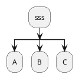
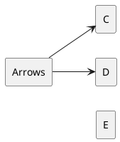
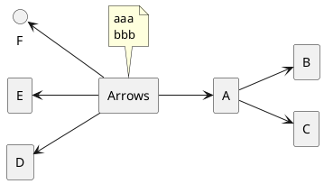
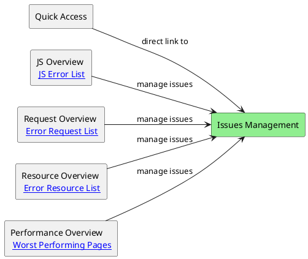

```plantuml
'甘特图

@startgantt
/'
单行注释、放在 单引号之间，多行注释前后加斜杠
[正式上线] lasts 1 day and starts at 2020/03/20
'/
'skinparam classFontSize 10'

scale 2
project starts the 2019/12/16
saturday are closed
sunday are closed
2020/01/01 is closed
2020/01/22 to 2020/02/02 is closed
2019/12/16 to 2019/12/30 are named [十二月]
2020/01/01 to 2020/01/31 are named [一月]
'2020/02/01 to 2020/02/30 are named [二月]'

-- 开发阶段（灰色背景是节假日、不计入总时间） --
[环境准备] as [hj] lasts 2 days and is colored in Lavender/LightBlue
then [首页 3d] lasts 3 days
[流程管理 4d] as [lc] lasts 4 days
[hj] -> [lc]

[<size:13><b>交付中心 <color:red>11d] as [jf] lasts 11 days
[jf] starts at [lc]'s end and is colored in Yellow/Green
[列表 3d] lasts 3 days and starts at [jf]'s start
[大图 3d] lasts 3 days and starts at [jf]'s start
[明细 3d] lasts 3 days and starts at [jf]'s start
[大图 3d] lasts 3 days and starts at [jf]'s start
[任务 3d] lasts 3 days and starts at [jf]'s start
[权限 5d] as [qx] lasts 5 days and starts at [jf]'s end

-- 测试阶段 --
[集成测试 5d] as [jc] lasts 5 days and is colored in Fuchsia/FireBrick
[qx] -> [jc]

@endgantt
```

> snippets

## bash / shell

- Unix 遵循的原则是 KISS (Keep it simple, stupid) do one thing and do it well。
- Linux 严格区分大小写。所有内容以文件形式保存，包括硬件。如：键盘 /dev/stdin 显示器 /dev/stdout
- Linux 不靠扩展名区分文件类型，靠权限区分。（ .gz .tgz .sh 等文件扩展名只是为了方便管理员查看 ）
  - bash 文件 想在 mac 上双击可执行(调用系统terminal)，需要去掉文件后缀名。
- shell 是一个命令行解释器。shell 是壳，kernel 是内核。shell 把用户敲进去的命令、翻译为 linux 内核能识别的语言。 sh: Bourne Shell 的缩写，可以说是目前所有 Shell 的祖先。 bash : Bourne Again Shell 的缩写，是 sh 的一个进阶版本。
- [vim 键盘图](https://zos.alipayobjects.com/rmsportal/MOPJrAnojdFvAToZkESi.gif) vi编辑器使用color-scheme `:colo desert` 或者 配置 `~/.vimrc` 为 `colo desert` + `syntax on` 。
- 不同平台安装包
  - macOS `brew install jq`
  - Ubuntu/Debian `sudo apt-get install jq`
  - CentOS/Fedora `sudo yum install jq`
- 在 Windows 上 哪些流行的 terminal 能和 macOS Linux 的 terminal 兼容?
  - Windows Terminal / WSL（Windows Subsystem for Linux）/ Git Bash

[Zsh 和 Bash 的不同](https://xshell.net/shell/bash_zsh.html)

bash 语句中的符号:
- 分号(;) 无论前一个命令是否成功，都会执行下一个命令。
- 双与号(&&) 只有当前一个命令执行成功 (返回值 0) 时，才会执行下一个命令。
- 双管道(||) 成功时执行 A，失败时执行 B `mkdir mydir && echo "创建成功" || echo "创建失败"`


```sh
[ -s "./scripts/script.sh" ] && \. "./scripts/script.sh"
bash script.sh && fn_name
bash script.sh fn_name  # 需要在脚本里 $1 为 fn_name 时手动执行一下
bash -c '. script.sh && fn_name'
zsh -c "source script.sh; fn_name"
sh -c "top -l 1 -pid 1234"
sh -c 'while true; do (ls -la); echo "---- $(date +%H:%M:%S) ----"; sleep 1; done'
sh -c 'while true; do (top -l 1 -stats pid,cpu,mem,command | grep -v " 0.0 " | head -n 20); sleep 1; done'
# 使用 Node.js 检查字符串是否包含中文字符
if node -e "let s = process.argv[1]; process.exit(s.match(/[\u4e00-\u9fa5]/) ? 0 : 1)" "$string"; then
  echo "字符串包含中文字符。"
else
  echo "字符串不包含中文字符。"
fi

env / w / who / whoami / tty / last / mtr -r
echo "system: $HOME $PATH $SHELL"
printenv HOME  # 打印环境变量
printenv | grep npm_config  # 查看所有 npm 设置的 env

# Process status
ps -ax
ps aux | grep xx.sh  # 列出正在运行的脚本进程
ps aux | grep "xx" | grep -v grep  # 排除 grep 本身的进程
ps -ef | grep ttyd
ps -ef | grep adb  # 有时候 adb devices 没反应 需要杀掉进程重启

pgrep -x 'ClashX'  # 获取应用的 pid
pgrep -f "ttyd zsh"  # -f 匹配完整的命令行
pgrep -f "ttyd -t disableLeaveAlert=true zsh"  # 参数解析后不一样 这里匹配不到
pgrep -f "ttyd zsh"> /dev/null  # 只返回输出码
pgrep -fx "ttyd -p 9999 -W -a zsh"
pgrep -u "$USER" -f "ttyd"
pgrep -u "$USER" -fx "ttyd -p 9999 -W -a zsh"

lsof "$z_log"
# z_log 文件正被进程 ttyd 打开, 文件描述符 1w 和 2w 表明它正在被用作标准输出和标准错误的重定向.
# 这时候 z_log 文件不能被其他进程 以 > 方式 写入内容, 改为 truncate -s 0 "$z_log" 处理.
# COMMAND  PID USER   FD   TYPE DEVICE SIZE/OFF     NODE NAME
# ttyd    1245  hua    1w   REG    1,6  16 65909077 /Users/hua/xx/z_log
# ttyd    1245  hua    2w   REG    1,6  16 65909077 /Users/hua/xx/z_log

lsof -i :8087   # 查找出占用了某个端口的程序和其对应的PID
kill 3747  # 杀掉 进程id
kill -9 *pid*  # 强制杀掉进程
pkill -P $$  # 杀掉当前 shell 启动的所有子进程
# 用 tmux 或 screen 可以让你在一个 shell 中开多个会话

top #  man top
top -l 1 -o cpu | head -n 20
top -l 1 -stats pid,cpu | head -n 20
say hello
open -a Activity\ Monitor # 打开活动监视器 或者 "Activity Monitor"

# defaults read 查看系统设置
defaults write com.apple.screencapture type jpg
defaults write com.apple.screencapture location ~/Downloads/
defaults write com.apple.Music autoPlay -bool false

sudo mount -uw /  # 挂载系统分区为可写
/sbin/mount -uw /
mount | grep /  # 查看系统挂载状态

pmset noidle # 阻止电脑睡眠 同时按住 shift、control、电源键，关闭显示器

timeout 3600 some-command
zip -e output.zip ~/xx.txt  # zip加解密


history 10 # 列出10条

# ls 命令默认只显示文件名
ls /usr/bin  # 有 env
ls /usr/local/bin  # 有 node npm npx
ls -d $PWD/*
ls -la
ls -l "$z_log"  # 查看文件是否有 读写权限，如无 运行 chmod u+rw "$z_log"
ls /Volumes/Macintosh\ HD/Applications

cat -n fname
mv fname rename
more filename # 一页一页的显示档案内容.
head/tail -n 20 ~/.zsh_history  # 只看 头/尾 几行(默认10行)

mkdir -p ~/inner/aa && touch $_/file.txt  # 创建目录并能生成文件
rm -rf xx # rm 删除不存在的文件或目录 加上 -f 不会报错
ln -s source_file dist


# 后台运行命令 & 和 nohup
# 注意  & 会随着 terminal 的关闭 而自动停止运行
/path/to/xx.sh >> /path/to/log.txt 2>&1 &
ttyd -W -a zsh >> log.txt 2>&1 &

nohup sleep 100 &
# 最后一个后台运行进程的 PID
echo $!
echo $! > "flag_file.log"

# nohup 不会随着 terminal 的关闭而停止、会在 系统关闭 时停止运行
nohup echo "Hello World"
my_command='echo "Hello World" && sleep 30'
nohup bash -c "$my_command" > output.log
nohup bash -c 'echo "Hello World" && sleep 30' > output.log
# 临时文件
echo 'echo "Hello World" && sleep 30' > /tmp/my_script.sh
chmod +x /tmp/my_script.sh
nohup /tmp/my_script.sh > output.log
# 如果不需要输出日志，可以将其重定向到 /dev/null
nohup bash -c 'your_command_here' > /dev/null 2>&1 &

```


### curl / net

```sh

# curl 默认使用 http 协议  https://ipinfo.io/json  https://ifconfig.me
curl ipinfo.io/json  # 查看本机公网IP

# 在 mac 上 xx.sh 里的代码不会执行 因为默认没权限. 先下载,再 chmod +x xx.sh 再执行
curl -O "http://xx.com/xx.sh"

curl -v -H "Content-Type: application/json" -H "X-App-Id: xx-cli" -H "X-App-Key: xx" https://xx.com/chat -d '{
  "jsonKey": "jsonVal",
  "jsonKey1": {}
}' | jq
curl -H "Content-Type: application/json" -H "X-App-Id: xx-cli" -H "X-App-Key: xx" https://xx.com/chat -d "@aa.json" | jq


ifconfig  # 查看本机内网IP
traceroute baidu.com  # 查看域名路由 或 `ping baidu.com`

```


### file/dir

```sh

# 删除 ai 目录下的指定后缀文件
rm -rf ai/**/*.d.ts ai/**/*.test.js ai/**/*.js.map

# 同步文件和目录
# 报错 cp: --exclude=a.txt is not a directory
cp -r test/* test1 --exclude=a --exclude='a.txt'
# 加引号 避免路径中间有空格
# 报错 cp: illegal option -- -
cp -r --exclude=a --exclude='a.txt' test/* test1

# 会排除掉 所有子目录 含有的同名 a.txt 文件
rsync -av --exclude='a.txt' --exclude='a/' test/ test1
# 在目标端删除源端不存在的文件
rsync -av --exclude='a.txt' --delete --dry-run test/ test1
rsync --version  # v2 不支持通配符
# 使用 .rsync-filter 文件配置
rsync -avF .rsync-filter test/ test1

# 创建一个临时目录用于存储 other-branch 的文件
mkdir /tmp/other
diff -r . /tmp/other
diff -rq . /tmp/other  # -q 只报告哪些文件不同
diff -r --exclude=".git" . /tmp/other
# 使用 --exclude="{.git,.svn}" 好像不正确
diff -r --exclude=".git" --exclude=".svn" dir1 dir2
diff -r --exclude=".git" dir1 dir2 dir3 > diff_output.txt
diff -r --exclude=".git" --exclude="node_modules" pro-components pro-componentsk > diff_output.txt

grep -rn 'grep' *  # 以 字符串 grep 来搜索 当前目录及子目录 的所有文件内容
grep grep$ she*.md  # 以 正则表达式 grep$ 来搜索 当前目录下 文件名匹配 she*.md 的内容
grep -r --include=\*.{cpp,h} pattern ./
grep -r --exclude-dir=node_modules pattern ~/

find . -name '*bash*'
find . -name "*.js" -not -path "*node_modules*" -not -path "*js-css-html*"
find . -name '*.DS_Store' -type f -delete   # 删除某目录及子目录下的 .DS_Store 文件
# find / -mmin -5   # 查找在系统中最后5分钟里修改过的文件(modify time)

# 如果文件存在则追加内容，否则创建并写入内容
# [ -f "$file" ] && echo "$content" >> "$file" || echo "$content" > "$file"
printf '\n%.0s' {1..10} >> $file

# unix diff 使用
function diff_gitignore() {
  gitignore=()
  GITIGNORE_FILE=".gitignore"
  if [ ! -f "$GITIGNORE_FILE" ]; then
    echo ".gitignore file not found in the current directory!"
    exit 1
  fi
  while IFS= read -r line; do
    # 移除行首尾的空白字符
    stripped_line=$(echo "$line" | tr -d '[:space:]')
    # 跳过空行和以 '#' 开头的注释行
    if [ -n "$stripped_line" ] && [ "${stripped_line:0:1}" != "#" ]; then
      # echo "$stripped_line"
      gitignore+=("--exclude=$line")
    fi
  done < "$GITIGNORE_FILE"
  # echo "${gitignore[@]}"
  for item in "${gitignore[@]}"; do echo "$item"; done
  # diff 的 exclude 参数 不认识 .gitignore 文件里的 **/**/es/** 这种写法
  # diff -rq --exclude=.git --exclude=**/**/es/** . /tmp/pro-components > diff.txt
}

# 获取当前路径和父路径
# echo "$(dirname $(/bin/pwd))"
# echo "$(basename $(/bin/pwd))"
current_path=$(/bin/pwd)
get_parent_dir() {
  local current_dir=$(basename "$current_path")
  local parent_dir="${current_path%$current_dir}"
  echo $parent_dir
}
parent_dir=$(get_parent_dir)


# 使用 yq 操作 yaml
dealYaml() {
  log_file="./z_log"
  clash_file="./clash.yaml"
  hl_input='{message:"aa", content: "www.cont cc"}'
  hl_input=${hl_input/#*'{'/'{'}
  local msg_command=$(echo "$hl_input" | yq '.message')
  local msg_content=$(echo "$hl_input" | yq '.content')
  if [[ $msg_content =~ ^www\. ]]; then
    msg_content=${msg_content#www.}
  fi
  new_str=DOMAIN-SUFFIX,"${msg_content}",Proxy
  rules_value=$(yq '.rules' $clash_file)
  if [[ "$rules_value" != *$new_str* ]]; then
    echo $new_str >> $log_file
    yq e '.rules |= [ "'"$new_str"'" ] +.' $clash_file -i
  fi
}
```


### npm

```sh
# 使用 pnpm 更新 workspaces 下所有 pkgs 的 outdated dependencies
function update_workspace_packages() {
  local update_pkgs="@ant-design/pro-*"
  # local workspace_packages=$(pnpm ls -r --depth -1 --json | jq -r '.[] | select(.private == false) | .name')
  # echo $workspace_packages
  local filter_ws_pkgs=()
  local workspace_packages=$(pnpm ls -r --depth -1)
  while IFS= read -r line; do
    if [[ $line =~ ^[^[:space:]]+ ]] && [[ $line != *"(PRIVATE)"* ]]; then
      # Filter out the content before @ in each line
      filter_ws_pkgs+=(${line%@*})
    fi
  done <<< "$workspace_packages"
  for pkg in "${filter_ws_pkgs[@]}"; do
    outdated=$(pnpm outdated "$update_pkgs" --filter "$pkg" --json)
    if [ "$outdated" != "{}" ]; then
      echo "$pkg has outdated dependencies $outdated"
      pnpm up "$update_pkgs" --filter "$pkg" --latest
    else
      echo "$pkg's $update_pkgs dependencies is up to date."
    fi
  done
  echo "Workspace packages finish update"
}
# update_workspace_packages

# 查找某个 npm group 下所有包的 dependencies 里包含的指定依赖
function search_dep() {
  # 先运行 sudo npm cache clean --force 能避免 npm error code EEXIST 错误
  local result_file="log.txt"

  local default_group="@ant-design"
  local default_registry="https://registry.npmmirror.com"
  local default_search_name="react"
  local default_search_size=300
  local group="${1:-$default_group}"
  local registry="${2:-$default_registry}"
  local search_name="${3:-$default_search_name}"
  local search_size="${4:-$default_search_size}"

  local pkgs=$(npm search $group --json --registry=$registry --searchlimit=$search_size)
  # echo "pkgs: $pkgs"
  local all_deps=$(echo "$pkgs" | jq -r '[.[] | {(.name): .["dist-tags"].latest}] | add')
  create_package_json "$all_deps"
  # return

  local pkg_names=$(npm search $group --json --registry=$registry --searchlimit=$search_size | jq -r '.[].name')
  echo "list: $pkg_names"
  for pkg_name in $pkg_names; do
    local deps=$(npm view $pkg_name dependencies --json --registry=$registry)
    # search_result=$(jq --arg name "$search_name" -r '.[$name]' <<< "$deps")
    search_result=$(jq -r '."'$search_name'"' <<< "$deps")
    echo "
pkg_name: $pkg_name
dependencies: $deps" >> $result_file
    if [ -n "$search_result" ]; then
      echo "search_result: $search_name $search_result
      " >> $result_file
    fi
  done
}
# search_dep
```

### git

```sh
misc() {
# 检查是否在 Git 仓库中
if ! git rev-parse --is-inside-work-tree > /dev/null 2>&1; then
  echo "错误：当前不在 Git 仓库中"
  exit 2
fi

# 检测 HEAD 状态
# if git symbolic-ref --quiet HEAD; then
if git symbolic-ref HEAD > /dev/null 2>&1; then
  echo "HEAD 已附加到分支: $(git symbolic-ref --short HEAD)"
  exit 0
else
  commit_hash=$(git rev-parse --short HEAD)
  echo "HEAD 处于分离状态，当前提交: $commit_hash"
  exit 1
fi

# 先 git tag -l > tags.txt
# 再运行本脚本
while read -r line; do
  git tag -d "$line"
  # git push origin --delete "$line"
done < tags.txt

remote_tags=$(git ls-remote --tags origin)
remote_tags=$(git ls-remote --tags origin | awk '{print $2}' | sed 's#refs/tags/##')
remote_tags=$(git ls-remote --tags origin | sed 's/.*refs\/tags\/\(.*\)/\1/')
local_tags=$(git tag -l)

# 2024-07 获取分支名
cd "$(git rev-parse --show-toplevel || echo .)"
branch=$(git rev-parse --symbolic-full-name --abbrev-ref HEAD) && echo ${branch}

}

# 在 ~/.zshrc 里 根据目录动态切换 git user
chpwd() {
  WORK_GIT_NAME="Alice Work"
  WORK_GIT_EMAIL="alice@work.com"
  PERSONAL_GIT_NAME="Alice Personal"
  PERSONAL_GIT_EMAIL="alice@personal.com"
  WORK_DIR="$HOME/work"
  PERSONAL_DIR="$HOME/personal"
  if [[ $PWD == $WORK_DIR* ]]; then
    export GIT_USER_NAME="$WORK_GIT_NAME"
    export GIT_USER_EMAIL="$WORK_GIT_EMAIL"
  elif [[ $PWD == $PERSONAL_DIR* ]]; then
    export GIT_USER_NAME="$PERSONAL_GIT_NAME"
    export GIT_USER_EMAIL="$PERSONAL_GIT_EMAIL"
  else
    unset GIT_USER_NAME
    unset GIT_USER_EMAIL
  fi
}

# 获取 git log 的 第一条 最后一条 总数 等信息，放到 bash 数组里
get_git_log() {
  # current_branch
  branch_name=$(git symbolic-ref --short HEAD)
  all_commits_num=$(git rev-list --count HEAD)
  all_commits=$(git log $branch_name --format=%H:%an:%s)
  latest_commit=$(git log $branch_name -1 --pretty=%H)
  skip_latest_commit=$(git log --skip=1 --pretty=%H)
  first_commit=$(git log $branch_name --reverse --skip=1 $latest_commit --pretty=%H | head -n 1)
  first_commit=$(git rev-list --max-parents=0 HEAD)
  echo $latest_commit
  echo $first_commit

  declare -a commits_info

  # 使用 while 循环读取 git log 输出，并将信息追加到数组中
  while IFS= read -r line; do
    commits_info+=("$line")
  done < <(echo "$all_commits")

  echo "commits count: "${#commits_info[@]}

  for info in "${commits_info[@]}"; do
    if [[ "$info" != "$first_commit" ]]; then
      echo "$info"
      # echo "${info%%:*}, ${info#*:}"
      # do sth
      # git cherry-pick $info
    else
      echo first_commit: "$first_commit"
    fi
  done
}

# 备份分支
function backup_branch() {
  if [ -z "$1" ]; then
    echo "请输入要备份的分支名"
    return 1
  fi
  local bk_branch_name=backup-$1
  local branch_exists=$(git branch | grep "$bk_branch_name")
  if [ -n "$branch_exists" ]; then
    echo -e "
    备份分支名 $bk_branch_name 已存在 请运行命令删除或改名
      git branch -D $bk_branch_name
    "
    return 1
  else
    # 做备份
    git checkout -b "${bk_branch_name}"
  fi
}
# 压缩分支的提交  使用 /bin/zsh 执行，不然显示有问题
function commits_squash() {
  local feature_branch="$1"
  local base_branch="$2"
  if [ -z "$1" ]; then
    local feature_branch=$(git symbolic-ref --short HEAD)
  fi
  if [ -z "$2" ]; then
    local base_branch="origin/master"
  fi
  # echo "参数 $1 $2 , $feature_branch $base_branch"

  local gitStatus=$(git status --porcelain)
  if [ "$gitStatus" != "" ]; then
    echo "Your git status is not clean"
    return 1
  fi

  backup_branch $feature_branch || return 1
  git pull

  echo "\033[32m
  合并 ${feature_branch} 成一个 commit，并归集所有待合并 commit 的 messages
  \033[0m"
  git checkout "${feature_branch}"

  calc_commits_num $base_branch $feature_branch
  local commits_num=$calc_commits_num_result
  echo $commits_num

  # 如果只有一个 commit，则无需合并
  if [ $commits_num -lt 2 ]; then
    echo "\033[32m
    只有一个提交，不需要压缩
    \033[0m"
    return 0
  fi

  # 收集所有待合并 commits 的 message
  local commits_message=""
  for ((i = commits_num - 1 ; i >= 0 ; i--)); do
    # MESSAGE=$(git log --format=%s HEAD~${i} -1)
    MESSAGE=$(git log --format='%h - %an - %ad %n %s' HEAD~${i} -1)
    commits_message+="${MESSAGE}
  "
  done
  local new_message="📦 chore: Squashed ${commits_num} commits:

  ${commits_message}"

  echo -e "\033[32m 请确认是否合并这些commits (y/n) : \033[0m"
  printf $new_message

  read answer
  [[ $answer = "n" ]] && return 1

  # 恢复到 base 分支的 最后一次提交
  git reset --soft $(git rev-parse HEAD~$commits_num)
  git add --all
  git commit -am "${new_message}"

  echo "
  建议再手动运行 git commit --amend 额外添加 commit 注释
  提交 git push --force-with-lease
  "
  # git log
  # git push origin "${feature_branch}" --force-with-lease
}

# 2016 自动 commit push
function commit() {
  # printf "\n"
  echo "\033[32m git op (y/n)?  \033[0m"
  read git_op
  [[ $git_op = "n" ]] && exit
  BASEDIR=$(dirname $0)
  ## echo $BASEDIR
  cd $BASEDIR
  echo "\033[32m git status \033[0m"
  git status
  read -p "Press Return to Close..."
}
```


### base

```sh
#!/usr/bin/env bash
# #!/bin/bash
# /bin/zsh
#!/usr/bin/env -i bash   # 重置所有环境变量

# 使用 set -e 会使脚本在任何命令返回非零状态时立即退出
set -e

# export PATH="/usr/local/bin:/usr/bin:$PATH"
# export PATH="$PATH:/usr/local/bin:/usr/local"
export PATH=/usr/bin:/bin
export HOME=/home/username
export TERM=xterm-256color

export TMP_VAR='tmp'  # 在 terminal 里临时设置环境变量
unset npm_config_registry  # 删除特定 env
unset npm_config_userconfig  # 删除特定 env

type fn_name
type -a node / pwd

# 用双引号包括变量，能保留换行
str="{
"a": "b"
}"

local str="long...\
实际不换行"
local str1="第一行
第二行"
local num=1
local num="$num"2  # 或 num=${num}2
local new_msg="Merged $(($num-1)) $((${num}-1)) commits"
echo $str $str1 $num $new_msg

local blank_path="/Applications/Google\" \"Chrome.app/Contents/MacOS/Google\" \"Chrome"
local blank_path=/Applications/Google\ Chrome.app/Contents/MacOS/Google\ Chrome
local blank_path="/Applications/Google Chrome.app/Contents/MacOS/Google Chrome"
local escaped_blank_path=${blank_path////\\/}
echo $escaped_blank_path
printf "这是要写入文件的内容\n"

# 设置默认值
default_value="default"
# 使用参数扩展来获取值，若无则用默认值
value="${1:-$default_value}"

# 数组  # 在 Bash 3 中 不能直接在函数内部引用或修改外部数组
myArray=("apple" "banana" "cherry")
myArray+=("element1" "element2" "element3")
newMyArray=("${myArray[@]}")
echo "${myArray[0]}"
echo "${myArray[1]}"
echo "${myArray[@]}"
# 遍历输出
for item in "${myArray[@]}"; do echo "$item"; done

cd /path/to/dir || { echo "路径无效"; exit 1; }
data_str="master-"$(date +"%Y%m%d-%H%M%S")

# 输入输出  使用 eval 不安全，也难解决命令参数 含有空格和引号 的情况
eval "ls -l" >> "/tmp/a_log.txt"
eval "ls -l" 2>&1 | tee -a "/tmp/a_log.txt"
(exec eval "ls -l" 2>&1 | tee -a "/tmp/a_log.txt") >/dev/null
eval "$command" >> "$file" 2>&1

# 兼容 bash 和 zsh 颜色和换行
# 依赖特定 Shell 的转义序列  (Zsh 的一些插件和配置 可能会影响换行的显示效果)
echo -e "\033[31mRed text\033[0m"
echo -e "Line 1\nLine 2"

# 使用 tput 命令，不依赖特定 Shell 的转义序列
RED=$(tput setaf 1)
RESET=$(tput sgr0)
echo "${RED}Red text${RESET}"
# 检测不同的 shell 分别设置
if [ -n "$BASH_VERSION" ]; then
  RED='\033[31m'
  RESET='\033[0m'
elif [ -n "$ZSH_VERSION" ]; then
  RED='%F{red}'
  RESET='%f'
fi
echo "${RED}Red text${RESET}"


function hl() {
  if [ $# -eq 0 ]; then
    echo "Usage: $0 xx"
    return 1
  fi
}
second_function() {
  return $?  # 直接返回 first_function 的状态码
}
echo $? # 获取 函数 return 返回值
if [ $? -ne 0 ]; then
  echo "Error: Function failed!"
  exit 1  # 或者根据需要退出脚本
fi
# command && success_action: 当 command 成功时执行 success_action
# command || failure_action: 当 command 失败时执行 failure_action
my_function || echo "Function failed!"

# 错误处理
trap 'echo "Error occurred on line $LINENO"; exit 1' ERR


# /.git/hooks/ yorkie 2.0.0
command_exists () {
  command -v "$1" >/dev/null 2>&1
}
if command_exists forever; then
  echo 'MY_Info: forever has been installed'
fi

has_hook_script () {
  [ -f package.json ] && cat package.json | grep -q "\"$1\"[[:space:]]*:"
}
has_hook_script pre-commit || exit 0

# OS X and Linux only
load_nvm () {
  command_exists nvm || {
    export NVM_DIR="$1"
    [ -s "$1/nvm.sh" ] && . "$1/nvm.sh"
  }
}
run_nvm () {
  # If nvm has been loaded correctly, use project .nvmrc
  command_exists nvm && [ -f .nvmrc ] && nvm use
}
load_nvm /Users/hua/.nvm
run_nvm


# 读取用户输入
confirm_action() {
  local prompt_message="$1"
  local user_input

  read -p "$prompt_message (y/n): " user_input
  user_input=${user_input:-y}  # 默认值为 'y'，如果用户直接按回车

  if [[ $user_input =~ ^[Yy]$ ]]; then
    return 0  # 表示确认，返回成功状态
  else
    return 1  # 表示取消，返回失败状态
  fi
}

datef() {
  local fmt="${1:-"%Y_%m_%d-%H_%M_%S"}"
  local output=$(date "+$fmt")
  echo "[$output]"
  # date "+$fmt"
}
# datef "%Y-%m-%d"

add_blank_lines() {
  # return 1
  # echo -e "\n" >> $sync_log
  printf '\n%.0s' {1..5} >> $sync_log
}

get_special_files() {
  special_files=(".pnpmfile.cjs" ".npmrc" "pnpm-lock.yaml" ".git")
  # 2024-08 bash 查找 packages 目录下二级 目录里存在的所有 config.ts congfig.tsx config.js 和 config 目录，排除掉 node_modules 目录。不查找子路径。查找结果 存放到数组里。
  # special_files+=($(find packages/*/src -maxdepth 1 -type f \( -name "config.ts" -o -name "config.tsx" -o -name "config.js" \) -not -path "*/node_modules/*" -o -type d -name "config" -not -path "*/node_modules/*"))
  # for item in "${special_files[@]}"; do echo "$item"; done
}
# get_special_files


input_string="your string to encode"
encoded_string=$(echo -n "$input_string" | base64)
decoded_string=$(echo -n "$encoded_string" | base64 --decode)


# 识别字符串包含的中文
string="Hello，世界！"
# string="Hello"
# 使用 printf 将每个字符转换为 Unicode 编码
for ((i=0; i<${#string}; i++)); do
  char="${string:i:1}"
  unicode=$(printf "%04X" "'$char")
  echo "字符: $char, Unicode 编码: \\u$unicode"
done
# 使用 bash 语句, 在 macOS 里不正常
if [[ $string =~ [\u4e00-\u9fa5] ]]; then
  echo "字符串包含中文"
else
  echo "字符串不包含中文"
fi

pnpm i 2>&1 | tee "$sync_log"
# PIPESTATUS 必须在主 shell 中使用，不能在子 shell 中（包括 {}、() 等）。
if [ ${PIPESTATUS[0]} -ne 0 ]; then
  echo "pnpm i failed with an error. Terminating execution."
  exit 1
fi
# 检查日志中是否有 ERR_PNPM_FETCH_404
if grep -q 'ERR_PNPM_FETCH_404' "$sync_log"; then
  echo "Found ERR_PNPM_FETCH_404, displaying error details:"
  grep --before-context=5 --after-context=5 'ERR_PNPM_FETCH_404' "$sync_log"
  exit 1
fi

if [ "$1" -eq 1 ]; then
  return 0  # 成功
fi

if [[ "${a}" != "${b}" ]]; then
  echo "a"
fi

if [ -s "./lib/sh/sync.sh" ]; then
  \. "./lib/sh/sync.sh"
  fn xx
fi

if [ -z "$1" ]; then
  echo "Please input the repo name"
  exit 1
fi

if [[ -n $GIT_USER_NAME ]]; then
  git config --global user.name "$GIT_USER_NAME"
  git config --global user.email "$GIT_USER_EMAIL"
fi

if [[ $PACKMAN_PUBLISH_BRANCH =~ ^release- ]]; then
  echo "release branch pipeline"
fi

if [[ "$NPM_TAG" =~ ^(alpha|beta|rc|latest)$ ]]; then
  # node ./build-publish.mjs
  npx tsx ./build-publish.mjs
else
  echo "Local release is prohibited!"
fi


while true; do
  ls -l
  echo "
  ---- last update: $(date '+%H:%M:%S') ----
  "
  sleep 1
done

# 持续显示进程信息
while true; do
  clear
  ps aux | awk '{print $2, $3, $11}' | sort -k2 -nr | head -n 10
  sleep 2
done

sync_code() {
  unset npm_config_registry
  echo "===== start clean ====="
}
case $1 in
  "sync_code") sync_code $2 ;;
  # "two") functionTwo ;;
esac


# 2014 ssh 登录 ssh & scp
scp -r ~/Downloads/build/ root@118.31.47.xx:/home/admin/nginx/
ssh root@118.31.47.xx xyxyxy
cd /home/admin/nginx/
cp -r ./build ./build-back1

echo "进行 xx 操作 \n\r" \
&& cd ~/my/work/project/xx \
&& spm build && spm deploy \
# 对引号进行转义
expect -c "spawn ssh admin@xx.net
expect \"password:\"
send \"password22\r\"
send \"cd ccbin && ./ccupdate.sh \n\"
interact "

```


## JS

### async

async await 实现原理 https://zhuanlan.zhihu.com/p/115112361
https://segmentfault.com/a/1190000023442526
await 后需要是 Promise

async await 与 forEach 不起作用。因为 forEach 每次循环 都忽略返回值
https://objcer.com/2017/10/12/async-await-with-forEach/
使用 map 或 for..of 代替 https://stackoverflow.com/a/37576787/2190503
https://advancedweb.hu/how-to-use-async-functions-with-array-foreach-in-javascript/

```js
function timeout(ms) {
  // return new Promise(resolve => setTimeout(resolve, ms));
  return new Promise((resolve, reject) => setTimeout(() => {
    ms === 404 ? reject('err...') : resolve(ms);
  }, ms));
}
var arr = [404, 2000, 4500];

// 普通 for 语句 串行执行，时间累加
for (var index = 0; index < arr.length; index++) {
  await timeout(arr[index]);
}
// for of 串行执行，时间累加
for (let item of arr) {
  await timeout(item);
}
// array.map 工作不正确
await arr.map((item) => {
  return timeout(item);
});
// Promise.all + array.map 并行执行，最慢的一个时间决定总时间
var res = await Promise.all(arr.map(async (item) => {
  // return await timeout(item).catch(() => 'catch it');
  try {
    return await timeout(item)
  } catch (error) {
    return 'catch it new style'
  }
}));
// reduce
await arr.reduce(async (memo, i) => {
  await memo;
  await timeout(10 - i);
  console.log(i);
}, undefined);


async function test() {
  console.log('test start');
  await otherTest();
  console.log('test end');
}
async function otherTest() {
  console.log('otherTest');
}
test();
console.log('after test');
// 输出 test start -> otherTest -> after test -> test end
// async 后函数相当于变成了
function test() {
  console.log('test start');
  const p = new Promise((res, rej) => {
      otherTest();
  });
  p.then(() => console.log('test end'));
  return p;
}
```

Promise
[promise-error-handling](https://zh.javascript.info/promise-error-handling)
https://zhuanlan.zhihu.com/p/58428287
https://segmentfault.com/a/1190000009478377
[Lightweight javascript implementation of promises](https://github.com/stackp/promisejs)

```js
Promise.all([
  new Promise(function (resolve, reject) {
    console.log('reject 先执行，后边 promise 内容是否会执行了？');
    window.addEventListener('DOMContentLoaded', () => resolve('dom ready'));
    // window.addEventListener('DOMContentLoaded', () => reject('dom ready'));
    // return reject('reject immediately');
  }),
  new Promise(function (resolve) {
    window.addEventListener('DOMContentLoaded', () => resolve('dom ready'));
    // return reject('reject again');
  }),
  new Promise(function (resolve) {
    console.log('p1');
    window.addEventListener('DOMContentLoaded', () => resolve('dom ready'));
  }),
  new Promise(function (resolve) {
    console.log('fake promise');
    resolve('fake promise');
  })
]).then(res => console.log('res: ', res), rej => console.log(rej));

// 不管成功失败，都返回所有结果，不退出
Promise.almost = r => Promise.all(r.map(p => p.catch ? p.catch(e => e) : p));

function PromiseImpl(fn) {
  let callbacks = [];
  this.then = (resolveFn, rejectFn) => {
    callbacks.push(resolveFn);
    return this;
  };
  const resolve = (value) => {
    callbacks.forEach(item => {
      item(value);
    })
  }
  fn(resolve);
}
const pro = new PromiseImpl((resolve, reject) => {
  setTimeout(() => {
    resolve(1);
  }, 100);
});
pro.then((data1) => {
  console.log(data1);
}, error => console.log(error)).then(data => {
  console.log(data);
}, error => console.log(error));
```


[Generators](https://developer.mozilla.org/en-US/docs/Web/JavaScript/Reference/Statements/function*)
[iterators](https://developer.mozilla.org/en-US/docs/Web/JavaScript/Guide/The_Iterator_protocol)
[yield](https://developer.mozilla.org/en-US/docs/Web/JavaScript/Reference/Operators/yield)

```js
// 斐波那契
function* fibonacci() {
  let [prev, curr] = [0, 1];
  for (;;) {
    [prev, curr] = [curr, prev + curr];
    yield curr;
  }
}
for (let n of fibonacci()) {
  if (n > 1000) break;
  console.log(n);
}

function* iterTree(tree) {
  if (Array.isArray(tree)) {
    for (let i = 0; i < tree.length; i++) {
      yield* iterTree(tree[i]);
    }
  } else {
    yield tree;
  }
}
const tree = ["a", ["b", "c"], ["d", "e"]];
for (let x of iterTree(tree)) {
  console.log(x);
}
```


### window

BOM 的核心是 window, window 对象包含属性：document、location、navigator、screen、history、frames
Dom 根节点包含子节点 forms、embeds、anchors、images、links

```js
// dom 节点包含 https://segmentfault.com/q/1010000007159611
console.log('log contains: ', document.documentElement.contains(document.body));
function isChildOf(child, parent) {
  var parentNode;
  if(child && parent) {
    parentNode = child.parentNode;
    while(parentNode) {
      if(parent === parentNode) {
        return true;
      }
      parentNode = parentNode.parentNode;
    }
  }
  return false;
}

// WebComponents Shadow DOM
/*
当用户没有与网页进行任何交互 并且也没有动画 requestIdleCallback 执行的时间最长可达到50ms。
屏幕是 60hz 有渲染时、每帧执行时间16ms（1000ms / 16），剩余空闲时间小于它。
requestAnimationFrame 的回调会在每一帧确定执行，属于高优先级任务，而 requestIdleCallback 的回调则不一定，属于低优先级任务。
不能在 requestIdleCallback 里再操作 DOM，因为它发生在一帧的最后，这样会导致页面再次重绘。DOM 操作建议在 rAF 中进行。
Promise的resolve(reject)操作也不建议放在里面，会拉长当前帧的耗时。
能做 数据的分析和上报 预加载资源 检测卡顿 拆分耗时任务(React 中的调度器 Scheduler)
*/
requestIdleCallback(myNonEssentialWork, { timeout: 2000 });
// 任务队列
const tasks = ['1', '2', '3'];
function myNonEssentialWork (deadline) {
  console.log('dl', deadline.timeRemaining());
  // 如果帧内有富余的时间，或者超时
  while ((deadline.timeRemaining() > 0 || deadline.didTimeout) && tasks.length > 0) {
    console.log('dl1', deadline.timeRemaining(), deadline.didTimeout);
    console.log('执行任务', tasks.shift());
  }
  console.log('dl2', deadline.timeRemaining());
  if (tasks.length > 0) {
    console.log('dl3', deadline.timeRemaining());
    requestIdleCallback(myNonEssentialWork);
  }
}
window.addEventListener('load', () => {
  requestIdleCallback(myNonEssentialWork, { timeout: 5000 });
  function myNonEssentialWork (deadline) {
    // console.log('执行任务 1', deadline.timeRemaining(), location.href);
    while ((deadline.timeRemaining() > 0 || deadline.didTimeout)) {
      // console.log('执行任务 while', deadline.timeRemaining());
    }
  }
});

// 判断当前页面是否在 iframe 里
if (self != top) {}
// 禁止别人以 iframe 加载你的页面
if (window.location != window.parent.location) {
  window.parent.location = window.location;
}

// 跨浏览器的 addEventListener 实现
function addEventListener(target, eventType, callback) {
  if (target.addEventListener) {
    target.addEventListener(eventType, callback, false);
    return {
      remove: function() {
        target.removeEventListener(eventType, callback, false);
      }
    };
  } else if (target.attachEvent) {
    target.attachEvent("on" + eventType, callback);
    return {
      remove: function() {
        target.detachEvent("on" + eventType, callback);
      }
    };
  }
}

// 改变 url 而不刷新页面的方法：location.hash(hashchange 事件)，history api。
// history 模式需要后端的配合，不然刷新页面会 404 https://developer.mozilla.org/en-US/docs/Web/API/History_API
// 浏览器在被点击“后退”或者“前进"按钮时，会触发 popstate 事件，代码调用 history.pushState/replaceState 不会触发。
// 用处：将 参数 更新到 URL 里，在 刷新页面 的时候会保留搜索结果
window.addEventListener('hashchange', (e) => console.log(e)); // 如果有 hash 时、触发
window.addEventListener('popstate', function (e) {
  console.log('popstate event: ', JSON.stringify(e.state), e);
  if (e.state !== null) {
    //load content with ajax
  }
});
history.pushState({page: 1}, "title 1", "?page=1");
// 浏览器不会下载或检查 bar.html 是否存在，刷新页面 404
history.pushState({page: 2}, "title 2", "bar.html");
// 不能跨域，baidu 跟本页面是不同域
history.pushState({page: 2}, "baidu", "https://www.baidu.com/");
history.replaceState({page: 3}, "title 3", "?page=3");
history.back(); history.forward(); history.go(2); // 跟 浏览器回退 按钮功能一样，触发 popstate 事件

// resize 事件只在 window 变化时触发，内部元素变化不会触发
// 注册在 元素上 不起作用 ele.addEventListener('resize'); 换用 ResizeObserver 监听元素尺寸变化
window.addEventListener('resize', () => {
  console.log('resize event');
}, true);

window.addEventListener('beforeunload', (e) => {
  e.preventDefault();
  e.returnValue = "";
  return "Custom message to show to the user";
}, true);

window.addEventListener('keydown', function showKeyCode(e) {
  var keyCode = e.keyCode || e.which;
  console.log('keyCode', keyCode);
}, false);

fetch('./users', {
  mode: 'no-cors',
  headers: {
    'Accept': 'application/json',
    'Content-Type': 'application/json'
  }
}).then(function checkStatus(response) {
  if (response.status >= 200 && response.status < 300) {
    return response
  } else {
    var error = new Error(response.statusText)
    error.response = response
    throw error
  }
}).then((response) => response.json()).catch(function(error) {
  console.log('request failed', error)
});

function ajax(url, success, fail) {
  var xhr = new XMLHttpRequest();
  xhr.onload = function() {
    if (xhr.status >= 200 && xhr.status < 400) {
      success(xhr.responseText);
    } else {
      fail(xhr);
    }
  };
  xhr.open('GET', url, true);
  xhr.send();
}

function ajaxUploadWithProgress(url, options) {
  const { method, headers, credentials, body } = options;
  return new Promise((resolve, reject) => {
    const result = {};
    var xhr = new XMLHttpRequest();
    xhr.withCredentials = credentials;
    Object.keys(headers).forEach(item => {
      xhr.setRequestHeader(item, headers[item]);
    });
    xhr.upload.onprogress = function(event) {
      console.log(`Uploaded ${event.loaded} of ${event.total} bytes`);
    };
    xhr.upload.onload = function() {
      console.log(`Upload finished successfully.`);
    };
    xhr.upload.onerror = function() {
      console.log(`Error during the upload: ${xhr.status}`);
    };
    xhr.onloadend = function() {
      console.log(`Error during the upload: ${xhr.status}`);
    };
    xhr.onload = function() {
      // success: xhr.status >= 200 && xhr.status < 400
      resolve(xhr);
    };
    xhr.open(method, url, true);
    xhr.send(body);
  });
}
```

### file img canvas svg

```js

function randomColor() {
  return '#' + ('00000' + (Math.random() * 0x1000000 << 0).toString(16)).slice(-6);
}

// 参考 https://unpkg.com/placeholder.js@3.1.0/dist/placeholder.js
function createImg(opts = {
  size: [128,128], text: '128', bgColor: randomColor(), color: randomColor(),
  // normal / italic / oblique
  fstyle: 'normal',
  // normal / bold / bolder / lighter
  fweight: 'bold',
  fsize: '', // auto calculate the font size to response to the image size
  ffamily: 'consolas',
}) {
  let cvs, cvsContext;
  const createCanvas = () => {
    if (!cvs || !cvsContext) {
      cvs = document.createElement('canvas');
      cvsContext = cvs.getContext('2d');
    }
    cvs.width = opts.size[0];
    cvs.height = opts.size[1];
    cvsContext.clearRect(0, 0, opts.size[0], opts.size[1]);
    cvsContext.fillStyle = opts.bgColor;
    cvsContext.fillRect(0, 0, opts.size[0], opts.size[1]);
    cvsContext.fillStyle = opts.color;
    cvsContext.font = `${opts.fstyle} normal ${opts.fweight} ${opts.fsize || 100}px ${opts.ffamily}`;
    const text_width = cvsContext.measureText(opts.text).width,
    let scale = 1.0;
    if (!opts.fsize) {
      scale = Math.min(0.7 * opts.size[0] / text_width, 0.7 * opts.size[1] / 100);
    }
    cvsContext.translate(opts.size[0] / 2, opts.size[1] / 2);
    cvsContext.scale(scale, scale);
    cvsContext.textAlign = 'center';
    cvsContext.textBaseline = 'middle';
    cvsContext.fillText(opts.text, 0, 0);
    return cvs;
  }
  return createCanvas().toDataURL();
}
// <form>
//   size: <input id="size" value="375x200" />
//   text: <input id="text" value="text" />
//   bgColor: <input id="bgColor" value="#ccc" placeholder="#f3efee #0D8FDB #39DBAC #F8591A" />
//   <br />
//   
// </form>
const opts = {
  size: [375, 200],
  bgColor: '#ccc',
  color: 'white',
  text: 'text',
};
['size', 'text', 'bgColor'].forEach(function(i) {
  document.getElementById(i).addEventListener('input', function() {
    opts[i] = this.value;
    document.getElementById('imgEle').setAttribute('src', createImg(opts));
  });
});

// canvas 有损缩放图片
async function resizeImg(imgSrc) {
  const canvas = document.createElement('canvas');
  const ctx = canvas.getContext('2d');
  const imgObj = await loadImage(imgSrc);
  const nw = imgObj.naturalWidth, nh = imgObj.naturalHeight;
  const ratio = nw / canvas.width;
  canvas.height = nh / ratio;
  ctx.drawImage(imgObj, 0, 0, nw / ratio, nh / ratio);
  return canvas;
}
const cvs = await resizeImg('https://gw.alipayobjects.com/zos/rmsportal/PnjNniBkexOKzoehotzl.jpg')
console.log('log cvs: ', cvs, cvs.width);

async function loadImage(imgSrc) {
  const imgObj = await new Promise((resolve) => {
    const img = new Image;
    img.onload = () => {
      resolve(img);
    };
    img.src = imgSrc;
  });
  console.log('img', imgObj);
}

const loadImage1 = async (imgSrc) => {
  const imgObj = await new Promise((resolve) => {
    const image = document.createElement('img');
    image.onload = () => {
      resolve(image);
    };
    image.src = imgSrc;
  });
  console.log('img', imgObj);
}

function getImgBase64() {
  // <input type="file" id="file" name="file" />
  const file = document.getElementById('file').files[0];
  const reader = new FileReader();
  reader.readAsDataURL(file);
  reader.onload = function (event) {
    const base64 = event.target.result;
    console.log('log base64: ', base64);
  };
}

// base64 图片自动下载
// https://stackoverflow.com/questions/14011021/how-to-download-a-base64-encoded-image
function downloadBase64File(base64String, fileName) {
  // const linkSource = `data:${contentType};base64,${base64Data}`;
  const now = new Date();
  const formatNow = `${now.getFullYear()}-${now.getMonth()}-${now.getDate()}_${now.getHours()}-${now.getMinutes()}`;
  const downloadLink = document.createElement("a");
  downloadLink.href = base64String;
  downloadLink.download = fileName || formatNow + '.jpeg';
  downloadLink.click();
}

// 读取 json 文件内容
const readJsonFile = (file) => {
  return new Promise((resolve) => {
    const reader = new FileReader();
    reader.readAsText(file);
    reader.onload = (event) => {
      resolve(JSON.parse(event.target.result));
    };
  });
};

// 下载字符串为 json 文件
import fileSaver from 'file-saver';
const downloadJson = (jsonData, { filename }) => {
  if (!jsonData) {
    return;
  }
  try {
    fileSaver.saveAs(
      new Blob([JSON.stringify(jsonData, null, 4)], { type: 'application/json;charset=utf-8' }),
      `${filename}.json`
    );
  } catch (e) {
    console.log(e);
  }
};
```


------ svg

svg 深入 https://flaviocopes.com/svg/
- 包括通过 img 或 CSS background-images 引用的 单独 svg 文件，必须要写 XML declaration DOCTYPE 声明。
- 直接写在 html 里的 svg 代码，不能写 XML declaration 和 DOCTYPE 声明。
- 如果 svg 使用 img 标签加载，不能与 css/js 交互，其包含的外部链接如 images, stylesheets, scripts, fonts 不能被加载。

https://flaviocopes.com

svg 文件 需要以 `<?xml version="1.0" encoding="UTF-8"?>` 和 `<!DOCTYPE svg PUBLIC "-//W3C//DTD SVG 1.1//EN" "http://www.w3.org/Graphics/SVG/1.1/DTD/svg11.dtd">` 开头

svg icon `<use class="icon-use" xlink:href="./sprites.svg#icon-hamburger"></use>`

svg 元素

`<object data="https://cdn.glitch.com/3b178055-c252-40d3-b2b8-69919fd392c5%2Fflag.svg?1522475211134" type="image/svg+xml"></object>`

`<iframe src="https://cdn.glitch.com/3b178055-c252-40d3-b2b8-69919fd392c5%2Fflag.svg?1522475211134" frameborder="0" width="300" height="200"></iframe>`

`<embed src="https://cdn.glitch.com/3b178055-c252-40d3-b2b8-69919fd392c5%2Fflag.svg?1522475211134" type="" />`

`<div style="background-image: url(https://cdn.glitch.com/3b178055-c252-40d3-b2b8-69919fd392c5%2Fflag.svg?1522475211134); height: 200px; width: 300px;"></div>`
``
``

`<svg width="50" height="50" xmlns="http://www.w3.org/2000/svg"><circle cx="25" cy="25" r="20"/></svg>`

```js
function pieChart(percentage, size) {
  // primary wedge
  var unit = (Math.PI * 2) / 100;
  var startangle = 0;
  var ra = 4;
  var endangle = percentage * unit - 0.001;
  var x1 = (size / ra) + (size / ra) * Math.sin(startangle);
  var y1 = (size / ra) - (size / ra) * Math.cos(startangle);
  var x2 = (size / ra) + (size / ra) * Math.sin(endangle);
  var y2 = (size / ra) - (size / ra) * Math.cos(endangle);
  var big = 0;
  if (endangle - startangle > Math.PI) {
      big = 1;
  }
  var d = "M " + (size / ra) + "," + (size / ra) +  // Start at circle center
      " L " + x1 + "," + y1 +     // Draw line to (x1,y1)
      " A " + (size / ra) + "," + (size / ra) +       // Draw an arc of radius r
      " 0 " + big + " 1 " +       // Arc details...
      x2 + "," + y2 +             // Arc goes to to (x2,y2)
      " Z";                       // Close path back to (cx,cy)

  return `
    <svg width="${size}" height="${size}" viewBox="0 0 ${size / 2} ${size / 2}">
      <circle cx="${size / ra}" cy="${size / ra}" r="${size / ra}" fill="#ebebeb"></circle>
      <path d="${d}" fill="red"></path>
      <circle cx="${size / ra}" cy="${size / ra}" r="${size * 0.17}" fill="#fff"></circle>
    </svg>
  `;
}
const pieHtml = pieChart(50, 72);
const div = document.createElement('div');
div.innerHTML = pieHtml;
document.body.appendChild(div);
```


### 国际化 / 日期
> 2024 2019

[Intl](https://developer.mozilla.org/zh-CN/docs/Web/JavaScript/Reference/Global_Objects/Intl)
[BCP 47](https://datatracker.ietf.org/doc/html/rfc5646)  locales 参数必须是一个 BCP 47 语言标记的字符串，或者是一个包括多个语言标记的数组。 [网页头部的声明应该是用 lang="zh" 还是 lang="zh-cn"](https://www.zhihu.com/question/20797118/answer/16809331)

最新推荐: zh (不区分简繁体和地区) zh-Hans (中文简体)  zh-CN(考虑老浏览器兼容)。
zh cn 等组合中的“大小写”对功能无影响，但比如 cn 小写会有违规范。

BCP 47： Best Current Practice 47 一种标准化的语言和区域设置标记系统 language-extlang-script-region-variant-extension-privateuse 标记结构：
- 语言代码（必填）：长度: 2-3 个字母（ISO 639-1 或 ISO 639-3）示例: en（英语）、zh（中文）、fr（法语）等。2 个字母的一般和 ISO 639 二字码是相同的，三字码是额外在 [IANA](https://www.iana.org/assignments/language-subtag-registry/language-subtag-registry) 中登记注册的。
- 国家/地区代码（可选）：长度: 2 个大写字母（ISO 3166-1 alpha-2）示例: US（美国）、CN（中国）、CA（加拿大）等，可以是数字 如 es-005=南美西班牙语。仅当有必要时才使用区域子标签。
- 脚本代码（可选）：长度: 4 个字母（ISO 15924）示例: Latn（拉丁文）、Cyrl（西里尔文）、Hans（简体中文）等。仅当有必要时才使用 script 子标签。
- 变体代码（可选）：长度: 各种长度 示例: valencia（瓦伦西亚语） pinyin=拼音 jyutping=粤拼 等。用于指示语言、脚本、区域组合不能涵盖的方言或变体。

zh-CN 简体中文-中国   zh-HK 繁体中文-香港   zh-MO 中文-澳门  zh-TW 中文-台湾  zh-SG 中文-新加坡
zh-CHS zh-Hans 简体中文  zh-CHT zh-Hant 繁体中文
zh-Hans-CN 简体中文-中国  zh-Hans-SG 简体中文-新加坡
zh(汉语/宏语言macrolanguage) za=Zhuang(状族语)  hak=Hakka(客家语)  cmn=Mandarin(普通话/是汉语的一种)
zh-cmn-Latn-pinyin 用拼音拼写的普通话(zh-cmn 就是 cmn)
zh-lzh-Hans 简体字书写的文言文
zh-yue-Hant-HK 在香港地区使用的繁体字书写的粤语

en-hk 英语(香港)  en-us 英语(美国)  en-gb 英语(英国)  en-ca 英语(加拿大)  en-au 英语(澳大利亚)
es-es 西班牙语(西班牙)  es-ar 西班牙语(阿根廷)
fr-fr 法语(法国)  fr-lu 法语(卢森堡)
es-us 西班牙语(美国)  es-mx 西班牙语(墨西哥)

```js
function isValidBCP47Tag(locale) {
  try {
    // 尝试创建一个 Intl.Locale 对象
    new Intl.Locale(locale);
    return true;
  } catch (e) {
    return false;
  }
}
console.log(isValidBCP47Tag('en-US'));  // true
console.log(isValidBCP47Tag('invalid-locale'));
console.log(isValidBCP47Tag('123')); // false

const korean = new Intl.Locale('ko', {
  region: 'KR',
  script: 'Kore',
  hourCycle: 'h23',
  calendar: 'gregory',
});
const japanese = new Intl.Locale('ja-Jpan-JP-u-ca-japanese-hc-h12');
console.log(korean.baseName, japanese.baseName);
console.log(korean.hourCycle, japanese.hourCycle);
// Expected output: "h23" "h12"

const locales = ["ban", "id-u-co-pinyin", "de-ID"];
console.log(Intl.NumberFormat.supportedLocalesOf(locales, { localeMatcher: "lookup" }));
// ["id-u-co-pinyin", "de-ID"]

const regionNamesInEnglish = new Intl.DisplayNames(['en'], { type: 'region' });
const regionNamesInTraditionalChinese = new Intl.DisplayNames(['zh-Hant'], {
  type: 'region',
});
console.log(regionNamesInEnglish.of('US'));
console.log(regionNamesInTraditionalChinese.of('US'));

let date = new Date(Date.UTC(2020, 11, 20, 3, 23, 16, 738));
console.log(new Intl.DateTimeFormat('en-US').format(date));
// Expected output: "12/20/2020"
console.log(new Intl.DateTimeFormat(['ban', 'id']).format(date));
// Expected output: "20/12/2020"
console.log(
  new Intl.DateTimeFormat('en-GB', {
    dateStyle: 'full',
    timeStyle: 'long',
    timeZone: 'Australia/Sydney',
  }).format(date),
);
// Expected output: "Sunday, 20 December 2020 at 14:23:16 GMT+11"

console.log(date.toLocaleTimeString());
console.log(date.toLocaleTimeString("zh-CN"));
console.log(date.toLocaleTimeString("en-US"));
console.log(date.toLocaleTimeString("en-GB"));
console.log(date.toLocaleTimeString("ko-KR"));

date = new Date(Date.UTC(2012, 11, 20, 3, 0, 0));
// 请求参数 (options) 中包含参数星期 (weekday)，并且该参数的值为长类型 (long)
let options = {
  weekday: "long",
  year: "numeric",
  month: "long",
  day: "numeric",
};
console.log(new Intl.DateTimeFormat("de-DE", options).format(date));
// "Donnerstag, 20. Dezember 2012"
// 需要使用世界标准时间 (UTC)，并且 UTC 使用短名字 (short) 展示
options.timeZone = "UTC";
options.timeZoneName = "short";
console.log(new Intl.DateTimeFormat("en-US", options).format(date));
// "Thursday, December 20, 2012, UTC"
options = {
  hour: "numeric",
  minute: "numeric",
  second: "numeric",
  timeZone: "Australia/Sydney",
  timeZoneName: "short",
  fractionalSecondDigits: 3,
};
console.log(new Intl.DateTimeFormat("en-AU", options).format(date));
// "2:00:00.200 pm AEDT"
options = {
  year: "numeric",
  month: "numeric",
  day: "numeric",
  dayPeriod: "short", // 单独设置会出现 10 at night
  hour: "numeric",
  minute: "numeric",
  second: "numeric",
  hour12: false,
  timeZone: "America/Los_Angeles",
};
console.log(new Intl.DateTimeFormat("en-US", options).format(date));
// "12/19/2012, 19:00:00"
// 要使用选项，但是需要使用浏览器的默认区域，请使用 'default'
console.log(new Intl.DateTimeFormat("default", options).format(date));

// 在你的区域下创建相对时间格式化程序
const rtf = new Intl.RelativeTimeFormat("en", {
  localeMatcher: "best fit", // 其他值："lookup"
  numeric: "always", // 其他值："auto"
  style: "long", // 其他值："short"或"narrow"
});
// 使用负值（-1）格式化相对时间。
console.log(rtf.format(-1, "day")); // "1 day ago"
// 使用正值（1）格式化相对时间。
console.log(rtf.format(1, "day")); // "in 1 day"

const duration = {
  hours: 1,
  minutes: 46,
  seconds: 40,
};
console.log(new Intl.DurationFormat("fr-FR", { style: "long" }).format(duration));
console.log(new Intl.DurationFormat("en", { style: "short" }).format(duration));
// "1 hr, 46 min and 40 sec"

const number = 123456.789;
console.log(new Intl.NumberFormat("de-DE").format(number));
console.log(new Intl.NumberFormat("ar-EG").format(number));
console.log(
  new Intl.NumberFormat("de-DE", { style: "currency", currency: "EUR" }).format(
    number,
  ),
);
console.log(
  new Intl.NumberFormat("ja-JP", { style: "currency", currency: "JPY" }).format(
    number,
  ),
);
console.log(
  new Intl.NumberFormat("pt-PT", {
    style: "unit",
    unit: "kilometer-per-hour",
  }).format(50),
);
// 50 km/h

const list = ["Motorcycle", "Bus", "Car"];
console.log(
  new Intl.ListFormat("en-GB", { style: "long", type: "conjunction" }).format(
    list,
  ),
);

const str = "吾輩は猫である。名前はたぬき。";
console.table(str.split(" "));
// ['吾輩は猫である。名前はたぬき。']  这两个句子并没有得到正确的分割。
const segmenterJa = new Intl.Segmenter("ja-JP", { granularity: "word" });
const segments = segmenterJa.segment(str);
console.table(Array.from(segments));
// [{segment: '吾輩', index: 0, input: '吾輩は猫である。名前はたぬき。', isWordLike: true},
// etc.
// ]
```


- [各地时间](https://time.is/)
- [日期和时间字符串](https://docs.microsoft.com/en-us/scripting/javascript/date-and-time-strings-javascript)
- [计算日期和时间](https://docs.microsoft.com/en-us/scripting/javascript/calculating-dates-and-times-javascript)
- [safari 对时间格式支持的差异](http://stackoverflow.com/questions/4310953/invalid-date-in-safari)

https://github.com/date-fns/date-fns
已废弃 https://momentjs.com/

```js
// JS 先按 ISO Date Format 标准格式解析时间字符串，再按其他支持的格式解析 (Chrome / IE9+)
// 时间戳 最小是 微妙？
// mysql 在存储时对 毫秒 四舍五入。

// ISO 格式: YYYY-MM-DDTHH:mm:ss.sssZ  最后的 sss 是毫秒数
console.log(new Date().toUTCString()); // 标准 ISO 格式
console.log(new Date().toISOString()); // 标准 ISO 格式

var myDate = new Date("2012-02-10T13:19:11+0000");
var offset = myDate.getTimezoneOffset() * 60 * 1000;
// getTimezoneOffset() 获得的“时区值”： 一般用于自己换算时间，不对 new Date() 构造时间产生任何影响，
// 但 toISOString() / toUTCString() 结果计算方式是 “localTime + 时区值”

console.log(new Date(2010, 11, 29, 10, 59, 59, 300)); // 参数: 年 月 日 时 分 秒 毫秒, 本地时间
console.log(new Date(Date.UTC(2010, 11, 29, 10, 59, 59, 300))); // UTC 时间
console.log(new Date('2010-01')); // 标准 ISO 格式
console.log(new Date('2010-01-29')); // 标准 ISO 格式
console.log(new Date('14:30:05Z')); // 或者 143005Z 标准 ISO 格式 UTC 时间后边加 Z
console.log(new Date('22:30:05+08:00')); // 或者 223005+0800 北京时间
// 日期和时间的组合表示法，要在时间前面加一大写字母T
console.log(new Date('2022-01-23T16:00:00.000+00:00')); // 标准 ISO 格式
console.log(new Date('2016-06-08T12:18:00+08:00')); // 标准 ISO 格式 北京时间
console.log(new Date('2022-01-21T03:10:54.233Z')); // 标准 ISO 格式
console.log(new Date('20160608T121800+08')); // 标准 ISO 格式 北京时间 Invalid Date
console.log(new Date('2016-06-08T12:18:00+0800')); // 标准 ISO 格式，Safari: Invalid Date
console.log(new Date().toISOString().slice(0, 10));
console.log(isNaN(Date.parse('2010-1-29')), isNaN(Date.parse('2010-11-29'))); // test in Sarari
console.log(new Date('11-29-2010')); // 非 ISO 格式，Safari: Invalid Date
console.log(new Date('2010/11/29')); // 非 ISO 格式，所有浏览器都支持
console.log(new Date('11/29/2010')); // 非 ISO 格式，所有浏览器都支持
console.log(new Date("2010-10-20 4:30 +0000")); // 非 ISO 格式，不同浏览器解析结果可能不同

console.log(new Date('6 Mar 2017 21:22:23 GMT')); // RFC 2822 格式
console.log(new Date('Mon 06 Mar 2017 21:22:23 z')); // RFC 2822 格式
console.log(new Date('Mon, 06 Mar 2017 21:22:23 +0000')); // RFC 2822 格式

var now = new Date();
var now_utc = new Date(now.getUTCFullYear(), now.getUTCMonth(), now.getUTCDate(), now.getUTCHours(), now.getUTCMinutes(), now.getUTCSeconds());
var utc_now = new Date(now.getTime() + now.getTimezoneOffset() * 60000);

var utc_timestamp = Date.UTC(now.getFullYear(), now.getMonth(), now.getDate(),
  now.getHours(), now.getMinutes(), now.getSeconds(), now.getMilliseconds());
console.log("Local & UTC now \n", now, '\n', now_utc, '\n', utc_now)
console.log("Local timestamp " + now.getTime())
console.log("UTC timestamp  " + utc_timestamp)


console.log(Date.now ? Date.now() : +new Date());
var now = new Date();
console.log(now.getFullYear(), now.getMonth(), now.getDate());
// 今天凌晨零点：
console.log(new Date(now.getFullYear(), now.getMonth(), now.getDate()));
// 一年后：
console.log(new Date(now.setYear(now.getFullYear() + 1)));

// 是否为闰年
// 遇到整百年时（如2000，1900，300）要被400整除才是闰年，否则为平年（2000闰年，1900平年，300平年）；遇到非整百年时（如2004，2005），只要被4整除就是闰年，不能被4整除为平年。
// 闰年的2月有29天，平年的2月有28天。
function isLeapYear(year) {
  return (new Date(year, 1, 29).getDate() === 29);
}
// function isLeapYear(year) {
//   return (year % 4 === 0 && year % 100 !== 0) || year % 400 === 0;
// }
console.log('isLeapYear', isLeapYear(1900));

// format date object  e.g. 2017-01-01
function genDateStr(date) {
  let mday = date.getDate();
  let month = date.getMonth() + 1;
  month = month < 10 ? `0${month}` : month;
  mday = mday < 10 ? `0${mday}` : mday;
  return `${date.getFullYear()}-${month}-${mday} ${date.getHours()}:${date.getMinutes()}`;
}
console.log(genDateStr(new Date()));

// 秒数转换为时间形式
function toHHMMSS(sec_num) {
  var hours   = Math.floor(sec_num / 3600);
  var minutes = Math.floor((sec_num - (hours * 3600)) / 60);
  var seconds = sec_num - (hours * 3600) - (minutes * 60);
  if (hours   < 10) {hours   = "0"+hours;}
  if (minutes < 10) {minutes = "0"+minutes;}
  if (seconds < 10) {seconds = "0"+seconds;}
  return hours+':'+minutes+':'+seconds;
}
console.log(toHHMMSS(100));

function firstDayOfMonth(date) {
  return new Date(date.getFullYear(), date.getMonth(), 1).getDate();
}
function lastDayOfMonth(date) {
  return new Date(date.getFullYear(), date.getMonth() + 1, 0).getDate();
}
console.log(lastDayOfMonth(new Date(2016, 1)), firstDayOfMonth(new Date()));

function cloneDate(date) {
  return new Date(+date);
}
var cd = cloneDate(new Date());
cd.setFullYear(2016);
cd.setMonth(1);
cd.setDate(10);
cd.setHours(8);
cd.setMinutes(40);
console.log(cd);
```


### 数组 对象 函数 原型

```js
// 数组去重
var uniqueArray = function(arr) {
  for (var i = 0; i < arr.length - 1; i++) {
    var item = arr[i];
    for (var j = i + 1; j < arr.length; j++) {
      item === arr[j] && (arr.splice(j, 1), j--);
    }
  }
  return arr;
};
function unique(arr) {
  var a = {}, b = {}, c = [];
  for (var i = 0; i < arr.length; i++) {
    if (!b[a[i]]) {
      c[c.length] = arr[i];
      b[a[i]] = true;
    }
  }
  return c;
}
//字符串数组去除重复的项，即[‘1’,‘2’,‘1’,‘3’]——>[‘1’,‘2’,‘3’]
Array.from(new Set(array));

// 删除 done 为 true 的数组元素
var arr = [
  { done: false, val: 1 },
  { done: true, val: 2 },
  { done: true, val: 3 },
  { done: false, val: 4 }
];

// 筛选出新数组
arr.filter(item => !item.done);

// 方法一：正向查找，删除后 index 减一
// 注意：由于数组长度会变化，不能用 len = arr.length 存下最初数组长度 ！！
for (var i = 0; i < arr.length; i++) {
  var o = arr[i];
  if (o.done) {
    // 删除一个元素，而 i 仍递增，如果不减一，会跨过一个元素
    arr.splice(i--, 1);
  }
}
console.log(arr);

// 方法二：倒序查找删除
var i = arr.length;
while (i--) {
  if (arr[i].done) {
    arr.splice(i, 1);
  }
}
console.log(arr);

// forEach 过程删除元素
var nums = [0, 1, 2, 3, 1, 4, 5, 6];
nums.forEach((i, index, arr) => {
  // console.log(i, index);
  if (i === 1) {
    // nums[index] = false;
    // arr.splice(index, 1) // 删除数组中一个，相当于 index + 1
    // nums.splice(index, 1) // 删除数组中一个，相当于 index + 1
    // console.log(i);
  }
});
// console.log(nums);

// 排序
var arr = [3, 324, 5345, 6546, 134, 5654, 665];
arr.sort(function(a, b) {
  return a - b;
});
// 乱序：让比较函数随机传回-1或1（效率不高）
var arr = [1, 2, 3, 4, 5, 6, 7, 8, 9, 10, 22, 33, 55, 77, 88, 99];
arr.sort(function() {
  return Math.random() > 0.5 ? -1 : 1;
});

// https://developer.mozilla.org/en-US/docs/Web/JavaScript/Reference/Global_Objects/Array/reduce
// 数组和
[0,1,2,3,4].reduce((previousValue, currentValue) => previousValue + currentValue, 10);
// 数组到对象
[1, 2, 3, 4].reduce((previousValue, currentValue) => {
  previousValue[currentValue] = `val-${currentValue}`;
  return previousValue;
}, {});
// 对象解构 George, Sam, Pear
[{ name: 'George' }, { name: 'Sam' }, { name: 'Pear' }].reduce(function (partial, value) {
  if (partial) {
    partial += ', '
  }
  return partial + value.name
}, '');


var arr2 = ['a', 'b', 'c', 'e'];
var arr_final = ['d', 'f', 'e', 'a', 'c', 'b'].sort((a, b) => {
  console.log(a, b)
  return arr2.indexOf(a) - arr2.indexOf(b)
});
console.log(arr_final);

// react state slice
function todos(state, action) {
  return [
    ...state.slice(0, action.index),
    Object.assign({}, state[action.index], {
      completed: true
    }),
    ...state.slice(action.index + 1)
  ]
}
var newSt = todos([{completed: false}, {completed: false}], {index: 0})
console.log(newSt);

// js 数组深入 https://segmentfault.com/a/1190000037627661

// 元素翻转 https://stackoverflow.com/questions/872310/javascript-swap-array-elements
var list = [{ a: 1 }, { b: 2 }];
var b = list[1];
list[1] = list[0];
console.log(list, b);
list[0] = b;
console.log(list);

// 模拟 repeat 效果
console.log(Array(20).fill([1, 2, 3]).flat());

// array from 第二个参数 map 函数 不会跳过值为 undefined 的数值项
const length = 3;
const init   = 0;
const resultA = Array.from({ length }, (_, index) => ({}));
const resultB = Array(length).fill({});
console.log(resultA[0] === resultA[1], resultB[0] === resultB[1]);

const result = Array.from({ length }, () => init);
const result1 = Array(length).fill(init);
const result2 = Array(length).map(() => init);
console.log(result, result1, result2);

// https://stackoverflow.com/questions/11800873/javascript-split-an-array-into-subarrays-by-a-given-seperator

// 生成数组
var numbers = [];
for (var i = 1; numbers.push(i++) < 100; );
var genArr = Array.apply(null, Array(5)).map((x, i) => i);
var genArr = Array.apply(null, { length: 10 }).map(Number.call, Number);
var genArr = Array.apply(null, { length: 10 }).map(Function.call, Math.random);
var genArr = Array.from(new Array(20), (x, i) => i);
var genArr = Array.from(Array(10).keys());
var genArr = Array.from({ length: 10 }, (v, i) => i);
var genArr = [...Array(10).keys()];
var genArr = Array(7).join(0).split(0).map(Number.call, Number);
var genArr = Array(10).fill(0).map((e, i) => i + 1);
```


------ 对象 函数 原型

```js

export const jsonParse = (
  text: string | unknown,
  reviver?: ((this: any, key: string, value: any) => any) | undefined
) => {
  if (typeof text !== 'string') {
    return text;
  }

  let value;
  try {
    value = JSON.parse(text, reviver);
  } catch (error) {
    console.log('jsonParse: ', text, error);
  }
  return value;
};

// switch 取巧写法
switch (true) {
  case location.hostname == "www.amazon.com" && !true:
  case location.hostname == "www.reddit.com":
  case /hbogo\./.test(location.hostname):
    console.log('do sth');
    break;
  case location.hostname == "www.facebook.com":
    console.log('do sth');
    break;
  default:
    console.log('do sth default');
}

// 中间变量 值交换 https://juejin.cn/post/6844903492608327688
var a = 1, b = 2;
a = [b, (b = a)][0];

// Destructured assignment
var { repeat, rules: { custom }} = { repeat: true, rules: { custom: 10 } };
console.log('Destructured assignment:', custom);

// 生成随机字符
var randomChar = Math.floor(Math.random() * 36).toString(36);

// 变量提升 https://www.jianshu.com/p/0f49c88cf169
var v='Hello World';
(function(){
  var v;
  alert(v); // undefined
  v='I love you';
})();

const add = () => window.addEventListener('click', () => console.log(aa))
add();
const aa = 'sss';

// 局部变量和全局变量
(function(){
  var x = y = 1;
})();
console.log(y); // 1 在 window 上
console.log(x); // 报错

// var 与 let 区别
const Greeters = []
for (let i = 0 ; i < 10 ; i++) {
  Greeters.push(function () { return console.log(i) })
}
Greeters[0]() // 0
Greeters[1]() // 1

// https://www.jb51.net/article/211414.htm
for (var j = 0; j < 3; j++) {
  setTimeout(() => console.log(j), 1000);
  (function(j) {
    setTimeout(() => console.log(j), 3000);
  })(j);
}
for (let j = 0; j < 3; j++) {
  setTimeout(() => console.log(j), 1000);
}

// Block–scoped variables
var es = [];
for (var i = 0; i < 10; i++) {
  let c = i;
  es[i] = function () {
    console.log("ES" + c);
  };
}
es[6]();

class A {
  static color = "red";
  counter = 0;
  handleClick = () => {
    console.log("A.handleClick");
    this.counter++;
  }
  handleLongClick() {
    console.log("A.handleLongClick");
    this.counter++;
  }
}
// A.prototype.handleClick is undefined
console.log(A.prototype, A.prototype.handleClick, A.prototype.handleLongClick);
new A().handleClick();
class C extends A {
  handleClick() {
    super.handleClick();
    console.log("C.handleClick");
  }
}
console.log(C.prototype.__proto__); // {constructor: ƒ, handleLongClick: ƒ}
new C().handleClick();

// 闭包：利用的是 “高阶函数” 的特性：函数可以作为参数或者返回值。
var fn = function(i) {
  // 局部变量 i 由于被 fun 引用，即便 fn 执行完毕，但也不会被 垃圾回收。
  return function() {
    console.log(i++);
  };
};
var fun = fn(2);
fun();
fun();

// 考察 this 指向
var user = {
  count: 1,
  getCount: function() {
    return this.count;
  }
};
console.log(user.getCount()); // 1
var func = user.getCount;
console.log(func()); // undefined
// 怎么能访问到 user 的 count
var func = user.getCount.bind(user);
console.log(func()); // 1

var o = {
  x: 8,
  valueOf: function() {
    return this.x + 2;
  },
  toString: function() {
    return this.x;
  }
};
console.log(o + '1', o + 1); // "101" 11

// prototype arrow function this
function Person(name) {
  this.name = name;
  this.say();
}
Person.prototype = {
  work() {
    console.log('I can work!');
    console.log(this);
  },
  walk: () => {
    console.log(this); // 箭头函数，注意此处 this
  },
  say() {
    console.log('I can say!');
  }
};
var p = new Person('me');
p.work();
p.walk();
p.say();

// prototype this
function F() {
  getName = function () { console.log(1) }
  return this;
}
var getName = function () { console.log(2) }
function getName () { console.log(3) }
F.getName = function () { console.log(4) }
F.prototype.getName = function () { console.log(5) }
F.getName () // 4
F().getName () // 1
new F().getName () // 5
getName() // 1

// 创建 People (父类) 和 Male (子类) 实现继承
function People(name) {
  this.name = name;
}
People.prototype.getName = function() {
  console.log("name:", this.name);
};
function Male(name, sex) {
  // 这里的 call，只是调用父类的构造器，而父类构造器的 prototype 上的东西并没被处理
  People.call(this, name);
  this.sex = sex;
}
// Male.prototype = People.prototype; // 错误，这样对子类 Male 原型的修改，都直接会改变父类 People 的原型
// 方法一：正确做法，但是父类 People 上属性可能比较多，使得占用内存大
Male.prototype = new People();
// 方法二：优化，利用一个空函数对象，减小内存占用
var F = function() {};
F.prototype = People.prototype;
Male.prototype = new F();
// 方法三：优化，使用 Object.create
Male.prototype = Object.create(People.prototype);
Male.prototype.constructor = Male;
Male.prototype.getSex = function() {
  console.log("sex:", this.sex);
};
var male = new Male("jim", "male");
male.getName();
male.getSex();
// 父类修改，会影响所有子类
People.prototype.getName = function() {
  console.log("parent，xxx");
};
// 子类修改，不应该影响父类
Male.prototype.getName = function() {
  console.log("sub，xxx");
};
male.getName();
var male1 = new Male("jim", "male");
male1.getName();
male1.getSex();

// 借助 __proto__ 实现数组的 子类型
var MyArrayProto = Object.create(Array.prototype);
// var MyArrayProto = { __proto__:Array.prototype };
MyArrayProto.foo = function() {};
function createMyArray() {
  var arr = Array.prototype.slice.call(arguments);
  arr.__proto__ = MyArrayProto;
  return arr;
}
var myarr = createMyArray(1, 2, 3); // myarr会有foo方法,也会有其他的数组方法
console.log(Object.getPrototypeOf(MyArrayProto) === Array.prototype);

/* Object
用 var anObject = new aFunction() 形式创建对象的过程实际上可以分为三步：
  1. 建立一个新对象（anObject）；
  2. 将该对象（anObject）的 __proto__ 设置为构造函数（aFunction）prototype 引用的那个原型对象；
  3. 将该对象（anObject）作为 this 参数调用构造函数，完成成员设置等初始化工作。
对象建立之后，对象上的任何访问和操作都只与对象自身及其原型链上的那串对象有关，与构造函数无关。
*/

// 对象的创建过程示例
function MyFunc() { }; // 定义一个构造函数
var anObj = new MyFunc();
// 等价于：
var anObj = {};     // 创建一个对象
anObj.__proto__ = MyFunc.prototype;
MyFunc.call(anObj); // 将 anObj 对象作为 this 指针调用 MyFunc 函数

// 实现 new 操作符 http://blog.vjeux.com/2011/javascript/how-prototypal-inheritance-really-works.html
function New (f) {
  var n = { '__proto__': f.prototype };
  return function () {
    f.apply(n, arguments);
    return n;
  };
}
// 内置对象（Array、Number、Object）的 prototype 不能被改变。
Array.prototype = {
  splice: function(){ console.log(11); }
};
var arr = [];
console.log(arr instanceof Array); // true, 说明 Array 的内置原型对象的引用还是保存着的
console.log(arr.splice);

var o;
// 创建一个原型为null的空对象
o = Object.create(null);
o = {};
// 以字面量方式创建的空对象就相当于:
o = Object.create(Object.prototype);
o.foo = 2;
console.log(o);

// 如何判断一个变量是对象还是数组？
// 给出判断 数组 类型的两种以上方法
var ins = [];
var ins = {};
console.log(Object.prototype.toString.call(ins));
console.log(Array.isArray(ins)); // es5 Array.isArray()
console.log(ins instanceof Array); // IE 兼容性
console.log(typeof ins); // 不能使用 typeof 来判断对象和数组

/* instanceof 判断对象是否是某个类的实例
  如果 obj instanceof Class 返回 true，那么 Class 的原型与 obj 原型链上的某个原型是同一个对象，
  但这并不意味着 obj 拥有 Class 的所有实例属性 (但肯定拥有 Class 的所有原型属性)。
*/
console.log(1 instanceof Number, new Number(1) instanceof Number);
// iframe 内 js 对象和父文档 js 对象是两套
console.log(top.a instanceof Array, top.a instanceof top.Array);

function t() {};
t.prototype = Array.prototype;
var x = new t();
console.log(x instanceof t, x instanceof Array, x instanceof Object); // true

function Person(name) {
  this.name = name;
}
var p = new Person('a');
console.log(p instanceof Person);
Person.prototype = {};
Person.prototype.constructor = Person;
var q = new Person('a');
console.log(p instanceof Person); // 一直为 false，因为p的原型链已经指向别处？
console.log(q instanceof Person);

/* Function
JS 中的函数运行在它们被定义的作用域里, 而不是它们被执行 (调用) 的作用域里。
JS 引擎不是一行行执行，而是一段段（不同 Script 标签为不同段落）的分析执行，不同 script 里的相同函数定义互不影响。

- [匿名函数的多种调用方式](http://www.cnblogs.com/snandy/archive/2011/02/28/1966664.html)
- [立即调用的函数表达式](http://www.cnblogs.com/TomXu/archive/2011/12/31/2289423.html)
- [ECMA-262-3 Chapter 5. Functions](http://dmitrysoshnikov.com/ecmascript/chapter-5-functions/)

匿名函数 http://www.cnblogs.com/TomXu/archive/2011/12/31/2289423.html
http://dmitrysoshnikov.com/ecmascript/chapter-5-functions/#question-about-surrounding-parentheses
*/

// ()里边语句为函数表达式
(function() { console.log('括号在里边'); }());
(function() { console.log('括号在外边'); })();
// !后边语句也要为表达式
!function() { console.log('! 符号'); }();

// 常用方法：call / apply / bind
// call 是 Function 的实例方法还是静态方法？
console.log(Function.call === Function.prototype.call);
console.log(typeof Function.prototype); // function

function demo () {
  // [].slice.call(arguments); // 写法是否合适？
  console.log(Array.prototype.slice.call(arguments));  // 将 arguments 转换为数组对象
  // 最常见的 “类数组对象” 就是 function 的 arguments 对象和 dom 集合。
  // Array.prototype.slice.call 只能将 arguments 转换为数组，但是对 dom 集合却不可以
  var slice = Array.prototype.slice.call;
  console.log(slice([1, 2, 3], 1)); // TypeError 是否跟 this 有关？
}
demo(1, 2, 3);

// 严格模式 / 非严格模式
window.color = "red";
function sayColor() {
  "use strict";
  console.log(this); // 严格模式下 undefined
  console.log(arguments);
}
sayColor();
sayColor.call(window);
sayColor.call(undefined);
sayColor.call(null);

function Person(name) {
  "use strict";
  this.lastName = name;
}
// 严格模式下、没有 new 时、构造函数里 this 值为 undefined，由于不能给 undefined 添加属性，会抛出错误。
// 非严格模式下，没有 new 时、this 是全局对象。
var me = new Person("Nicholas");
```


------ 基本类型

正则

```js
// 正则 https://regex101.com/
var urlStr = 'https://cn.bing.com:8999/search/1?query=java+regex&a=b';
// 匹配问号前
var matches = urlStr.match(/^(http|https):\/\/([A-Za-z0-9.-]+)(:[0-9]+)?(\/[^?]+).*$/);
// 匹配问号后 q 参数
var matches = urlStr.match(/.+(\?|\&)q=([^&.]+)?&/);

// /^\d{6}$/  /^[a-zA-Z0-9]{6,15}$/  // 正则表达式验证 6 位数字密码？6~15位数字、字母？

' aab'.replace(/(^\s*)|(\s*$)/g , ""); // trim 空格

// 元字符  ( [ { / ^ $ | ) ? * + .  预定义字符  \t \n \r . \d \D \w   要进行转义
/index(\.web)?\.tsx$/.test('index.web.tsx');
'S89(KKK,L)'.test(/S\d+[\(]\w+,\w+\)/g);
/\bend\b/.test('weekend , endFor , end');
'bb=2.blueidea.com'.replace(/(bb=)\d/, "\$1" + "3");
// contain 子字符串
/(my|you)/i.test('it is my name and you...')
console.log( /^a|bc$/.exec("add") ); //匹配开始位置的a或结束位置的bc
console.log( /^(a|bc)$/.exec("bc") ); //匹配a或bc
console.log( /(abc){2}/.exec("abcabc ###") );
console.log( /(?:abc){2}/.exec("abcabc ###") ); // 非捕获分组 ?:

// 反向引用被存储在RegExp对象的静态属性$1―$9中
console.log( /(A?(B?(C?)))/.exec("ABC") );
console.log( RegExp.$1 + "\n" + RegExp.$2 + "\n" + RegExp.$3 );
console.log( "1234 5678".replace(/(\d)\s(\d)/, "$2 $1") );
// \1 \2 形式
console.log( /\d+(\D)\d+\1\d+/.exec("2008-1-1") );
console.log( /(\w)(\w)\2\1/.exec("woow") );
console.log( /(\w)\1{4,}/.exec("aa bbbb ccccc 999999999") );

// 多行匹配
console.log( "ab\ncdef".replace(/[a-z]$/g, '#') );
console.log( "ab\ncdef".replace(/[a-z]$/gm, '#') );

// 正向前瞻(?=)
console.log( /([a-z]+(?=\d))/i.test("abc every1 abc") ); //true
console.log( RegExp.$1 ); //every，不返回数字
//负向前瞻
console.log( /([a-z](?!\d))/i.test("abc1 one") );
console.log( RegExp.$1 ); //one

// search方法，无需在search时用g标识
console.log( 'my age is 180 year old'.search(/\d+/) );

//手机号码验证（国内、国际号码）
var chinaMobile = /^0*1[3,4,5,8]\d{9}$/.test(123);
/^(886){1}0{0,1}[6,7,9](?:\d{7}|\d{8}|\d{10})$/.test(88);

//email验证
/^([a-zA-Z0-9]+[_|\_|\.]?)*[a-zA-Z0-9]+@([a-zA-Z0-9]+[_|\_|\.]?)*[a-zA-Z0-9]+\.[a-zA-Z]{2,3}$/.test(value);

//验证邮编（国内、国际） 国际邮编：只能由数字、字母、空格、横杆组成
/^\d{6}|0{6}$/.test(val);
/^[a-zA-Z0-9\s\-]{6,10}$/.test(val);
/^\d{3}|0{3}$/.test(val);

{/*
<script type="tpl" id="tpl">
  <html><head></head>
  <body>
    <div></div>
  </body>
  </html>
</script>
*/}

// 多行匹配 html
var html = document.getElementById('tpl').innerHTML;
var match = html.match(/^([\s\S]*<body.*>)([\s\S]*)(<\/body>[\s\S]*)$/m);

// stripTags 检测html的tag
'<aa>xx</a>'.replace(/<\/?[^>]+>/g , "");
'<aa>xx</a>'.replace(/<[^>]*>|<\/[^>]*>/g, "");

// 调换位置
"Doe, John".replace(/(\w+)\s*,\s*(\w+)/, "$2 $1");

// 将所有双引号包含的字符替换成中括号包含的字符
'"JavaScript" 非常强大！'.replace(/"([^"]*)"/g, "[$1]");

//转化成camelize命名方式： background-color → backgroundColor
s.replace(/-([a-z])/ig, function(letter){ return letter.toUpperCase(); });

// 日期格式  替换
'12/05/2008'.replace(/^(\d{1,2})\/(\d{1,2})\/(\d{4})$/g, '$3-$1-$2');
```

undefined & null

```js
var jsonObj = { a: undefined, b: null, c: false, d: true, e: 2 };
console.log(JSON.stringify(jsonObj));

// undefined 是不可靠的，可用 void 0 代替：http://shapeshed.com/the-void-of-undefined-in-javascript/
console.log(void 0 === undefined);
function isUndefined(obj) {
  return obj === void 0;
}
console.log(null == undefined == '' == 0 == 0.0 == -0 == false);

console.log(window.localStorage != undefined, typeof window.localStorage != 'undefined') // 判断不完善
console.log('localStorage' in window && window['localStorage'] != null) // 完善

console.log('undefined' in window); // undefined 默认值为 'undefined'
var anObj = {};
console.log('undefined' in anObj); // false

// undefined 是 window 上的一个属性，但 null 不是, null 是空对象的直接量
console.log(window.undefined === undefined);
console.log(window.null === undefined, null !== undefined, window.null === null);

var undefined = 8; // 老浏览器上，window.undefined 是可以覆盖的，新浏览器不允许覆盖。
(function(window, undefined) {
  // 在老浏览器上：这里第二个参数 undefined 作为真正的 undefined 使用
  console.log(undefined); // 此处 undefined 参数为局部的名称为 undefined 变量，值为 undefined
  console.log(window.undefined); // 8 (老浏览器)
})(window);

var undefined = 6;
(function () {
  'use strict'; // 试试切换严格模式
  console.log(undefined); // undefined
})();

(function (undefined) {
  // undefined 作为函数参数，是可变的
  'use strict';
  console.log(undefined);

  undefined = 12345;
  console.log(typeof undefined);
})(-1);

(function () {
  'use strict';
  try {
    undefined = 3;
    console.log(undefined);
  } catch (e) { console.log(e); }

  undefined = 2;
  // var undefined = 4;
  console.log(undefined);
})();

/* Number
  Js 中所有数字都是浮点型
  NaN 类型 not a number NaN 自身和自身不相等，使用 isNaN() 函数判断 NaN 类型，原理是先调用对象的 valueOf() 方法，确定是否可以转换为数值，如果不能，基于这个返回值，再调用 toString() 方法.
  parseInt() 方法有基模式，可以把 二进制、八进制、十六进制 或其他任何进制的字符串转换成整数，基是由方法的第二个参数指定。
  parseFloat() 原理和 parseInt() 解析方式相同，区别是只能解析 十进制 的值
*/

/**
 实现一个方法，用于验证给定字符串是否为数字，
// 注意充分考虑各种符合数字定义的字符串
示例：
  isNumber('0') => true
  isNumber(' 0.1 ') => true
  isNumber('abc') => false
  isNumber('1 a') => false
  isNumber('2e10') => true
  isNumber('Infinity') => true
*/
function isNumber(str) {
  /* 代码实现 */
  return !isNaN(str * 1);
}

console.log("10" * 5); // * - / 转换为整型，+ 转换为字符串
console.log(5 / 0);  // Infinity
console.log(-5 / 0);  // -Infinity
console.log(0 / 0);  // NaN
console.log(-4.3 % 2.1);  // 模运算符（%） -0.09999999999999964

console.log(0.1 + 0.2 === 0.3); //false  浮点数精度丢失
console.log(isNaN(10));     // false
console.log(isNaN('10'));   // false
console.log(isNaN(true));   // false
console.log(isNaN('blue'));   // true
console.log(isNaN(NaN));     // true

// 数值转换。通过 Number 转换，如果是 null，返回 0；如果是 undefined 返回 NaN；
console.log(Number('you'), Number(''), Number('0000011111'), Number(true));  // NaN 0 11111 1

console.log(
  parseInt('12fuck'), parseInt(''), parseInt('sns'), parseInt('0000011111'),
  parseInt('0xA'), parseInt(22.5), parseInt('70'), parseInt('070'), parseInt('0xf')
); // 12 NaN NaN 4681 10 22 70 56 15

console.log(
  parseInt("19", 10), parseInt("11", 2), parseInt("17", 8), parseInt("1f", 16), parseInt("010")
); // 19 3 15 31 10或8
console.log(
  parseFloat('1234fuck'), parseFloat('0xA'), parseFloat('070'), parseFloat('0808.5'),
  parseFloat('22.555.55'), parseFloat('3.11415926e7')
); // 1234 0 70 808.5 22.555 31141592.6
```

Boolean String

JavaScript 的字符串是不可变的（immutable），String 类定义的方法都不能改变字符串的内容。
像 String.toUpperCase() 这样的方法，返回的是全新的字符串，而不是修改原始字符串。
toString()方法转换为字符串，
1. 调用每个值都有的toString()方法，toString可指定基数，默认为十进制, null和undefined没有这个方法
2. 不知道转换值为null或undefined情况下 使用String()

```js
console.log(new Boolean());  // 0 null '' false NaN 这些值均为 false
console.log(new Boolean(1));  // true 'false' 这些值均为 true
console.log(!!'');  // false
console.log(!!' ');  // true
console.log(1 == true && 2 == true);

console.log('a' == new String('a'));
console.log(String.fromCharCode(255)); // Unicode 编码 >255 能确定是双字节

// console.log(20013.toString());  // 报错
console.log(20013..toString(2)); // 你没看错, 就是两个 .
console.log((20013).toString(2));

var bol = true;
var num = 10;
console.log(bol.toString());  // 'true'
console.log(num.toString(2), num.toString(8), num.toString(10), num.toString(16));  // '1010' '12' '10' 'a'

console.log(String(null), String(undefined));  // 'null' 'undefined'

var s = 'test';
s.len = 4; // 创建包装对象，为包装对象添加属性 len
console.log(s.len); // 查找其len属性，返回 undefined
```


### .

### 笔试题

开放问题
- 在项目中的角色？是否“独立”负责/0-1的项目、还是维护修改项目？
- 遇到印象深刻的难题是什么？怎么解决的？（潜力） 开源作品或技术博客？ 最有成就感的技术产出？
- 原工作是否有过因为他的存在而带来不一样的结果？以后三年职业计划？
- 看哪些技术网站？国外网站？最近有学什么新技术（学习能力和专业热情）

笔试套路：写出所有可能解法，也写出最经典解法。
- Google笔试面试
- 聊聊微软面试 https://mp.weixin.qq.com/s/-NESGyGBbF3WakPFieAT0w
- https://github.com/hzfe/awesome-interview
- https://github.com/yifeikong/reverse-interview-zh
- https://github.com/lydiahallie/javascript-questions
- https://h5bp.org/Front-end-Developer-Interview-Questions/translations/chinese/
- https://github.com/MaximAbramchuck/awesome-interview-questions
- 2020 https://github.com/CavsZhouyou/Front-End-Interview-Notebook
- 2019
- https://mp.weixin.qq.com/s/e-IC588SZPJK2QRBm3KuHA
- https://segmentfault.com/a/1190000019496107
- 2018
- https://mp.weixin.qq.com/s?__biz=MjM5MDE0Mjc4MA==&mid=2651011223&idx=2&sn=54acfe1d565f650c52fcea5481ad1195
- https://github.com/markyun/My-blog/tree/master/Front-end-Developer-Questions/Questions-and-Answers
- 2017 https://github.com/jawil/blog/issues/22

```js
/*
- 图文卡片，图片上 hover 显示半透明灰色背景、一个 button 在水平垂直居中位置。
- lodash 防抖和节流的 区别和应用场景？ 千位分隔符问题的实现方案？正则
- 检测 浏览器 滚动条停止滚动？ 实现一个弹窗组件？ 设计一个好用强大的图片上传组件？ 面向对象的思维来设计俄罗斯方块？虚拟滚动？
- js decorators 的 polyfill 实现 https://www.sitepoint.com/javascript-decorators-what-they-are/
*/

/*
在函数式编程中，函数实际上即是描述了一种集合到集合的映射关系。即这个函数在入参与结果之间建立了映射关系。在任意时间任意状态调用一个函数，都能获得同样的结果，也就是说它不会被任何可变状态影响、不会产生副作用。如 Redux 中的 compose，常见的函数柯里化，ImmutableJS 等等，都可以视为对于函数式编程范式的一种实现。
*/
// 柯里化 foo(1, 2, 3) curried(1)(2)(3)
// 函数链式调用 sum(1)(2,3)(4,5,6)... val.f1().f2().f3() 嵌套调用 f3(f2(f1(val)))  管道符
// https://zhuanlan.zhihu.com/p/498208169
var curry = fn => judge = (...args) => args.length === fn.length ? fn(...args) : (...arg) => judge(...args, ...arg)
// TC39 数据流编程 Pipe/Flow Pipeline Operator
const compose = (...funcs) => funcs.reduce((a, b) => (...args) => a(b(...args)));

// lodash 常用方法: escape unescape

// 2022-08 lodash get实现
const obj = {
  'a.b.c.d': 'abed',
  'a.d.xx': 'adxx'
  'a.e': 'ae'
}
// 写一个方法，将其转化为
{
  a: { b: { c: { d: 'abcd' } } },
  d: { xx: 'adxx' },
  e: 'ae'
}
```

```js
// 写一个 repeat 方法，实现执行下面代码后每隔 35 输出 123，总共执行 4 次
const test = repeat((a) => console.log(a), 4, 3000);
test(123);
function repeat(func, times, delay) {
  return function (...args) {
    for (let i = 0; i < times; i++) {
      setTimeout(() => {
        func.apply(null, args);
      }, delay * i);
    }
  }
}

// 排序 返回一个新的数组对象
function orderBy(data, fn) {}
const sortArr = orderBy([{ weight: 10 }, { weight: 3 }, { weight: 2 } ], item => item.weight);

// 实现 Promise.all 或 Promise.race 方法
const PromiseAll = function(promises) {
  let results = [];
  return new Promise((resolve, reject) => {
    promises.forEach((p, index) => {
      p.then((result) => {
        results.push(result);
        if (index === promises.length - 1) {
          resolve(results);
        }
      }).catch((err) => reject(err));
    });
  });
};
const task1 = new Promise(resolve => resolve(1));
const task2 = new Promise(resolve => setTimeout(() => resolve(2), 2000));
promiseAll([task1, task2]).then(results => {
  // 2秒后执行
  // results === [1, 2]
})

// 2011 设计一个异步请求队列
// 实现一个串行请求队列 https://github.com/BetaSu/fe-hunter/issues/6
// 控制并发请求数量
// https://juejin.cn/post/6850418108160147464
// https://juejin.cn/post/6976028030770610213
// https://zhuanlan.zhihu.com/p/349666099
async function asyncPool(poolLimit, array, iteratorFn) {
  const res = [];
  const exec = [];
  for (const item of array) {
    const p = Promise.resolve().then(() => iteratorFn(item, array));
    res.push(p);
    console.log('p1', res, res.length);
    if (poolLimit <= array.length) {
      const e = p.then(() => {
        exec.splice(exec.indexOf(e), 1);
      });
      exec.push(e);
      console.log('e1', exec);
      if (poolLimit <= exec.length) {
        console.log('p2', exec);
        await Promise.race(exec);
      }
    }
  }
  return Promise.all(res);
}
const timeout = t => new Promise(resolve => {
  setTimeout(() => {
    console.log('ttt', t);
    resolve(t);
  }, t);
});
asyncPool(2, [3000, 4000, 5000, 6000], timeout);


// https://github.com/mqyqingfeng/Blog/issues/12
var bind = function(fn, context) {
  var slice = Array.prototype.slice,
    args = slice.call(arguments, 2);
  return function() {
    return fn.apply(context, args.concat(slice.call(arguments)));
  };
};
var handler = function(x, y) {
  console.log(x, y);
};
var argh = bind(handler, undefined, 5, 10);

// debounce 和 throttle 区别 https://github.com/lishengzxc/bblog/issues/7
// debounce 请求时序问题  https://juejin.cn/post/6943877239612276744

// https://remysharp.com/2010/07/21/throttling-function-calls
function debounce(fn, delay) {
  var timer = null;
  return function() {
    var context = this, args = arguments;
    clearTimeout(timer);
    timer = setTimeout(function() {
      fn.apply(context, args);
    }, delay);
  };
}

// https://remysharp.com/2010/07/21/throttling-function-calls
function throttle(fn, threshold) {
  threshold = threshold || 200;
  var last, timeout;

  return function() {
    var now = +new Date();
    var args = arguments;
    var trigger = function() {
      last = now;
      fn.apply(this, args);
    }.bind(this);
    if (last && now < last + threshold) {
      // hold on to it
      clearTimeout(timeout);
      timeout = setTimeout(trigger, threshold);
    } else {
      trigger();
    }
  };
}

// 检测 滚动停止
var delayedExec = function(after, fn) {
  var timer;
  return function() {
    timer && clearTimeout(timer);
    timer = setTimeout(fn, after);
  };
};
var scrollStopper = delayedExec(500, function() {
  console.log("stopped it");
});
// document.getElementById('box').addEventListener('scroll', scrollStopper);

// 检验对象是否循环引用
var obj = { foo: { bar: {} } };
obj.foo.bar = obj.foo;
try {
  JSON.stringify(obj);
} catch (e) {
  console.log(e.message);
}

// if的条件为空的判断：`null、undefined、\t\n\f、字符串空值`等几种情形
function isBlank(str) {
  if (str == null) str = "";
  return /^\s*$/.test(str);
}

// 获取一个数字数组中的最大值或最小值
// Math.max(...array)
// Math.max.apply(Math, numbersArr);


/*
2012 阿拉蕾 arale
Widget , UI 组件的抽象类，进行生命周期管理。
jQuery 时代的 UI 管理，做的不够好，一定程度上不能称之为 component 组件管理。
*/
// Widget 抽象类
function Widget () {
  this.ele = null
}
Widget.prototype = {
  on: function (type, handler) {
    if (this.handlers[type] == undefined) {
      this.handlers[type] = []
    }
    this.handlers[type].push(handler)
    return this
  },
  fire: function (type, data) {
    if (Array.isArray(this.handlers[type])) {
      this.handlers[type].forEach(function (handler) {
        handler(data)
      })
    }
  },
  off: function (type) {
    if (type) {
    }
  },
  init: function (config) {
    var def = {};
    this.options = Object.assign(config, def);
  },
  render: function (container) {
    this.renderUI()
    this.handlers = {}
    this.bindUI()
    this.syncUI()
    $(container || document.body).append(this.ele)
  },
  //由子类具体实现 画ui界面
  renderUI: function () {},
  //由子类具体实现 为UI绑定dom事件，及组件的自定义事件
  bindUI: function () {},
  //由子类具体实现 根据config设置ui动态变化的部分，如宽、高、样式名等
  syncUI: function () {},
  destroy: function () {
    this.destructor()
    this.ele.off()
    this.ele.remove()
  },
  //由子类具体实现
  destructor: function () {}
}
Widget.prototype.constructor = Widget

/*
2011 面试题目
- 跨域。 实现继承。 实现 XHR封装。 实现addEvent函数。 实现 getElementsByClassName。
- Ajax readyState 值 0 1 2 3 4 分别表示什么？当 readyState=4 时，一个完整的服务器响应已经收到了，接着，函数会检查HTTP服务器响应的状态值。http状态码含义  304 Not Modified 使用缓存。 4xx: 客户端错误 403 Forbidden。  5xx: 服务器错误。
- IE页面渲染，那个“奇怪”的layout的理解？
- IE6 bug： 双倍 margin bug，如何解决？  DIV浮动IE文本产生3象素的bug。  在IE6中使用透明PNG图片。
- IE6不支持最小宽度（min-width） IE6不支持position:fixed;解决方法。
*/

// 2011-11 杭州胡同笔试
;(function(){
  var _toString = Object.prototype.toString;
  var data = [1,[],{},undefined,NaN,false,null,'true',/\s/,XMLHttpRequest(),Array];
  for(var i in data)
    console.log(typeof data[i]);
    //out?
  for(var i in data)
    console.log(_toString.call(data[i]).replace(/^.*?\s([a-z]+)]$/i,function(n,i1){return i1;}));
    //out?
})()
;(function(){
  var foo = function(i){
      var _that = this,
          _self  = arguments.callee;
            _self.i = i;
            _self._getIti = function(){
                  return i;
    };
            _self._getItii = (function(){
                  var i = _self.i;
                  return (function(){
                              return i;
                        });
    }());
          _that.getIti = _self._getIti;
          _that.getItii = _self._getItii;
  }
  foo.prototype = {
    pgetIti:function(){return foo._getIti();},
    pgetItii:function(){return foo._getItii();}
  }
  var f1 = new foo(1);
        console.log(f1.getIti());//?
  var f2 = new foo(2);
        console.log(f2.getIti());//?
        console.log(f2.getItii());//?
  var f3 = new foo(3);
        console.log(f3.getItii());//?
        console.log(f1.getIti());//?
        console.log(f2.getItii());//?
        console.log(f1.pgetIti());//?
        console.log(f2.pgetItii());//?
        console.log(f3.pgetIti());//?
        console.log(f3.pgetItii());//?
        console.log(f1.pgetItii());//?
    return 'done';
})()
```


### algorithm
> 2018 2022 2024

算法入门 https://leetcode.cn/study-plan/algorithms  (https://leetcode.com/ .cn 都是 GitHub 登录)
[LeetCode 刷题攻略](https://github.com/youngyangyang04/leetcode-master)
js 算法 https://github.com/trekhleb/javascript-algorithms
计算机科学中有哪些重要的算法？https://www.applysquare.com/topic-cn/RT1ia720O/
2009 POJ推荐50题 — ACM暑假集训 列表中大约有70个题目 选做其中的50道。北京大学ACM在线评测 http://poj.org

递归、尾递归，构造多叉树、二叉树(中序遍历)，排序。
常用算法：查找(二分法)、双指针(快慢指针)、动态规划、滑动窗口。
几种常见的JS递归算法 https://juejin.cn/post/6844904014207795214

数据结构 逻辑结构 线性的：数组、链表、栈、队列(优先队列)、串  非线性的：堆、树、图、广义表。 存储结构:

算法的时间与空间复杂度 https://zhuanlan.zhihu.com/p/50479555
时间复杂度：渐近时间复杂度的表示法T(n)=O(f(n))。按数量级递增排列，常见的时间复杂度有：常数阶O(1),对数阶O(log2n),线性阶O(n),线性对数阶O(nlog2n),平方阶O(n2)，立方阶O(n3),k次方阶O(nk), 指数阶O(2n)。随着问题规模n的不断增大，上述时间复杂度不断增大，算法的执行效率越低。Ο(1)表示基本语句的执行次数是一个常数，一般来说，只要算法中不存在循环语句，其时间复杂度就是Ο(1)。如果算法的执行时间不随着问题规模n的增加而增长，即使算法中有上千条语句，其执行时间也不过是一个较大的常数。此类算法的时间复杂度是O(1)。Ο(log2n)、Ο(n)、Ο(nlog2n)、Ο(n2)和Ο(n3)称为多项式时间，而Ο(2n)和Ο(n!)称为指数时间。计算机科学家普遍认为前者是有效算法，把这类问题称为P类问题，而把后者称为NP问题。

存储具有普通树结构数据的方法有 3 种：双亲表示法；孩子表示法；孩子兄弟表示法。
通过孩子兄弟表示法，任意一棵普通树都可以相应转化为一棵二叉树，换句话说，任意一棵普通树都有唯一的一棵二叉树于其对应。因此，孩子兄弟表示法可以作为将普通树转化为二叉树的最有效方法，通常又被称为"二叉树表示法"或"二叉链表表示法"。

二叉树结构可以用数组表示。满二叉树与完全二叉树、二叉树的遍历（前序、中序、后序遍历）。

迭代与递归：迭代用重复结构，而递归用选择结构。递归重复函数调用的开销很大，将占用很长的处理器时间和大量的内存空间。迭代通常发生在函数内，因此没有重复调用函数和多余内存赋值的开销。
尾递归算法和单向递归算法可用迭代算法来代替。斐波那契数列计算的递归改循环迭代所带来的速度大幅提升。汉诺塔问题的递归算法中有两处递归调用，并且其中一处递归调用语句后还有其他语句，因此该递归算法不是尾递归或单向递归。要把这样的递归算法转化为非递归算法，并没有提高程序运行的速度，反而会使程序变得复杂难懂，这是不可取的。

- 深度优先搜索(DFS)、广度优先搜索(BFS)，二叉树的遍历 前序遍历，如何将递归用循环表示，排序算法、逆波兰式，人工智能算法？
- slam 算法；杨辉三角的输出、两个有序链表合并成一个有序的链表；从 n 个数中取出 m 个不同的数，要求时间复杂度低。MySQL为什么用 b+ 树？
2018~2021


```js
// 数字两两组合 有多少种？

// 冒泡排序 时间复杂度 O(n²)
// 冒泡排序优化 对已排序的做标记、只排序未排的部分
function bubbleSort1(arr) {
  let _count = 1;
  for (let i = 0; i < arr.length; i++) {
    for (let j = 0; j < arr.length - i; j++) {
      // 循环次数
      console.log('for _count', _count++);
      if (arr[j] < arr[j + 1]) {
        // 交换次数 最多 n(n-1)/2
        [arr[j], arr[j + 1]] = [arr[j + 1], arr[j]];//交换位置
      }
    }
  }
  return arr;
}
// test
var arr = [91, 60, 96, 7, 35, 65, 10];
console.log(bubbleSort(arr));

// 快排 https://juejin.cn/post/6844903938290876430
// 时间复杂度为O(nlogn) 空间复杂度为O(n)
function quickSort(rawArr = []) {
  if (rawArr.length <= 1) { return rawArr; }
  // 排除掉分界点元素
  const leftArray = rawArr.filter((item, i) => item >= rawArr[0] && i !== 0);
  const rightArray = rawArr.filter(item => item < rawArr[0]);
  console.log('exec', leftArray, rightArray);
  return [...quickSort(leftArray), rawArr[0], ...quickSort(rightArray)];

  const left = [];
  const right = [];
  for (let index = 1; index < rawArr.length; index++) {
    if (rawArr[0] >= rawArr[index]) {
      left.push(rawArr[index]);
    } else {
      right.push(rawArr[index]);
    }
  }
  return [...quickSort(left), arr[0], ...quickSort(right)];
}
var arr = [91, 60, 96, 7, 35, 65, 10];
var arr = [2,3,1,5,0];
console.log(quickSort(arr));

// 二分法查找示例 https://juejin.cn/post/6860318443711938574
// 二分法查找和遍历复杂度 https://blog.csdn.net/HUST_zxs/article/details/130478382


// 爬楼梯 f(x)=f(x−1)+f(x−2)
// 斐波那契数列：前面相邻两项之和，构成了后一项。 [0, 1, 1, 2, 3, 5, 8, 13]
function fibArr(n) {
  if (n <= 1) return 1;
  let [pre, cur] = [1, 2];
  // 空间复杂度 O(1) 滚动数组法？ 动态规划法？
  for (let index = 2; index < n; index++) {
    [pre, cur] = [cur, pre + cur];
  }
  return cur;

  // 临时变量法 https://blog.csdn.net/yangxinxiang84/article/details/121278068
  let cur = 2, pre = 1, sum;
  for (let index = 2; index < n; index++) {
    sum = cur + pre;
    pre = cur;
    cur = sum;
    console.log('cur', cur, index);
  }
  return cur;
}
console.log(fibArr(10));
// 爬楼梯
function climbStairs(n) {
  const fibs = [1, 2];
  // 空间复杂度 O(n) 动态规划法
  for (let index = 2; index < n; index++) {
    fibs[index] = fibs[index - 1] + fibs[index - 2];
  }
  return fibs;
}

function fibonacci(n) {
  if (n <= 2) {
    return n;
  }
  // 递归法 会超时
  return fibonacci(n - 1) + fibonacci(n - 2);
}
console.log(fibonacci(10));

// 阶乘 递归法和迭代法 时间复杂度都为O(n)，但是递归算法要进行n次函数调用 迭代法只有一次函数调用。
function factorial(num){
  if (num<1) {
    return 1
  } else {
    return num * factorial(num-1)
  }
}
function factorial(num){
  if (num < 1) {
    return 1
  }
  let res = 1;
  for (let i = 1; i <= num; i++) {
    res *= i;
  }
  return res;
}

// 172. 阶乘后的零
var trailingZeroes = function(n) {
  let ans = 0;
  while (n !== 0) {
      n = Math.floor(n / 5);
      ans += n;
  }
  return ans;
};
console.log(trailingZeroes(26));

// 求次方 快速幂算法 https://zhuanlan.zhihu.com/p/95902286

// leetcode 1. 两数之和  暴力破解法、hash 表法
var twoSum = function(nums, target) {
  if (!nums || !nums.length) return;
  const hashObj = {};
  for (let index = 0; index < nums.length; index++) {
    const num = nums[index];
    const hasVal = hashObj[target - num];
    if (hasVal != undefined) {
      return [hasVal, index];
    }
    hashObj[num] = index;
  }
};
console.log('twoSum', twoSum([1,2,3,7,11,15], 9));

// 136. 只出现一次的数字  位运算异或 时间复杂度：O(n)，空间复杂度：O(1)
var singleNumber = function(nums) {
  let ans = 0;
  for(const num of nums) {
      ans ^= num;
  }
  return ans;
};
console.log(singleNumber([2,1,2]));

// 20. 有效的括号 https://leetcode-cn.com/problems/valid-parentheses/
var isValid = function(s) {
  let map = { "{":"}", "[":"]", "(":")" }
  let leftArr = [];
  for(let ch of s){
      if(ch in map){
          leftArr.push(ch)
      }else{
          if(ch!=map[leftArr.pop()]){
              return false
          }
      }
  }
   return !leftArr.length
};
console.log(isValid("{([])}"));

// 53. 最大子数组和
// 具有最大和的连续子数组（子数组最少包含一个元素），返回其最大和。
var maxSubArray = function(nums) {
  let pre = 0, maxAns = nums[0];
  nums.forEach((x) => {
      pre = Math.max(pre + x, x);
      maxAns = Math.max(maxAns, pre);
  });
  return maxAns;
};
console.log(maxSubArray([-2,1,-3,4,-1,2,1,-5,4]));

// 300. 最长递增子序列
// https://leetcode.cn/problems/longest-increasing-subsequence/solutions/1033432/dong-tai-gui-hua-he-er-fen-cha-zhao-lian-x7dh/
var lengthOfLIS = function (nums) {
  const dp = new Array(nums.length).fill(1);
  for (let i = 0; i < nums.length; i++) {
    // i与i前面的元素比较
    for (let j = 0; j < i; j++) {
      // 找比i小的元素，找到一个，就让当前序列的最长子序列长度加1
      if (nums[i] > nums[j]) {
        dp[i] = Math.max(dp[i], dp[j] + 1);
      }
    }
  }
  // 找出最大的子序列
  return Math.max(...dp);
};

// 873. 最长的斐波那契子序列的长度
// https://leetcode-cn.com/problems/length-of-longest-fibonacci-subsequence/
// 动态规划 https://juejin.cn/post/6951922898638471181
// 状态转移方程: 新加入一个元素nums[i], 最长递增子序列要么是以nums[i]结尾的递增子序列，要么就是nums[i-1]的最长递增子序列。
// 最长斐波那契式子序列的长度 (结果不一定是斐波那契数)
var lenLongestFibSubseq = function (arr) {
  const len = arr.length;
  let ans = 0;
  const map = arr.reduce((pre, item, index) => ({
      ...pre,
      [item]: index + 1,
  }), {});
  // dp数组初始化为2
  const dp = new Array(len).fill().map(() => new Array(len).fill(2));
  console.log('map', map, dp);
  for (let j = len - 1; j >= 1; j--) {
      for (let i = j - 1; i >= 0; i--) {
          const sum = arr[i] + arr[j];
          if (map[sum]) {
            dp[i][j] = dp[j][map[sum] - 1] + 1;
          }
          ans = Math.max(dp[i][j], ans);
      }
  }
  return ans > 2 ? ans : 0;
  /*
  let ans = 0, n = arr.length;
  for (let i = 0; i < n - 2; i++) {
    for (let j = i + 1; j < n - 1; j++) {
      let a = arr[i], b = arr[j], len = 2;
      for (let k = j + 1; k < n; k++) {
        let c = arr[k];
        if (a + b === c) {
          a = b;
          b = c;
          ans = Math.max(ans, ++len);
        } else if (a + b < c) {
          break;
        }
      }
    }
  }
  return ans;
  */
};
console.log(lenLongestFibSubseq([1,3,7,11,12,14,18]));
console.log(lenLongestFibSubseq([1,2,3,4,5,6,7,8]));


// leetcode 209. 长度最小的子数组
// https://github.com/azl397985856/leetcode/blob/master/problems/209.minimum-size-subarray-sum.md
var minSubArrayLen = function (target, nums) {
  if (nums.length === 0) return 0;
  const slideWindow = [];
  let acc = 0;
  let min = null;
  for (let i = 0; i < nums.length + 1; i++) {
    const num = nums[i];
    while (acc >= target) {
      if (min === null || slideWindow.length < min) {
        min = slideWindow.length;
      }
      acc = acc - slideWindow.shift();
      console.log('acc', slideWindow)
    }
    slideWindow.push(num);
    acc = slideWindow.reduce((a, b) => a + b, 0);
  }
  return min || 0;
};
console.log(minSubArrayLen(7, [2,3,3,2,4,3]));


// 汉诺塔问题 https://blog.csdn.net/lizhengxv/article/details/80043809

// 876. 链表的中间结点
```


二叉树 前中后序遍历

```js
// traverse https://segmentfault.com/a/1190000004620352
// 二叉树 前中后序遍历  数组表示法 [3,9,20,null,null,15,7]
var binaryTree = {
  value: 1,
  left: {
    value: 2,
    left: {
      value: 4,
    }
  },
  right: {
    value: 3,
    left: {
      value: 5,
      left: {
        value: 7,
      },
      right: {
        value: 8,
      },
    },
    right: {
      value: 6,
    }
  }
};
var levelTraverse = function (root) {
  if (!root) {
    return;
  }
  const que = [root];
  while(que.length) {
    const node = que.shift();
    console.log('current node', node.value);
    if (node.left) {
      que.push(node.left);
    }
    if (node.right) {
      que.push(node.right);
    }
  }
};
levelTraverse(binaryTree);

// 前序遍历 根左右
var preOrder = function (root) {
  if (!root) {
    return;
  }
  console.log('pre current node', root.value);
  preOrder(root.left);
  preOrder(root.right);
}
preOrder(binaryTree);
var preOrderUnRecur = function (root) {
  if (!root) {
    return;
  }
  const stack = [root];
  while (stack.length) {
    const node = stack.pop();
    console.log('preUn current node', node.value);
    if (node.right) {
      stack.push(node.right);
    }
    if (node.left) {
      stack.push(node.left);
    }
  }
}
preOrderUnRecur(binaryTree);

// 中序遍历 左根右
var inOrder = function (root) {
  if (!root) {
    return;
  }
  inOrder(root.left);
  console.log('in current node', root.value);
  inOrder(root.right);
}
inOrder(binaryTree);

// 后序遍历 左右根
var postOrder = function (root) {
  if (!root) {
    return;
  }
  postOrder(root.left);
  postOrder(root.right);
  console.log('post current node', root.value);
}
postOrder(binaryTree);

// leetcode 104. 二叉树的最大深度
var maxDepth = function (root) {
  if (!root) {
    return 0;
  }
  var lh = maxDepth(root.left);
  var rh = maxDepth(root.right);
  console.log('lr', lh, rh);
  return Math.max(lh, rh) + 1;
}
console.log('maxDepth', maxDepth(binaryTree));

```

BFS DFS

```js
const data = {
  id: 0,
  children: [
    { id: 1, children: [{ id: 3 }, { id: 4 }]},
    { id: 2 }
  ]
};

// dfs(data) // [0, 1, 3, 4, 2]
// bfs(data) // [0, 1, 2, 3, 4]

/**
 * 怎么生成 类似以下结构的 tree 数据？(注意 id 的值需要反馈节点所在树的位置)
 [{
    id: '0',
    children: [{
      id: '0-0',
      children: [{
        id: '0-0-0',
      }, {
        id: '0-0-1'
      }]
    }, {
      id: '0-1'
    }]
  }]
  * 再写出 用 广度优先(BFS) 和 深度优先(DFS) 遍历以上树的方法？
  */
// 生成 treeData 方法
function generateTree(
  x = 3, // x: 每一级下的节点数
  y = 2, // y: 每级节点数里有 y 个节点、存在子节点 (y < x)
  z = 1 // z: 树的 level 层级数（0表示只有一级）
) {
  const treeData = [];
  function _loop(level, preKey = "0", nodes = treeData) {
    if (level < 0) {
      return nodes;
    }
    for (let i = 0; i < x; i++) {
      const key = `${preKey}-${i}`;
      if (i < y) {
        nodes.push({ id: key, children: _loop(level - 1, key, []) });
      } else {
        nodes.push({ id: key });
      }
    }
    return nodes;
  }
  _loop(z);
  return treeData;
}
const tree = generateTree(3, 2, 2);
console.log(tree);

// BFS
function traverseBFS(callback, treeData) {
  let queue = [...treeData];
  while (queue.length) {
    const node = queue.shift();
    if (callback(node.id)) {
      return node;
    }
    queue = queue.concat(node.children);
  }
  return null;
}
console.log(traverseBFS(id => id === "0-0-1", tree));

// DFS
let selNode = "";
function traverseDFS(callback, treeData) {
  const stack = [...treeData];
  for (let index = 0; index < stack.length; index++) {
    const node = stack[index];
    if (callback(node.id)) {
      selNode = node;
    }
    if (node.children && node.children.length) {
      traverseDFS(callback, node.children);
    }
    // return node;
  }
}
traverseDFS(id => id === "0-0-1", tree);
console.log(selNode);


function getLeafCount(data) {
  if (!data.children) {
    return 1;
  }
  let count = 0;
  for (let index = 0; index < data.children.length; index++) {
    count += getLeafCount(data.children[index]);
  }
  return count;
}
console.log(getLeafCount({ id: 0, children: tree }));


// tree 数据结构扁平化 https://juejin.cn/post/6983904373508145189
function arrayToTree(items) {
  const result = [];   // 存放结果集
  const itemMap = {};  //
  for (const item of items) {
    const id = item.id;
    const pid = item.pid;
    if (!itemMap[id]) {
      itemMap[id] = {
        children: [],
      }
    }
    itemMap[id] = {
      ...item,
      children: itemMap[id]['children']
    }
    const treeItem = itemMap[id];
    if (pid === 0) {
      result.push(treeItem);
    } else {
      if (!itemMap[pid]) {
        itemMap[pid] = {
          children: [],
        }
      }
      itemMap[pid].children.push(treeItem)
    }
  }
  console.log('itemMap', itemMap);
  return result;
}
var arr = [
  {id: 1, name: '1', pid: 0},
  {id: 2, name: '2', pid: 1},
  {id: 3, name: '3', pid: 1},
  {id: 4, name: '4', pid: 3},
  {id: 5, name: '5', pid: 3},
]
console.log(arrayToTree(arr))


/*
tree 遍历算法： 广度优先和深度优先
Tree Traversal（BFS vs. DFS）：http://kevhuang.com/tree-traversal/
https://stackoverflow.com/a/33704700/2190503
库：http://aaronstacy.com/t-js/
*/
function unflatten(array, parent, tree) {
  tree = typeof tree !== 'undefined' ? tree : [];
  parent = typeof parent !== 'undefined' ? parent : { id: 0 };
  var children = array.filter(child => child.parentid == parent.id);
  if (children.length) {
    if (parent.id == 0) {
      tree = children;
    } else {
      parent['children'] = children;
    }
    children.forEach(child => unflatten(array, child));
  }
  return tree;
}

function unflatten1(array, parent = { id: 0 }) {
  var children = array.filter(child => child.parentid == parent.id);
  if (children.length) {
    parent['children'] = children;
    children.forEach(child => unflatten1(array, child));
  }
  if (parent.id == 0) {
    return children;
  }
}

// improve performance
function unflatten2(array, parent = { id: 0 }) {
  const children = [];
  for (let i = 0; i < array.length; i++) {
    if (array[i].parentid === parent.id) {
      children.push(array[i]);
      array.splice(i--, 1);
    }
  }
  if (children.length) {
    parent['children'] = children;
    children.forEach(child => unflatten2(array, child));
  }
  if (parent.id == 0) {
    return children;
  }
}

function findPath(obj, id) {
  let node = obj[id];
  const path = [];
  while(node) {
    path.push(node.id);
    node = obj[node.parentid];
  }
  return path;
}

function trackParent(array) {
  array.forEach(i => {
    if (i.parentid) {
      i['parent'] = array.filter(ii => ii.id === i.parentid)[0];
    }
  });
}

function findPath1(arr, id) {
  // 不用 reduce 效率更高
  return arr.reduce((result, next) => {
    return next.id === id ? next : result;
  });
}

var treeData = [
  {'id':1 ,'parentid' : 0},
  {'id':2 ,'parentid' : 1},
  {'id':3 ,'parentid' : 1},
  {'id':4 ,'parentid' : 2},
  {'id':5 ,'parentid' : 0},
  {'id':6 ,'parentid' : 0},
  {'id':7 ,'parentid' : 4},
  {'id':8 ,'parentid' : 5},
];
var treeData1 = {
  1: {'id':1 ,'parentid' : 0},
  2: {'id':2 ,'parentid' : 1},
  3: {'id':3 ,'parentid' : 1},
  4: {'id':4 ,'parentid' : 2},
  5: {'id':5 ,'parentid' : 0},
  6: {'id':6 ,'parentid' : 0},
  7: {'id':7 ,'parentid' : 4},
  8: {'id':8 ,'parentid' : 5},
};

var transformData = {};
treeData.forEach(i => transformData[i.id] = i);
console.log(findPath(transformData, 4));
// console.log(findPath(treeData1, 4));

// trackParent(treeData);
// console.log(findPath1(treeData, 4));

// var tree = unflatten1(treeData);
var tree = unflatten2(treeData);
console.log(tree);

```

实际用法

```js
// 生成 树数据
function generateData(x = 3, y = 2, z = 1, gData = []) {
  // x：每一级下的节点总数。y：每级节点里有y个节点、存在子节点。z：树的level层级数（0表示一级）
  function _loop(_level, _preKey, _tns) {
    const preKey = _preKey || '0';
    const tns = _tns || gData;

    const children = [];
    for (let i = 0; i < x; i++) {
      const key = `${preKey}-${i}`;
      tns.push({label: key + '-label', key: key});
      if (i < y) {
        children.push(key);
      }
    }
    if (_level < 0) {
      return tns;
    }
    const __level = _level - 1;
    children.forEach((key, index) => {
      tns[index].children = [];
      return _loop(__level, key, tns[index].children);
    });
  }
  _loop(z);
  return gData;
}
function calcTotal(x = 3, y = 2, z = 1) {
  const rec = (n) => n >= 0 ? x * Math.pow(y, n--) + rec(n) : 0;
  return rec(z + 1);
}

const gData = generateData(3, 2, 2);
console.log('总节点数（单个tree）：', calcTotal(3, 2, 2), gData);

const checked = ['0-0-0', '0-0-2', '0-0-1-0-0', '0-0-1-1', '0-0-1-2', '0-0-0-0'];
const checkedKeys = [...checked];

function recursive(children, cb) {
  children.forEach(item => {
    cb(item);
    if (item.children) {
      recursive(item.children, cb);
    }
  });
}

function checkChildren(children) {
  children.forEach((item, index) => {
    if (item.__checked) {
      return;
    }
    const ci = checkedKeys.indexOf(item.key);
    if (ci > -1) {
      item.__checked = true;
      checkedKeys.splice(ci, 1);
      if (item.children) {
        recursive(item.children, child => {
          child.__checked = true;
        });
      }
    } else {
      if (item.children) {
        checkChildren(item.children);
      }
    }
  });
}

function checkParent(children, parent = { root: true }) {
  let siblingChecked = 0;
  children.forEach(item => {
    if (item.children && !item.__checked && !item.__halfChecked) {
      const p = checkParent(item.children, item);
      if (p.__checked) {
        siblingChecked++;
      } else if (p.__halfChecked) {
        siblingChecked += 0.5;
      }
    } else if (item.__checked) {
      siblingChecked++;
    } else if (item.__halfChecked) {
      siblingChecked += 0.5;
    }
  });
  const len = children.length;
  if (siblingChecked === len) {
    parent.__checked = true;
  } else if (siblingChecked < len && siblingChecked > 0) {
    parent.__halfChecked = true;
  }
  if (parent.root) {
    return children;
  }
  return parent;
}

// 指定节点的子节点全选，如果兄弟节点都选中、则父节点也选中
checkChildren(gData);
checkParent(gData);
console.log(gData);

const gData1 = generateData(3, 2, 1);
console.log('总节点数（单个tree）：', calcTotal(3, 2, 1), gData1);

const checked1 = ['0-0-0', '0-0-1', '0-0-1-0'];

// 找出选中节点的父节点路径
let sel = [];
function findPath(selected, children, parent = { root: true }) {
  for (var i = 0; i < children.length; i++) {
    const item = children[i];
    if (selected === item.key) {
      sel.push(item);
      return;
    }
    if (item.children) {
      findPath(selected, item.children, item);
      if (sel.length) {
        sel.push(item);
        return;
      }
    }
  }
}
findPath(checked1[2], gData1);
console.log(sel);
```


tween 动画

```js
// https://github.com/gre/bezier-easing
var EasingFunctions = {
  // no easing, no acceleration
  linear: function (t) { return t },
  // accelerating from zero velocity
  easeInQuad: function (t) { return t*t },
  // decelerating to zero velocity
  easeOutQuad: function (t) { return t*(2-t) },
  // acceleration until halfway, then deceleration
  easeInOutQuad: function (t) { return t<.5 ? 2*t*t : -1+(4-2*t)*t },
  // accelerating from zero velocity
  easeInCubic: function (t) { return t*t*t },
  // decelerating to zero velocity
  easeOutCubic: function (t) { return (--t)*t*t+1 },
  easeOutCubic1: function (pos) { return Math.pow((pos - 1), 3) + 1; },
  easeOutElastic: function (t) {
    var p = 0.3;
    return Math.pow(2,-10*t) * Math.sin((t-p/4)*(2*Math.PI)/p) + 1;
  },
  // acceleration until halfway, then deceleration
  easeInOutCubic: function (t) { return t<.5 ? 4*t*t*t : (t-1)*(2*t-2)*(2*t-2)+1 },
  easeInOutCubic1: function (pos) {
    if ((pos /= 0.5) < 1) {
      return 0.5 * Math.pow(pos, 3);
    }
    return 0.5 * (Math.pow((pos - 2), 3) + 2);
  },
  // accelerating from zero velocity
  easeInQuart: function (t) { return t*t*t*t },
  // decelerating to zero velocity
  easeOutQuart: function (t) { return 1-(--t)*t*t*t },
  // acceleration until halfway, then deceleration
  easeInOutQuart: function (t) { return t<.5 ? 8*t*t*t*t : 1-8*(--t)*t*t*t },
  // accelerating from zero velocity
  easeInQuint: function (t) { return t*t*t*t*t },
  // decelerating to zero velocity
  easeOutQuint: function (t) { return 1+(--t)*t*t*t*t },
  // acceleration until halfway, then deceleration
  easeInOutQuint: function (t) { return t<.5 ? 16*t*t*t*t*t : 1+16*(--t)*t*t*t*t }
};
```


## Libs

### react


react input two-way-binding.

```js
// 受控 非受控
class ControlledInput extends React.Component {
  state = {
    val: 1
  };
  componentWillReceiveProps(nextProps) {
    // this.setState({ val: nextProps.val });
  }
  componentDidUpdate(prevProps, prevState) {
    console.log(this.state.value);
  }
  onChange = () => {
    this.setState({ value: Math.random() });
  }
  render() {
    return (
      <div>
        <h3>controlled input</h3>
        <input value={this.state.val}/>
        <br/>
        <h3>Uncontrolled input</h3>
        <input defaultValue={this.state.value} onChange={evt => {
          console.log('evt: ', evt.target.value);
          this.onChange();
        }} />
      </div>
    );
  }
}
```


------ context useReducer

```js
import React, { useState, useEffect, useReducer, useContext } from 'react';

// context
export const themes = {
  light: {
    foreground: '#000000',
    background: '#eeeeee',
  },
  dark: {
    foreground: '#ffffff',
    background: '#222222',
  },
};
export const ThemeContext = React.createContext(
  themes.dark // 默认值
);
export const TodosDispatch = React.createContext(null);

export const DeepChild = ({ todos }) => {
  // 如果我们想要执行一个 action，我们可以从 context 中获取 dispatch。
  const dispatch = useContext(TodosDispatch);
  function handleClick() {
    dispatch({ type: 'add', text: 'hello' });
  }
  return (
    <button onClick={handleClick}>Add todo {JSON.stringify(todos)}</button>
  );
}

export default ({ onClick }) => {
  // 提示：`dispatch` 不会在重新渲染之间变化
  // 父组件 避免 向子组件 传递回调函数，改为 传递 dispatch
  const [todos, dispatch] = useReducer((state, action) => {
    switch (action.type) {
      case 'add':
        return {text: state.text + action.text};
      default:
        throw new Error();
    }
  }, 'default', (text) => {
    return { text: text };
  });

  return (
    <div>
      <TodosDispatch.Provider value={dispatch}>
        <DeepChild todos={todos} />
      </TodosDispatch.Provider>
    </div>
  )
}
```

------ react hooks

useState 异步回调获取不到最新值 https://www.cnblogs.com/hymenhan/p/14991789.html

```js
import React, { useState, useEffect, useCallback } from 'react';

export default (props) => {
  const [count, setCount] = useState(0);
  const [flag, setFlag] = useState(true);

  const increase = useCallback(() => {
    setCount(count + 1);
    // 函数式方法更新 count 会加 1
    // setCount(count => count + 1);
  }, [count]);

  function handleClick() {
    setCount(count + 1);
    // setCount(c => c + 1);
    setFlag(f => !f);

    increase();
    increase();
    increase();
    // 相当于
    // setCount(count + 1);
    // setCount(count + 1);
    // setCount(count + 1);

    // 只更新 UI 一次
  }

  useEffect(() => {
    setTimeout(() => {
      setCount(c => c + 1);
      setFlag(f => !f);
      // 更新 UI 两次
    }, 1000);
  }, []);

  useEffect(() => {
    const intervalId = setInterval(() => {
      console.log(`Count: ${count}`);
      // setCount(count + 1);
      // https://reactjs.org/docs/hooks-reference.html#functional-updates
      // setCount(count => count + 1);
    }, 1000);
    // return () => clearInterval(intervalId);
  }, []);
  // }, [count]);

  console.log('re render count');

  return (
    <div>
      <div>{count} {String(flag)}</div>
      <button onClick={handleClick}>re render</button>
    </div>
  );
}
```

useEffect useCallback

```js
import React, { useState, useEffect, useCallback } from 'react';
const Index = () => {
  const [count, setCount] = useState(0);
  const [text, updateText] = useState('');

  const onAlert = useCallback(() => {
    setTimeout(() => {
      alert('Value: ' + count)
    }, 5000)
  }, [count])

  useEffect(() => {
    console.log('count change')
    return () => {
      console.log('count cleanup')
    }
  }, [count])

  async function fetchData() {
    const res = await new Promise((resolve) => {
      setTimeout(() => resolve(true), 3000);
    });
    updateText('new');
  }

  useEffect(() => {
    fetchData();
  }, []);

  return (
    <div>
      <button onClick={() => setCount(count + 1)}>btn1 {count}</button>
      <button onClick={onAlert}>点我后，再点 btn1</button>
      <input value={text} onChange={e => updateText(e.target.value)} />
    </div>
  );
}
```

常用 hooks

```js
import React, { useCallback, useRef, useEffect } from 'react';

// 解决 React state update on an unmounted component
export function useIsMounted() {
  const isMounted = useRef(false);
  useEffect(() => {
    isMounted.current = true;
    return () => {
      isMounted.current = false;
    };
  });
  return isMounted;
}

export function usePrevious(value) {
  const ref = useRef();
  useEffect(() => {
    ref.current = value;
  });
  return ref.current;
}

export function useEventCallback(fn, dependencies) {
  const ref = useRef(() => {
    throw new Error('Cannot call an event handler while rendering.');
  });
  useEffect(() => {
    ref.current = fn;
  }, [fn, ...dependencies]);
  return useCallback(() => {
    const fn = ref.current;
    return fn();
  }, [ref]);
}

/**
 * https://github.com/uidotdev/usehooks
 * https://usehooks.com/useDebounce
 * @param value
 * @param delay
 */
export function useDebounce(value, delay) {
  const [debouncedValue, setDebouncedValue] = useState(value);
  useEffect(() => {
    const handler = setTimeout(() => {
      setDebouncedValue(value);
    }, delay);
    return () => {
      clearTimeout(handler);
    };
  }, [value, delay]); // Only re-call effect if value or delay changes
  return debouncedValue;
}
function useDebounce(fn, ms) {
  const fRef = useRef();
  fRef.current = fn;
  const result = useCallback(debounce(() => fRef.current(), ms), []);
  return result;
}
```

debounce / throttle + react hooks

```js
import React, { useState, useCallback, useRef } from 'react';
import { debounce } from 'lodash';

export default (props) => {
  const [value, setValue] = useState();
  const f = () => console.log(value);

  // 组件 re-render，每次都重新生成一个 debounce 的 fetch  timeout 之后都触发了请求
  // const fn = debounce(f, 500);

  // 使用 useCallback 但没监听 value 则 value 一直为 undefined
  // const fn = useCallback(debounce(f, 500), []);

  // 使用 useRef 组件 re-render，每次都重新生成 回调函数，不需要外部传入最新变量
  const fRef = useRef();
  fRef.current = f;
  const fn = useCallback(debounce(() => fRef.current(), 500), []);

  return (
    <div>
      <input
        value={value}
        onChange={(event) => {
          const _v = event.target.value;
          setValue(_v);
          fn();
        }}
      />
    </div>
  );
}
```

throttle

```js
import React, { useState, useEffect, useRef } from 'react';
import { throttle } from 'lodash';

export default (props) => {
  const [hover, setHover] = useState(false);
  const containerRef = useRef();

  useEffect(() => {
    console.log('click', hover);
    if (!hover) {
      return;
    }
    const container = containerRef.current;

    const onScroll = throttle(() => {
      console.log(container.scrollTop, window.innerHeight);
      // 如果 otherFn 内部有依赖其他 state 也需要添加到 useEffect 监听里
      // otherFn();
    }, 200);

    container.addEventListener('scroll', onScroll, { passive: true });
    return () => {
      container.removeEventListener('scroll', onScroll);
    };
  }, [hover]);

  return (
    <div onClick={() => setHover(!hover)}>
      <div ref={containerRef} style={{ width: 500, height: 200, border: '1px solid red', overflow: 'scroll' }}>
        <div style={{ height: 1000 }}>点击后、滚动内容</div>
      </div>
    </div>
  );
}
```

------ animate

```js
// "rc-animate": "^2.4.4",
// "rc-queue-anim": "^1.5.0",
// "rc-scroll-anim": "^2.4.1",
// "rc-tween-one": "^1.7.3",
import ScrollAnim from 'rc-scroll-anim';
import TweenOne from 'rc-tween-one';
import Animate from 'rc-animate';
import QueueAnim from 'rc-queue-anim';
const Index = () => {
  return (<div>
    <div style={{ height: 500, background: 'tan' }}>
      <QueueAnim key="1" type="bottom">
        <div key="0" style={{ margin: '30px auto', width: 600, height: 80, backgroundColor: '#133252'}}></div>
        <div key="1" style={{ margin: '30px auto', width: 600, height: 80, backgroundColor: '#F38EAD'}}></div>
        <div key="2" style={{ margin: '30px auto', width: 600, height: 80, backgroundColor: '#133252'}}></div>
        <div key="3" style={{ margin: '30px auto', width: 600, height: 80, backgroundColor: '#133252'}}></div>
      </QueueAnim>
    </div>
    <ScrollAnim.OverPack
      style={{ width: '100%', height: 1000, backgroundColor: '#174270' }}
      playScale={0.8}
    >
      <TweenOne
        animation={{ opacity: 1 }}
        style={{ opacity: 0, textAlign: 'center', color: '#fff', fontSize: 32, padding: 160, }}
        key="title"
      >
        在页面80％时进入
      </TweenOne>
      <Animate key="0" transitionName="fade" transitionAppear>
        <div style={{ margin: '30px auto', width: 600, height: 80, backgroundColor: '#133252'}}></div>
      </Animate>
      <TweenOne
        style={{
          margin: '30px auto', width: 600, height: 80, backgroundColor: '#133252',
          transform: 'translateY(100px)', opacity: 0
        }}
        animation={{ y: 0, opacity: 1 }}
        key="1"
      />
    </ScrollAnim.OverPack>
  </div>);
}
```


------ react-router

```js
// "react": "^16.2.0",
// "react-dom": "^16.2.0",
// "react-router": "^3.0.2"

// index.js
import React from 'react';
import ReactDOM from 'react-dom';
import { Router, Route, hashHistory, IndexRoute, Link } from 'react-router';
import App from './App';
import P1 from './pages/P1';
class Index extends React.Component {
  render() {
    return (
      <div className="body">
        <h1>Stages list</h1>
        <ul role="nav">
          <li><Link to="/p1">P1</Link></li>
          <li><Link to="/p2">P2</Link></li>
        </ul>
      </div>
    );
  }
}
ReactDOM.render(
  <Router history={hashHistory}>
    <Route path="/" component={App}>
      <IndexRoute component={Index} />
      <Route path="p1" component={P1} />
      <Route path="p2" component={P2} />
    </Route>
  </Router>
, document.getElementById('root'));

// App.js
import React from 'react';
import { hashHistory } from 'react-router';
import { NavBar } from 'antd-mobile';
export default class App extends React.Component {
  constructor(props){
    super(props);
    this.state = { title: 'app' };
  }
  render() {
    return (
      <div className="container">
        <NavBar mode="light" onLeftClick={() => hashHistory.goBack()}>
          {this.state.title}
        </NavBar>
        <div style={{ position: 'relative', height: '100%' }}>
          {this.props && this.props.children && React.cloneElement(this.props.children, {
              changeTitle: title => this.setState({ title })
            }) || 'no content'}
        </div>
      </div>
    );
  }
}
// pages/P1.js
import React from 'react';
export default class Demo extends React.Component {
  componentDidMount() {
    this.props.changeTitle('Stage 2');
  }
  componentWillUnmount() {
    console.log('componentWillUnmount');
  }
  render() {
    return (<div style={{ marginBottom: 30 }}>
      Page 2
    </div>);
  }
}
```


### antdm-umi 2018

```js
// antd-mobile@2 模版
// head 标签
// 不需要设置 meta name="viewport" content=""
// 高清方案脚本 https://os.alipayobjects.com/rmsportal/lvEQQbNgHsIxVfXLkmuX.js
// body 标签
// /dist/shared.js
// /dist/file_name.js
// https://as.alipayobjects.com/g/component/fastclick/1.0.6/fastclick.js
if ('addEventListener' in document) {
  window.addEventListener('load', function() {
    FastClick.attach(document.body);
  }, false);
}

import React from 'react';
// import js and css modularly, parsed by babel-plugin-antd
import { Button } from 'antd-mobile';
// import pc antd
import { Button as ButtonPc } from 'antd';
// import 'antd/lib/button/style/index.css';
// import ButtonPc from 'antd/lib/button';
export default class Antd extends React.Component {
  render() {
    return (
      <div>
        <Button onClick={(e) => console.log('mobile', e) }>Start</Button> <br />
        <ButtonPc onClick={(e) => console.log(e)}>Start</ButtonPc>
      </div>
    );
  }
}


// umi.js config
export default {
  // appType 标记为 h5, 就会官方植入 hd, fastclick 等移动研发相关解决方案;
  appType: 'h5 | console',
  // deployMode: 'assets | custom',
  deployMode: {
    mode: 'online',
  },
  favicon: false,
  title: '标题',
  targets: {
    ios: 8,
    android: 4,
    chrome: 33,
  },
  // 是否关掉 cssModule;
  disableCSSModules: true,
  deer: {
    // 埋点位
    spma: 'a1153',
  },
  // 异常搜集
  clue: { pid: '12345' },
  dynamicImport: {
    webpackChunkName: false,
    loadingComponent: '../src/component/Loading',
  },
  theme: {
    // 'brand-primary': '#108ee9',
  },
  locale: {
    enable: true,
  }
  // 去除默认加上的 .html 后缀
  exportStatic: null,
  // 解决对于 node_modules 有 es6 会在 build 报错
  es5ImcompatibleVersions: true,
  // Android 4 里 Set Promise 未定义错误
  // 如果是 assets 应用，没有用到 bigfish 构建出来的 HTML, script 配置无效，需手动修改后端 html 文件添加
  script: [
    'https://a.alipayobjects.com/g/component/??es6-shim/0.35.1/es6-sham.min.js,es6-shim/0.35.1/es6-shim.min.js',
  ],
  proxy: {
    dev: {
      'eworkcard/api/': {
        target: 'http://xx.alipay.net',
      },
    },
    test: {},
    pre: {},
  }
  routes: [{
    path: '/',
    indexRoute: {
      title: 'ww',
      spmb: 'b9903',
      component: 'index',
    },
    component: '../layout',
    routes: [
      {
        path: 'index',
        spmb: 'b9903',
        component: 'index',
      },
      {
        path: 'guide',
        spmb: 'b9901',
        title: 'xx',
        component: 'guide',
      },
    ],
  }],
}

// umi.js / bigfish.js model
// from 2018-2019 云游 @pofeng
import axios from 'axios';
import { Action } from 'redux';
type ModelState = {
  params: object;
};
type SetStateAction = Action & { payload: Partial<ModelState> };

function setState(payload: Partial<ModelState>) {
  const action: SetStateAction = { type: 'setState', payload };
  return action;
}
const getInitialState = (): ModelState => {
  return {
    architecture: [],
  };
};
const namespace = 'xxx';
export default {
  namespace,
  state: getInitialState(),
  reducers: {
    setState(state: ModelState, { payload }) {
      return { ...state, ...payload };
    },
  },
  effects: {
    *fetchData(_, effectMap: EffectsCommandMap) {
      const { call, put, fork, select } = effectMap;
      yield fork(() => fetch_deploymentUnitWhiteList(_, effectMap));
      try {
        const modelState: ModelState = yield select(state => state[namespace]);
        const rsp: IServiceResponse = yield call(() => axios.get(`/api/envs/${envId}`));
        yield put(setState({ architecture: rsp.data.data }));
      } catch (e) {
        yield put(setState({ architecture: getInitialState().architecture }));
      }
    },
  },
};

// umi.js / bigfish.js  page
import React, { PureComponent } from '@alipay/bigfish/react';
import { Divider, Icon, Layout, Menu } from '@alipay/bigfish/antd';
import { List, WingBlank, Button, Flex } from '@alipay/bigfish/antd-mobile';
import { connect } from '@alipay/bigfish/sdk';
import history from '@alipay/bigfish/sdk/history';
import { Link } from '@alipay/bigfish/sdk/router';
import { formatMessage } from '@alipay/bigfish/locale';
import { replace, map, indexOf } from "@alipay/bigfish/util/lodash";
import qs from '@alipay/bigfish/util/query-string';
'@alipay/bigfish/eslint'
'@alipay/bigfish/stylelint'
@connect(({ page, guide }) => ({ page, guide }))
@NavWrapper
export default class App extends PureComponent {
  componentDidMount() {
  }
  goBack = (ev) => {}
  render() {}
}
```


### less

```less
/*
<link rel="stylesheet/less" type="text/css" href="./base.less" />
<script src="//cdnjs.cloudflare.com/ajax/libs/less.js/3.9.0/less.min.js" ></script>
*/
// https://lesscss.org/less-preview
// 设置 display: flex 后，元素本身变成 block 元素，其子元素的 float、clear、vertical-align 失效。

// dumi dark theme
@dark-selector: ~[data-prefers-color="dark"];
.some-container {
  color: #fff;
  @{dark-selector} & {
    color: #000;
  }
}

html, body {
  margin: 0;
  padding: 0;
  height: 100%;
}

.media{
  display: none;
  position:relative;
  margin: 10px;
  height: 30px;
  border: 1px solid #ccc;
}
@media screen and (max-width: 320px) {
  .s0{
    display: block;
  }
}
@media screen and (device-width: 320px) {
  .s1{
    display: block;
  }
}
@media screen and (device-width: 768px){
  .s2{
    display: block;
  }
}
@media screen and (orientation:portrait){
  .s3{
    display: block;
  }
}
@media screen and (orientation:landscape){
  .s4{
    display: block;
  }
}
@media only screen and (min-device-width: 320px){
  /*  iPhone 3 */
}
@media only screen and (min-device-width: 320px)and (-webkit-min-device-pixel-ratio: 2) {
  /* iPhone 4, 5c,5s, 所有iPhone6的放大模式，个别iPhone6的标准模式 */
}
@media only screen and (min-device-width: 375px)and (-webkit-min-device-pixel-ratio: 2) {
  /* 大多数iPhone6的标准模式 */
}
@media only screen and (min-device-width: 375px)and (-webkit-min-device-pixel-ratio: 3) {
  /* 所有 iPhone6+ 的放大模式 */
}
@media only screen and (min-device-width:412px) and (-webkit-min-device-pixel-ratio: 3) {
  /* 所有iPhone6+的标准模式,414px写为412px是由于三星Nexus 6为412px，可一并处理 */
}

.holygrail {
  padding-left: 200px;  padding-right: 150px;
  .column { position: relative; float: left; }
  .center { width: 100%; background: #DDD; }
  .left { width: 200px;  right: 200px;  margin-left: -100%; background: #66F; }
  .right { width: 150px;  margin-right: -150px; background: #F66; }
}

.flex-container {
  height: 50%;
  width: 50%;
  background-color: rgb(124, 233, 233);
  display: flex;
  flex-direction: column;
  header {
    background-color: gray;
  }
  article {
    flex: 1 1 auto;
    overflow-y: auto;
    min-height: 0px;
  }
  footer {
    background-color: gray;
  }
}

.aspect-ratio(@width; @height) {
  position: relative;
  &:before {
    display: block;
    content: "";
    width: 100%;
    padding-top: ((@height / @width) * 100%);
  }
  > *:first-child {
    position: absolute;
    top: 0;
    left: 0;
    right: 0;
    bottom: 0;
  }
}

.aspect-container {
  width: 800px;
  div {
    margin-bottom: 20px;
  }
  .aspect {
    width: 100%;
    border: 1px solid gray;
    .aspect-ratio(750, 210);  // 设计稿为750，稿中元素高度为210
  }
  .aspect1 {
    position: relative;
    width: 10vw; /* 100% < 100vw (if have body's default margin) */
    height: calc(10vw * 0.5625); /*16:9 aspect ratio*/
    box-sizing: border-box;
    border: 1px solid blue;
    .text {
      height: 1vh;
    }
  }
  .aspect2 {
    position: relative;
    width: 100%;
    padding-top: 100%; /* 1:1 Aspect Ratio */
    padding-top: 75%; /* 4:3 Aspect Ratio */
    padding-top: 66.66%; /* 3:2 Aspect Ratio */
    padding-top: 56.25%; /* 16:9 Aspect Ratio */
    box-sizing: border-box;
    border: 1px solid blue;
    .text {
      position: absolute;
      top: 0;
      left: 0;
      bottom: 0;
      right: 0;
    }
  }
}

.steps-horizontal {
  & * {
    box-sizing: border-box; // 重要
  }
  display: flex;
  .steps-item {
    flex: 1;
    position: relative;
    &:last-child {
      flex: none;
    }
    &-icon, &-icon img {
      width: 24px;
      height: 24px;
    }
    &-icon {
      background-color: white;
    }
    &-line {
      position: absolute;
      top: 12px;
      left: 0;
      height: 1px;
      width: 100%;
      padding: 0 4px 0 27px;
      &:after {
        content: '';
        display: block;
        z-index: 0;
        height: 1px;
        width: 100%;
        background-color: #108ee9;
      }
    }
  }
}
// 参考 antd / antd-mobile Steps 组件
.steps-vertical {
  .steps-item, .steps-item * {
    box-sizing: border-box;
  }
  .steps-item {
    position: relative;
    padding-left: 40px;
    min-height: 50px;
  }
  .steps-item-line {
    position: absolute;
    left: 12px;
    top: 0;
    width: 1px;
    height: 100%;
    padding: 27px 0 4px;
  }
  .steps-item-icon {
    position: absolute;
    left: 0;
    z-index: 1;
    overflow: hidden;
    background-color: white;
  }
  .steps-item-icon, .steps-item-icon img {
    width: 24px;
    height: 24px;
  }
  .steps-item-line:after {
    display: block;
    content: '';
    z-index: 0;
    width: 1px;
    height: 100%;
    background-color: #108ee9;
  }
  .steps-item-content {
    margin-bottom: 10px;
  }
}

@keyframes mymove {
  from { left: 0px; }
  to { left:200px; }
}
.css_animate {
  position: relative;
  animation: mymove 5s infinite;
  background-color: #ccc;
  width: 200px;
  transition-property: transform, width, background-color;
  transition-duration: 0.5s, 3s, 5s;
  transition-timing-function: linear, ease-in;
  &:hover {
    background-color: #486AAA;
    width: 300px;
    transform: rotate(750deg) skew(0deg, 0deg) scale(0.6);
    /* transform: rotateX(360deg); */
    transform-origin: 50% 50%;
  }
}

@keyframes sploosh {
  0% {
    width: 120px;
    height: 120px;
    background: rgba(255,212,48,0.7);
  }
  100% {
    width: 400px;
    height: 400px;
    background: rgba(255,212,48,0);
  }
}
.ofo_unlock {
  .circle {
    width: 80px;
    height: 80px;
    border-radius: 50%;
    position: absolute;
    top: 40%;
    left: 50%;
    transform: translate(-50%,-50%);
    animation: sploosh 2s linear;
    animation-iteration-count: infinite;
    animation-direction: normal;
  }
  .circle1 {
    animation-delay: 0;
  }
  .circle2 {
    animation-delay: 0.5s;
  }
  .circle3 {
    animation-delay: 1s;
  }
  .circle4 {
    animation-delay: 1.5s;
  }
  .round {
    width: 120px;
    height: 120px;
    border-radius: 50%;
    position: absolute;
    top: 40%;
    left: 50%;
    transform: translate(-50%,-50%);
    background-color: #fff;
    z-index: 1;
    text-align: center;
    color: #000;
  }
}

```

###


## .


### cdn

[![NPM version][npm-image]][npm-url]
[![Downloads][downloads-image]][downloads-url]
[![Build Status][travis-image]][travis-url]

[npm-url]: https://npmjs.org/package/@huajs/demo
[npm-image]: http://img.shields.io/npm/v/@huajs/demo.svg

[downloads-url]: https://npmjs.org/package/@huajs/demo
[downloads-image]: http://img.shields.io/npm/dm/@huajs/demo.svg?style=flat-square

[travis-url]: https://travis-ci.org/react-component/m-steps
[travis-image]: http://img.shields.io/travis/react-component/m-steps.svg

- https://www.npmjs.com/~warmhug
- https://www.npmjs.com/org/huajs
- https://www.npmjs.com/org/warm_hug


国外图片站点
https://www.pexels.com/zh-cn/
https://pixabay.com/

https://gw.alipayobjects.com/os/lib/react/16.13.0/umd/react.production.min.js
https://gw.alipayobjects.com/os/lib/react-dom/16.13.0/umd/react-dom.production.min.js
https://gw.alipayobjects.com/zos/rmsportal/gIYqpRZVWejUBzkRRZMl.png
https://img.alicdn.com/bao/uploaded/i1/32785103/TB2UQQOsFXXXXaDXXXXXXXXXXXX_!!32785103.jpg_300x300q90.jpg
https://gw.alipayobjects.com/zos/rmsportal/PnjNniBkexOKzoehotzl.jpg@100h.src
https://gw.alipayobjects.com/zos/rmsportal/RxMbdtGwmMUIVsXRiLyJ.jpg
https://os.alipayobjects.com/rmsportal/EylTaSCtqXQRiTK.jpg
http://images.cnblogs.com/cnblogs_com/bluedream2009/201609/o_mm.jpg

[国内有哪些靠谱的 Javascript 库 CDN可用](https://www.zhihu.com/question/20227463)
https://unpkg.com  https://cdnjs.com  https://jshub.com  https://cdnjs.cloudflare.com  https://www.bootcdn.cn  https://www.staticfile.org  https://upcdn.b0.upaiyun.com
https://cdn.bytedance.com  https://www.webcache.cn

http://cdn.staticfile.org/angular.js/1.2.16/angular.js
http://cdn.bootcss.com/placeholder.js/3.1.0/placeholder.js
https://maxcdn.bootstrapcdn.com/bootstrap/3.3.5/js/bootstrap.min.js
https://maxcdn.bootstrapcdn.com/bootstrap/3.3.5/css/bootstrap.css
http://ajax.googleapis.com/ajax/libs/jquery/2.1.1/jquery.js
https://code.jquery.com/ui/1.13.0/jquery-ui.js
jQuery v1.12.4 https://gw.alipayobjects.com/os/rmsportal/YbGjMuYEbXdIGJRsqOSA.js
https://a.alipayobjects.com/jquery/jquery/1.11.1/jquery-debug.js
https://gw.alipayobjects.com/os/lib/jquery/3.6.0/dist/jquery.min.js
qrcode.js https://gw.alipayobjects.com/os/rmsportal/lRHmUpUMSTHDNMnENjeD.js
less.js https://gw.alipayobjects.com/os/rmsportal/OKOpSSqWebCoOQQXdLVG.js
bootstrap.css v3.3.7 https://gw.alipayobjects.com/os/rmsportal/SaEqgaEyUazqSndgTxGj.css
bootstrap.js v3.3.7 https://gw.alipayobjects.com/os/rmsportal/MoeUXzBfoEONHwCbBvXl.js


### 命名

bash 英语术语: Redirection Pipes

aids / facilities / Misc / Vendor / base / core
data-commons / data-utils / http-utils / json-helper
integration / integrate / legacy

lib - Library（库）：通常包含一系列可重用的代码模块或函数集合。
common - Common（公共）：存放项目中多个部分都会用到的通用函数或组件。
commons - 公共组件/方法：项目中多个部分都会用到的通用逻辑和功能。
aux 或 auxiliary - 辅助，与 helper 类似，指辅助性代码模块。
Assistants - 辅助类，帮助主程序执行操作。
helper - Helper（助手）：这类文件或模块提供一些辅助性的功能函数。
Helpers - 帮助函数或模块，用于简化代码。
extensions / ext - 扩展方法：扩展已有对象或类型的额外功能函数。
tools - 工具集：各种杂项但实用的功能函数合集。
utility utilities (完整形式) - 同样指代工具函数，与 utils 含义一致
support - 支持模块：为其它主要模块提供支持性功能的代码块。
tasks / jobs - 任务/作业：用于定时任务或其他异步工作流程的模块。

logger / logging - 日志记录：用于处理日志生成和管理的模块。
core_utils - 核心工具：专用于项目核心模块的一组工具方法。
funcs / functions - 函数集：用来存储独立、非特定业务逻辑的函数。
Components - 组件类，用于构建更大的系统。
Modules - 模块类，包含一组相关的功能。
Libraries - 库，提供预定义的功能集合。
Frameworks - 框架，提供应用程序的基本结构。
Addons - 插件或附加组件，扩展主程序的功能。
Plugins - 插件，用于扩展软件的功能。
Scripts - 脚本，一系列自动化命令或程序。
Snippets - 代码片段，用于快速插入常用代码。
services - 服务层：在某些架构中，这一层封装了应用程序的核心业务逻辑和数据处理操作。
services_utils - 服务层工具：在服务层内部使用的通用功能模块。
models - 模型：在 MVC（Model-View-Controller）架构中，模型代表数据结构及相关的业务逻辑。
middlewares - 中间件：在像Express.js这样的Node框架中，中间件是指处理HTTP请求的函数序列。
io - Input/Output（输入/输出）：与数据读取、写入等I/O操作相关的模块。
config - 配置：存放应用程序配置信息的模块或文件夹。
cache - 缓存：提供缓存功能，如数据缓存、HTTP请求缓存等的模块。
validators / validation - 校验器/验证：包含数据校验逻辑的模块。
exceptions - 异常处理：用来定义和处理自定义异常的模块。
consts / constants - 常量：存放程序中不会改变的值。
enums - 枚举：存储枚举类型的模块。
templates / views - 模板/视图：在Web开发中，存放HTML模板或其他类型视图文件的目录。
primitives - 基础工具：包含一些基础且常用的处理数据、字符串等的基础方法。


http://json-schema.org/draft-07/schema
2025-04

2024-lerna
|- packages/
│  |─ demo/
│  |─ demo1/
|- shared/
│  |─ utils.ts
|- tests/
│  |─ setupTests.ts
|- typings/
│  |─ css-modules.d.ts
│  |─ scss.d.ts
|- .gitignore
|- .npmrc
|- tsconfig.json
|- typings.d.ts
|- vitest.config.ts


### PRD 系分 2019-11

PRD有三种状态：Draft、 Review、Ready,  其中起草人为产品或研发团队，相关人 review 通过。

修订记录/更新日志
修改日期	修改版本	修改内容	备注

前后端测试负责人、工作量评估。

一、需求背景
1.1 需求来源
1.2 需求描述
概念对齐/名词定义/关键术语
目标对齐
竞品调研/同类产品调研
使用场景/主要用户/试点用户

二、需求目标
产品定位
产品目标
产品能力
业务问题(业务需求)现存问题
功能一览表格
业务流程

三、结构/流程图
3.1 功能结构图
3.2 需求流程图
业务流程 -> 任务流程 -> 页面流程
3.3 交互设计图

四、需求范围
模块 功能 优先级

五、功能性需求
详细需求
详细方案

六、非功能性需求
上线/灰度/回滚方案、兼容性、AB实验、高可用、性能、监控、权限、运维 等。

七、附录
数据分析报告、用户调研报告


------ 系分 模版
> 2019-11

系分(系统设计+业务分析)的本质其实就是将技术推演的过程前置，所带来的好处就是：问题可以在第一时间发现，第一时间解决，从而最大化的降低了需求变更、方案变更 所带来的沉没成本。

--- 修订历史
| 版本号 | 作者 | 内容提要 | 发布日期 |
|  ----  | ----  | ---- | ---- |
| V1.0 | XX | 初稿 | 2020-10-24 |

--- 需求背景
xxxx

--- 需求目标
xxxx

--- 相关资源
- prd(@xx): XXX  交互稿(@xx): XXX  视觉稿(@xx): XXX
- 后端系分: XXX、API 列表

--- 功能分析
> 1.模块交互截图 2.展示要素分析 3.时序图（包含系统交互、用户行为交互）

模块A
xxxx
模块B
xxxx

特殊模块分析(可选)
1.特殊功能描述
2.实现思路流程图？依赖的框架、类库？
3.性能表现，是否需要降级？降级的维度：钱包版本、系统版本、小程序版本?
4.兼容性，稳定性方案

--- 监控设计
核心业务数据监控。异常监控告警。

--- 灰度方案
服务端、客户端、配置项灰度方案。

--- 应急方案
写操作熔断方案、核心模块熔断、应急提示（小黄条）

--- 埋点方案
1.页面访问埋点 2.链路行动点曝光+点击 3.特殊业务埋点

--- 技术沉淀
1.沉淀一个组件？ 2.沉淀一个模板？ 3.沉淀一套解决方案？

--- 项目管理

工作量评估

| 功能点 | 工作量 | 需求优先级 | 责任人 |
|  ----  | ----  | ---- | ---- |
| 模块A | X天 | P0 | 小马 |
| 模块B | X天 | P0 | 小马 |
| 模块C | X天 | P1 | 小马 |

项目风险点

项目详细计划表

发布checkList


### mobile 2012-2013

------ scroll

- 模拟滚动
  - iScroll 并没有监听原生`onscroll`事件，而是用 touch 事件模拟浏览器原生滚动效果。
  - 缺点：模拟的滚动结束后，不会自然触发“浏览器原生的滚动”，类似需求不容易满足。
- touch 事件 和 手势
  - 在某个元素的 touchmove 事件里如果有 e.preventDefault() 则会阻止包括 body 的整个页面滚动。
  - 手势是使用 touch 事件实现的，比如 https://github.com/hammerjs/hammer.js 。
  - 走马灯、下拉刷新、上拉刷新、Swipeable-Tabs、iOS swipe-to-show-actions 等都需要基于一个良好的“手势”库来实现。
- 原生 scroll 事件问题
  - ios 上 scroll 事件，只在 scroll 结束时触发（ios < 8），安卓会一直触发。
  - iOS < 8 pauses painting during scrolling.
  - 滚动过程中要「fixed标题栏」，在惯性滚动过程中不会触发 scroll 事件。
  - [iOS 与 惯性滚动](https://fe.ele.me/momentum-scrolling-on-ios/)

移动端 scroll 事件只在滚动结束时触发，用 touchmove 事件代替。

scrollTop/Left 变化会 多触发一次 scroll 事件。参考
https://stackoverflow.com/questions/1386696/make-scrollleft-scrolltop-changes-not-trigger-scroll-event


------ touch

```js
// -webkit-tap-highlight-color: rgba(0, 0, 0, 0);
/* touch 和 mouse 事件 执行顺序
  Android: touchstart -> touchend -> mouseenter -> mousemove -> mousedown -> mouseup -> click
  iOS: touchstart -> touchend -> mouseenter -> mousemove
  iOS 上如果注册了 mousemove 或 mouseenter 那么 mouse down up 事件不会触发。
  touchMove 只在 touchstart 元素上触发；mouseMove 在当前鼠标位置上触发。
  touch 结束后不会触发 mouseleave 需要再点击一下元素外边 才会触发。
*/
// http://zeptojs.com/zepto.js
var startTime, m = false;
function log(msg) {
  $('body').append('<div>' + (new Date().getTime() - startTime) + ': ' + msg + '</div>');
}
$('#test').bind('click', function () {
  log('click');
}).bind('mousedown', function (e) {
  e.preventDefault();
  startTime = startTime || new Date().getTime();
  m = true;
  log('mousedown');
}).bind('mousemove', function (e) {
  e.preventDefault();
  log('mousemove');
  if (!m) return;
  log('mousemove con');
}).bind('mouseup', function () {
  m = false;
  log('mouseup');
}).bind('mouseenter', function() {
  log('mouseenter');
}).bind('mouseleave', function() {
  log('mouseleave');
}).bind('touchstart', function () {
  startTime = new Date().getTime();
  log('touchStart');
}).bind('touchmove', function (e) {
  e.preventDefault();
  log('touchMove');
}).bind('touchend', function () {
  log('touchEnd');
});
```

touch-action: manipulation;
touch-action: none;
指针事件 (Pointer Events)：是一个新的 web 事件系列，相应的规范旨在使用一个单独的事件模型，
对所有输入类型，包括鼠标 (mouse)、触摸 (touch)、触控 (stylus) 等，进行统一的处理。
例如，你可以只去监听一个元素的 pointerdown 事件，无需分别监听其 touchstart 和 mousedown 事件。
有一个和点击延迟直接相关的实现 —— 一个名为 touch-action 的新 CSS 属性。
根据规范，touch-action 属性决定 “是否触摸操作会触发用户代理的默认行为。这包括但不限于双指缩放等行为”。
touch-action 的默认值为 auto，将其置为 none 即可移除目标元素的 300 毫秒点击延迟。
IE 11+ 可以用 touch-action: manipulation; 属性来阻止元素的双击缩放。

------ [fastclick](https://github.com/ftlabs/fastclick)

Touch事件穿透，click事件被执行了两次：一次是touchend我们手动执行，一次是系统自建的click，这就是传说中的鬼点击 ghost-click 。
在 touchend 处阻止浏览器默认事件，避免 鬼点击，iOS 有效，android 无效。

```js
// #d1, #d2 {width: 100%; height: 50px;position: absolute;z-index: 1;top: 0; left: 0;}
// #d1 {background-color: blue; color: #fff;}
// #d2 {background-color: red;color: #fff; width: 60%; height: 70px;}
// d2 在 d1 上边
var touchStartTime = 0;
var d1 = document.getElementById('d1');
var d2 = document.getElementById('d2');
function hideD2() { d2.style.display = 'none'; }
function log(text) {
  var console = document.getElementById('console');
  console.innerHTML += '<br />' + text;
}
d1.addEventListener('touchstart', function () {
  log('blue div: touchstart');
})
d1.addEventListener('touchend', function () {
  log('blue div: touchend');
})
d1.addEventListener('click', function () {
  log('blue div: click');
})
d2.addEventListener('touchstart', function () {
  touchStartTime = new Date().getTime();
  log('red div: touchstart');
  // hideD2();
})
d2.addEventListener('touchend', function () {
  log('red div: touchend, ' + (new Date().getTime() - touchStartTime));
  hideD2();
})
d2.addEventListener('click', function () {
  log('red div: click, ' + (new Date().getTime() - touchStartTime));
  // hideD2();
})
```

设置 `<meta name="viewport" content="width=device-width, initial-scale=1">` 后，Chrome 32+ on Android 和 iOS 10 都不会再有 300ms 延迟，可以不使用 fastclick。

```js
// https://as.alipayobjects.com/g/component/fastclick/1.0.6/fastclick.js
window.addEventListener('load', function() {
  var logId = 0;
  var tsTime;
  document.getElementById('btn').addEventListener('touchstart', function() {
    tsTime = new Date().getTime();
    // console.log(tsTime)
  })
  document.getElementById('btn').addEventListener('click', function() {
    // console.log(new Date().getTime())
    document.getElementById('log').innerHTML =
      logId++ + ' 点击延迟：' + (new Date().getTime() - tsTime);
  })
  FastClick.attach(document.body);
}, false);
```


------ webview

```js
document.write('<pre>');
document.writeln(navigator.userAgent);
var isIOS = typeof navigator !== 'undefined' && /iPad|iPhone|iPod/i.test(navigator.userAgent);
document.writeln('is iOS: ', isIOS);

var isWebView = typeof navigator !== 'undefined' && /(iPhone|iPod|iPad).*AppleWebKit(?!.*Safari)/i.test(navigator.userAgent);
document.writeln('is WebView: ', isWebView);

// https://stackoverflow.com/questions/28795476/detect-if-page-is-loaded-inside-wkwebview-in-javascript
if (navigator.platform.substr(0,2) === 'iP') {
  //iOS (iPhone, iPod or iPad)
  var lte9 = /constructor/i.test(window.HTMLElement);
  var nav = window.navigator, ua = nav.userAgent, idb = !!window.indexedDB;
  if (ua.indexOf('Safari') !== -1 && ua.indexOf('Version') !== -1 && !nav.standalone){
    //Safari (WKWebView/Nitro since 6+)
    document.writeln('is UIWebView: false. is Safari');
  } else if ((!idb && lte9) || !window.statusbar.visible) {
    //UIWebView
    document.writeln('is UIWebView: true');
  } else if ((window.webkit && window.webkit.messageHandlers) || !lte9 || idb){
    //WKWebView
    document.writeln('is WKWebView: true');
  }
}
```

浏览器内核区别：手机系统官方浏览器、Chrome、UC、QQ、android控件里的webview、自己开发的APP里引用的 Webview，内核都不一样。


## 自动化
> 2021 ~ 2025

------ cron 定时任务

系统任务在 /etc/crontab 或 /etc/cron.d/ 目录，需要管理员权限.
crontab 文件一般位于 /var/at/tabs/<username> 或 /var/cron/tabs/<username> 不建议直接改.

通过 vi 编辑器修改, 使用 :wq 保存.
crontab -l  # 查看当前的 crontab 内容
crontab -e  # 编辑 cron 配置 保存后 cron 会自动加载和应用
sudo launchctl list | grep cron  # 检查 cron 服务是否正常运行

如果未启动
sudo launchctl load -w /System/Library/LaunchDaemons/com.vix.cron.plist

crontab -e 脚本内容示例

```sh
# 接下来的 每1分钟 每2分钟 每10分钟 执行. 后面的四个 * 分别表示小时、日期、月份和星期几
* * * * * env > /tmp/cron_log
* * * * * zsh -ic 'echo "time: $(date) $var" >> /tmp/cron_log; env >> /tmp/cron_log'
*/2 * * * * env > /tmp/cron_log
*/10 * * * * env > /tmp/cron_log
# 每天 上午11:50 下午14:30 执行备份
50 11 * * * zsh -ic 'scheduled_tasks backup >> "$hl_ext_log"' 2>&1
30 14 * * * zsh -ic 'scheduled_tasks backup >> "$hl_ext_log"' 2>&1
# 每隔三天上午 11:49 清空日志文件
49 11 */3 * * zsh -ic 'scheduled_tasks clear_logs >> "$hl_ext_log"' 2>&1
```

crontab 里的默认 env 为 SHELL=/bin/sh 等.
但 macOS 默认使用 zsh 如果使用 sh 或 bash 则 .zshrc 里的变量 不可读取.
sh -c 'source ~/.zshrc; echo "var: $var"'
/bin/bash -c 'source ~/.zshrc; fn_name fn_arg'


------ scrcpy adb

电脑控制手机 https://www.zhihu.com/question/46795475 、 anydesk 体验不错、但不能远程操作iPhone，国产抄袭版 todesk 会卡死，Wormhole虫洞 利用 iPhone 的辅助功能-触控 能被三方控制功能实现远程操作、但体验很差。

- https://github.com/Genymobile/scrcpy/blob/master/doc/shortcuts.md
- https://github.com/Genymobile/scrcpy/blob/master/doc/connection.md#tcpip-wireless
- 第一次电脑和手机需要usb线链接，手机打开“开发者选项和usb调试”。
- 手机开发者选项: 建议打开 停用adb授权超时功能(disable ADB authorization timeout)。

```sh
# scrcpy --tcpip  # 插入usb线时、先设置无线连接，之后不用插入usb线、通过具体ip地址链接。
# scrcpy --tcpip=10.94.62.181  # 如果ip正确但也连不上 删掉ip 插上线。
scrcpy --shortcut-mod=lctrl --stay-awake --turn-screen-off -m1024 -b2M --tcpip=10.94.62.181
```

- 其他选项 --select-usb  --max-fps 15 --max-size 960
- 快捷键: ctrl p(开电源) o(关屏幕) h(主屏幕) ↑(音量) nn(通知/设置)
- 其他 https://github.com/Uj947nXmRqV2nRaWshKtHzTvckUUpD/ethernally

adb 自动化: https://blog.ferstar.org/post/use-tasker-do-some-funny-things/

```sh
adb -s emulator-5554 shell input text 'my%stext'
# 如果有空格、特殊字符等, 会报错: Error: Invalid arguments for command: text usage: input ...
# 对这些字符 ( ) < > | ; & * \ ~ " ' 加上反斜杠 \ 转义, 空格用 %s 转义

# adb 解锁 android 手机
# https://stackoverflow.com/questions/30402582/how-to-verify-android-device-screen-on-or-off-using-adb-shell-command

screenState=$(adb shell dumpsys nfc | grep -e 'mScreenState=' -e 'Screen State:' | tr : = | cut -d '=' -f2)
if [ "$screenState" == "OFF_LOCKED" ] ; then
  echo "Screen is off. Turning on."
  adb shell input keyevent 26 # wakeup
  sleep 0.8
  adb shell input touchscreen swipe 540 1000 540 500 # unlock bottom->top
  sleep 0.8
  adb shell input text 0000 # pin
  echo "OK, should be on now."
else
  echo "Screen is already on. Locking."
  adb shell input keyevent 26
fi
```


### macOS

------ AppleScript
> 2024

- 可以在任意 可执行文件 顶部标记 `#!/usr/bin/osascript` 或者 存储为 .scpt 后缀、不需要顶部 shebang 。
- 执行文件 `osascript /path/to/xx.scpt`。
- call-another-programs-functions: [Accessibility APIs](https://stackoverflow.com/a/866389/2190503) [NSWorkspace](https://stackoverflow.com/q/20874893/2190503)
- 键盘码 https://eastmanreference.com/complete-list-of-applescript-key-codes
- 菜单处理
  - [打开菜单](https://stackoverflow.com/questions/16492839/applescript-on-clicking-menu-bar-item-via-gui-script) [打开子菜单](https://stackoverflow.com/questions/2111736/applescript-or-automator-to-click-on-menus-in-an-application)
  - [Frontmost Application](https://stackoverflow.com/questions/14386167/os-x-accessing-the-main-menu-of-the-frontmost-application)

注意 osascript 的注释和 bash 脚本不同！

```osascript
-- 将 Chrome 窗口放到最前面
tell application "Google Chrome"
    activate -- 激活 Chrome 窗口
    repeat with w in windows
        if title of w = "topmost_page" then
            set index of w to 1
            exit repeat
        end if
    end repeat
end tell

-- 将 Chrome 窗口放到最前面
tell application "Google Chrome"
  set frontmost to true
  repeat with w in windows
    if title of w = "topmost_page" then
      set index of w to 1
    end if
  end repeat
end tell

-- 打开 Chrome 的第一个标签页
tell application "System Events"
	tell application "Google Chrome" to activate
	key code 18 using command down
end tell

tell application "System Events" to keystroke "r" using {option down, command down}

tell application "System Events" to keystroke "l" using command down & shift down

tell application "System Events"
  key code {123, 124} using {shift down, command down} -- ⇧⌘←, ⇧⌘→
  keystroke "c" using command down -- keystroke "C" would be treated as ⇧C
end tell

-- 实现 Command Shift N 功能
tell application "System Events"
	tell application "Safari" to activate
	key code 45 using {command down, shift down}
end tell

-- 点击 macOS 顶部菜单
tell application "System Events" to tell process "ClashX"
  tell menu bar item 1 of menu bar 2
    click
    key code 31 using command down  -- 等同按下 Command O
    key code 15 using command down  -- 等同按下 Command R
    click menu item "更多设置" of menu 1
  end tell
end tell
```

在 bash 文件里调用 osascript
- [open app using bash](https://stackoverflow.com/questions/55100327/how-to-open-and-close-apps-using-bash-in-macos)
- [activate app By Pid](https://stackoverflow.com/questions/2296812/how-to-activate-mac-os-x-application-with-a-given-process-id)

```sh
#!/bin/bash

# 显示系统通知
osascript -e 'display notification "Test message" with title "Test Notification"'

osascript -e 'tell application "Safari" to activate'
osascript -e 'activate app "Safari"'
osascript -e 'quit app "Safari"'

osascript -e 'tell application "System Events" to tell process "ClashX"
  tell menu bar item 1 of menu bar 2
    click
    key code 15 using command down
  end tell
end tell
'

# https://apple.stackexchange.com/questions/103621/run-applescript-from-bash-script
osascript <<EOD
  tell application "Google Chrome"
    activate
  end tell
  tell application "System Events"
    key down {command}
    keystroke "f"
    key up {command}
  end tell
EOD
```


### Android


------ kwgt
> 2025

$df(h:mma:ss)$  ( good $if(df(H)>=0&df(H)<=11, "morning", df(H)>=12&df(H)<=15, "afternoon", df(H)>=16&df(H)<=20, "evening", "night")$ )
2025-05 公式编辑器

KWGT 默认刷新间隔为每分钟一次，可在 全局设置 中，将 更新间隔 调整为 1秒, 但会导致 手机耗电 过度.
所以 小组件的 秒数 不能直接显示出来, 能怎么做?
https://chat.deepseek.com/a/chat/s/fc16fdf3-c934-4446-9e30-91f821899648
https://www.douban.com/group/topic/243177384
2025-03

kwgt kustom 能用 JavaScript 编程的方式做小组件吗?
哪里有比较丰富的 widgets 市场或集合, 可以直接下载使用?
2025-03-04

kwgt [官网](https://docs.kustom.rocks/) [reddit](https://www.reddit.com/r/kustom/)


------ automate
> 2023 2024

https://llamalab.com/automate/

权限设置：开启无障碍 允许后台弹出界面 显示悬浮窗 桌面快捷方式。
添加桌面图标：在flow beginning里 install home screen shortcut

语法：
拼接变量 `"my string" ++ myVar` 或 `mystring{myVar}`。
正则表达式(java版本): `matches(txt, "(?s)\\s*+(?:https?://)?+(?:www\\.)?+(?:m\\.)?+(.+?)/?+\\s*+")[1]`。
函数: `contains(txt, "https://")` 等。
Content view 组件的 Content MIME type: `video/mp4` 等类型。
一些 APP 的 Package 和 Activity class:
`com.android.chrome` / `com.google.android.apps.chrome.Main`

社区优秀应用：Search Engine 、 Tab Browser 、 Text to Speech 、Web dialogs (inspect layout, better support) 、 Microsoft Rewards Auto-Search

- 直接打开 天猫精灵-我的设备 页面: 使用 App start 组件，package 选择 `com.alibaba.ailabs.tg` Activity class 选择 `com.alibaba.ailabs.tg.home.MyIotHomeActivity`
- 亮度升高: set screen brightness 为 0.4，因为 小米改动了系统默认亮度、这里0.5是最亮的。
- 复制日期时间: 设置变量 dt "{Now;dateFormat;yyyy-MM-dd_HH-mm}" 设置 clipboard 为 dt。


--- 通过分享使用 百度/Google 搜索:

情况分析：
- 从普通软件分享的文字是 `你好` 这样的纯文本。
- 从 edge 浏览器bing网站菜单栏的“分享按钮”直接点击分享的文字是 `https://cn.bing.com/search?q=test&qs=HS` 这种纯粹的url。
- 从 edge 浏览器bing搜索结果网页内选中文字后、弹出的分享按钮点击是 `"你好" https://cn.bing.com/search?q=test&qs=HS` 这种 纯文本+URL，需要去掉其中的链接。

实现：
1. 使用 Content shared 组件，设置 Content MIME type 为 Any / Text，Content text 为 txt。
2. 上一步 txt 值可能是 `纯文本、纯文本+URL、纯URL` 三者中的某一种，使用 Expression true 组件来做 if 判断。
   1. 先判断是否为http开头的纯URL、if语句为 `#txt < 4 ? 0 : slice(txt, 0, 4) = "http"` 如果值为真、这时只是bing(或者你自己的默认)搜索引擎链接，用表达式 `matches(txt, ".*([?&])q=(.*?)&.*")[1]` 提取 url 后边的 q 参数值。
   2. 否则再判断是否是 `纯文本+URL`(注意文本和URL之间有换行符)，设置中间变量 txt1 为 `matches(txt, "\"(.*)\"([\\s\\S]*)http.*")[1]` 这个正则能匹配换行符、并提取出了其中的纯文本文字。
   3. 再使用 Expression true 组件判断 `txt1 != ""` 值为真、则使用 Variable set 组件、设置 txt 为 txt1。不为真、则是 `纯文本` 的情况、直接返回 txt 即可。
3. 最终打开的链接: `"https://www.google.com/search?q=" ++ txt` 和 `"https://www.baidu.com/s?wd=" ++ txt`


--- 处理 onedriver 里 txt 文件:

使用 Dialog choice 组件，在 Choices 输入框输入
```json
{
  "content://com.microsoft.skydrive.content.external/Drive/ID/1/Item/RID/4B2D0681F143BB23%216901/Stream/1/Property/_life.txt": "life",
  "content://com.microsoft.skydrive.content.external/Drive/ID/1/Item/RID/4B2D0681F143BB23%216902/Stream/1/Property/_misc.txt": "misc"
}
```
勾选 Show window 选项、才能弹出弹窗。
> 其中 json 里的 URL 来自 小米默认浏览器 打开 onedriver txt 文件时的路径，使用这个路径、也可以在 automate 这里打开。
再使用 App start 组件，package 选择 `cn.wps.moffice_eng.xiaomi.lite` Activity class 选择 `cn.wps.moffice.plugin.app.entrance.WriterEntranceActivity`


### iOS Scriptable
> 2022 ~ 2023

[mac scriptable](https://scriptable.app/mac-beta/)
[scriptable docs](https://docs.scriptable.app/)
[reddit 社区](https://www.reddit.com/r/Scriptable/)
[automators 社区](https://talk.automators.fm/t/file-bookmarks-sync/5729)
https://github.com/dersvenhesse/awesome-scriptable
https://github.com/evilbutcher/Scriptables
https://routinehub.co/

[捷径汇总](https://www.jianshu.com/p/ec131155c58d)
https://ifttt.com/ 通过获取“智能开关、iOS提醒事项日历”等各类服务的API、再设置 if.then 逻辑、在手机上打开才能运行。注意：没有像“iOS快捷指令”app的系统权限、不能调用其他app。

iOS<=16 版本，小组件里列表内容 没有click等点击事件、只可以通过url打开Safari或其他app。

[icon_themer & Fancy Icon Maker](https://www.reddit.com/r/shortcuts/comments/p30bnu/icon_themer_alternative/) 新版 iOS 已失效。

iOS内容限制：转到“设置” > “屏幕时间” > “内容和隐私限制” > 选择“内容限制”-”网页内容“。

[appintents](https://developer.apple.com/documentation/appintents/)

学习

```js
// 通过查看 APP 里的 Gallery 示例代码，能全面了解各种功能和写法。

console.log(config);
// 输入参数
let input = (args.widgetParameter == null) ? 'no' : args.widgetParameter;
console.log(input);

// 桌面 widget 设置
let widget = new ListWidget()
let wTxt = widget.addText('显示的文字')
wTxt.textColor = Color.white();
widget.setPadding(16,16,16,0)
widget.spacing = -3
let gradient = new LinearGradient()
gradient.colors = [new Color("FF6F91"), new Color("FF9671")]
gradient.locations = [0.5, 1]
widget.backgroundGradient = gradient
Script.setWidget(widget)

// DocumentPicker 不能在 widget 里运行
let fileURLs = await DocumentPicker.open(["public.plain-text"])
let txt = FileManager.local().readString(fileURLs[0])
console.log(txt);

// 在 iCloud Scriptable 目录里创建 _my_note.txt
let fm = FileManager.iCloud()
fm.writeString(fm.joinPath(fm.documentsDirectory(), '_my_note.txt'), 'aa');

// https://talk.automators.fm/t/read-icloud-file-outside-scriptable-directory/3959
// 由于沙箱机制，只能读取 scripable 所在目录内的文件，iCloud 内其他目录文件读取不了。
let fm = FileManager.iCloud()
let dirPath = fm.documentsDirectory()
console.log(dirPath)
console.log(fm.joinPath(dirPath, "test.txt"))
console.log(fm.libraryDirectory())
// 文件书签 https://www.macstories.net/stories/beyond-the-tablet/9/
// APP 设置 -> File Bookmarks 添加 file 或 direction 之后可以读取
// 可以 writeString 编程修改，也可以直接手动修改关联的原文件、修改后自动更新。
console.log(fm.bookmarkExists('test.txt'))
console.log(fm.readString(fm.bookmarkedPath('test.txt')))
let wr = fm.writeString(fm.bookmarkedPath('test.txt'), 'aa\nbb\ncc')
let raw = fm.readString(fm.bookmarkedPath('test.txt'))
console.log(wr);
console.log(raw);
console.log(fm.allFileBookmarks())

// 读取剪贴板 注意 console log 的参数只能一个
var clipboardContents = Pasteboard.paste();
console.log(`Clipboard contents: ${clipboardContents}`);

// widget 里只能配置 url, 不能调用 Safari 等系统APP的API
if (config.runsInWidget) {
  let widget = createWidget(items)
  Script.setWidget(widget)
  Script.complete()
} else {
  //QuickLook.present(createWidget(items));
  Safari.open(appURL)
}
```

应用

```js
// 参考 gallery 里的 News Widget 小组件
// 增加打开 shortcuts 相应指令的功能
function addItem(container, { date, url, text }) {
  const item = container.addStack();
  item.url = url;
  item.setPadding(4,4,4,4);

  const textObj = item.addText(text);
  textObj.font = Font.mediumSystemFont(13);
  textObj.textColor = Color.darkGray();
  textObj.lineLimit = 1;
}
function createUI(container, wData) {
  const out = container.addStack();
  wData.forEach(items => {
    const col = out.addStack();
    col.layoutVertically();
    items.forEach(item => {
      addItem(col, item);
    });
    out.addSpacer(10);
  });
}
function createUrl(name) {
  let caUrl = new CallbackURL("shortcuts://x-callback-url/run-shortcut");
  caUrl.addParameter("name", name);
  return caUrl.getURL();
}
const data = [
  [
    { url: 'scriptable://', text: 'scriptable' },
    { url: createUrl('卧室关灯'), text: '卧室关灯' },
    { url: createUrl('开插座'), text: '开插座' },
    { url: createUrl('关插座'), text: '关插座' },
  ],
  [
    { url: 'shortcuts://', text: 'shortcuts' },
    { url: createUrl('获取时间'), text: '获取时间' },
    { url: createUrl('番茄计时'), text: '番茄计时' },
    { url: createUrl('豆瓣实时'), text: '豆瓣实时' },
  ],
  [
    { url: createUrl('打开keep'), text: '打开keep' },
    { url: 'weread://', text: '微信读书' },
    { url: 'googletranslate://', text: 'Google翻译' },
    { url: 'googlechrome://www.google.com.hk/#newwindow=1', text: 'Chrome搜索' },
  ],
];
const widget = new ListWidget();
createUI(widget, data)
Script.setWidget(widget);
widget.presentMedium();
Script.complete();
```


```js
// 参考自 https://talk.automators.fm/t/reading-contents-of-a-file/8865/2
// Random number generator
function getRndInteger(min, max) {
  return Math.floor(Math.random() * (max - min) ) + min;
}
let fm = FileManager.iCloud()
let raw = fm.readString(fm.joinPath(fm.documentsDirectory(), '_my_note.txt'))
// let raw = fm.readString(fm.bookmarkedPath('_my_note'))
let quotes = raw.split("\n").filter(item => item && item != '========');
//console.log(quotes)
let lines = quotes.length;
let idx = getRndInteger(2, lines);
let widget = new ListWidget()
let wTxt = widget.addText(`[${(idx / lines).toFixed(2)}] ${quotes[idx]}`);
wTxt.minimumScaleFactor = 0.8;
widget.backgroundColor = new Color('dddddd');
Script.setWidget(widget);
widget.presentMedium();
Script.complete();
```


```js
// 主文件内容。加载远程文件 remote.js 并执行其中代码。
const codeFilename = "remote"
const gitHubUrl = "http://localhost:9999/remote.js"
// Determine if the user is using iCloud.
let files = FileManager.local()
const iCloudInUse = files.isFileStoredIniCloud(module.filename)
// If so, use an iCloud file manager.
files = iCloudInUse ? FileManager.iCloud() : files
// Determine if the Weather Cal code exists and download if needed.
const pathToCode = files.joinPath(files.documentsDirectory(), codeFilename + ".js")
if (!files.fileExists(pathToCode)) {
  const req = new Request(gitHubUrl)
  const codeString = await req.loadString()
  files.writeString(pathToCode, codeString)
}
// Import the code.
if (iCloudInUse) { await files.downloadFileFromiCloud(pathToCode) }
const code = importModule(codeFilename)
// Run the initial setup or settings menu.
let preview
if (config.runsInApp) {
  preview = await code.runSetup(Script.name(), iCloudInUse)
  console.log(preview);
  if (!preview) return
}
const widget = new ListWidget();
widget.refreshAfterDate = new Date(Date.now()+1000*60*60*24*30*12);
const text = widget.addText('aaa bbb');
text.textColor = new Color('C5EA9C');
widget.backgroundColor = new Color('FFFFA1');
Script.setWidget(widget);
if (config.runsInApp) {
  if (preview == "small") { widget.presentSmall() }
  else if (preview == "medium") { widget.presentMedium() }
  else { widget.presentLarge() }
}
Script.complete();


// 远程文件 remote.js 作为主文件的 module 被 import 进去
module.exports = {
  // Initialize shared properties.
  initialize(name, iCloudInUse) {
    this.name = name
    this.fm = iCloudInUse ? FileManager.iCloud() : FileManager.local()
    this.bgPath = this.fm.joinPath(this.fm.libraryDirectory(), this.name)
    this.now = new Date()
    this.data = {}
    this.initialized = true
  },
  async runSetup(name, iCloudInUse, codeFilename, gitHubUrl) {
    if (!this.initialized) this.initialize(name, iCloudInUse)
    const backgroundSettingExists = this.fm.fileExists(this.bgPath)
    console.log(this.bgPath);
    console.log(backgroundSettingExists);
    await this.generatePrompt("Weather Cal is set up.", 'message', ["Continue"])
    return await this.setWidgetBackground()
  },
  async setWidgetBackground() {
    return 'large';
  },
  // Generic implementation of an alert.
  async generatePrompt(title,message,options) {
    const alert = new Alert()
    alert.title = title
    if (message) alert.message = message
    const buttons = options || ["OK"]
    for (button of buttons) { alert.addAction(button) }
    console.log(alert);
    // if (!options) await alert.present()
    return alert
  },
};
```


```js
// 创建目录、解析远程json
// https://github.com/wa91/quote-widget/blob/main/Quote
let fm = FileManager.iCloud();
let cachePath = fm.joinPath(fm.documentsDirectory(), "subDir");
console.log(cachePath);
if(!fm.fileExists(cachePath)){
  fm.createDirectory(cachePath)
}
const date = new Date();
let raw = new Date(Number(fm.readString(fm.joinPath(cachePath, "lastread"))));
let past= new Date(new Date(date.getTime()) - (60 * 60 * 1000));
console.log(past)
console.log(raw)
if (raw<past) {
let req = new Request('https://zenquotes.io/api/random');
  let json = await req.loadJSON();
  fm.writeString(fm.joinPath(cachePath, "lastread"), String(date.getTime()));
  fm.writeString(fm.joinPath(cachePath, "quote"), json[0].q);
  fm.writeString(fm.joinPath(cachePath, "author"), json[0].a);
}
let quote = fm.readString(fm.joinPath(cachePath, "quote"));
let author = fm.readString(fm.joinPath(cachePath, "author"));
var size =14;
if (quote.length > 80) {
  size= 10;
}
```


### plantuml

2022

```plantuml
@startuml
title 无分支条件

[*] --> active
active -right-> inactive : disable
inactive -left-> active  : enable
inactive --> closed  : close
active --> closed  : close
closed --> [*]
@enduml
```
















```plantuml
@startuml

!$rfcs = "进入 apm_web_rfcs 空间"
!$coll = "收集需求"
!$new  = "新建需求\n添加基本描述"
!$rc   = "选择 slard/apmplus 空间，同步创建新需求 或关联已有需求"
!$entr = "进入 slard/apmplus 空间"
!$main = '在 slard/apmplus 空间做需求管理 \n 会 <u>自动同步</u> 部分状态变更 到 rfcs 空间的相应需求'
!$fm   = "在 slard/apmplus 空间完成 线上验收"
!$fr   = "rfcs 空间相应需求 手动再确认"
!$stop = "终止"

rectangle $coll #A9DCDF
rectangle frr as "$fr" #lightgreen
rectangle $stop #ddd

:Actor: -u-> $coll : bp/oncall
$coll -r-> ($new) : $rfcs
($new) -r-> ($rc) : 转为正式需求
($new) -d-> ($stop) : 伪需求
($rc) -d-> ($main) : $entr
($main) -d-> frr : $fm

@enduml
```


```plantuml
' a 不能变成 :a:
a -> b
if "a" then
  -->[true] "Some Action"
else
  ->[false] "Something else"
endif
```



